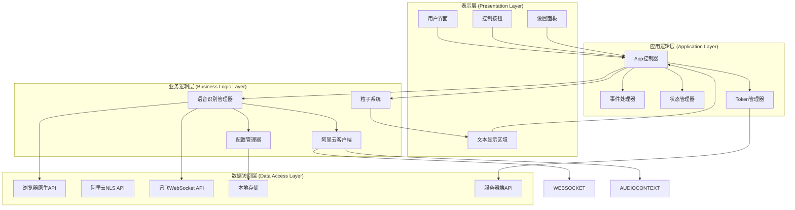
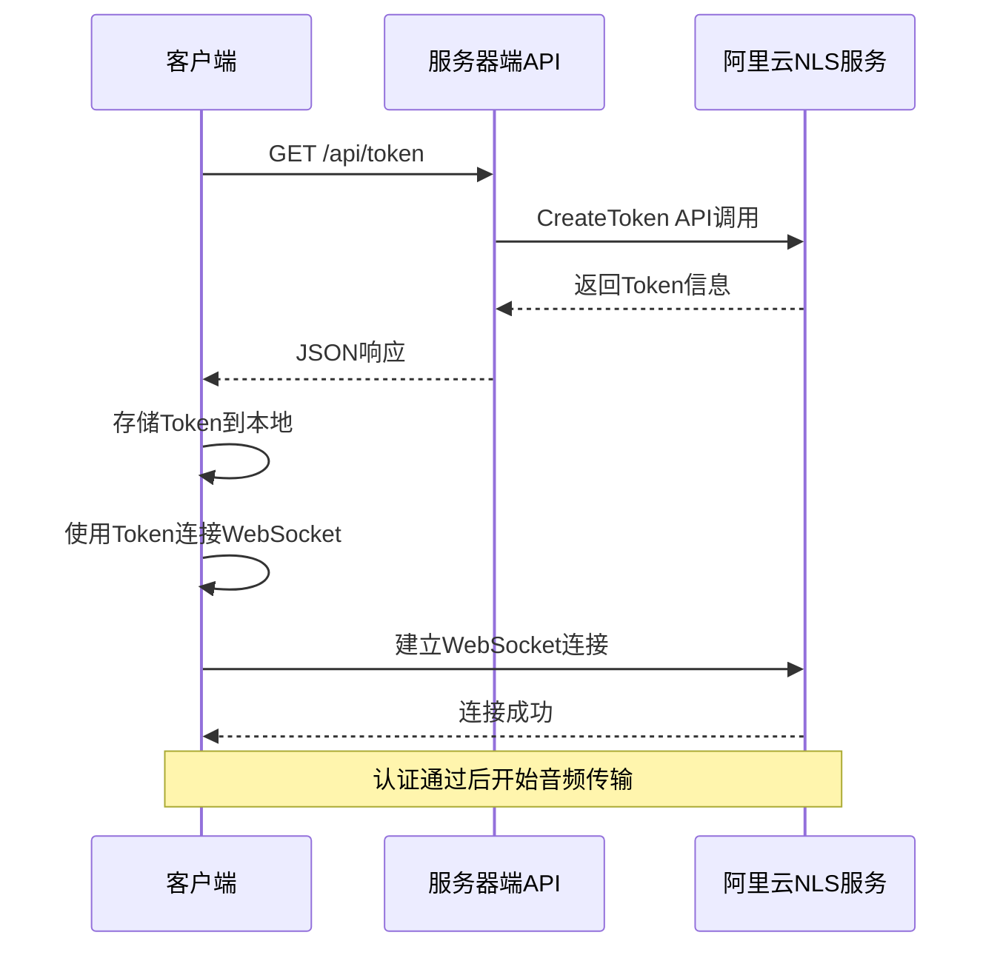
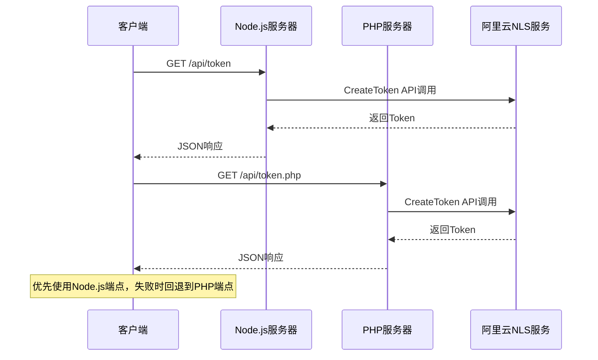
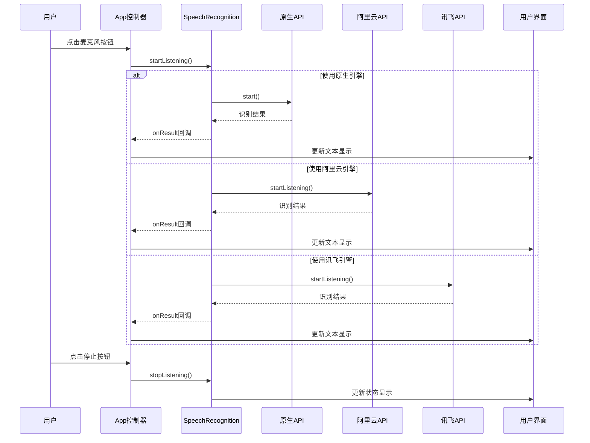

# API参考文档

<cite>
**本文档引用的文件**
- [speech.js](file://js/speech.js)
- [app.js](file://js/app.js)
- [particles.js](file://js/particles.js)
- [aliyun-speech.js](file://js/aliyun-speech.js)
- [index.html](file://index.html)
- [README.md](file://README.md)
- [token.php](file://api/token.php)
- [server.js](file://server.js)
</cite>

## 目录
1. [简介](#简介)
2. [项目结构](#项目结构)
3. [核心组件](#核心组件)
4. [架构概览](#架构概览)
5. [详细组件分析](#详细组件分析)
6. [服务器端API](#服务器端api)
7. [依赖关系分析](#依赖关系分析)
8. [性能考虑](#性能考虑)
9. [故障排除指南](#故障排除指南)
10. [结论](#结论)
11. [附录](#附录)

## 简介

MySpeechRecognition是一个基于Web技术的语音识别应用，支持多后端语音识别引擎。该项目提供了完整的语音识别解决方案，包括浏览器原生Web Speech API、阿里云智能语音识别WebSocket API和讯飞语音识别WebSocket API三种后端选择。应用具有现代化的粒子动画背景、实时语音转文字显示、设置面板管理和错误处理机制。

该应用的核心特性包括：
- 多后端语音识别支持（浏览器原生/阿里云/讯飞）
- 实时语音转文字显示
- 粒子动画背景系统
- 设置面板管理
- 自动错误恢复和后端切换
- 响应式设计
- 服务器端Token管理

## 项目结构

项目采用模块化架构，主要由以下核心文件组成：

```mermaid
graph TB
subgraph "前端应用层"
HTML[index.html]
CSS[style.css]
end
subgraph "JavaScript模块层"
APP[app.js]
SPEECH[speech.js]
PARTICLES[particles.js]
ALIYUN[aliyun-speech.js]
XFYUN[xfyun-speech.js]
end
subgraph "服务器端API层"
NODEJS[node.js server.js]
PHP[PHP token.php]
end
subgraph "外部依赖"
WEB_API[Web Speech API]
WEBSOCKET[WebSocket API]
AUDIOCONTEXT[AudioContext API]
LOCALSTORAGE[localStorage API]
ALIYUN_API[阿里云NLS API]
XFYUN_API[讯飞WebSocket API]
END
HTML --> APP
APP --> SPEECH
APP --> PARTICLES
SPEECH --> ALIYUN
SPEECH --> XFYUN
ALIYUN --> WEBSOCKET
ALIYUN --> AUDIOCONTEXT
XFYUN --> WEBSOCKET
XFYUN --> AUDIOCONTEXT
SPEECH --> WEB_API
SPEECH --> LOCALSTORAGE
APP --> CSS
NODEJS --> ALIYUN_API
PHP --> ALIYUN_API
```

**图表来源**
- [index.html:1-141](file://index.html#L1-L141)
- [app.js:1-375](file://js/app.js#L1-L375)
- [speech.js:1-390](file://js/speech.js#L1-L390)
- [particles.js:1-199](file://js/particles.js#L1-L199)
- [aliyun-speech.js:1-479](file://js/aliyun-speech.js#L1-L479)
- [xfyun-speech.js:1-452](file://js/xfyun-speech.js#L1-L452)
- [server.js:1-83](file://server.js#L1-L83)
- [token.php:1-146](file://api/token.php#L1-L146)

**章节来源**
- [index.html:1-141](file://index.html#L1-L141)
- [README.md:1-1](file://README.md#L1-L1)

## 核心组件

### 语音识别管理器 (SpeechRecognition)

SpeechRecognition类是整个应用的核心组件，负责管理多种语音识别后端并提供统一的API接口。

#### 主要功能特性
- 支持浏览器原生Web Speech API、阿里云WebSocket API和讯飞WebSocket API
- 自动错误检测和后端切换
- 实时结果回调和状态通知
- 配置持久化存储
- 多语言支持（默认中文）

#### 核心常量

**SpeechState枚举**
- `IDLE`: 空闲状态
- `LISTENING`: 监听状态  
- `ERROR`: 错误状态

**BackendType枚举**
- `NATIVE`: 浏览器原生引擎
- `ALIYUN`: 阿里云引擎
- `XFYUN`: 讯飞引擎

**章节来源**
- [speech.js:10-19](file://js/speech.js#L10-L19)

### 阿里云语音识别客户端 (AliyunSpeech)

AliyunSpeech类提供阿里云智能语音识别WebSocket API的客户端实现。

#### 主要功能
- 使用NLS实时语音转写WebSocket协议
- 适用于国内网络环境，识别准确率高
- 使用AudioContext捕获PCM音频
- WebSocket实时传输，获取识别结果
- 自动重连机制

#### 配置参数
- WebSocket URL: `wss://nls-gateway-cn-shanghai.aliyuncs.com/ws/v1`
- 采样率: 16000 Hz
- 音频帧大小: 6400字节（200ms @ 16kHz 16bit）
- 最大重连次数: 3次
- 重连延迟: 指数增长，最多5秒

**章节来源**
- [aliyun-speech.js:13-40](file://js/aliyun-speech.js#L13-L40)

### 粒子系统 (ParticleSystem)

ParticleSystem类提供动态的粒子动画背景效果，增强用户体验。

#### 主要功能
- 霓虹色粒子动画
- 粒子间连线效果
- 鼠标交互吸引
- 响应式尺寸调整
- 性能优化的动画循环

#### 配置参数
- 粒子颜色数组：霓虹青、霓虹紫
- 连接距离阈值：120像素
- 鼠标吸引半径：150像素
- 吸引力强度：0.02
- 设备适配：移动端40个粒子，桌面端80个粒子

**章节来源**
- [particles.js:8-16](file://js/particles.js#L8-L16)

### 应用主控制器 (App)

App类作为应用的主控制器，协调各个组件的工作。

#### 主要职责
- 初始化和管理其他组件
- 处理用户界面事件
- 管理应用状态
- 提供用户交互接口
- 集成阿里云Token自动获取功能

**章节来源**
- [app.js:12-41](file://js/app.js#L12-L41)

## 架构概览

应用采用分层架构设计，实现了清晰的关注点分离：



**图表来源**
- [app.js:1-375](file://js/app.js#L1-L375)
- [speech.js:1-390](file://js/speech.js#L1-L390)
- [aliyun-speech.js:1-479](file://js/aliyun-speech.js#L1-L479)
- [particles.js:1-199](file://js/particles.js#L1-L199)

## 详细组件分析

### SpeechRecognition 类 API 参考

#### 构造函数
```javascript
constructor()
```
初始化语音识别管理器，设置默认状态和配置。

**章节来源**
- [speech.js:21-39](file://js/speech.js#L21-L39)

#### 静态方法

**isNativeSupported()**
```javascript
static isNativeSupported() boolean
```
检测浏览器是否支持Web Speech API。

**返回值**: boolean - 支持返回true，否则false

**章节来源**
- [speech.js:44-46](file://js/speech.js#L44-L46)

#### 实例方法

**init()**
```javascript
init() void
```
初始化语音识别管理器，包括：
- 设置阿里云回调监听
- 初始化原生API监听
- 从localStorage恢复配置

**异常处理**: 自动处理初始化过程中的错误

**章节来源**
- [speech.js:51-81](file://js/speech.js#L51-L81)

**onResult(callback)**
```javascript
onResult(callback) void
```
注册识别结果回调函数。

**参数**:
- `callback`: Function - 回调函数，接收`(finalText, interimText)`两个参数

**返回值**: void

**章节来源**
- [speech.js:106-108](file://js/speech.js#L106-L108)

**onStateChange(callback)**
```javascript
onStateChange(callback) void
```
注册状态变化回调函数。

**参数**:
- `callback`: Function - 回调函数，接收`(state, message)`两个参数

**返回值**: void

**章节来源**
- [speech.js:113-115](file://js/speech.js#L113-L115)

**getBackend()**
```javascript
getBackend() string
```
获取当前使用的语音识别后端类型。

**返回值**: string - 返回`BackendType`枚举值

**章节来源**
- [speech.js:120-122](file://js/speech.js#L120-L122)

**setBackend(type)**
```javascript
setBackend(type) void
```
设置语音识别后端类型。

**参数**:
- `type`: string - `BackendType`枚举值

**返回值**: void

**异常处理**: 自动保存配置到localStorage

**章节来源**
- [speech.js:127-130](file://js/speech.js#L127-L130)

**configureAliyun(config)**
```javascript
configureAliyun(config) void
```
配置阿里云API凭证。

**参数**:
- `config`: Object - 包含`appKey`、`token`的对象

**返回值**: void

**异常处理**: 自动保存配置到localStorage

**章节来源**
- [speech.js:135-138](file://js/speech.js#L135-L138)

**getAliyunConfig()**
```javascript
getAliyunConfig() Object
```
获取当前阿里云配置信息。

**返回值**: Object - 包含`appKey`、`token`的对象

**章节来源**
- [speech.js:143-148](file://js/speech.js#L143-L148)

**startListening()**
```javascript
startListening() void
```
开始语音识别监听。

**行为**: 根据当前后端类型选择相应的启动方法

**异常处理**: 自动处理启动过程中的错误

**章节来源**
- [speech.js:154-183](file://js/speech.js#L154-L183)

**stopListening()**
```javascript
stopListening() void
```
停止语音识别监听。

**行为**: 根据当前后端类型选择相应的停止方法，并重置到IDLE状态

**异常处理**: 自动清理资源

**章节来源**
- [speech.js:184-190](file://js/speech.js#L184-L190)

**getFinalTranscript()**
```javascript
getFinalTranscript() string
```
获取已确认的最终文本。

**返回值**: string - 已确认的文本内容

**章节来源**
- [speech.js:191-193](file://js/speech.js#L191-L193)

**resetTranscript()**
```javascript
resetTranscript() void
```
重置文本内容。

**返回值**: void

**章节来源**
- [speech.js:194-200](file://js/speech.js#L194-L200)

**destroy()**
```javascript
destroy() void
```
销毁语音识别管理器。

**行为**: 停止原生识别，销毁阿里云实例

**返回值**: void

**章节来源**
- [speech.js:201-203](file://js/speech.js#L201-L203)

#### 事件回调接口

**结果回调 (onResult)**
- 参数: `(finalText: string, interimText: string)`
- 触发时机: 有新的识别结果时
- 用途: 更新UI显示识别结果

**状态回调 (onStateChange)**
- 参数: `(state: string, message: string)`
- 状态值: `SpeechState.IDLE`、`SpeechState.LISTENING`、`SpeechState.ERROR`
- 用途: 更新UI状态和错误提示

**章节来源**
- [speech.js:53-72](file://js/speech.js#L53-L72)
- [speech.js:106-115](file://js/speech.js#L106-L115)

### AliyunSpeech 类 API 参考

#### 构造函数
```javascript
constructor()
```
初始化阿里云语音识别客户端。

**章节来源**
- [aliyun-speech.js:17-40](file://js/aliyun-speech.js#L17-L40)

#### 公共方法

**configure(config)**
```javascript
configure({ appKey, token }) void
```
配置阿里云API凭证。

**参数**:
- `config`: Object - 包含`appKey`、`token`的对象

**返回值**: void

**章节来源**
- [aliyun-speech.js:45-48](file://js/aliyun-speech.js#L45-L48)

**isConfigured()**
```javascript
isConfigured() boolean
```
检查是否已配置阿里云API凭证。

**返回值**: boolean - 已配置返回true，否则false

**章节来源**
- [aliyun-speech.js:53-55](file://js/aliyun-speech.js#L53-L55)

**onResult(callback)**
```javascript
onResult(callback) void
```
注册识别结果回调函数。

**参数**:
- `callback`: Function - 回调函数，接收`(finalText, interimText)`两个参数

**返回值**: void

**章节来源**
- [aliyun-speech.js:60-62](file://js/aliyun-speech.js#L60-L62)

**onStateChange(callback)**
```javascript
onStateChange(callback) void
```
注册状态变化回调函数。

**参数**:
- `callback`: Function - 回调函数，接收`(state, message)`两个参数

**返回值**: void

**章节来源**
- [aliyun-speech.js:67-69](file://js/aliyun-speech.js#L67-L69)

**startListening()**
```javascript
async startListening() void
```
开始语音识别监听。

**返回值**: Promise<void> - 异步操作

**异常处理**: 
- 权限错误：麦克风权限被拒绝
- 设备错误：未找到麦克风设备
- 网络错误：连接阿里云服务失败

**章节来源**
- [aliyun-speech.js:74-144](file://js/aliyun-speech.js#L74-L144)

**stopListening()**
```javascript
stopListening() void
```
停止语音识别监听。

**返回值**: void

**异常处理**: 自动清理音频流和WebSocket连接

**章节来源**
- [aliyun-speech.js:149-171](file://js/aliyun-speech.js#L149-L171)

**getFinalTranscript()**
```javascript
getFinalTranscript() string
```
获取已确认的最终文本。

**返回值**: string - 已确认的文本内容

**章节来源**
- [aliyun-speech.js:176-178](file://js/aliyun-speech.js#L176-L178)

**resetTranscript()**
```javascript
resetTranscript() void
```
重置文本内容。

**返回值**: void

**章节来源**
- [aliyun-speech.js:183-185](file://js/aliyun-speech.js#L183-L185)

**destroy()**
```javascript
destroy() void
```
销毁阿里云语音识别客户端。

**返回值**: void

**章节来源**
- [aliyun-speech.js:190-192](file://js/aliyun-speech.js#L190-L192)

#### WebSocket认证流程



**图表来源**
- [server.js:19-76](file://server.js#L19-L76)
- [token.php:39-146](file://api/token.php#L39-L146)

**章节来源**
- [aliyun-speech.js:199-244](file://js/aliyun-speech.js#L199-L244)

### ParticleSystem 类 API 参考

#### 构造函数
```javascript
constructor()
```
初始化粒子系统。

**章节来源**
- [particles.js:69-82](file://js/particles.js#L69-L82)

#### 公共方法

**init()**
```javascript
init() void
```
初始化粒子系统，包括：
- 设置画布尺寸
- 创建粒子对象
- 绑定事件监听
- 启动动画循环

**返回值**: void

**章节来源**
- [particles.js:84-89](file://js/particles.js#L84-L89)

**start()**
```javascript
start() void
```
启动粒子动画。

**返回值**: void

**异常处理**: 防止重复启动

**章节来源**
- [particles.js:138-142](file://js/particles.js#L138-L142)

**stop()**
```javascript
stop() void
```
停止粒子动画。

**返回值**: void

**异常处理**: 取消动画帧请求

**章节来源**
- [particles.js:144-150](file://js/particles.js#L144-L150)

**destroy()**
```javascript
destroy() void
```
销毁粒子系统。

**返回值**: void

**异常处理**: 移除所有事件监听

**章节来源**
- [particles.js:191-197](file://js/particles.js#L191-L197)

#### 粒子更新算法


**图表来源**
- [particles.js:34-58](file://js/particles.js#L34-L58)

**章节来源**
- [particles.js:152-167](file://js/particles.js#L152-L167)

### App 类 API 参考

#### 构造函数
```javascript
constructor()
```
初始化应用控制器。

**章节来源**
- [app.js:12-41](file://js/app.js#L12-L41)

#### 公共方法

**init()**
```javascript
init() void
```
初始化应用，包括：
- 初始化粒子背景
- 初始化语音识别
- 绑定事件监听
- 同步设置面板状态

**返回值**: void

**章节来源**
- [app.js:43-65](file://js/app.js#L43-L65)

**_toggleListening()**
```javascript
_toggleListening() void
```
切换语音识别状态。

**行为**: 
- IDLE状态 -> 开始监听
- LISTENING状态 -> 停止监听  
- ERROR状态 -> 重置文本后重新开始

**返回值**: void

**章节来源**
- [app.js:82-91](file://js/app.js#L82-L91)

**_saveSettings()**
```javascript
_saveSettings() void
```
保存设置到语音识别管理器。

**返回值**: void

**异常处理**: 显示保存成功的提示消息

**章节来源**
- [app.js:163-178](file://js/app.js#L163-L178)

**_autoGetToken()**
```javascript
async _autoGetToken() void
```
自动获取阿里云Token。

**行为**: 
- 依次尝试Node.js和PHP端点
- 显示加载状态和结果提示
- 成功后更新Token输入框

**返回值**: Promise<void> - 异步操作

**异常处理**: 
- 端点不可用时显示错误提示
- 服务端错误时显示详细信息

**章节来源**
- [app.js:195-253](file://js/app.js#L195-L253)

**_copyTranscript()**
```javascript
async _copyTranscript() void
```
复制识别文本到剪贴板。

**返回值**: Promise<void> - 异步操作

**异常处理**: 
- 优先使用Clipboard API
- 备用方案：创建临时textarea元素

**章节来源**
- [app.js:335-356](file://js/app.js#L335-L356)

## 服务器端API

### /api/token 端点

/api/token端点提供阿里云NLS Access Token的获取服务，支持两种实现方式：Node.js版本和PHP版本。

#### Node.js版本 (server.js)

**端点**: `GET /api/token`

**请求参数**: 无

**响应格式**:
```json
{
  "success": true,
  "token": "NLS-XXXXXXXX-XXXX-XXXX-XXXX-XXXXXXXXXXXX",
  "expireTime": 1640995200,
  "userId": "user@example.com"
}
```

**错误响应**:
```json
{
  "success": false,
  "message": "服务端未配置阿里云AccessKey凭证，请在.env文件中设置ALIYUN_ACCESS_KEY_ID和ALIYUN_ACCESS_KEY_SECRET"
}
```

**使用示例**:
```javascript
// 前端获取Token
fetch('/api/token')
  .then(response => response.json())
  .then(data => {
    if (data.success) {
      console.log('Token:', data.token);
      console.log('过期时间:', data.expireTime);
    }
  });
```

**章节来源**
- [server.js:19-76](file://server.js#L19-L76)

#### PHP版本 (token.php)

**端点**: `GET /api/token.php`

**请求参数**: 无

**响应格式**:
```json
{
  "success": true,
  "token": "NLS-XXXXXXXX-XXXX-XXXX-XXXX-XXXXXXXXXXXX",
  "expireTime": 1640995200,
  "userId": "user@example.com"
}
```

**错误响应**:
```json
{
  "success": false,
  "message": "获取Token失败：当前AccessKey无NLS服务权限，请在阿里云RAM控制台授予AliyunNLSFullAccess权限"
}
```

**使用示例**:
```php
// 服务器端配置.env文件
ALIYUN_ACCESS_KEY_ID=your_access_key_id
ALIYUN_ACCESS_KEY_SECRET=your_access_key_secret
```

**章节来源**
- [token.php:31-146](file://api/token.php#L31-L146)

#### Token获取流程



**图表来源**
- [server.js:19-76](file://server.js#L19-L76)
- [token.php:39-146](file://api/token.php#L39-L146)
- [app.js:200-216](file://js/app.js#L200-L216)

**章节来源**
- [app.js:195-253](file://js/app.js#L195-L253)

## 依赖关系分析

### 模块依赖图

```mermaid
graph TB
subgraph "主应用模块"
APP[app.js]
end
subgraph "核心业务模块"
SPEECH[speech.js]
PARTICLES[particles.js]
ALIYUN[aliyun-speech.js]
XFYUN[xfyun-speech.js]
end
subgraph "外部API依赖"
WEB_API[Web Speech API]
WEBSOCKET[WebSocket API]
AUDIOCONTEXT[AudioContext API]
MEDIADEVICES[navigator.mediaDevices]
LOCALSTORAGE[localStorage API]
CLIPBOARD[navigator.clipboard]
ALIYUN_API[阿里云NLS API]
XFYUN_API[讯飞WebSocket API]
END
subgraph "服务器端依赖"
EXPRESS[Express.js]
POP_CORE[@alicloud/pop-core]
CURL[cURL扩展]
DOTENV[dotenv]
END
APP --> SPEECH
APP --> PARTICLES
SPEECH --> ALIYUN
SPEECH --> XFYUN
ALIYUN --> WEBSOCKET
ALIYUN --> AUDIOCONTEXT
XFYUN --> WEBSOCKET
XFYUN --> AUDIOCONTEXT
SPEECH --> WEB_API
SPEECH --> LOCALSTORAGE
XFYUN --> MEDIADEVICES
APP --> CLIPBOARD
EXPRESS --> POP_CORE
EXPRESS --> DOTENV
PHP --> CURL
```

**图表来源**
- [app.js:9-10](file://js/app.js#L9-L10)
- [speech.js:8](file://js/speech.js#L8)
- [aliyun-speech.js:13](file://js/aliyun-speech.js#L13)
- [server.js:8-11](file://server.js#L8-L11)
- [token.php:13-26](file://api/token.php#L13-L26)

### 组件交互序列



**图表来源**
- [app.js:82-91](file://js/app.js#L82-L91)
- [speech.js:154-183](file://js/speech.js#L154-L183)

**章节来源**
- [app.js:43-65](file://js/app.js#L43-L65)
- [speech.js:51-81](file://js/speech.js#L51-L81)

## 性能考虑

### 优化策略

1. **动画性能优化**
   - 使用requestAnimationFrame进行高效动画渲染
   - 实现粒子边界环绕避免重绘
   - 根据设备类型调整粒子数量（移动端40个，桌面端80个）

2. **内存管理**
   - 实现资源清理方法（destroy）
   - 及时取消事件监听器绑定
   - WebSocket连接的正确关闭

3. **网络优化**
   - 阿里云音频缓冲区管理
   - 自动重连机制
   - 错误状态下的优雅降级
   - Token缓存策略

4. **用户体验优化**
   - 状态变化的即时反馈
   - 响应式布局适配
   - 键盘快捷键支持（空格键）
   - Token自动获取的进度提示

## 故障排除指南

### 常见问题及解决方案

**浏览器不支持Web Speech API**
- 症状：页面显示不支持提示
- 解决方案：使用Chrome、Edge或Safari浏览器
- 相关代码：[index.html:78-81](file://index.html#L78-L81)

**麦克风权限被拒绝**
- 症状：出现"麦克风权限被拒绝"错误
- 解决方案：在浏览器设置中允许访问麦克风
- 相关代码：[speech.js:279-280](file://js/speech.js#L279-L280)

**网络错误**
- 症状：原生API网络错误，自动切换到阿里云引擎
- 解决方案：配置阿里云API凭证或检查网络连接
- 相关代码：[speech.js:288-301](file://js/speech.js#L288-L301)

**阿里云服务连接失败**
- 症状：WebSocket连接错误
- 解决方案：检查AppKey、Token配置和网络连接
- 相关代码：[aliyun-speech.js:130-143](file://js/aliyun-speech.js#L130-L143)

**Token获取失败**
- 症状：无法获取阿里云Token
- 解决方案：检查服务器端API配置和AccessKey权限
- 相关代码：[app.js:218-229](file://js/app.js#L218-L229)

**章节来源**
- [speech.js:273-315](file://js/speech.js#L273-L315)
- [aliyun-speech.js:130-143](file://js/aliyun-speech.js#L130-L143)
- [app.js:218-229](file://js/app.js#L218-L229)

## 结论

MySpeechRecognition项目展现了现代Web应用开发的最佳实践，通过模块化设计实现了清晰的职责分离和良好的可维护性。项目的主要优势包括：

1. **多后端支持**: 提供了灵活的语音识别解决方案，适应不同网络环境
2. **优雅降级**: 自动错误检测和后端切换机制确保用户体验
3. **现代化UI**: 粒子动画背景和响应式设计提升了视觉体验
4. **完善的错误处理**: 全面的异常处理和用户友好的错误提示
5. **配置持久化**: localStorage存储用户偏好设置
6. **服务器端安全**: Token管理通过服务器端API实现，保护AccessKey凭证
7. **跨平台支持**: 同时支持Node.js和PHP两种服务器端实现

项目在架构设计、代码组织和用户体验方面都达到了较高水准，为类似语音识别应用的开发提供了优秀的参考模板。

## 附录

### 版本兼容性信息

- **浏览器支持**: Chrome 65+、Edge 79+、Safari 14+
- **API依赖**: Web Speech API、WebSocket API、AudioContext API
- **ES6模块**: 使用现代JavaScript模块系统
- **服务器端**: Node.js 14+ 或 PHP 7.0+

### 废弃API迁移指南

当前版本未发现废弃API，所有公开接口均保持向后兼容性。

### 使用示例

**基本初始化示例**
```javascript
// 创建应用实例
const app = new App();
app.init();

// 配置阿里云语音识别
speechRecognition.configureAliyun({
  appKey: 'YOUR_APP_KEY',
  token: 'YOUR_ACCESS_TOKEN'
});
```

**事件监听示例**
```javascript
// 监听识别结果
speechRecognition.onResult((finalText, interimText) => {
  console.log('识别结果:', finalText);
});

// 监听状态变化
speechRecognition.onStateChange((state, message) => {
  console.log('状态变化:', state, message);
});
```

**Token获取示例**
```javascript
// 自动获取Token
await app._autoGetToken();

// 手动获取Token
const response = await fetch('/api/token');
const data = await response.json();
if (data.success) {
  app.aliyunToken.value = data.token;
}
```

**章节来源**
- [app.js:43-65](file://js/app.js#L43-L65)
- [speech.js:51-81](file://js/speech.js#L51-L81)
- [app.js:195-253](file://js/app.js#L195-L253)