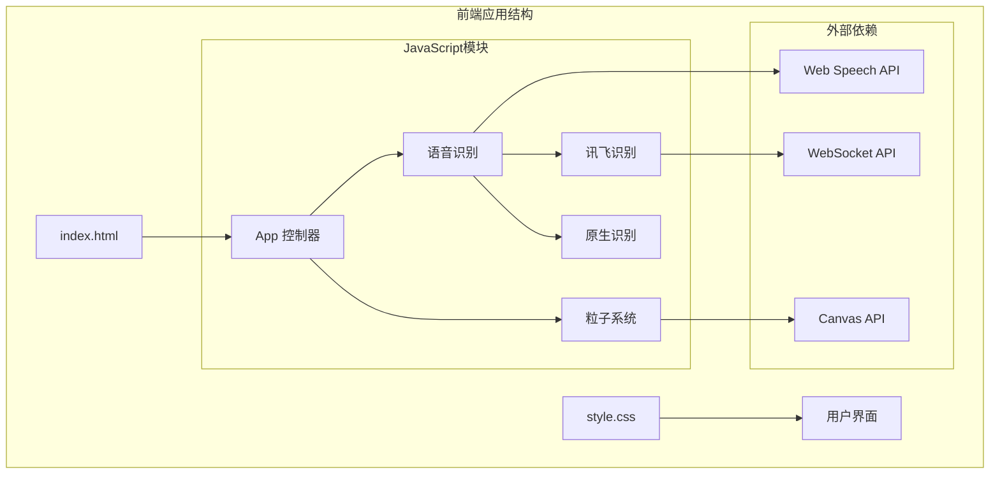
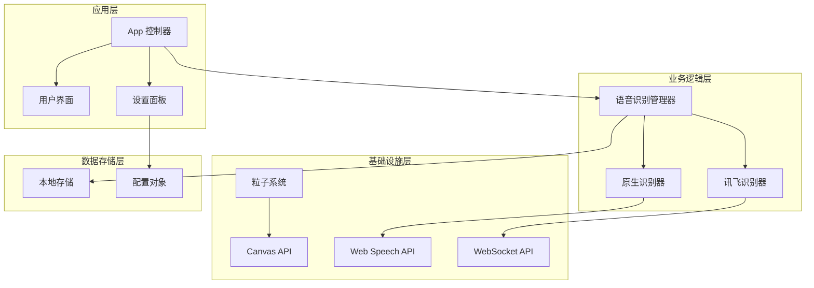
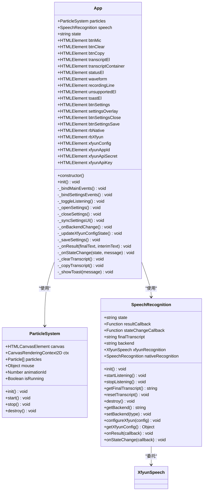
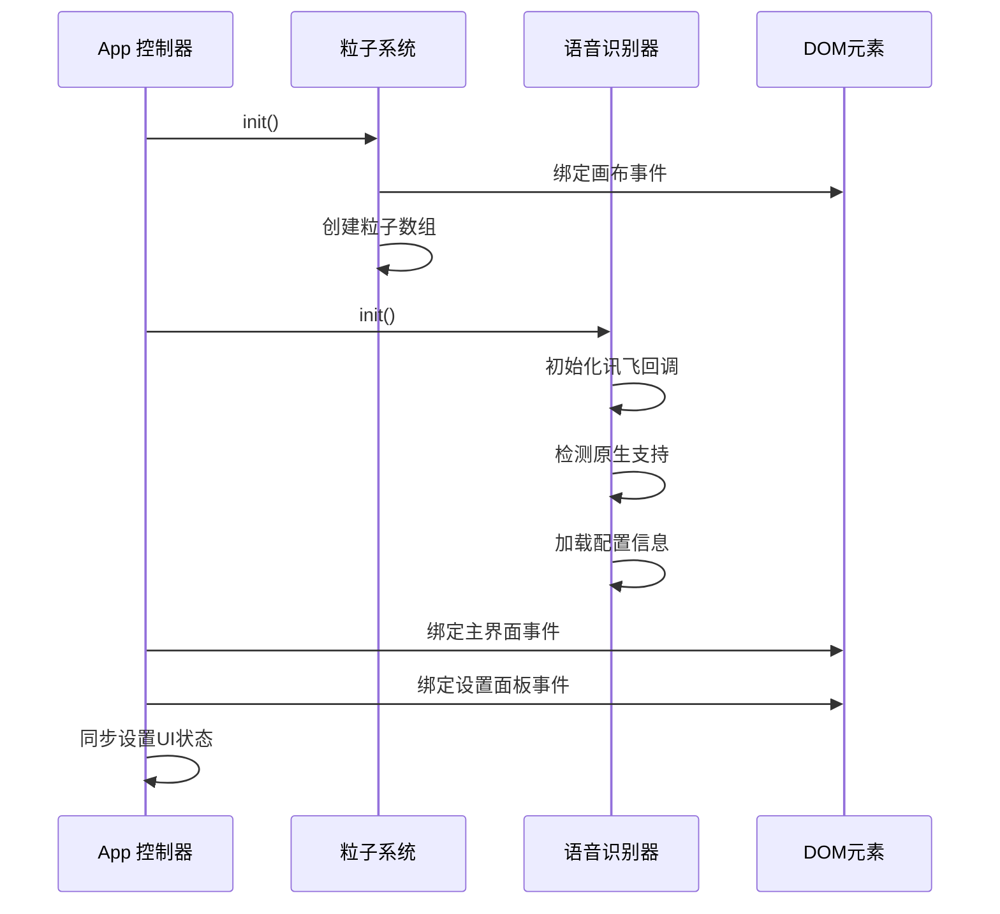
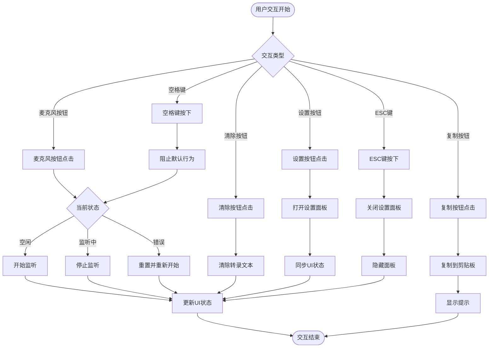
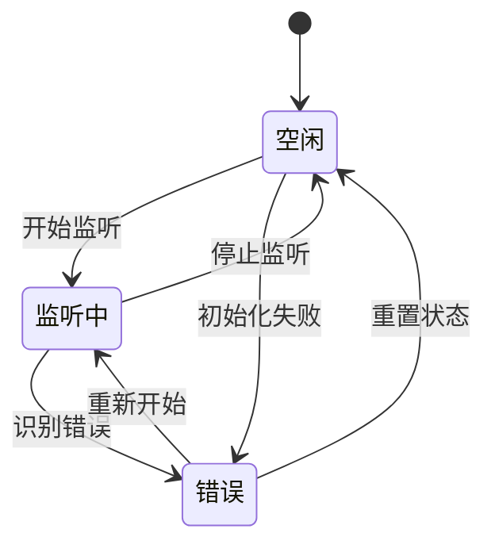
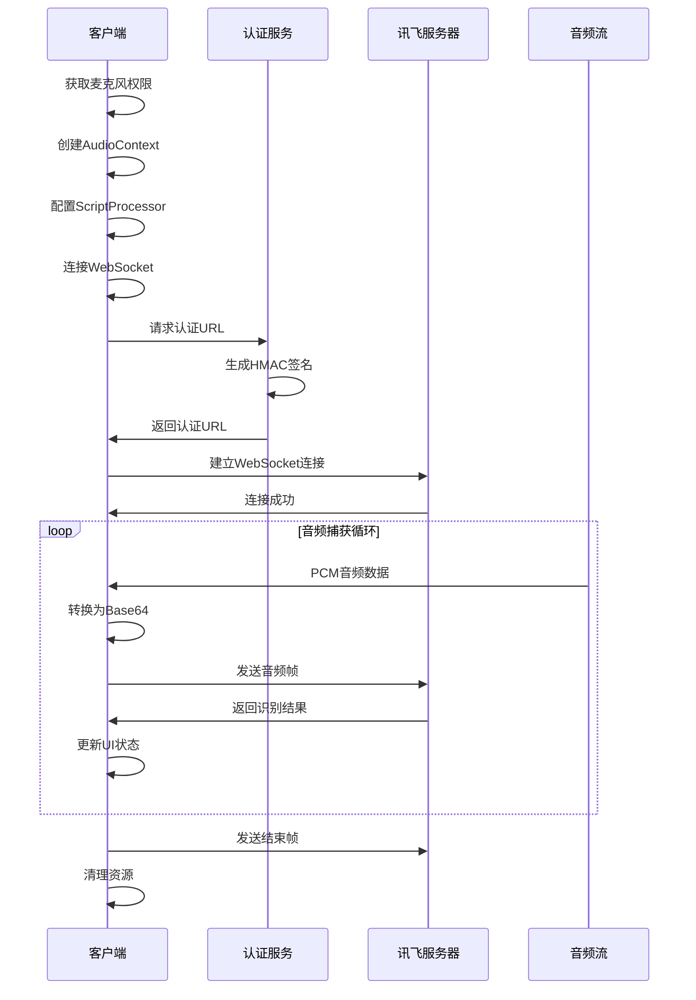
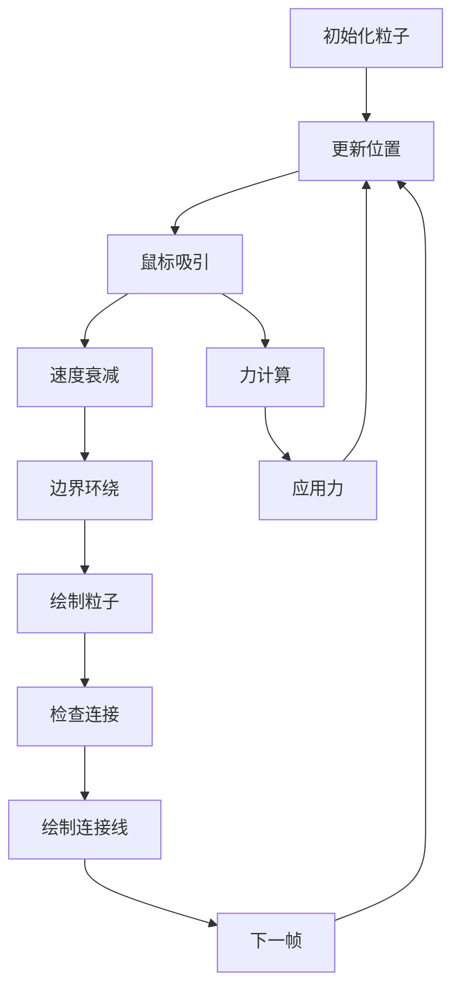
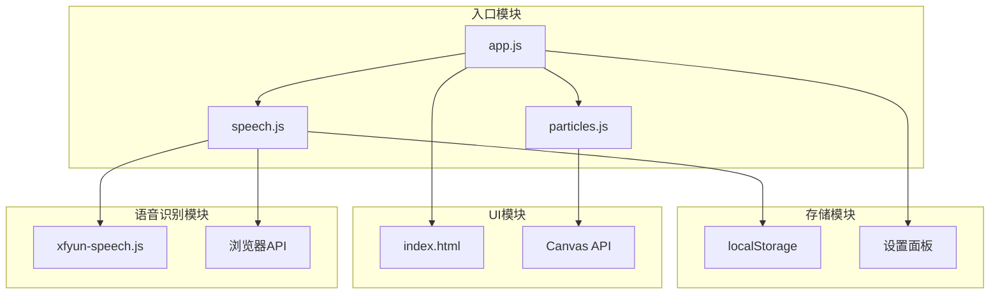

# App 控制器 API

<cite>
**本文档引用的文件**
- [app.js](file://js/app.js)
- [speech.js](file://js/speech.js)
- [xfyun-speech.js](file://js/xfyun-speech.js)
- [particles.js](file://js/particles.js)
- [index.html](file://index.html)
</cite>

## 目录
1. [简介](#简介)
2. [项目结构](#项目结构)
3. [核心组件](#核心组件)
4. [架构概览](#架构概览)
5. [详细组件分析](#详细组件分析)
6. [依赖关系分析](#依赖关系分析)
7. [性能考虑](#性能考虑)
8. [故障排除指南](#故障排除指南)
9. [结论](#结论)

## 简介

App 控制器是语音识别应用程序的核心管理类，负责协调多个子系统的初始化、状态管理和用户交互处理。该控制器实现了多后端语音识别支持（浏览器原生Web Speech API和讯飞语音识别），提供了粒子动画背景系统，并集成了完整的设置面板管理功能。

主要功能包括：
- 应用程序初始化和组件协调
- 多后端语音识别引擎管理
- 用户界面状态管理和事件处理
- 设置面板的配置和持久化
- 实时语音识别结果的显示和处理
- 错误处理和降级策略

## 项目结构

该项目采用模块化架构设计，每个功能模块都有独立的JavaScript文件：



**图表来源**
- [app.js:1-292](file://js/app.js#L1-L292)
- [speech.js:1-371](file://js/speech.js#L1-L371)
- [xfyun-speech.js:1-404](file://js/xfyun-speech.js#L1-L404)
- [particles.js:1-199](file://js/particles.js#L1-L199)

**章节来源**
- [index.html:1-143](file://index.html#L1-L143)
- [app.js:1-50](file://js/app.js#L1-L50)

## 核心组件

App 控制器类是整个应用程序的核心，负责协调各个子系统的初始化和运行。

### 主要职责

1. **组件初始化协调**：管理粒子系统和语音识别器的初始化顺序
2. **DOM元素绑定**：维护所有UI元素的引用和事件绑定
3. **状态管理**：跟踪语音识别状态并更新UI
4. **用户交互处理**：处理按钮点击、键盘快捷键等用户操作
5. **设置面板管理**：协调设置面板的显示、隐藏和配置保存

### 构造函数参数

App 控制器不需要任何参数，在构造时会自动初始化所有必要的DOM元素引用。

**章节来源**
- [app.js:12-41](file://js/app.js#L12-L41)

## 架构概览

应用程序采用分层架构设计，各层之间通过清晰的接口进行通信：



**图表来源**
- [app.js:9-11](file://js/app.js#L9-L11)
- [speech.js:21-39](file://js/speech.js#L21-L39)
- [xfyun-speech.js:17-32](file://js/xfyun-speech.js#L17-L32)

## 详细组件分析

### App 控制器类

App 控制器是应用程序的主要协调者，负责管理所有子系统的生命周期和交互。

#### 类结构图



**图表来源**
- [app.js:12-287](file://js/app.js#L12-L287)
- [speech.js:21-371](file://js/speech.js#L21-L371)
- [particles.js:69-199](file://js/particles.js#L69-L199)

#### 初始化流程

App 控制器的初始化过程遵循严格的顺序，确保所有组件都能正确初始化：



**图表来源**
- [app.js:43-65](file://js/app.js#L43-L65)
- [speech.js:51-81](file://js/speech.js#L51-L81)

#### 用户交互处理

App 控制器处理多种用户交互场景，包括按钮点击、键盘快捷键和设置面板操作：



**图表来源**
- [app.js:69-120](file://js/app.js#L69-L120)
- [app.js:82-91](file://js/app.js#L82-L91)
- [app.js:247-286](file://js/app.js#L247-L286)

**章节来源**
- [app.js:43-286](file://js/app.js#L43-L286)

### 语音识别管理器

SpeechRecognition 类是多后端语音识别的核心管理器，支持浏览器原生Web Speech API和讯飞语音识别两种模式。

#### 状态管理

语音识别器维护三种核心状态：



**图表来源**
- [speech.js:10-14](file://js/speech.js#L10-L14)
- [speech.js:329-336](file://js/speech.js#L329-L336)

#### 后端切换机制

当检测到网络问题时，系统会自动在两个后端之间切换：

```mermaid
flowchart TD
NetworkError["网络错误"] --> CheckRetry{"重试次数 < 最大重试次数"}
CheckRetry --> |是| IncrementRetry["增加重试计数"]
CheckRetry --> |否| CheckXfyun{"讯飞配置已设置?"}
IncrementRetry --> Wait["等待重连"]
CheckXfyun --> |是| SwitchToXfyun["切换到讯飞引擎"]
CheckXfyun --> |否| ShowError["显示网络错误"]
SwitchToXfyun --> AutoStart["自动启动讯飞识别"]
AutoStart --> Wait
Wait --> NetworkOK{"网络恢复?"}
NetworkOK --> |是| SwitchBack["切换回原生引擎"]
NetworkOK --> |否| ShowError
SwitchBack --> ResumeListening["继续监听"]
ResumeListening --> [*]
```

**图表来源**
- [speech.js:282-302](file://js/speech.js#L282-L302)
- [speech.js:294-297](file://js/speech.js#L294-L297)

**章节来源**
- [speech.js:21-371](file://js/speech.js#L21-L371)

### 讯飞语音识别器

XfyunSpeech 类实现了基于WebSocket的讯飞语音识别客户端，专门针对中国大陆网络环境优化。

#### WebSocket连接流程



**图表来源**
- [xfyun-speech.js:67-129](file://js/xfyun-speech.js#L67-L129)
- [xfyun-speech.js:176-207](file://js/xfyun-speech.js#L176-L207)

#### 音频处理管道

讯飞识别器实现了完整的音频处理流水线：

```mermaid
flowchart LR
Microphone[麦克风输入] --> MediaStream[MediaStream]
MediaStream --> AudioContext[AudioContext]
AudioContext --> ScriptProcessor[ScriptProcessorNode]
ScriptProcessor --> PCM[PCM音频数据]
PCM --> Float32ToInt16[Float32转Int16]
Float32ToInt16 --> Base64[转换为Base64]
Base64 --> WebSocket[WebSocket传输]
WebSocket --> XfyunAPI[讯飞API]
XfyunAPI --> Result[识别结果]
Result --> UIUpdate[UI更新]
```



**图表来源**
- [xfyun-speech.js:96-102](file://js/xfyun-speech.js#L96-L102)
- [xfyun-speech.js:251-293](file://js/xfyun-speech.js#L251-L293)

**章节来源**
- [xfyun-speech.js:17-404](file://js/xfyun-speech.js#L17-L404)

### 粒子背景系统

ParticleSystem 类提供了动态的粒子动画背景，增强了用户体验的视觉效果。

#### 粒子物理模拟



**图表来源**
- [particles.js:34-58](file://js/particles.js#L34-L58)
- [particles.js:152-167](file://js/particles.js#L152-L167)

**章节来源**
- [particles.js:69-199](file://js/particles.js#L69-L199)

## 依赖关系分析

应用程序的模块依赖关系清晰明确，遵循单一职责原则：



**图表来源**
- [app.js:9-11](file://js/app.js#L9-L11)
- [speech.js:8](file://js/speech.js#L8)

### 外部API依赖

应用程序依赖以下浏览器API：

| API类别 | 用途 | 版本要求 |
|---------|------|----------|
| Web Speech API | 语音识别 | Chrome 33+, Edge 79+, Safari 14+ |
| WebSocket API | 实时通信 | 所有现代浏览器 |
| Canvas API | 2D图形渲染 | HTML5标准 |
| AudioContext API | 音频处理 | HTML5标准 |
| localStorage | 配置持久化 | HTML5标准 |
| Clipboard API | 文本复制 | 现代浏览器 |

**章节来源**
- [speech.js:44](file://js/speech.js#L44)
- [xfyun-speech.js:87](file://js/xfyun-speech.js#L87)

## 性能考虑

### 内存管理

应用程序实现了完善的内存清理机制：

1. **音频资源清理**：停止音频流和关闭AudioContext
2. **WebSocket连接管理**：确保连接正常关闭
3. **事件监听器移除**：避免内存泄漏
4. **动画帧取消**：停止Canvas动画

### 性能优化策略

1. **懒加载机制**：仅在需要时初始化昂贵的资源
2. **节流和防抖**：限制高频事件处理
3. **批量DOM更新**：减少重排重绘
4. **缓存策略**：缓存配置和计算结果

### 资源监控

应用程序提供了基本的性能监控能力：

- 粒子系统根据屏幕尺寸动态调整粒子数量
- 自动暂停机制在页面不可见时停止动画
- 错误处理机制确保异常不会影响整体性能

## 故障排除指南

### 常见问题及解决方案

#### 语音识别问题

| 问题症状 | 可能原因 | 解决方案 |
|----------|----------|----------|
| 无法开始识别 | 权限被拒绝 | 检查浏览器权限设置 |
| 识别结果为空 | 网络连接问题 | 切换到讯飞引擎 |
| 识别准确率低 | 音质问题 | 检查麦克风设置 |
| 服务超时 | 网络不稳定 | 检查网络连接 |

#### UI显示问题

| 问题症状 | 可能原因 | 解决方案 |
|----------|----------|----------|
| 粒子背景不显示 | Canvas不支持 | 检查浏览器兼容性 |
| 设置面板无法打开 | 事件绑定失败 | 刷新页面重试 |
| 文本复制失败 | Clipboard API不支持 | 使用备用复制方法 |

#### 性能问题

| 问题症状 | 可能原因 | 解决方案 |
|----------|----------|----------|
| CPU占用过高 | 动画帧率过高 | 检查requestAnimationFrame调用 |
| 页面卡顿 | DOM操作过多 | 优化UI更新频率 |
| 内存泄漏 | 事件监听器未移除 | 检查事件清理逻辑 |

**章节来源**
- [speech.js:273-315](file://js/speech.js#L273-L315)
- [xfyun-speech.js:114-128](file://js/xfyun-speech.js#L114-L128)

## 结论

App 控制器类是一个设计精良的应用程序核心组件，它成功地整合了多种技术栈和功能模块。通过清晰的架构设计、完善的错误处理机制和优秀的用户体验，该控制器为语音识别应用提供了稳定可靠的基础。

主要优势包括：
- **模块化设计**：各功能模块职责明确，便于维护和扩展
- **多后端支持**：灵活的引擎切换机制适应不同网络环境
- **优雅降级**：在网络异常时提供备选方案
- **完整的生命周期管理**：从初始化到销毁的全流程控制

未来可以考虑的改进方向：
- 添加更详细的性能监控指标
- 实现更丰富的配置选项
- 增强错误恢复能力
- 优化移动端用户体验