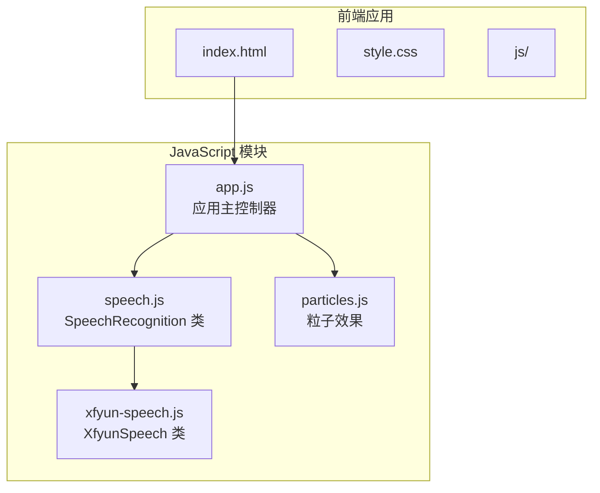
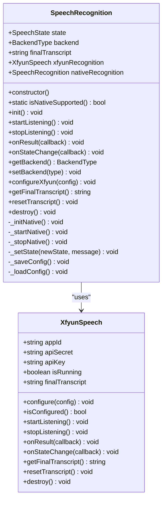
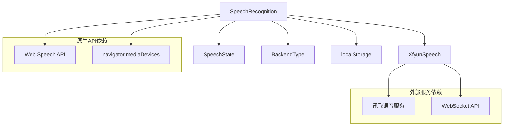

# SpeechRecognition 类 API

<cite>
**本文档引用的文件**
- [speech.js](file://js/speech.js)
- [xfyun-speech.js](file://js/xfyun-speech.js)
- [app.js](file://js/app.js)
- [index.html](file://index.html)
</cite>

## 目录
1. [简介](#简介)
2. [项目结构](#项目结构)
3. [核心组件](#核心组件)
4. [架构概览](#架构概览)
5. [详细组件分析](#详细组件分析)
6. [依赖关系分析](#依赖关系分析)
7. [性能考虑](#性能考虑)
8. [故障排除指南](#故障排除指南)
9. [结论](#结论)

## 简介

SpeechRecognition 类是一个多后端语音识别管理器，支持浏览器原生 Web Speech API 和讯飞语音听写 WebSocket API。该类提供了统一的接口来处理语音识别任务，包括初始化、启动/停止监听、结果处理和状态管理等功能。

## 项目结构

该项目采用模块化架构，主要包含以下文件：



**图表来源**
- [speech.js:1-371](file://js/speech.js#L1-L371)
- [xfyun-speech.js:1-404](file://js/xfyun-speech.js#L1-L404)
- [app.js:1-292](file://js/app.js#L1-L292)

**章节来源**
- [speech.js:1-371](file://js/speech.js#L1-L371)
- [xfyun-speech.js:1-404](file://js/xfyun-speech.js#L1-L404)
- [app.js:1-292](file://js/app.js#L1-L292)

## 核心组件

### 枚举定义

SpeechRecognition 类定义了两个重要的枚举常量：

#### SpeechState 枚举
- **IDLE**: 空闲状态，表示未进行语音识别
- **LISTENING**: 监听状态，表示正在进行语音识别
- **ERROR**: 错误状态，表示识别过程中出现错误

#### BackendType 枚举
- **NATIVE**: 浏览器原生 Web Speech API
- **XFYUN**: 讯飞语音听写 WebSocket API

**章节来源**
- [speech.js:10-19](file://js/speech.js#L10-L19)

### 构造函数

```javascript
constructor()
```

SpeechRecognition 类的构造函数初始化以下关键属性：
- `state`: 当前识别状态，默认为 IDLE
- `resultCallback`: 结果回调函数
- `stateChangeCallback`: 状态变化回调函数
- `finalTranscript`: 最终识别文本
- `backend`: 当前后端类型，默认为 NATIVE
- `nativeRetryCount`: 原生API重试次数
- `maxNativeRetry`: 最大原生API重试次数
- `nativeRecognition`: 原生SpeechRecognition实例
- `xfyunRecognition`: XfyunSpeech实例
- `nativeFailed`: 原生API失败标志

**章节来源**
- [speech.js:21-39](file://js/speech.js#L21-L39)

## 架构概览

SpeechRecognition 类采用代理模式，内部管理两个不同的语音识别后端：



**图表来源**
- [speech.js:21-371](file://js/speech.js#L21-L371)
- [xfyun-speech.js:17-404](file://js/xfyun-speech.js#L17-L404)

## 详细组件分析

### 静态方法

#### isNativeSupported()

```javascript
static isNativeSupported() bool
```

**功能**: 检测浏览器是否支持 Web Speech API

**参数**: 无

**返回值**: boolean - 支持返回 true，否则返回 false

**使用场景**: 在初始化前检查浏览器兼容性

**章节来源**
- [speech.js:44-46](file://js/speech.js#L44-L46)

### 初始化方法

#### init()

```javascript
init() void
```

**功能**: 初始化语音识别系统

**参数**: 无

**返回值**: void

**初始化过程**:
1. 设置讯飞回调函数
2. 设置原生API回调函数
3. 初始化原生 SpeechRecognition（如果可用）
4. 从 localStorage 恢复配置

**异常处理**: 
- 原生API初始化失败会触发错误状态
- 配置加载失败会被记录但不影响整体初始化

**章节来源**
- [speech.js:51-81](file://js/speech.js#L51-L81)

### 控制方法

#### startListening()

```javascript
startListening() void
```

**功能**: 开始语音识别监听

**参数**: 无

**返回值**: void

**行为逻辑**:
- 如果后端类型为 XFYUN，则调用 `_startXfyun()`
- 否则调用 `_startNative()`
- 根据当前后端类型选择相应的启动流程

**异常处理**:
- 讯飞后端未配置时会触发错误状态
- 原生API启动异常会被捕获并记录

**章节来源**
- [speech.js:154-160](file://js/speech.js#L154-L160)

#### stopListening()

```javascript
stopListening() void
```

**功能**: 停止语音识别监听

**参数**: 无

**返回值**: void

**行为逻辑**:
- 根据当前后端类型调用相应停止方法
- 将状态设置为 IDLE

**异常处理**:
- 原生API停止异常会被捕获并记录
- 自动清理相关资源

**章节来源**
- [speech.js:165-172](file://js/speech.js#L165-L172)

### 事件回调方法

#### onResult(callback)

```javascript
onResult(callback) void
```

**功能**: 注册识别结果回调函数

**参数**:
- `callback`: function - 回调函数，接收 `(finalText, interimText)` 参数

**返回值**: void

**回调参数**:
- `finalText`: string - 已确认的最终文本
- `interimText`: string - 中间结果文本

**使用场景**: 实时显示识别结果

**章节来源**
- [speech.js:106-108](file://js/speech.js#L106-L108)

#### onStateChange(callback)

```javascript
onStateChange(callback) void
```

**功能**: 注册状态变化回调函数

**参数**:
- `callback`: function - 回调函数，接收 `(state, message)` 参数

**返回值**: void

**回调参数**:
- `state`: string - 新的状态值（IDLE/LISTENING/ERROR）
- `message`: string - 状态相关的消息

**使用场景**: 更新UI状态和错误提示

**章节来源**
- [speech.js:113-115](file://js/speech.js#L113-L115)

### 文本处理方法

#### getFinalTranscript()

```javascript
getFinalTranscript() string
```

**功能**: 获取已确认的最终识别文本

**参数**: 无

**返回值**: string - 当前的最终文本

**使用场景**: 获取完整的识别结果用于复制或保存

**章节来源**
- [speech.js:177-179](file://js/speech.js#L177-L179)

#### resetTranscript()

```javascript
resetTranscript() void
```

**功能**: 重置识别文本

**参数**: 无

**返回值**: void

**行为逻辑**:
- 清空 `finalTranscript` 属性
- 如果当前后端为 XFYUN，同时重置 XfyunSpeech 的文本

**使用场景**: 清除之前的识别结果

**章节来源**
- [speech.js:184-189](file://js/speech.js#L184-L189)

### 配置方法

#### getBackend()

```javascript
getBackend() BackendType
```

**功能**: 获取当前使用的语音识别后端类型

**参数**: 无

**返回值**: BackendType - 当前后端类型（NATIVE 或 XFYUN）

**使用场景**: 查询当前配置的后端类型

**章节来源**
- [speech.js:120-122](file://js/speech.js#L120-L122)

#### setBackend(type)

```javascript
setBackend(type) void
```

**功能**: 设置语音识别后端类型

**参数**:
- `type`: BackendType - 目标后端类型

**返回值**: void

**行为逻辑**:
- 更新 `backend` 属性
- 保存配置到 localStorage

**使用场景**: 切换语音识别后端

**章节来源**
- [speech.js:127-130](file://js/speech.js#L127-L130)

#### configureXfyun(config)

```javascript
configureXfyun(config) void
```

**功能**: 配置讯飞语音识别API凭证

**参数**:
- `config`: object - 包含以下属性的对象
  - `appId`: string - 讯飞应用ID
  - `apiSecret`: string - 讯飞API密钥
  - `apiKey`: string - 讯飞API密钥

**返回值**: void

**行为逻辑**:
- 调用内部 XfyunSpeech 实例的 configure 方法
- 保存配置到 localStorage

**使用场景**: 设置讯飞API凭证

**章节来源**
- [speech.js:135-138](file://js/speech.js#L135-L138)

#### getXfyunConfig()

```javascript
getXfyunConfig() object
```

**功能**: 获取当前的讯飞配置信息

**参数**: 无

**返回值**: object - 包含讯飞配置的对象
- `appId`: string - 应用ID
- `apiSecret`: string - API密钥
- `apiKey`: string - API密钥

**使用场景**: 显示或备份讯飞配置

**章节来源**
- [speech.js:143-149](file://js/speech.js#L143-L149)

### 销毁方法

#### destroy()

```javascript
destroy() void
```

**功能**: 销毁语音识别实例

**参数**: 无

**返回值**: void

**行为逻辑**:
- 停止原生API监听
- 销毁 XfyunSpeech 实例
- 清理相关资源

**使用场景**: 应用关闭或内存清理

**章节来源**
- [speech.js:194-197](file://js/speech.js#L194-L197)

## 依赖关系分析

### 内部依赖关系



**图表来源**
- [speech.js:8-39](file://js/speech.js#L8-L39)
- [xfyun-speech.js:13-404](file://js/xfyun-speech.js#L13-L404)

### 外部依赖关系

#### 浏览器API依赖
- **Web Speech API**: 用于浏览器原生语音识别
- **MediaDevices API**: 用于访问麦克风设备
- **localStorage**: 用于持久化配置

#### 第三方服务依赖
- **讯飞语音服务**: 通过 WebSocket 提供语音识别服务
- **WebSocket API**: 用于与讯飞服务通信

**章节来源**
- [speech.js:86-101](file://js/speech.js#L86-L101)
- [xfyun-speech.js:77-129](file://js/xfyun-speech.js#L77-L129)

## 性能考虑

### 自动重连机制
- 原生API在监听结束后会自动重连，最大延迟2秒
- 讯飞API通过WebSocket保持长连接，减少建立连接的开销

### 资源管理
- 及时清理AudioContext和MediaStream资源
- 使用localStorage缓存配置，避免重复初始化

### 错误恢复
- 网络错误时自动切换到备用后端
- 权限被拒绝时提供清晰的错误提示

## 故障排除指南

### 常见问题及解决方案

#### 浏览器不支持 Web Speech API
**症状**: 初始化失败或功能不可用
**原因**: 浏览器版本过低或不支持
**解决**: 使用讯飞后端或升级浏览器

#### 麦克风权限被拒绝
**症状**: 状态变为ERROR，提示权限问题
**原因**: 用户拒绝了麦克风访问权限
**解决**: 引导用户在浏览器设置中允许麦克风访问

#### 网络连接问题
**症状**: 原生API频繁报错
**原因**: 网络环境限制了Google服务访问
**解决**: 切换到讯飞后端，配置API凭证

#### 讯飞API配置错误
**症状**: 启动失败或认证失败
**原因**: APPID、APIKey或APISecret配置错误
**解决**: 检查并重新配置讯飞API凭证

**章节来源**
- [speech.js:273-315](file://js/speech.js#L273-L315)
- [xfyun-speech.js:114-128](file://js/xfyun-speech.js#L114-L128)

## 结论

SpeechRecognition 类提供了一个功能完整、易于使用的多后端语音识别解决方案。其设计特点包括：

1. **多后端支持**: 同时支持浏览器原生API和讯飞服务
2. **自动故障转移**: 网络问题时自动切换后端
3. **完整的生命周期管理**: 包含初始化、运行、停止、销毁等完整流程
4. **丰富的回调机制**: 支持结果和状态变化的实时通知
5. **配置持久化**: 自动保存用户设置到localStorage

该类适合需要在不同环境下提供稳定语音识别功能的应用场景，特别是需要在中国大陆网络环境中工作的应用。