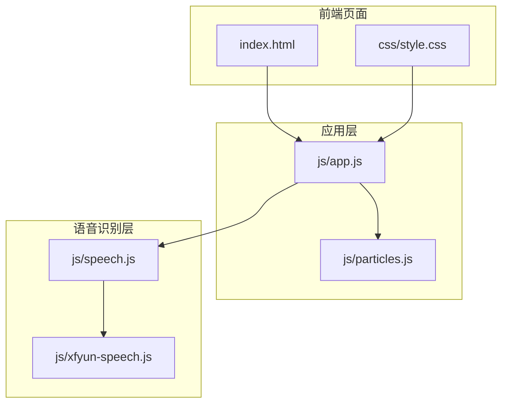
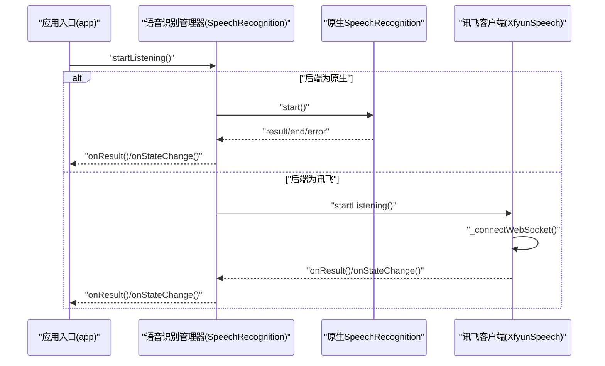
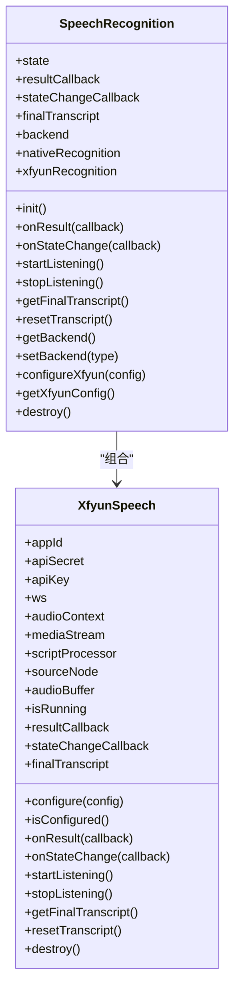
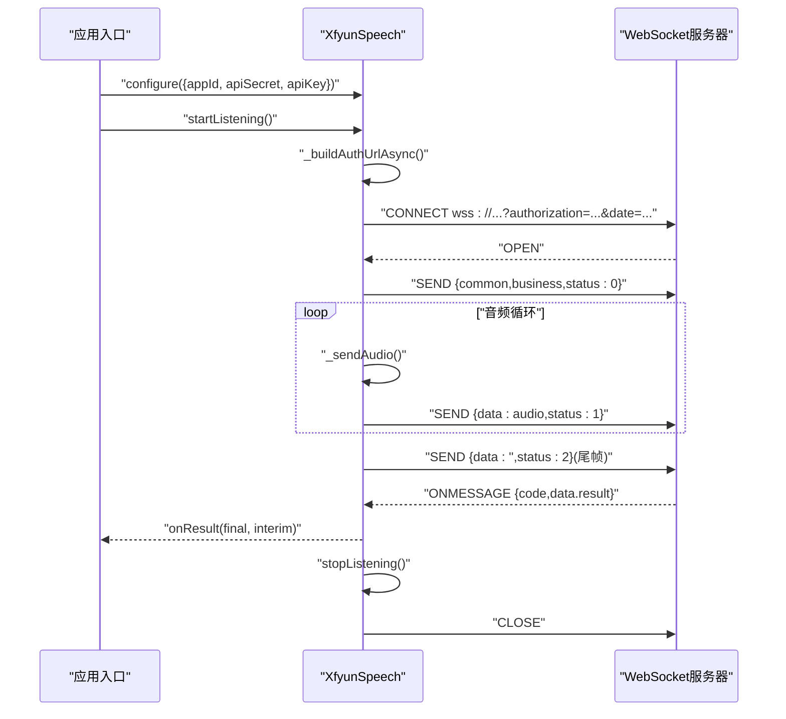
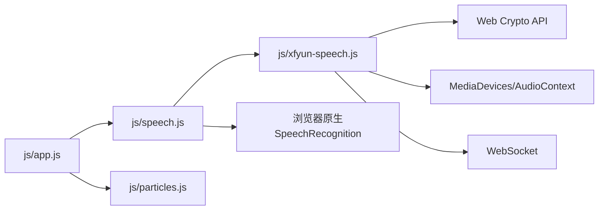

# 后端集成 API

<cite>
**本文引用的文件列表**
- [README.md](file://README.md)
- [index.html](file://index.html)
- [css/style.css](file://css/style.css)
- [js/app.js](file://js/app.js)
- [js/particles.js](file://js/particles.js)
- [js/speech.js](file://js/speech.js)
- [js/xfyun-speech.js](file://js/xfyun-speech.js)
</cite>

## 目录
1. [简介](#简介)
2. [项目结构](#项目结构)
3. [核心组件](#核心组件)
4. [架构总览](#架构总览)
5. [详细组件分析](#详细组件分析)
6. [依赖关系分析](#依赖关系分析)
7. [性能考量](#性能考量)
8. [故障排查指南](#故障排查指南)
9. [结论](#结论)
10. [附录](#附录)

## 简介
本项目提供“讯飞语音识别后端”的完整集成 API，支持：
- WebSocket 连接管理与音频数据传输协议
- 识别结果处理与事件回调
- 认证机制（HMAC-SHA256 签名）
- 连接状态管理与错误处理
- 与浏览器原生 Web Speech API 的差异与自动切换机制
- 网络异常处理、重连策略与性能优化建议

## 项目结构
前端采用模块化组织，核心逻辑集中在语音识别管理器与讯飞客户端两个模块，配合应用入口与 UI 层协同工作。

图表来源
- [index.html](file://index.html)
- [css/style.css](file://css/style.css)
- [js/app.js](file://js/app.js)
- [js/particles.js](file://js/particles.js)
- [js/speech.js](file://js/speech.js)
- [js/xfyun-speech.js](file://js/xfyun-speech.js)

章节来源
- [index.html](file://index.html)
- [css/style.css](file://css/style.css)
- [js/app.js](file://js/app.js)
- [js/particles.js](file://js/particles.js)
- [js/speech.js](file://js/speech.js)
- [js/xfyun-speech.js](file://js/xfyun-speech.js)

## 核心组件
- 语音识别管理器（多后端）：统一对外 API，负责状态管理、事件分发、后端切换与持久化配置。
- 讯飞语音客户端：封装 WebSocket 连接、音频采集与 PCM 编码、鉴权签名、帧发送与结果解析。
- 应用入口：初始化 UI、绑定事件、调用语音识别管理器并更新界面状态。

章节来源
- [js/speech.js](file://js/speech.js)
- [js/xfyun-speech.js](file://js/xfyun-speech.js)
- [js/app.js](file://js/app.js)

## 架构总览
系统通过“语音识别管理器”抽象出统一接口，内部根据后端类型路由到原生 Web Speech API 或讯飞 WebSocket。当原生 API 因网络错误失败时，自动建议并切换到讯飞后端；若已配置讯飞凭证，则自动启用并重试。

图表来源
- [js/app.js](file://js/app.js)
- [js/speech.js](file://js/speech.js)
- [js/xfyun-speech.js](file://js/xfyun-speech.js)

## 详细组件分析

### 语音识别管理器（SpeechRecognition）
- 角色定位：统一的语音识别控制中心，封装状态机、事件回调、后端选择与持久化配置。
- 关键能力
  - 状态管理：IDLE、LISTENING、ERROR
  - 后端类型：NATIVE（原生）、XFYUN（讯飞）
  - 自动切换：原生网络错误时自动建议并切换到讯飞
  - 配置持久化：localStorage 存储后端选择与讯飞凭证
- 对外 API
  - init()：初始化原生与讯飞回调，恢复配置
  - onResult(callback)：注册识别结果回调（finalText, interimText）
  - onStateChange(callback)：注册状态变化回调（state, message, openSettings）
  - startListening() / stopListening()：控制识别生命周期
  - getFinalTranscript() / resetTranscript()：文本获取与重置
  - getBackend() / setBackend(type)：查询与设置后端
  - configureXfyun(config) / getXfyunConfig()：配置与读取讯飞凭证
  - destroy()：销毁资源

图表来源
- [js/speech.js](file://js/speech.js)
- [js/xfyun-speech.js](file://js/xfyun-speech.js)

章节来源
- [js/speech.js](file://js/speech.js)

### 讯飞语音客户端（XfyunSpeech）
- 角色定位：面向讯飞 WebSocket 的客户端，负责音频采集、PCM 编码、鉴权签名、帧发送与结果解析。
- 关键能力
  - 配置校验：appId、apiSecret、apiKey
  - 音频采集：使用 MediaDevices.getUserMedia + AudioContext + ScriptProcessorNode
  - 鉴权：HMAC-SHA256 签名，Authorization 头拼接
  - WebSocket：首帧业务参数 + 中间帧音频 + 尾帧结束
  - 结果解析：合并中间与最终结果，区分 final 与 interim
  - 资源清理：停止音频流、关闭 AudioContext、断开 WebSocket
- 对外 API
  - configure({ appId, apiSecret, apiKey })
  - isConfigured()
  - onResult(callback)
  - onStateChange(callback)
  - startListening() / stopListening()
  - getFinalTranscript() / resetTranscript()
  - destroy()

图表来源
- [js/xfyun-speech.js](file://js/xfyun-speech.js)

章节来源
- [js/xfyun-speech.js](file://js/xfyun-speech.js)

### 应用入口（App）
- 角色定位：UI 与语音识别管理器的桥接层，负责事件绑定、状态渲染与设置面板交互。
- 关键职责
  - 初始化粒子背景与语音识别
  - 绑定主界面事件（开始/停止、清空、复制）
  - 绑定设置面板事件（引擎切换、保存配置）
  - 根据状态更新 UI（按钮、波形、状态栏）

章节来源
- [js/app.js](file://js/app.js)

## 依赖关系分析
- 模块依赖
  - app.js 依赖 speech.js 与 particles.js
  - speech.js 依赖 xfyun-speech.js
- 外部依赖
  - 浏览器原生 Web Speech API（SpeechRecognition）
  - Web Crypto API（HMAC-SHA256）
  - MediaDevices / AudioContext / ScriptProcessorNode（音频采集）
  - WebSocket（讯飞服务）

图表来源
- [js/app.js](file://js/app.js)
- [js/speech.js](file://js/speech.js)
- [js/xfyun-speech.js](file://js/xfyun-speech.js)

章节来源
- [js/app.js](file://js/app.js)
- [js/speech.js](file://js/speech.js)
- [js/xfyun-speech.js](file://js/xfyun-speech.js)

## 性能考量
- 音频采集
  - 采样率固定为 16kHz，单声道，使用 ScriptProcessorNode 捕获 PCM 数据，避免高 CPU 占用
  - 采用缓冲队列批量发送音频帧，减少网络开销
- WebSocket
  - 首帧携带业务参数，后续仅传输音频数据，降低消息体积
  - 断线自动清理资源，避免内存泄漏
- 原生 API 重连
  - 原生 API 在 end 事件触发时进行指数退避重连，限制最大延迟，提升稳定性
- UI 优化
  - 文本滚动至底部，中间结果弱化显示，最终结果强调显示，提升阅读体验

章节来源
- [js/xfyun-speech.js](file://js/xfyun-speech.js)
- [js/speech.js](file://js/speech.js)

## 故障排查指南
- 常见错误与处理
  - 权限被拒：提示麦克风权限被拒绝，引导用户在浏览器设置中开启
  - 设备不存在：提示未找到麦克风设备
  - WebSocket 连接失败：提示连接讯飞服务失败，检查网络与 API 配置
  - 原生网络错误：自动建议切换到讯飞引擎，并在配置完成后自动重试
- 诊断步骤
  - 确认已配置讯飞凭证（APPID、APIKey、APISecret）
  - 检查网络连通性与浏览器支持情况
  - 查看控制台日志与状态提示信息
  - 在设置面板中切换后端并保存配置

章节来源
- [js/xfyun-speech.js](file://js/xfyun-speech.js)
- [js/speech.js](file://js/speech.js)

## 结论
本项目提供了完整的讯飞语音识别后端集成方案，具备完善的 WebSocket 连接管理、音频传输协议与结果处理流程；同时通过与原生 Web Speech API 的对比与自动切换机制，提升了在国内网络环境下的可用性与稳定性。建议在生产环境中结合实际网络状况调整重连策略与音频参数，以获得更佳的用户体验。

## 附录

### API 一览表
- 语音识别管理器（SpeechRecognition）
  - init()：初始化
  - onResult(callback)：注册结果回调
  - onStateChange(callback)：注册状态回调
  - startListening() / stopListening()：开始/停止识别
  - getFinalTranscript() / resetTranscript()：获取/重置文本
  - getBackend() / setBackend(type)：查询/设置后端
  - configureXfyun(config) / getXfyunConfig()：配置/读取讯飞凭证
  - destroy()：销毁
- 讯飞语音客户端（XfyunSpeech）
  - configure({ appId, apiSecret, apiKey })
  - isConfigured()
  - onResult(callback)
  - onStateChange(callback)
  - startListening() / stopListening()
  - getFinalTranscript() / resetTranscript()
  - destroy()

章节来源
- [js/speech.js](file://js/speech.js)
- [js/xfyun-speech.js](file://js/xfyun-speech.js)

### 配置参数说明
- 讯飞凭证
  - appId：应用 ID
  - apiSecret：API 密钥
  - apiKey：API Key
- 业务参数（首帧）
  - language：语言（示例 zh_cn）
  - domain：领域（示例 iat）
  - accent：口音（示例 mandarin）
  - dwa：动态修正（示例 wpgs）
  - vad_eos：静音检测结束时间（毫秒，示例 2000）

章节来源
- [js/xfyun-speech.js](file://js/xfyun-speech.js)

### 使用示例（步骤）
- 初始化
  - 在应用入口中创建并初始化语音识别管理器
- 配置讯飞
  - 通过设置面板输入 appId、apiSecret、apiKey 并保存
- 开始识别
  - 点击麦克风按钮或按空格键开始
  - 若原生网络错误，系统会自动建议并切换到讯飞后端
- 停止识别
  - 再次点击麦克风按钮或按空格键停止
- 获取结果
  - 通过 onResult 回调获取 finalText 与 interimText
  - 通过 getFinalTranscript 获取已确认文本

章节来源
- [js/app.js](file://js/app.js)
- [js/speech.js](file://js/speech.js)
- [js/xfyun-speech.js](file://js/xfyun-speech.js)

### 与原生 Web Speech API 的差异与切换机制
- 差异点
  - 服务位置：原生依赖 Google 服务，讯飞为国内服务
  - 网络要求：原生在部分网络环境下可能受限，讯飞更稳定
  - 识别质量：两者各有优势，可根据场景选择
- 切换机制
  - 原生网络错误时，自动建议切换到讯飞
  - 若已配置讯飞凭证，自动启用并重试
  - 用户可在设置面板手动选择后端

章节来源
- [js/speech.js](file://js/speech.js)