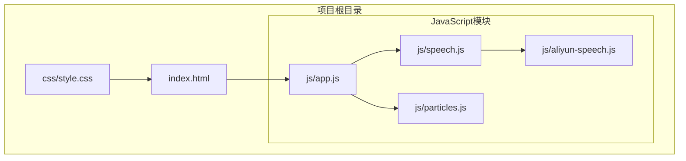
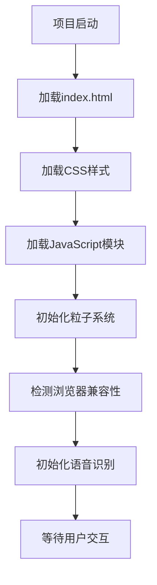
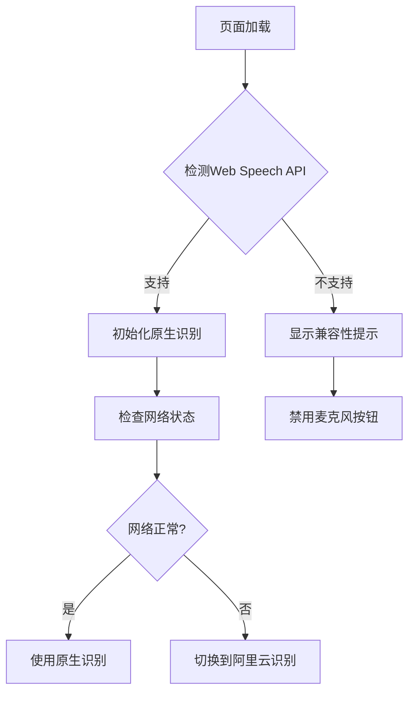
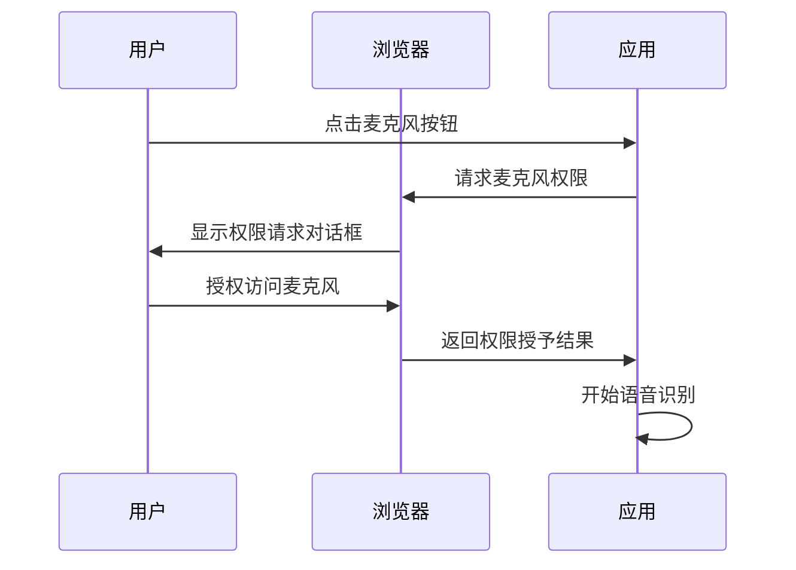
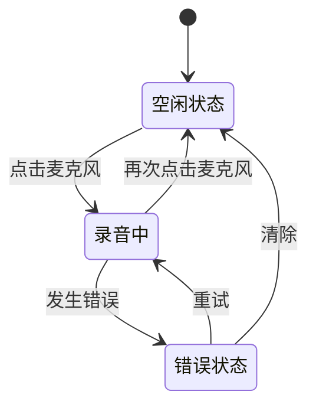
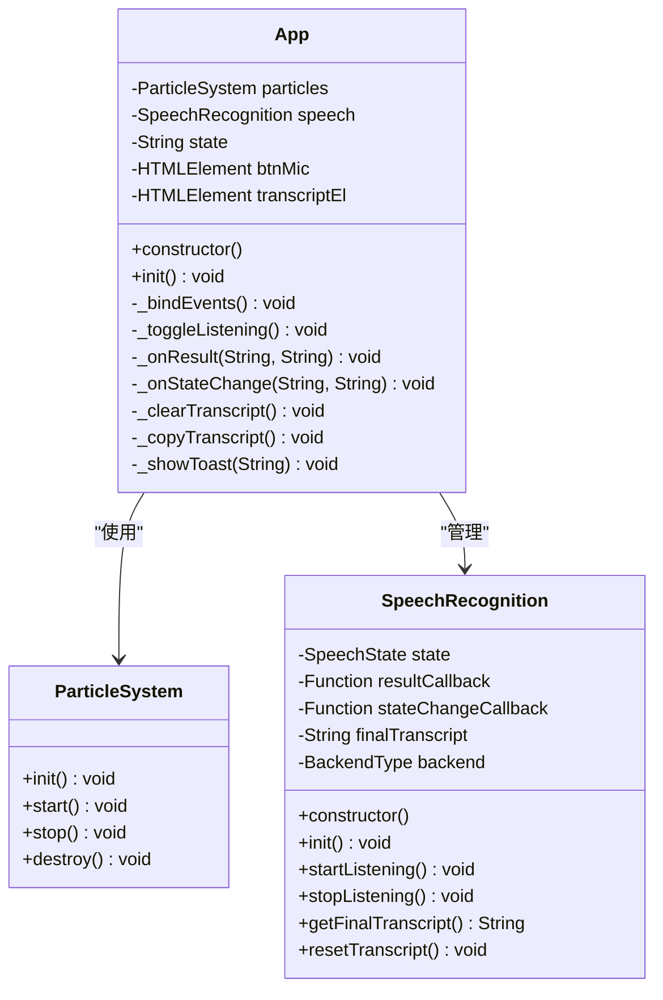
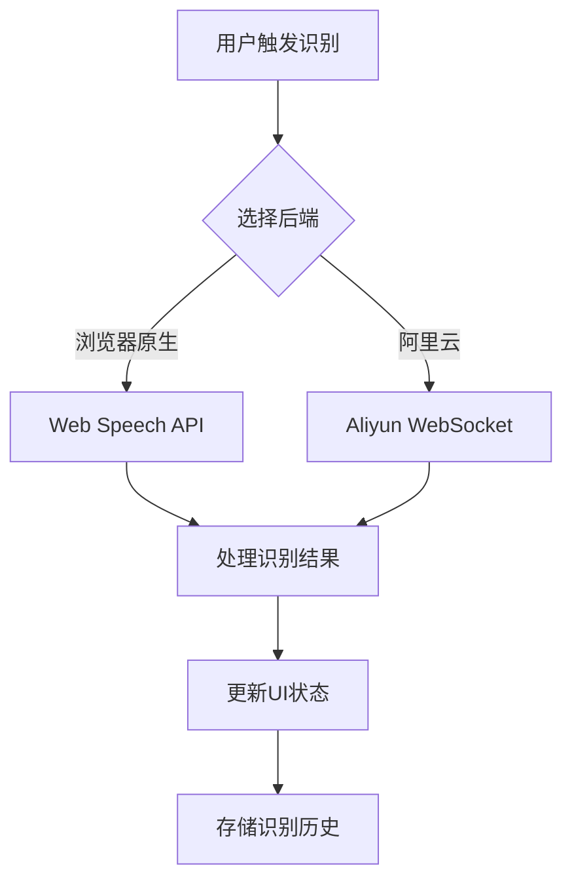
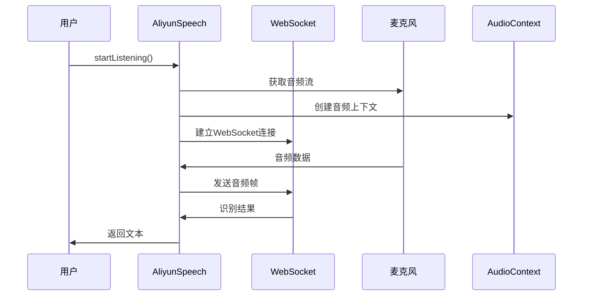

# 快速开始

<cite>
**本文档引用的文件**
- [README.md](file://README.md)
- [index.html](file://index.html)
- [app.js](file://js/app.js)
- [speech.js](file://js/speech.js)
- [aliyun-speech.js](file://js/aliyun-speech.js)
- [particles.js](file://js/particles.js)
- [style.css](file://css/style.css)
</cite>

## 更新摘要
**所做更改**
- 更新了用户界面布局和交互模式的说明
- 修正了语音识别后端配置，从讯飞改为阿里云
- 优化了首次使用流程的界面描述
- 更新了错误处理和状态指示的交互细节

## 目录
1. [简介](#简介)
2. [项目结构](#项目结构)
3. [安装和环境准备](#安装和环境准备)
4. [浏览器兼容性要求](#浏览器兼容性要求)
5. [部署和运行](#部署和运行)
6. [第一次使用完整流程](#第一次使用完整流程)
7. [核心组件详解](#核心组件详解)
8. [常见配置问题和解决方案](#常见配置问题和解决方案)
9. [使用示例](#使用示例)
10. [自定义和扩展指南](#自定义和扩展指南)
11. [故障排除指南](#故障排除指南)
12. [总结](#总结)

## 简介

MySpeechRecognition是一个基于Web Speech API的实时语音识别应用，支持浏览器原生识别和阿里云语音识别两种模式。该项目采用现代化的前端技术栈，提供了流畅的用户体验和强大的语音识别功能。

**项目特点：**
- 支持浏览器原生Web Speech API和阿里云语音识别
- 实时语音转文字，支持中间结果和最终结果
- 粒子动画背景，科技感十足的界面设计
- 响应式设计，支持移动端和桌面端
- 自动错误检测和后端切换机制

## 项目结构

项目采用模块化架构设计，主要由以下核心部分组成：



**图表来源**
- [index.html:1-143](file://index.html#L1-L143)
- [app.js:1-203](file://js/app.js#L1-L203)
- [speech.js:1-371](file://js/speech.js#L1-L371)
- [aliyun-speech.js:1-452](file://js/aliyun-speech.js#L1-L452)
- [particles.js:1-199](file://js/particles.js#L1-L199)

**章节来源**
- [index.html:1-143](file://index.html#L1-L143)
- [style.css:1-472](file://css/style.css#L1-L472)

## 安装和环境准备

### 系统要求

- **操作系统**: Windows、macOS、Linux均可运行
- **浏览器**: Chrome 65+、Edge 79+、Safari 14+
- **网络**: 稳定的互联网连接
- **硬件**: 支持麦克风的设备

### 环境准备步骤

1. **下载项目文件**
   ```bash
   git clone https://github.com/yourusername/MySpeechRecognition.git
   cd MySpeechRecognition
   ```

2. **验证文件完整性**
   确保以下文件存在：
   - `index.html` - 主页面文件
   - `css/style.css` - 样式文件
   - `js/app.js` - 应用主入口
   - `js/speech.js` - 语音识别管理器
   - `js/aliyun-speech.js` - 阿里云语音客户端
   - `js/particles.js` - 粒子动画系统

3. **字体文件准备**
   在`fonts/`目录下确保存在`HYNiaoWen260605.ttf`字体文件

### 依赖关系

项目采用纯前端技术栈，无需额外依赖：



**章节来源**
- [index.html:1-143](file://index.html#L1-L143)
- [app.js:1-203](file://js/app.js#L1-L203)

## 浏览器兼容性要求

### 支持的浏览器

| 浏览器 | 版本要求 | 支持状态 |
|--------|----------|----------|
| Chrome | 65+ | ✅ 完全支持 |
| Edge | 79+ | ✅ 完全支持 |
| Safari | 14+ | ✅ 完全支持 |
| Firefox | 未测试 | ❓ 可能支持 |
| Opera | 未测试 | ❓ 可能支持 |

### Web Speech API支持检测

应用会自动检测浏览器对Web Speech API的支持情况：



**图表来源**
- [speech.js:44-46](file://js/speech.js#L44-L46)
- [speech.js:75-77](file://js/speech.js#L75-L77)

### 兼容性特性

- **自动检测**: 无需手动配置浏览器兼容性
- **优雅降级**: 不支持时提供清晰的错误提示
- **后端切换**: 网络异常时自动切换识别引擎

**章节来源**
- [speech.js:44-46](file://js/speech.js#L44-L46)
- [index.html:78-81](file://index.html#L78-L81)

## 部署和运行

### 本地开发服务器设置

推荐使用以下几种方式运行项目：

#### 方式一：使用Python内置服务器

```bash
# 进入项目目录
cd MySpeechRecognition

# Python 3
python -m http.server 8000

# 或者 Python 2
python -m SimpleHTTPServer 8000
```

#### 方式二：使用Node.js http-server

```bash
# 全局安装http-server
npm install -g http-server

# 启动服务器
http-server -p 8000 -c-1
```

#### 方式三：使用VS Code Live Server插件

1. 在VS Code中安装Live Server插件
2. 右键点击`index.html`文件
3. 选择"Open with Live Server"

### 服务器配置要求

- **端口**: 8000 (默认)
- **协议**: HTTP/HTTPS
- **CORS**: 默认支持
- **静态文件**: 自动服务

### 部署到生产环境

1. **静态托管**: 将整个项目文件夹上传到CDN或静态托管服务
2. **本地部署**: 直接将文件放在Web服务器根目录
3. **容器化**: 可以使用Docker容器部署

**章节来源**
- [index.html:1-143](file://index.html#L1-L143)

## 第一次使用完整流程

### 步骤1：访问应用

1. 打开浏览器访问本地服务器地址
2. 首次访问会显示欢迎界面
3. 确认浏览器支持Web Speech API

### 步骤2：授权麦克风访问



**图表来源**
- [app.js:78-88](file://js/app.js#L78-L88)
- [speech.js:201-216](file://js/speech.js#L201-L216)

### 步骤3：开始语音识别

1. **点击麦克风按钮** 或 **按空格键**
2. 观察界面反馈：
   - 麦克风按钮变为绿色脉冲效果
   - 顶部出现红色录音指示线
   - 声波动画条开始闪烁
   - 状态栏显示"正在聆听..."

### 步骤4：查看识别结果

识别结果会实时显示在文本区域：

- **最终结果**: 白色文本，有霓虹效果
- **中间结果**: 青色半透明文本
- **占位符**: 当没有识别结果时显示提示信息

### 步骤5：控制识别过程



**图表来源**
- [app.js:125-154](file://js/app.js#L125-L154)

### 步骤6：管理识别结果

- **清除文本**: 点击清除按钮清空所有识别结果
- **复制文本**: 点击复制按钮将最终结果复制到剪贴板
- **自动滚动**: 新增结果时自动滚动到最新内容

**章节来源**
- [app.js:90-120](file://js/app.js#L90-L120)
- [app.js:157-184](file://js/app.js#L157-L184)

## 核心组件详解

### 应用主控制器 (App)

App类是整个应用的协调中心，负责：



**图表来源**
- [app.js:11-28](file://js/app.js#L11-L28)
- [particles.js:69-82](file://js/particles.js#L69-82)
- [speech.js:21-39](file://js/speech.js#L21-L39)

### 语音识别管理器 (SpeechRecognition)

SpeechRecognition类提供统一的语音识别接口：



**图表来源**
- [speech.js:154-172](file://js/speech.js#L154-L172)
- [speech.js:319-325](file://js/speech.js#L319-L325)

### 阿里云语音客户端 (AliyunSpeech)

AliyunSpeech类专门处理阿里云语音识别：



**图表来源**
- [aliyun-speech.js:67-129](file://js/aliyun-speech.js#L67-L129)
- [aliyun-speech.js:176-207](file://js/aliyun-speech.js#L176-L207)

**章节来源**
- [app.js:11-28](file://js/app.js#L11-L28)
- [speech.js:21-39](file://js/speech.js#L21-L39)
- [aliyun-speech.js:17-32](file://js/aliyun-speech.js#L17-L32)

## 常见配置问题和解决方案

### 问题1：浏览器不支持Web Speech API

**症状**: 页面显示"浏览器不支持语音识别"提示

**解决方案**:
1. 更换到支持的浏览器（Chrome 65+、Edge 79+、Safari 14+）
2. 确保使用HTTPS协议访问
3. 检查浏览器设置中的语音识别权限

### 问题2：麦克风权限被拒绝

**症状**: 显示"麦克风权限被拒绝"错误

**解决方案**:
1. 在浏览器设置中允许网站使用麦克风
2. 清除网站权限设置后重新授权
3. 确保没有其他程序占用麦克风

### 问题3：网络错误导致识别失败

**症状**: 显示网络错误，自动切换到阿里云识别

**解决方案**:
1. 检查网络连接稳定性
2. 配置阿里云API凭证（推荐）
3. 使用代理或VPN解决网络限制

### 问题4：阿里云API配置错误

**症状**: 显示"请先在设置中配置阿里云 API 凭证"

**解决方案**:
1. 访问阿里云开放平台注册账号
2. 创建语音听写应用获取凭证
3. 在设置面板中正确填写APPID、APISecret、APIKey

### 问题5：音频质量不佳

**症状**: 识别准确率低

**解决方案**:
1. 确保在安静环境中使用
2. 调整麦克风位置和距离
3. 检查音频设备驱动程序
4. 使用外置USB麦克风

**章节来源**
- [speech.js:277-314](file://js/speech.js#L277-L314)
- [aliyun-speech.js:117-127](file://js/aliyun-speech.js#L117-L127)

## 使用示例

### 基础语音识别示例

```javascript
// 创建语音识别实例
const speech = new SpeechRecognition();

// 设置结果回调
speech.onResult((finalText, interimText) => {
    console.log('最终文本:', finalText);
    console.log('中间文本:', interimText);
});

// 设置状态变化回调
speech.onStateChange((state, message) => {
    console.log('状态变化:', state, message);
});

// 开始识别
speech.startListening();
```

### 高级配置示例

```javascript
// 配置阿里云API
speech.configureAliyun({
    appId: 'YOUR_APP_ID',
    apiSecret: 'YOUR_API_SECRET', 
    apiKey: 'YOUR_API_KEY'
});

// 设置后端类型
speech.setBackend('aliyun'); // 或 'native'

// 获取当前配置
const config = speech.getAliyunConfig();
console.log('当前配置:', config);
```

### UI集成示例

```javascript
// 监听应用状态变化
app.speech.onStateChange((state, message) => {
    switch(state) {
        case 'listening':
            // 录音中样式更新
            break;
        case 'error':
            // 错误处理
            showToast(message);
            break;
    }
});
```

## 自定义和扩展指南

### 自定义样式

可以通过修改CSS变量来自定义外观：

```css
:root {
    --bg-primary: #0a0a0f;        /* 主背景色 */
    --accent-cyan: #00f0ff;       /* 靛蓝色强调色 */
    --accent-purple: #bf00ff;     /* 紫色强调色 */
    --text-primary: #e0e0ff;      /* 主要文字颜色 */
}
```

### 添加新识别后端

要添加新的语音识别后端，需要：

1. **创建后端类**:
```javascript
class NewBackend {
    constructor() {
        this.appId = '';
        this.apiKey = '';
        this.resultCallback = null;
        this.stateChangeCallback = null;
    }
    
    configure(config) {
        // 配置API凭证
    }
    
    startListening() {
        // 开始识别
    }
    
    stopListening() {
        // 停止识别
    }
}
```

2. **在SpeechRecognition中集成**:
```javascript
// 添加后端类型
const BackendType = {
    NATIVE: 'native',
    ALIYUN: 'aliyun',
    NEW_BACKEND: 'new_backend'  // 新添加的类型
};

// 在startListening中处理新后端
if (this.backend === BackendType.NEW_BACKEND) {
    this.newBackend.startListening();
}
```

### 扩展功能

**添加语言支持**:
```javascript
// 修改语言设置
this.nativeRecognition.lang = 'zh-CN'; // 支持多语言
```

**自定义音频处理**:
```javascript
// 修改音频采样率和缓冲区大小
const SAMPLE_RATE = 24000; // Hz
const BUFFER_SIZE = 8192; // 字节
```

**增强错误处理**:
```javascript
// 添加自定义错误处理器
_onNativeError(event) {
    const errorMap = {
        'not-allowed': '请检查麦克风权限',
        'network': '网络连接异常',
        'no-speech': '未检测到语音输入'
    };
    
    const message = errorMap[event.error] || '未知错误';
    this._setState(SpeechState.ERROR, message);
}
```

## 故障排除指南

### 常见错误诊断

| 错误类型 | 可能原因 | 解决方案 |
|----------|----------|----------|
| 权限错误 | 用户拒绝麦克风访问 | 检查浏览器权限设置 |
| 网络错误 | 无法连接语音识别服务 | 检查网络连接，使用阿里云后端 |
| 浏览器不支持 | 使用不受支持的浏览器 | 升级到支持的浏览器版本 |
| 音频设备错误 | 麦克风设备不可用 | 检查设备连接，重启音频服务 |
| WebSocket错误 | 无法建立WebSocket连接 | 检查防火墙设置，使用HTTPS |

### 调试技巧

1. **启用开发者工具**: 按F12打开开发者工具
2. **查看控制台日志**: 关注JavaScript错误信息
3. **检查网络面板**: 确认WebSocket连接状态
4. **验证音频流**: 确认麦克风权限和音频输入

### 性能优化建议

1. **减少DOM操作**: 批量更新UI元素
2. **优化音频处理**: 合理设置采样率和缓冲区
3. **内存管理**: 及时清理音频和WebSocket资源
4. **事件监听**: 避免重复绑定事件监听器

**章节来源**
- [speech.js:277-314](file://js/speech.js#L277-L314)
- [aliyun-speech.js:117-127](file://js/aliyun-speech.js#L117-L127)

## 总结

MySpeechRecognition项目提供了一个功能完整、易于使用的语音识别解决方案。通过其模块化架构设计，用户可以轻松地进行部署、配置和扩展。

**主要优势**：
- 简单易用的界面设计
- 双后端支持，适应不同网络环境
- 实时反馈和状态指示
- 响应式设计，支持多设备
- 完善的错误处理机制

**适用场景**：
- 语音输入辅助工具
- 实时会议记录
- 无障碍技术支持
- 语音搜索应用
- 语言学习辅助

通过遵循本指南的步骤，您应该能够成功部署和使用MySpeechRecognition项目。如遇问题，建议参考故障排除指南或查看开发者工具中的详细错误信息。