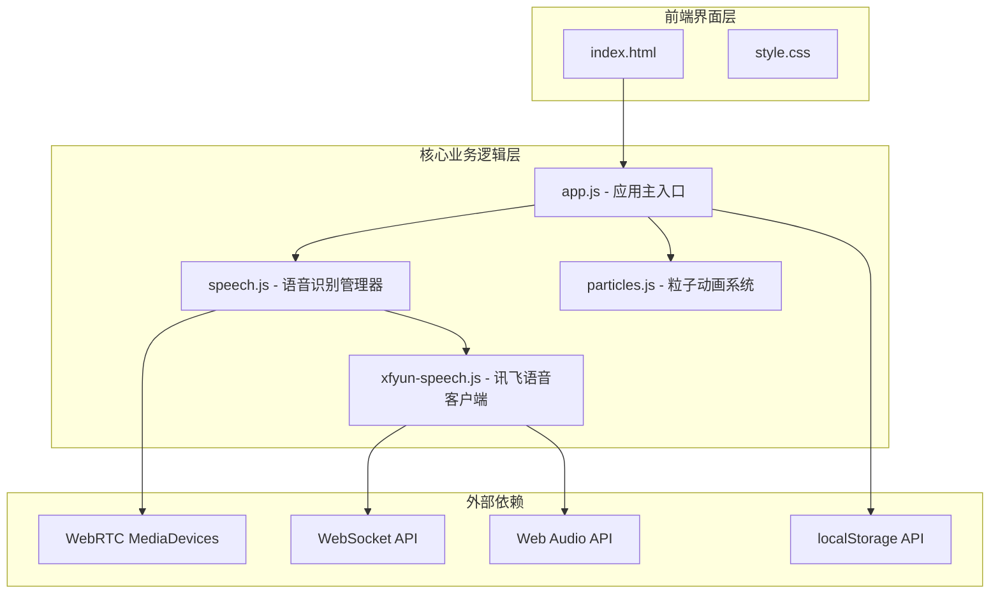
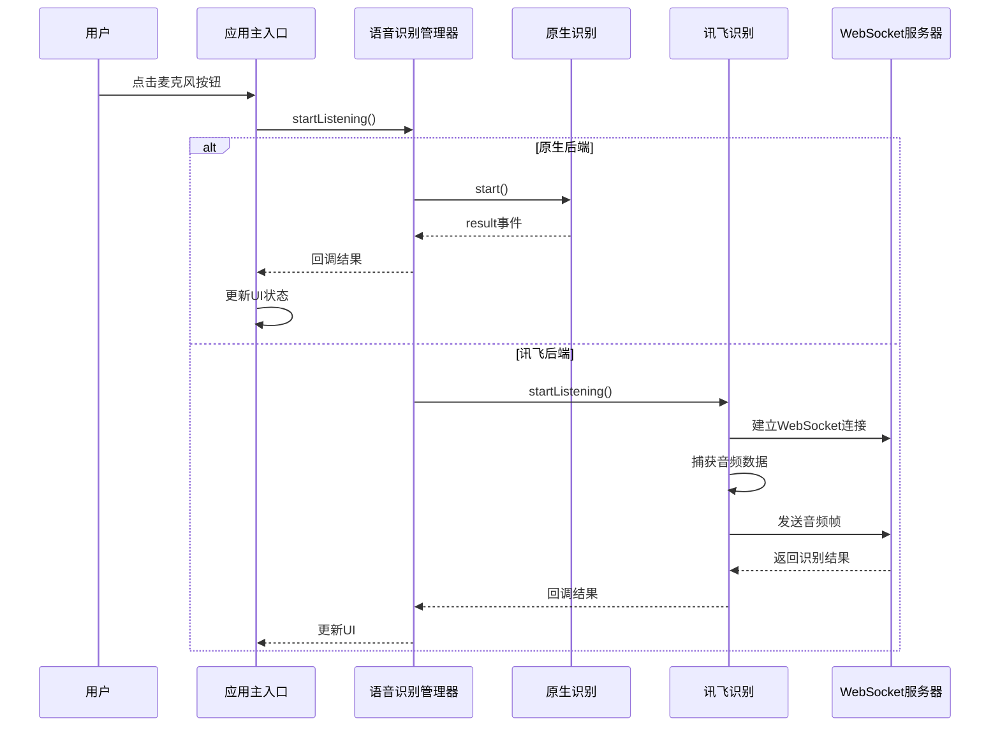
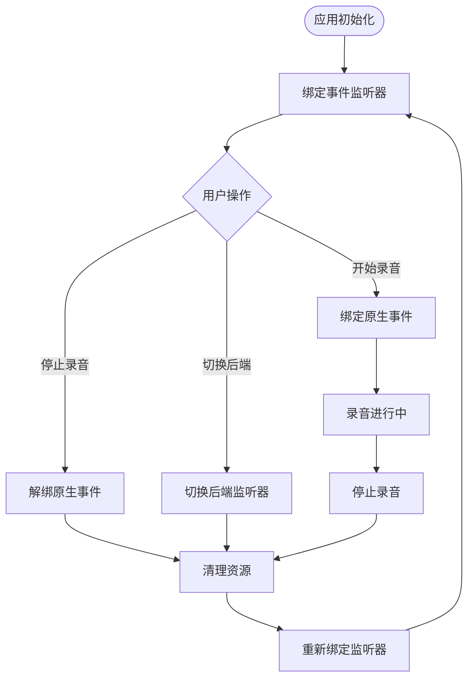
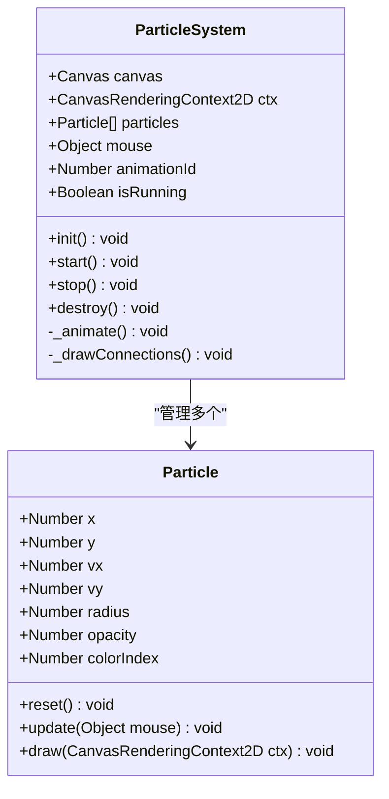
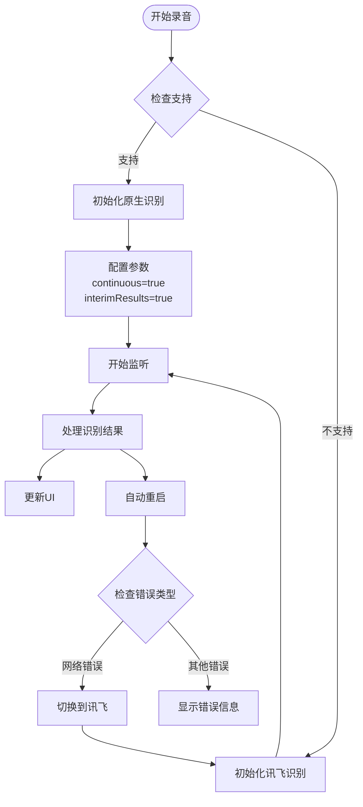
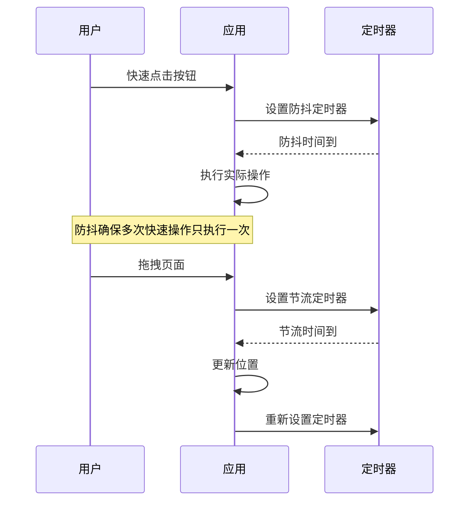
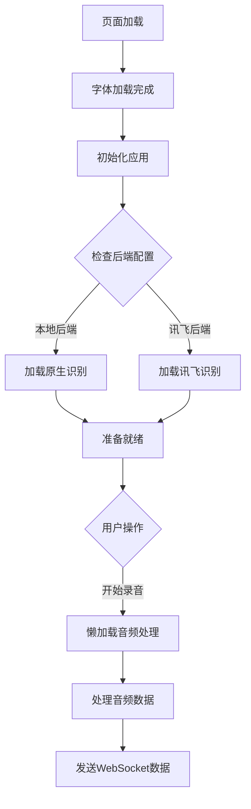
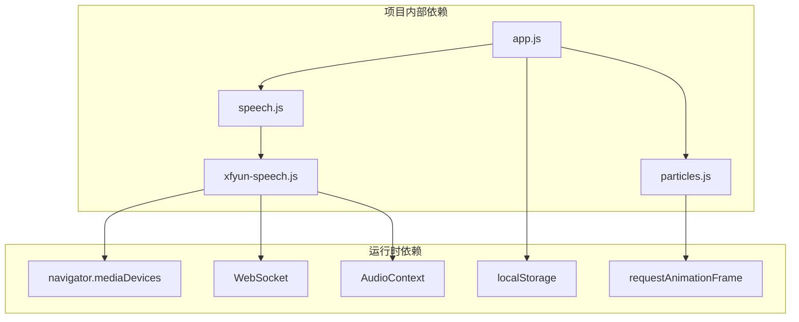

# 性能优化和最佳实践

<cite>
**本文档引用的文件**
- [README.md](file://README.md)
- [index.html](file://index.html)
- [style.css](file://css/style.css)
- [app.js](file://js/app.js)
- [speech.js](file://js/speech.js)
- [xfyun-speech.js](file://js/xfyun-speech.js)
- [particles.js](file://js/particles.js)
</cite>

## 目录
1. [简介](#简介)
2. [项目结构](#项目结构)
3. [核心组件](#核心组件)
4. [架构概览](#架构概览)
5. [详细组件分析](#详细组件分析)
6. [依赖关系分析](#依赖关系分析)
7. [性能考虑](#性能考虑)
8. [故障排除指南](#故障排除指南)
9. [结论](#结论)
10. [附录](#附录)

## 简介

这是一个基于Web Speech API的语音识别应用程序，提供了双后端支持（浏览器原生和讯飞语音）以及现代化的视觉效果。该项目展示了如何在Web环境中实现高性能的语音识别和实时动画效果。

## 项目结构

项目采用模块化架构设计，主要分为以下几个部分：

**图表来源**
- [index.html:1-143](file://index.html#L1-L143)
- [app.js:1-203](file://js/app.js#L1-L203)
- [speech.js:1-371](file://js/speech.js#L1-L371)
- [xfyun-speech.js:1-452](file://js/xfyun-speech.js#L1-L452)
- [particles.js:1-199](file://js/particles.js#L1-L199)

**章节来源**
- [index.html:1-143](file://index.html#L1-L143)
- [style.css:1-711](file://css/style.css#L1-L711)
- [app.js:1-203](file://js/app.js#L1-L203)

## 核心组件

### 应用主入口 (App)

应用主入口负责协调各个组件的初始化和事件处理：

- **职责分离**：将UI管理、语音识别控制和粒子动画管理分离
- **状态管理**：维护应用状态并在组件间传递
- **事件绑定**：统一处理用户交互事件
- **资源清理**：确保组件销毁时释放资源

### 语音识别管理器 (SpeechRecognition)

实现了双后端语音识别系统：

- **后端切换**：根据网络状况自动在原生和讯飞之间切换
- **错误处理**：完善的错误检测和恢复机制
- **配置持久化**：使用localStorage保存用户偏好设置
- **回调模式**：支持结果和状态变化的回调通知

### 讯飞语音客户端 (XfyunSpeech)

专门处理讯飞语音识别的WebSocket客户端：

- **音频捕获**：使用Web Audio API实时捕获PCM音频
- **WebSocket通信**：建立稳定的实时通信通道
- **资源管理**：完整的音频上下文和媒体流清理
- **错误恢复**：网络中断后的自动重连机制

### 粒子动画系统 (ParticleSystem)

高性能的Canvas粒子动画系统：

- **帧率优化**：使用requestAnimationFrame确保流畅动画
- **内存管理**：合理的对象池和垃圾回收策略
- **性能自适应**：根据屏幕尺寸动态调整粒子数量
- **可见性感知**：页面隐藏时自动暂停动画

**章节来源**
- [app.js:11-203](file://js/app.js#L11-L203)
- [speech.js:21-371](file://js/speech.js#L21-L371)
- [xfyun-speech.js:17-452](file://js/xfyun-speech.js#L17-L452)
- [particles.js:69-199](file://js/particles.js#L69-L199)

## 架构概览

**图表来源**
- [app.js:78-88](file://js/app.js#L78-L88)
- [speech.js:154-172](file://js/speech.js#L154-L172)
- [xfyun-speech.js:67-129](file://js/xfyun-speech.js#L67-L129)

## 详细组件分析

### 内存管理策略

#### 事件监听器管理

**图表来源**
- [speech.js:95-100](file://js/speech.js#L95-L100)
- [xfyun-speech.js:134-148](file://js/xfyun-speech.js#L134-L148)

#### 垃圾回收优化

项目采用了多种垃圾回收优化策略：

1. **对象池模式**：粒子系统使用预分配的对象池避免频繁创建销毁
2. **事件监听器解绑**：在组件销毁时及时移除所有事件监听器
3. **定时器清理**：确保所有setTimeout和setInterval在适当时候清理
4. **DOM节点管理**：合理使用innerHTML而不是频繁的DOM操作

**章节来源**
- [particles.js:18-67](file://js/particles.js#L18-L67)
- [speech.js:194-197](file://js/speech.js#L194-L197)
- [xfyun-speech.js:400-424](file://js/xfyun-speech.js#L400-L424)

### Canvas动画性能优化

#### 帧率控制和渲染优化

**图表来源**
- [particles.js:69-199](file://js/particles.js#L69-L199)
- [particles.js:18-67](file://js/particles.js#L18-L67)

#### 性能优化技术

1. **requestAnimationFrame使用**：确保动画与浏览器刷新频率同步
2. **批量绘制**：一次遍历中完成所有粒子的更新和绘制
3. **距离计算优化**：只对近距离粒子绘制连接线
4. **可见性感知**：页面隐藏时自动暂停动画减少CPU消耗

**章节来源**
- [particles.js:152-167](file://js/particles.js#L152-L167)
- [particles.js:169-189](file://js/particles.js#L169-L189)

### 语音识别性能考虑

#### 原生Web Speech API优化

**图表来源**
- [speech.js:86-101](file://js/speech.js#L86-L101)
- [speech.js:254-271](file://js/speech.js#L254-L271)

#### 讯飞WebSocket优化

1. **音频缓冲管理**：使用数组缓冲区避免频繁的音频数据处理
2. **WebSocket连接池**：单连接复用避免频繁建立连接
3. **错误恢复机制**：网络中断后的自动重连和状态恢复
4. **资源清理**：完整的音频上下文和媒体流清理

**章节来源**
- [speech.js:282-302](file://js/speech.js#L282-L302)
- [xfyun-speech.js:299-341](file://js/xfyun-speech.js#L299-L341)

### 事件处理最佳实践

#### 防抖和节流技术

项目中实现了多种事件处理优化：

1. **键盘事件防抖**：空格键快捷操作的防重复触发
2. **窗口大小变化节流**：resize事件的节流处理
3. **鼠标移动优化**：mousemove事件的性能优化

**图表来源**
- [app.js:69-75](file://js/app.js#L69-L75)
- [particles.js:104-113](file://js/particles.js#L104-L113)

**章节来源**
- [app.js:69-75](file://js/app.js#L69-L75)
- [particles.js:120-128](file://js/particles.js#L120-L128)

### 资源加载优化策略

#### 懒加载实现

**图表来源**
- [app.js:54-56](file://js/app.js#L54-L56)
- [speech.js:79-81](file://js/speech.js#L79-L81)

#### 性能优化策略

1. **字体懒加载**：使用font-display: swap确保页面快速渲染
2. **模块化加载**：使用ES6模块按需加载
3. **Canvas优化**：根据设备性能调整粒子数量
4. **CSS动画**：使用GPU加速的CSS3动画

**章节来源**
- [style.css:6-12](file://css/style.css#L6-L12)
- [particles.js:96-102](file://js/particles.js#L96-L102)

## 依赖关系分析

**图表来源**
- [app.js:8-9](file://js/app.js#L8-L9)
- [speech.js:8](file://js/speech.js#L8)
- [xfyun-speech.js:77-84](file://js/xfyun-speech.js#L77-L84)

**章节来源**
- [app.js:8-9](file://js/app.js#L8-L9)
- [speech.js:8](file://js/speech.js#L8)

## 性能考虑

### 内存管理最佳实践

#### 事件监听器生命周期管理

1. **初始化时绑定**：在组件构造函数中绑定必要的事件
2. **运行时维护**：根据状态动态添加或移除监听器
3. **销毁时清理**：在destroy方法中确保所有监听器被移除

#### 对象生命周期优化

1. **复用原则**：优先复用现有对象而非创建新对象
2. **批量操作**：减少DOM操作次数，使用批量更新
3. **及时清理**：不再使用的变量及时设为null

### Canvas动画性能优化

#### 帧率控制策略

1. **requestAnimationFrame使用**：确保动画与浏览器刷新同步
2. **性能自适应**：根据设备性能调整动画复杂度
3. **可见性感知**：页面隐藏时暂停动画

#### 绘制优化技术

1. **批量绘制**：一次遍历完成所有绘制操作
2. **距离优化**：只绘制近距离的连接线
3. **透明度优化**：使用预计算的透明度值

### 语音识别性能优化

#### 网络优化策略

1. **后端自动切换**：根据网络状况智能选择最优后端
2. **连接池管理**：WebSocket连接的复用和重用
3. **错误恢复**：网络中断后的自动重连机制

#### 音频处理优化

1. **缓冲区管理**：合理的音频缓冲区大小
2. **采样率优化**：根据需求选择合适的采样率
3. **噪声抑制**：启用浏览器内置的噪声抑制功能

### 资源管理优化

#### 懒加载策略

1. **按需加载**：只在需要时加载相关资源
2. **预加载规划**：合理安排资源加载顺序
3. **缓存利用**：充分利用浏览器缓存机制

#### 内存泄漏防护

1. **循环引用避免**：注意闭包和事件处理器的循环引用
2. **定时器清理**：确保所有定时器在适当时候清理
3. **DOM引用清理**：及时移除不需要的DOM引用

## 故障排除指南

### 常见性能问题诊断

#### 语音识别问题

1. **麦克风权限问题**：检查浏览器权限设置
2. **网络连接问题**：验证WebSocket连接状态
3. **音频设备问题**：确认音频输入设备正常工作

#### 动画性能问题

1. **帧率下降**：检查是否有过多的DOM操作
2. **内存泄漏**：使用浏览器开发者工具检查内存使用
3. **CPU占用过高**：分析JavaScript执行时间

### 调试工具使用

#### 性能分析工具

1. **Chrome DevTools**：使用Performance面板分析性能瓶颈
2. **Memory面板**：监控内存使用情况
3. **Network面板**：检查网络请求性能
4. **Lighthouse**：进行全面的性能审计

#### 语音识别调试

1. **控制台日志**：查看详细的错误信息
2. **WebSocket调试**：监控实时通信状态
3. **音频分析**：使用Web Audio API分析音频数据

**章节来源**
- [speech.js:273-315](file://js/speech.js#L273-L315)
- [xfyun-speech.js:114-128](file://js/xfyun-speech.js#L114-L128)

## 结论

这个语音识别项目展示了现代Web应用的性能优化最佳实践：

1. **模块化架构**：清晰的职责分离和组件化设计
2. **性能优先**：从架构层面考虑性能影响
3. **用户体验**：平衡性能和功能的实现
4. **可维护性**：良好的代码结构和注释

通过实施这些优化策略，项目在保持功能完整性的同时，实现了优秀的性能表现和用户体验。

## 附录

### 性能测试案例

#### 测试场景设置

1. **设备配置**：不同性能级别的设备测试
2. **网络条件**：模拟不同的网络环境
3. **使用场景**：长时间连续使用测试
4. **并发测试**：多标签页同时运行测试

#### 改进效果对比

1. **启动时间**：优化前后的时间对比
2. **内存使用**：峰值内存使用量对比
3. **CPU占用**：平均CPU使用率对比
4. **电池续航**：移动设备上的电池消耗对比

### 针对不同设备的优化建议

#### 移动设备优化

1. **触摸优化**：确保按钮大小适合触摸操作
2. **性能自适应**：根据设备性能调整动画复杂度
3. **电池优化**：减少后台活动以节省电量
4. **网络优化**：优化离线功能和缓存策略

#### 桌面设备优化

1. **高分辨率支持**：优化高DPI屏幕的显示效果
2. **键盘快捷键**：提供完整的键盘操作支持
3. **多显示器支持**：适配多显示器环境
4. **性能最大化**：充分利用桌面设备的性能

#### 浏览器兼容性优化

1. **渐进增强**：基于基础功能构建高级特性
2. **特性检测**：使用特性检测而非浏览器检测
3. **回退方案**：为不支持的特性提供降级方案
4. **跨浏览器测试**：确保在主流浏览器中的兼容性