# 性能问题诊断

<cite>
**本文档引用的文件**
- [index.html](file://index.html)
- [app.js](file://js/app.js)
- [speech.js](file://js/speech.js)
- [aliyun-speech.js](file://js/aliyun-speech.js)
- [particles.js](file://js/particles.js)
- [style.css](file://css/style.css)
</cite>

## 目录
1. [简介](#简介)
2. [项目结构](#项目结构)
3. [核心组件](#核心组件)
4. [架构概览](#架构概览)
5. [详细组件分析](#详细组件分析)
6. [性能问题诊断指南](#性能问题诊断指南)
7. [Canvas动画性能优化](#canvas动画性能优化)
8. [内存管理与垃圾回收](#内存管理与垃圾回收)
9. [浏览器性能分析工具使用](#浏览器性能分析工具使用)
10. [不同硬件配置下的调优策略](#不同硬件配置下的调优策略)
11. [故障排除指南](#故障排除指南)
12. [结论](#结论)

## 简介

这是一个基于Web Speech API的语音识别应用，支持浏览器原生识别和阿里云语音识别两种后端。项目采用模块化设计，包含Canvas粒子背景动画、实时语音识别、多后端切换等功能。本文档专注于系统的性能问题诊断和优化策略，涵盖语音识别延迟、CPU占用过高、内存泄漏等问题的识别和解决方案。

## 项目结构

项目采用清晰的模块化架构，主要由以下部分组成：

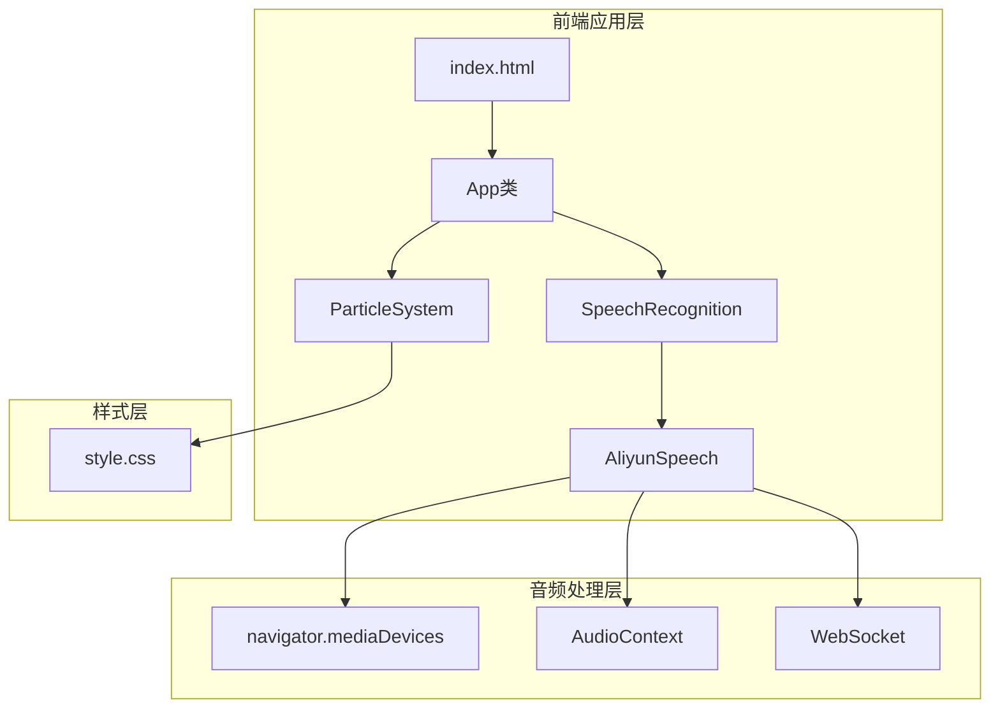

**图表来源**
- [index.html:1-143](file://index.html#L1-L143)
- [app.js:1-296](file://js/app.js#L1-L296)
- [speech.js:1-383](file://js/speech.js#L1-L383)
- [aliyun-speech.js:1-478](file://js/aliyun-speech.js#L1-L478)
- [particles.js:1-199](file://js/particles.js#L1-L199)

**章节来源**
- [index.html:1-143](file://index.html#L1-L143)
- [app.js:1-296](file://js/app.js#L1-L296)
- [speech.js:1-383](file://js/speech.js#L1-L383)
- [aliyun-speech.js:1-478](file://js/aliyun-speech.js#L1-L478)
- [particles.js:1-199](file://js/particles.js#L1-L199)

## 核心组件

### 应用主控制器
App类作为整个应用的协调者，负责：
- 初始化粒子背景系统
- 管理语音识别后端
- 处理用户界面事件
- 状态管理和UI更新

### 语音识别管理器
SpeechRecognition类提供统一的语音识别接口，支持：
- 浏览器原生Web Speech API
- 阿里云WebSocket语音识别
- 自动后端切换机制
- 配置持久化存储

### Canvas粒子系统
ParticleSystem类实现高性能的粒子动画效果：
- 实时粒子运动计算
- 粒子间连线绘制
- 鼠标交互响应
- 自适应分辨率

**章节来源**
- [app.js:12-296](file://js/app.js#L12-L296)
- [speech.js:21-383](file://js/speech.js#L21-L383)
- [particles.js:69-199](file://js/particles.js#L69-L199)

## 架构概览

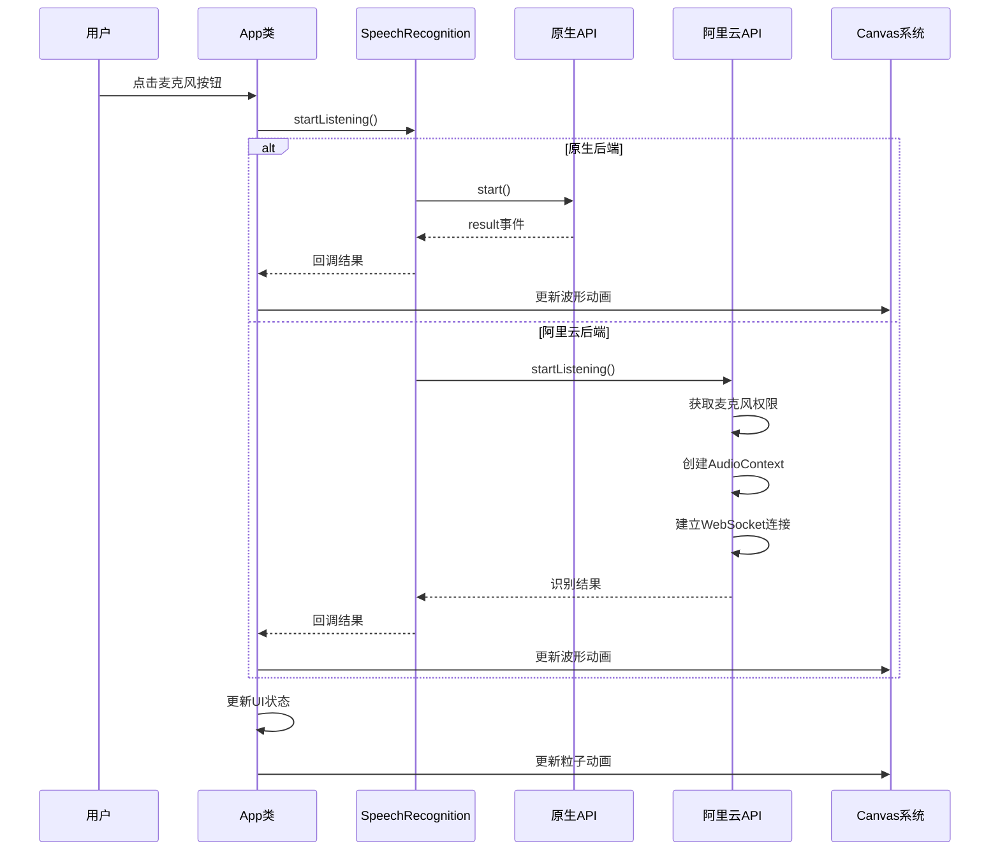

**图表来源**
- [app.js:82-91](file://js/app.js#L82-L91)
- [speech.js:154-184](file://js/speech.js#L154-L184)
- [xfyun-speech.js:67-129](file://js/xfyun-speech.js#L67-L129)

## 详细组件分析

### 语音识别组件深度分析

#### 原生Web Speech API集成
原生API通过SpeechRecognition对象实现，具有以下特点：
- 支持连续识别和临时结果
- 自动错误处理和重连机制
- 本地浏览器处理，无网络延迟

#### 阿里云WebSocket集成
阿里云API通过WebSocket实现实时音频传输：
- PCM音频格式转换
- 实时音频流处理
- 云端语音识别服务

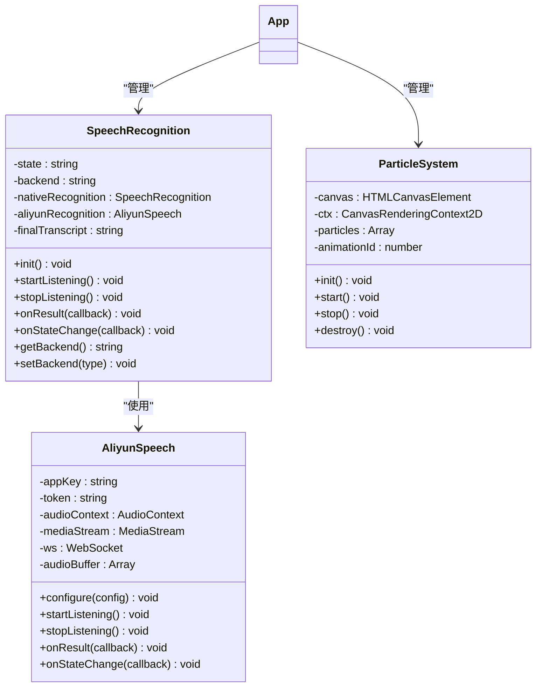

**图表来源**
- [speech.js:21-383](file://js/speech.js#L21-L383)
- [aliyun-speech.js:17-478](file://js/aliyun-speech.js#L17-L478)
- [particles.js:69-199](file://js/particles.js#L69-L199)

**章节来源**
- [speech.js:21-383](file://js/speech.js#L21-L383)
- [aliyun-speech.js:17-478](file://js/aliyun-speech.js#L17-L478)
- [particles.js:69-199](file://js/particles.js#L69-L199)

## 性能问题诊断指南

### 语音识别延迟问题诊断

#### 延迟来源分析

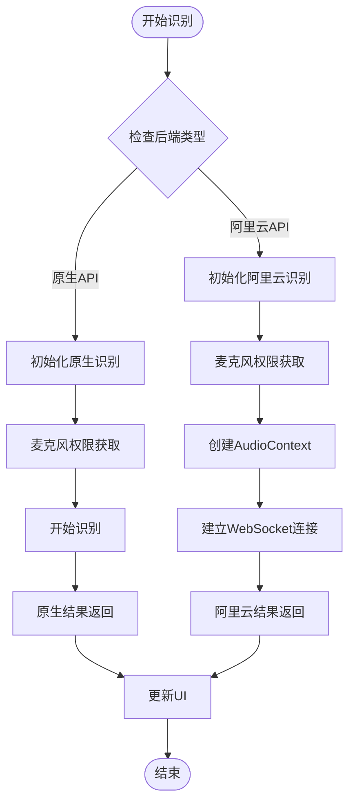

**图表来源**
- [speech.js:154-184](file://js/speech.js#L154-L184)
- [aliyun-speech.js:77-108](file://js/aliyun-speech.js#L77-L108)

#### 延迟问题识别方法

1. **网络延迟检测**
   - 使用浏览器开发者工具的Network面板监控WebSocket连接
   - 检查阿里云API的响应时间
   - 监控原生API的start/end事件间隔

2. **音频处理延迟**
   - 分析AudioContext的缓冲区大小
   - 检查PCM数据转换的性能
   - 监控WebSocket消息发送频率

3. **UI更新延迟**
   - 使用Performance面板分析DOM操作
   - 检查文本插入的批量更新
   - 监控滚动位置的更新频率

**章节来源**
- [speech.js:285-327](file://js/speech.js#L285-L327)
- [aliyun-speech.js:96-102](file://js/aliyun-speech.js#L96-L102)

### CPU占用过高问题诊断

#### CPU热点分析

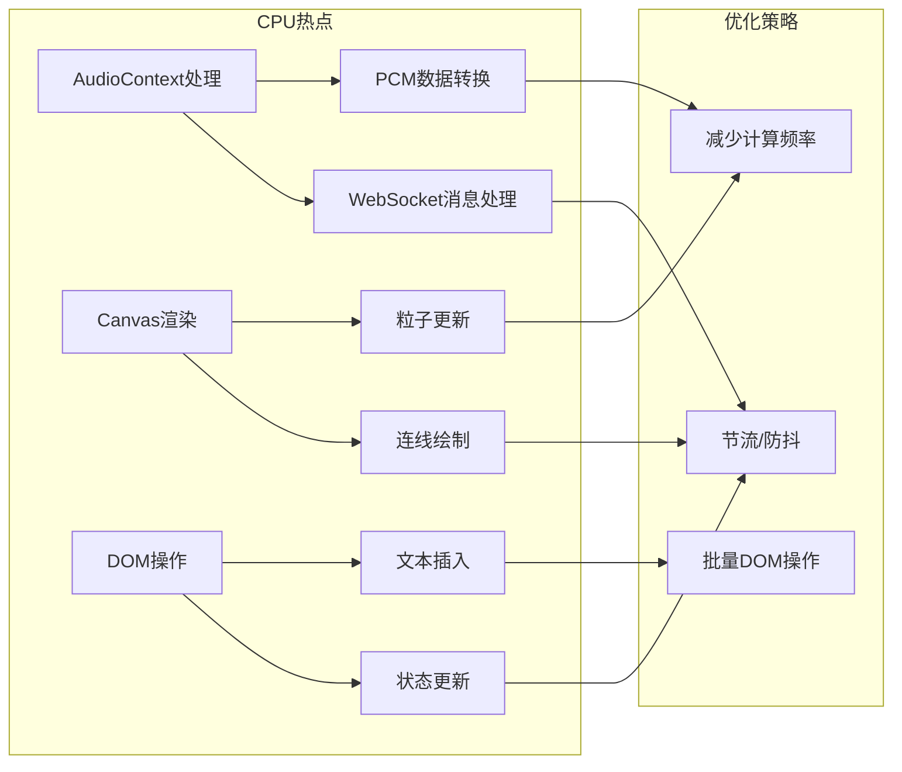

**图表来源**
- [aliyun-speech.js:96-102](file://js/aliyun-speech.js#L96-L102)
- [particles.js:152-167](file://js/particles.js#L152-L167)
- [app.js:182-208](file://js/app.js#L182-L208)

#### CPU问题识别方法

1. **音频处理优化**
   - 检查AudioContext的sampleRate设置
   - 优化PCM数据转换算法
   - 减少WebSocket消息处理频率

2. **Canvas渲染优化**
   - 分析粒子更新的复杂度
   - 优化连线绘制算法
   - 减少不必要的重绘

3. **DOM操作优化**
   - 使用DocumentFragment批量插入
   - 避免频繁的offsetHeight/offsetWidth查询
   - 使用requestAnimationFrame优化动画

**章节来源**
- [aliyun-speech.js:384-391](file://js/aliyun-speech.js#L384-L391)
- [particles.js:152-167](file://js/particles.js#L152-L167)
- [app.js:182-208](file://js/app.js#L182-L208)

### 内存泄漏问题诊断

#### 内存泄漏检测方法

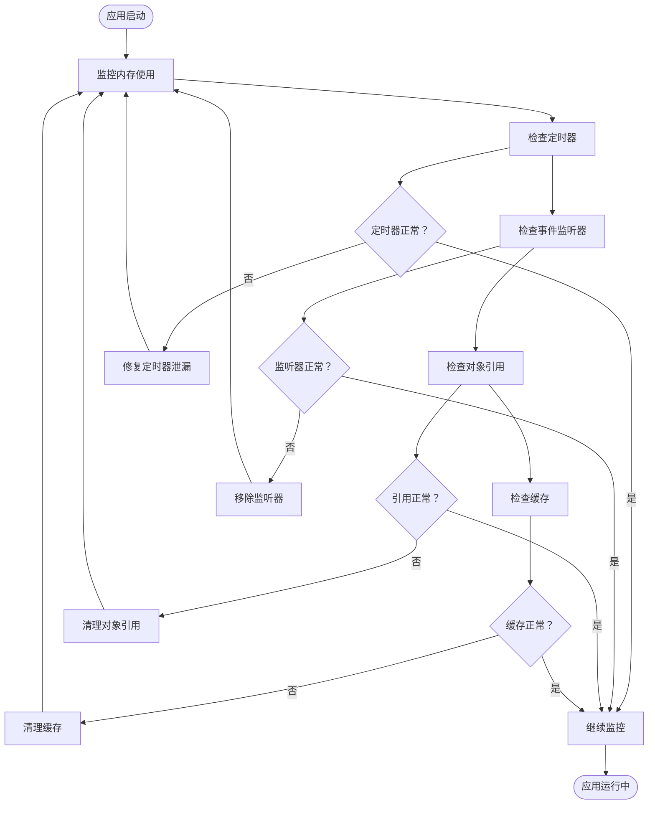

**图表来源**
- [speech.js:206-209](file://js/speech.js#L206-L209)
- [aliyun-speech.js:355-379](file://js/aliyun-speech.js#L355-379)
- [particles.js:191-197](file://js/particles.js#L191-L197)

#### 内存泄漏识别方法

1. **音频处理内存管理**
   - 检查AudioContext的正确关闭
   - 确保MediaStream轨道的停止
   - 监控WebSocket连接的状态

2. **Canvas系统内存管理**
   - 确保AnimationFrame的正确取消
   - 检查事件监听器的移除
   - 监控粒子数组的增长

3. **应用级内存管理**
   - 检查SpeechRecognition实例的销毁
   - 确保DOM元素的正确清理
   - 监控localStorage的使用

**章节来源**
- [speech.js:206-209](file://js/speech.js#L206-L209)
- [aliyun-speech.js:355-379](file://js/aliyun-speech.js#L355-379)
- [particles.js:191-197](file://js/particles.js#L191-L197)

## Canvas动画性能优化

### 帧率控制策略

#### 动画循环优化

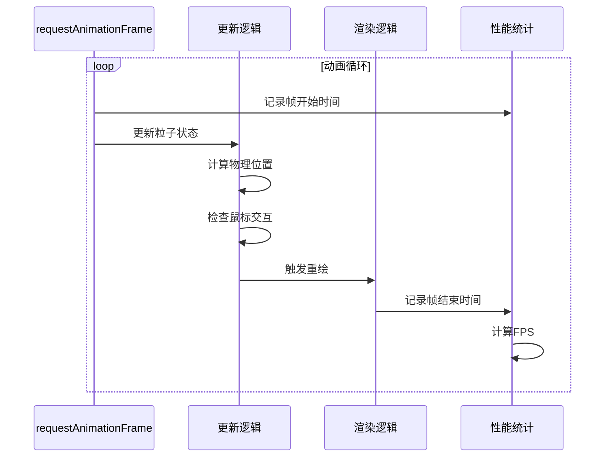

**图表来源**
- [particles.js:152-167](file://js/particles.js#L152-L167)

#### 优化技术实现

1. **自适应粒子数量**
   - 根据屏幕尺寸动态调整粒子数量
   - 在小屏幕上减少粒子密度
   - 使用性能预算限制粒子数量

2. **批量更新策略**
   - 合并多个小的DOM更新
   - 使用CSS动画替代JavaScript动画
   - 减少重排和重绘的触发

3. **渲染优化**
   - 使用离屏Canvas进行复杂计算
   - 优化连线绘制算法
   - 减少像素填充操作

**章节来源**
- [particles.js:96-102](file://js/particles.js#L96-L102)
- [particles.js:169-189](file://js/particles.js#L169-L189)

### 渲染优化技术

#### 性能监控指标

| 指标 | 正常范围 | 优化目标 |
|------|----------|----------|
| FPS | 60±5 | 保持稳定在55+ |
| 渲染时间 | <16ms | 目标<10ms |
| GPU使用率 | <80% | 目标<60% |
| 内存使用 | <50MB | 控制增长趋势 |

#### 渲染优化策略

1. **Canvas渲染优化**
   - 使用`imageSmoothingEnabled=false`提升渲染性能
   - 合并多个绘制调用为单个批次
   - 使用`transform`矩阵进行批量变换

2. **粒子系统优化**
   - 实现粒子池复用机制
   - 减少粒子间的距离计算
   - 优化连线绘制的条件判断

3. **事件处理优化**
   - 使用节流函数限制mousemove事件频率
   - 实现事件委托减少监听器数量
   - 优化可见性变化处理

**章节来源**
- [particles.js:152-167](file://js/particles.js#L152-L167)
- [particles.js:120-128](file://js/particles.js#L120-L128)

## 内存管理与垃圾回收

### 垃圾回收策略

#### 内存使用模式分析

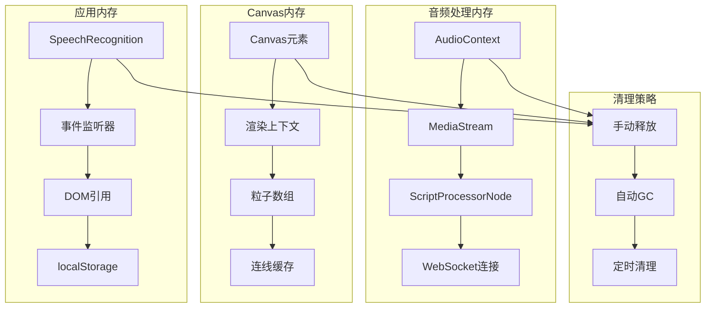

**图表来源**
- [aliyun-speech.js:355-379](file://js/aliyun-speech.js#L355-379)
- [particles.js:191-197](file://js/particles.js#L191-L197)
- [speech.js:350-381](file://js/speech.js#L350-L381)

#### 内存优化实践

1. **音频处理内存管理**
   - 确保AudioContext在停止时正确关闭
   - 及时停止MediaStream的所有轨道
   - 监控WebSocket连接状态并及时清理

2. **Canvas系统内存管理**
   - 实现粒子对象池减少分配
   - 优化连线绘制的临时对象
   - 监控Canvas尺寸变化避免内存泄漏

3. **应用级内存管理**
   - 使用WeakMap存储DOM到数据的映射
   - 实现组件生命周期的完整清理
   - 监控localStorage使用避免过度存储

**章节来源**
- [aliyun-speech.js:355-379](file://js/aliyun-speech.js#L355-379)
- [particles.js:191-197](file://js/particles.js#L191-L197)
- [speech.js:350-381](file://js/speech.js#L350-L381)

### 事件监听器清理

#### 事件监听器管理策略

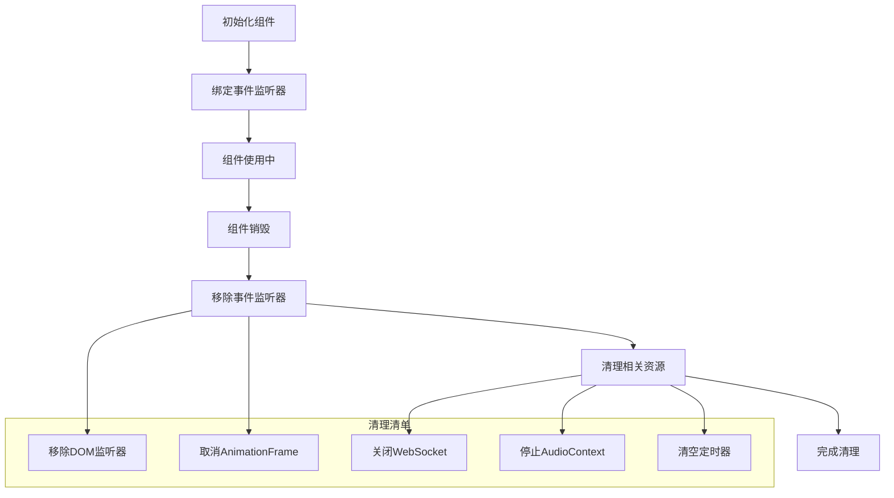

**图表来源**
- [particles.js:191-197](file://js/particles.js#L191-L197)
- [speech.js:206-209](file://js/speech.js#L206-L209)

#### 事件监听器优化

1. **DOM事件管理**
   - 使用事件委托减少监听器数量
   - 实现统一的事件管理器
   - 确保在组件销毁时移除所有监听器

2. **媒体设备事件**
   - 监控媒体设备的变化
   - 及时更新音频处理链路
   - 处理设备移除的异常情况

3. **窗口事件管理**
   - 监控窗口大小变化
   - 处理页面可见性变化
   - 管理焦点和失焦事件

**章节来源**
- [particles.js:191-197](file://js/particles.js#L191-L197)
- [speech.js:206-209](file://js/speech.js#L206-L209)

## 浏览器性能分析工具使用

### Chrome DevTools性能分析

#### 性能面板使用指南

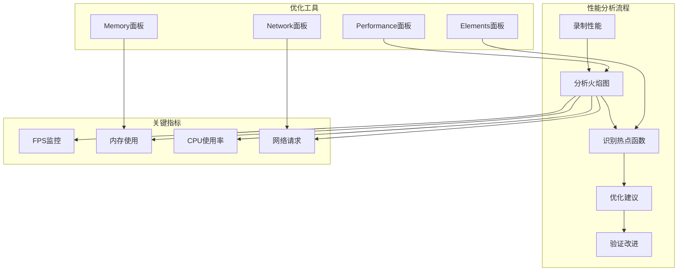

**图表来源**
- [app.js:182-208](file://js/app.js#L182-L208)
- [speech.js:246-283](file://js/speech.js#L246-L283)

#### 性能分析步骤

1. **录制性能数据**
   - 打开Performance面板
   - 点击录制按钮
   - 执行语音识别操作
   - 停止录制并分析结果

2. **分析关键指标**
   - 查看FPS曲线稳定性
   - 监控内存使用峰值
   - 分析CPU使用分布
   - 检查网络请求延迟

3. **识别性能瓶颈**
   - 分析长任务列表
   - 查看重排重绘信息
   - 监控垃圾回收活动
   - 检查主线程阻塞

**章节来源**
- [app.js:182-208](file://js/app.js#L182-L208)
- [speech.js:246-283](file://js/speech.js#L246-L283)

### 内存分析技巧

#### 内存快照分析

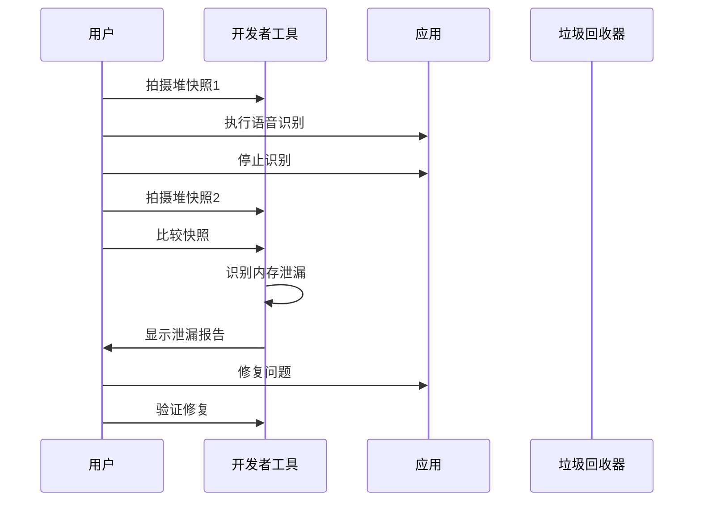

**图表来源**
- [aliyun-speech.js:355-379](file://js/aliyun-speech.js#L355-379)
- [particles.js:191-197](file://js/particles.js#L191-L197)

#### 内存泄漏检测方法

1. **堆快照比较**
   - 拍摄应用启动时的堆快照
   - 执行完整的语音识别流程
   - 拍摄结束时的堆快照
   - 比较快照差异

2. **对象保留路径分析**
   - 查找持续存在的对象
   - 分析对象的引用链
   - 识别意外的全局引用
   - 检查闭包内存泄漏

3. **实时内存监控**
   - 使用Memory面板监控内存
   - 观察内存使用的增长趋势
   - 检查垃圾回收的频率
   - 分析内存碎片化程度

**章节来源**
- [aliyun-speech.js:355-379](file://js/aliyun-speech.js#L355-379)
- [particles.js:191-197](file://js/particles.js#L191-L197)

## 不同硬件配置下的调优策略

### 性能分级策略

#### 硬件配置分类

| 硬件等级 | CPU核心数 | 内存容量 | 推荐策略 |
|----------|-----------|----------|----------|
| 高性能 | 8核+ | 16GB+ | 全功能启用，高帧率 |
| 中性能 | 4-8核 | 8-16GB | 标准功能，中等帧率 |
| 低性能 | 2-4核 | 4-8GB | 简化功能，低帧率 |
| 极低性能 | <2核 | <4GB | 基础功能，禁用动画 |

#### 自适应配置策略

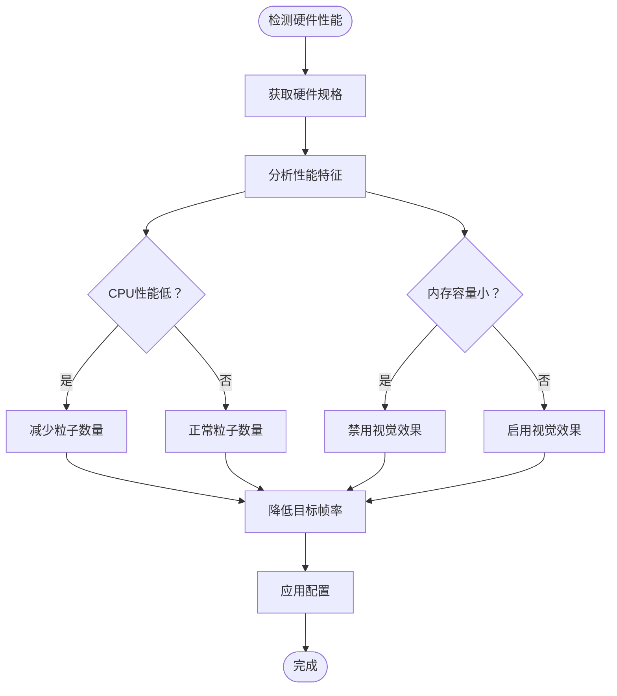

**图表来源**
- [particles.js:96-102](file://js/particles.js#L96-L102)
- [speech.js:154-184](file://js/speech.js#L154-L184)

#### 具体调优参数

1. **高性能配置**
   - 粒子数量：80个
   - 目标帧率：60 FPS
   - 音频缓冲：4096字节
   - WebSocket重连：自动

2. **中性能配置**
   - 粒子数量：60个
   - 目标帧率：45 FPS
   - 音频缓冲：2048字节
   - WebSocket重连：延迟1秒

3. **低性能配置**
   - 粒子数量：40个
   - 目标帧率：30 FPS
   - 音频缓冲：1024字节
   - WebSocket重连：延迟3秒

4. **极低性能配置**
   - 粒子数量：20个
   - 目标帧率：20 FPS
   - 音频缓冲：512字节
   - 禁用Canvas动画

**章节来源**
- [particles.js:96-102](file://js/particles.js#L96-L102)
- [speech.js:154-184](file://js/speech.js#L154-L184)

### 降级策略实现

#### 功能降级机制

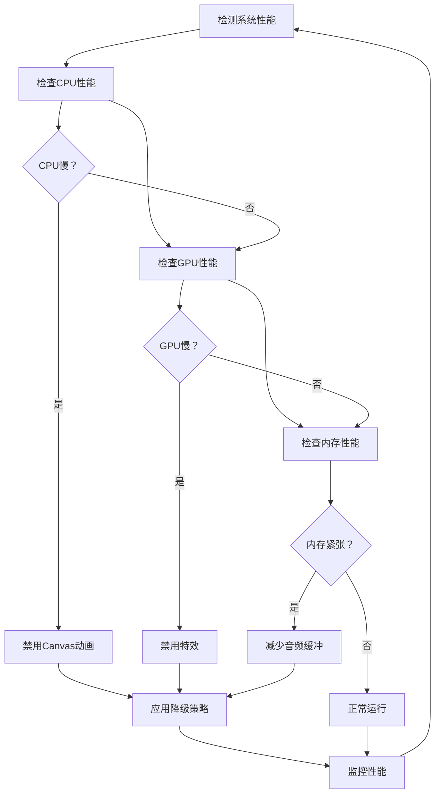

**图表来源**
- [particles.js:138-150](file://js/particles.js#L138-L150)
- [aliyun-speech.js:134-148](file://js/aliyun-speech.js#L134-L148)

#### 降级策略执行

1. **Canvas动画降级**
   - 禁用粒子系统动画
   - 减少粒子数量到20%
   - 降低目标帧率到20 FPS
   - 使用静态背景替代动态效果

2. **音频处理降级**
   - 减少音频缓冲大小
   - 增加音频处理间隔
   - 降低采样率到8kHz
   - 禁用高级音频效果

3. **网络连接降级**
   - 增加WebSocket重连间隔
   - 减少音频发送频率
   - 使用更保守的重试策略
   - 实现网络状态监控

**章节来源**
- [particles.js:138-150](file://js/particles.js#L138-L150)
- [aliyun-speech.js:134-148](file://js/aliyun-speech.js#L134-L148)

## 故障排除指南

### 常见性能问题及解决方案

#### 语音识别延迟问题

| 问题症状 | 可能原因 | 解决方案 |
|----------|----------|----------|
| 识别延迟明显 | 网络连接不稳定 | 切换到阿里云后端 |
| 原生API无响应 | 权限被拒绝 | 检查浏览器权限设置 |
| 阿里云API连接失败 | 网络环境限制 | 检查Token和网络配置 |
| 识别准确率低 | 音质问题 | 调整麦克风设置 |

#### Canvas动画性能问题

| 问题症状 | 可能原因 | 解决方案 |
|----------|----------|----------|
| 帧率下降 | 粒子数量过多 | 减少粒子数量 |
| 卡顿现象 | 重绘频繁 | 合并DOM操作 |
| 内存泄漏 | 事件监听器未清理 | 实现完整的清理机制 |
| CPU占用高 | 计算密集型操作 | 优化算法实现 |

#### 内存管理问题

| 问题症状 | 可能原因 | 解决方案 |
|----------|----------|----------|
| 内存持续增长 | 对象引用未释放 | 使用WeakMap管理引用 |
| 垃圾回收频繁 | 对象创建过多 | 实现对象池复用 |
| 页面卡死 | 大量DOM节点 | 使用虚拟滚动 |
| 加载缓慢 | 缓存策略不当 | 优化资源缓存 |

**章节来源**
- [speech.js:285-327](file://js/speech.js#L285-L327)
- [particles.js:152-167](file://js/particles.js#L152-L167)
- [aliyun-speech.js:114-129](file://js/aliyun-speech.js#L114-L129)

### 诊断工具使用技巧

#### 性能分析最佳实践

1. **录制场景选择**
   - 选择典型用户操作场景
   - 包含完整的功能流程
   - 避免极端条件测试

2. **数据分析方法**
   - 关注长任务和阻塞事件
   - 分析内存分配模式
   - 监控网络请求效率
   - 检查渲染性能指标

3. **优化验证方法**
   - 逐项实施优化措施
   - 使用A/B测试对比效果
   - 监控关键性能指标
   - 收集用户反馈

**章节来源**
- [app.js:182-208](file://js/app.js#L182-L208)
- [speech.js:246-283](file://js/speech.js#L246-L283)

## 结论

本性能诊断指南涵盖了语音识别应用的各个方面，包括：

1. **系统性诊断方法**：提供了从硬件检测到软件分析的完整诊断流程
2. **具体优化策略**：针对语音识别延迟、CPU占用、内存泄漏等具体问题提供了可操作的解决方案
3. **Canvas动画优化**：详细说明了帧率控制、渲染优化、资源管理等技术要点
4. **工具使用指导**：介绍了浏览器性能分析工具的使用方法和最佳实践
5. **硬件适配策略**：提供了不同硬件配置下的调优建议和降级策略

通过实施这些诊断和优化方法，可以显著提升语音识别应用的性能表现，改善用户体验，并确保应用在各种硬件环境下都能稳定运行。