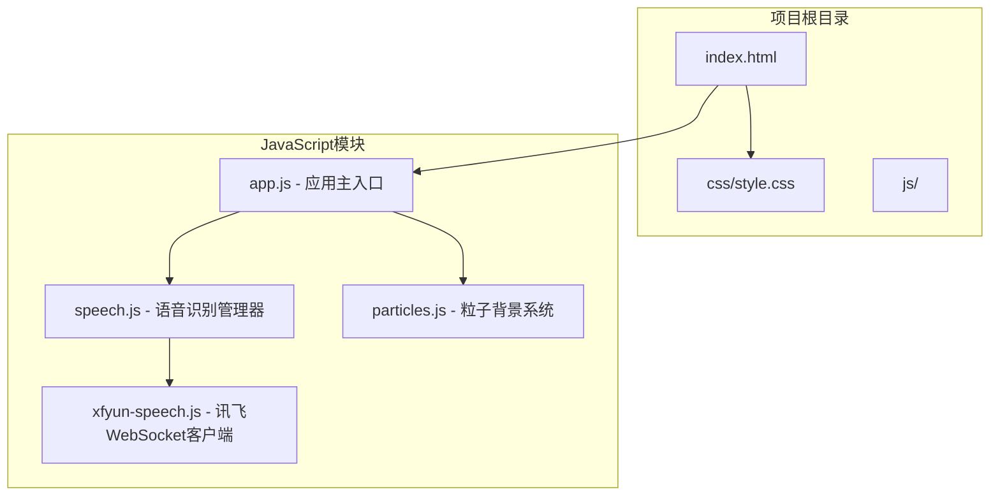
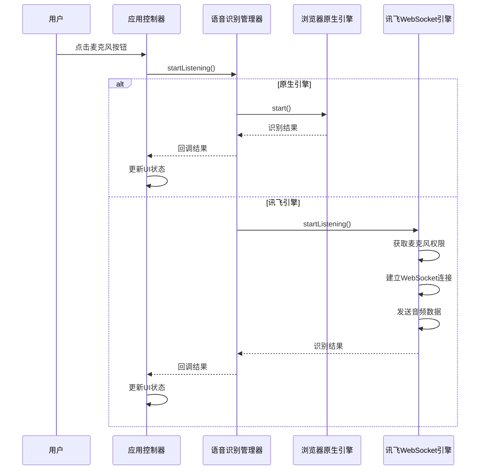
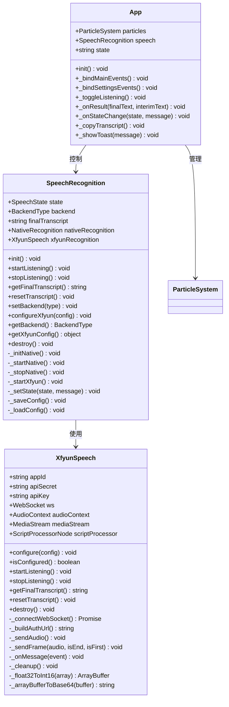
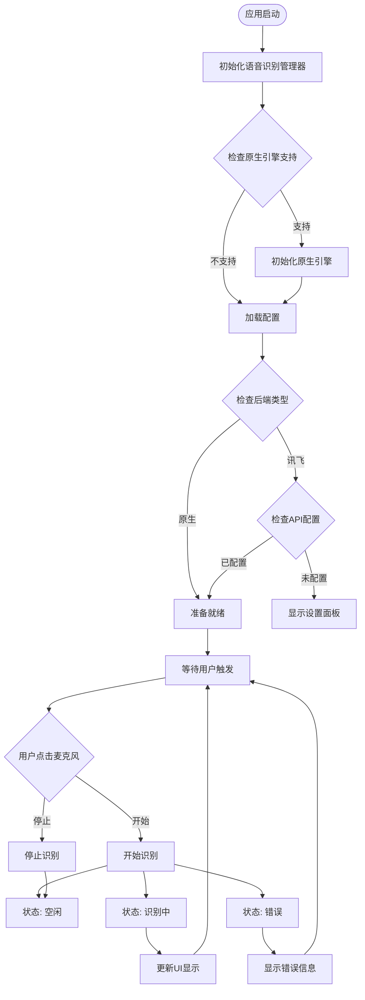
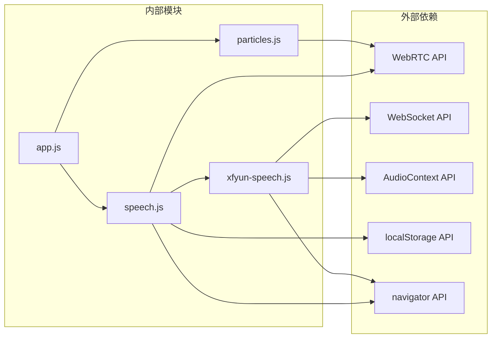

# 故障排除指南

<cite>
**本文档引用的文件**
- [README.md](file://README.md)
- [index.html](file://index.html)
- [style.css](file://css/style.css)
- [app.js](file://js/app.js)
- [speech.js](file://js/speech.js)
- [xfyun-speech.js](file://js/xfyun-speech.js)
- [particles.js](file://js/particles.js)
</cite>

## 目录
1. [简介](#简介)
2. [项目结构](#项目结构)
3. [核心组件](#核心组件)
4. [架构概览](#架构概览)
5. [详细组件分析](#详细组件分析)
6. [依赖关系分析](#依赖关系分析)
7. [性能考虑](#性能考虑)
8. [故障排除指南](#故障排除指南)
9. [结论](#结论)

## 简介

这是一个基于Web Speech API的实时语音识别应用，支持两种识别引擎：
- **浏览器原生引擎**：依赖Google服务，适合国际用户
- **讯飞语音引擎**：专为中国大陆网络环境优化，使用WebSocket实时传输

应用采用现代化的科幻暗色主题设计，提供流畅的用户体验和强大的故障处理机制。

## 项目结构



**图表来源**
- [index.html:1-143](file://index.html#L1-L143)
- [app.js:1-292](file://js/app.js#L1-L292)
- [speech.js:1-371](file://js/speech.js#L1-L371)
- [xfyun-speech.js:1-452](file://js/xfyun-speech.js#L1-L452)
- [particles.js:1-199](file://js/particles.js#L1-L199)

**章节来源**
- [index.html:1-143](file://index.html#L1-L143)
- [style.css:1-711](file://css/style.css#L1-L711)
- [app.js:1-292](file://js/app.js#L1-L292)

## 核心组件

### 应用主控制器 (App)
负责整个应用的初始化、事件绑定和状态管理。

### 语音识别管理器 (SpeechRecognition)
- 支持双引擎切换
- 自动网络错误检测和引擎切换
- 状态管理和回调处理

### 讯飞WebSocket客户端 (XfyunSpeech)
- 基于WebSocket的实时语音识别
- 音频PCM数据捕获和传输
- 完整的错误处理机制

### 粒子背景系统 (ParticleSystem)
- 霓虹色粒子动画效果
- 鼠标交互和连线效果
- 性能优化的Canvas渲染

**章节来源**
- [app.js:12-287](file://js/app.js#L12-L287)
- [speech.js:21-371](file://js/speech.js#L21-L371)
- [xfyun-speech.js:17-452](file://js/xfyun-speech.js#L17-L452)
- [particles.js:69-199](file://js/particles.js#L69-L199)

## 架构概览



**图表来源**
- [app.js:82-91](file://js/app.js#L82-L91)
- [speech.js:154-172](file://js/speech.js#L154-L172)
- [xfyun-speech.js:67-129](file://js/xfyun-speech.js#L67-L129)

## 详细组件分析

### 语音识别管理器类图



**图表来源**
- [speech.js:21-371](file://js/speech.js#L21-L371)
- [xfyun-speech.js:17-452](file://js/xfyun-speech.js#L17-L452)
- [app.js:12-287](file://js/app.js#L12-L287)

### 状态管理流程图



**图表来源**
- [speech.js:51-81](file://js/speech.js#L51-L81)
- [app.js:210-243](file://js/app.js#L210-L243)

**章节来源**
- [speech.js:1-371](file://js/speech.js#L1-L371)
- [xfyun-speech.js:1-452](file://js/xfyun-speech.js#L1-L452)
- [app.js:1-292](file://js/app.js#L1-L292)

## 依赖关系分析



**图表来源**
- [speech.js:44-46](file://js/speech.js#L44-L46)
- [xfyun-speech.js:77-91](file://js/xfyun-speech.js#L77-L91)
- [particles.js:70-82](file://js/particles.js#L70-L82)

**章节来源**
- [speech.js:44-46](file://js/speech.js#L44-L46)
- [xfyun-speech.js:77-91](file://js/xfyun-speech.js#L77-L91)
- [particles.js:70-82](file://js/particles.js#L70-L82)

## 性能考虑

### 优化策略

1. **音频处理优化**
   - 使用16kHz采样率和单声道配置
   - 4096字节音频缓冲区大小平衡延迟和CPU使用
   - 浮点数到Int16转换的高效实现

2. **内存管理**
   - 及时清理AudioContext和MediaStream
   - WebSocket连接的正确关闭和资源释放
   - Canvas动画的帧率控制

3. **网络优化**
   - 自动引擎切换减少网络错误影响
   - WebSocket连接池管理
   - 音频数据的批量发送

### 性能监控指标

- **CPU使用率**：音频处理和Canvas渲染
- **内存占用**：音频缓冲区和WebSocket连接
- **网络延迟**：WebSocket消息往返时间
- **识别准确率**：最终文本质量

**章节来源**
- [xfyun-speech.js:13-15](file://js/xfyun-speech.js#L13-L15)
- [xfyun-speech.js:94-102](file://js/xfyun-speech.js#L94-L102)
- [particles.js:138-167](file://js/particles.js#L138-L167)

## 故障排除指南

### 浏览器兼容性问题

#### 问题症状
- 页面显示"浏览器不支持 Web Speech API"提示
- 麦克风按钮不可用或无响应

#### 诊断步骤
1. **检查浏览器支持**
   ```javascript
   // 在浏览器控制台运行
   console.log('SpeechRecognition支持:', !!window.SpeechRecognition);
   console.log('webkitSpeechRecognition支持:', !!window.webkitSpeechRecognition);
   ```

2. **验证HTTPS环境**
   - Web Speech API需要HTTPS或localhost环境
   - 检查浏览器地址栏的安全锁图标

3. **检查浏览器版本**
   - Chrome 25+ 支持原生引擎
   - Edge 79+ 支持原生引擎
   - Safari 14+ 支持原生引擎

#### 解决方案
1. **使用支持的浏览器**
   - 推荐使用Chrome、Edge或Safari
   - 确保浏览器版本满足最低要求

2. **配置HTTPS环境**
   - 生产环境必须使用HTTPS
   - 开发环境可以使用localhost

3. **启用必要的权限**
   ```javascript
   // 检查媒体设备权限
   navigator.mediaDevices.getUserMedia({audio: true})
   .then(stream => console.log('麦克风权限正常'))
   .catch(err => console.log('麦克风权限问题:', err));
   ```

**章节来源**
- [index.html:78-81](file://index.html#L78-L81)
- [speech.js:44-46](file://js/speech.js#L44-L46)

### 权限获取失败

#### 问题症状
- 显示"麦克风权限被拒绝"错误
- 音频录制按钮闪烁但无声音输入

#### 诊断步骤
1. **检查浏览器权限设置**
   - 查看地址栏的权限图标
   - 检查浏览器设置中的权限管理

2. **验证硬件设备**
   ```javascript
   // 检查可用的音频输入设备
   navigator.mediaDevices.enumerateDevices()
   .then(devices => {
       devices.forEach(device => {
           if (device.kind === 'audioinput') {
               console.log('可用麦克风:', device.label);
           }
       });
   });
   ```

3. **测试其他应用**
   - 在系统设置中测试麦克风
   - 使用其他语音应用验证硬件

#### 解决方案
1. **手动授权**
   - 点击浏览器地址栏的权限图标
   - 选择"允许"访问麦克风

2. **检查系统设置**
   - Windows：设置 → 隐私 → 麦克风
   - macOS：系统偏好设置 → 隐私 → 麦克风
   - Linux：检查PulseAudio或ALSA配置

3. **重启浏览器**
   - 关闭并重新打开浏览器
   - 清除浏览器缓存和Cookie

**章节来源**
- [speech.js:276-315](file://js/speech.js#L276-L315)
- [xfyun-speech.js:117-128](file://js/xfyun-speech.js#L117-L128)

### 网络连接异常

#### 问题症状
- 显示"网络错误"或"无法连接语音识别服务"
- 自动切换到讯飞引擎但仍然失败

#### 诊断步骤
1. **检查网络连接**
   ```javascript
   // 测试WebSocket连接
   const ws = new WebSocket('wss://iat-api.xfyun.cn/v2/iat');
   ws.onopen = () => console.log('WebSocket连接成功');
   ws.onerror = (err) => console.log('WebSocket连接失败:', err);
   ```

2. **验证API配置**
   - 检查APPID、APISecret、APIKey是否正确
   - 确认在讯飞开放平台注册的应用状态

3. **测试代理设置**
   - 检查公司防火墙或代理服务器
   - 尝试使用移动热点

#### 解决方案
1. **配置讯飞API**
   - 访问讯飞开放平台注册账号
   - 创建语音听写应用获取凭证
   - 在应用设置中启用相关服务

2. **调整网络设置**
   - 确保能够访问讯飞API域名
   - 检查DNS解析是否正常
   - 验证SSL证书有效性

3. **使用备用网络**
   - 切换到稳定的WiFi网络
   - 使用有线网络连接
   - 避免使用受限的公共网络

**章节来源**
- [speech.js:282-302](file://js/speech.js#L282-L302)
- [xfyun-speech.js:176-207](file://js/xfyun-speech.js#L176-L207)

### WebSocket连接问题

#### 问题症状
- WebSocket连接立即断开
- 连接超时或认证失败
- 无法建立实时音频传输

#### 诊断步骤
1. **检查WebSocket URL**
   ```javascript
   // 验证认证URL构建
   const host = 'iat-api.xfyun.cn';
   const path = '/v2/iat';
   const date = new Date().toUTCString();
   const signatureOrigin = `host: ${host}\ndate: ${date}\nGET ${path} HTTP/1.1`;
   console.log('签名原文:', signatureOrigin);
   ```

2. **验证时间同步**
   - 确保系统时间准确
   - 检查时区设置
   - 验证UTC时间格式

3. **测试网络路由**
   ```javascript
   // 检查DNS解析
   fetch('https://iat-api.xfyun.cn')
   .then(response => console.log('DNS解析成功'))
   .catch(err => console.log('DNS解析失败:', err));
   ```

#### 解决方案
1. **修复时间问题**
   - 同步系统时间到准确的时间源
   - 检查NTP服务配置
   - 验证时区设置

2. **处理跨域问题**
   - 确保使用正确的主机头
   - 验证日期格式符合HTTP规范
   - 检查Authorization头部格式

3. **优化连接参数**
   - 增加连接超时时间
   - 实现重连机制
   - 添加连接状态监控

**章节来源**
- [xfyun-speech.js:212-229](file://js/xfyun-speech.js#L212-L229)
- [xfyun-speech.js:191-205](file://js/xfyun-speech.js#L191-L205)

### 用户界面问题

#### 问题症状
- 界面元素显示异常
- 按钮无响应或状态错乱
- 文本显示格式错误

#### 诊断步骤
1. **检查CSS加载**
   ```javascript
   // 验证字体加载
   document.fonts.ready.then(() => {
       console.log('字体加载完成');
   });
   ```

2. **验证DOM元素**
   ```javascript
   // 检查关键元素是否存在
   const elements = [
       'btn-mic', 'transcript', 'status', 
       'settings-overlay', 'unsupported'
   ];
   
   elements.forEach(id => {
       const el = document.getElementById(id);
       console.log(`${id}: ${el ? '存在' : '不存在'}`);
   });
   ```

3. **监控事件绑定**
   ```javascript
   // 检查事件监听器
   const btn = document.getElementById('btn-mic');
   const listeners = getEventListeners(btn);
   console.log('事件监听器:', listeners);
   ```

#### 解决方案
1. **修复样式问题**
   - 检查CSS文件路径是否正确
   - 验证字体文件是否可访问
   - 确认响应式样式生效

2. **恢复事件绑定**
   - 重新初始化应用
   - 检查JavaScript错误
   - 验证模块导入是否成功

3. **清理缓存**
   - 清除浏览器缓存
   - 强制刷新页面 (Ctrl+F5)
   - 清除应用存储的数据

**章节来源**
- [app.js:62-64](file://js/app.js#L62-L64)
- [style.css:1-711](file://css/style.css#L1-L711)

### 性能问题诊断

#### 问题症状
- 页面卡顿或延迟明显
- 音频处理出现杂音
- CPU使用率过高

#### 诊断步骤
1. **监控性能指标**
   ```javascript
   // 使用Performance API
   const observer = new PerformanceObserver((list) => {
       for (const entry of list.getEntries()) {
           console.log(entry.name, entry.duration);
       }
   });
   observer.observe({entryTypes: ['measure']});
   ```

2. **检查音频处理**
   ```javascript
   // 监控音频缓冲区
   setInterval(() => {
       console.log('音频缓冲区长度:', audioBuffer.length);
   }, 1000);
   ```

3. **分析内存使用**
   ```javascript
   // 检查内存泄漏
   if (performance.memory) {
       console.log('已使用内存:', performance.memory.usedJSHeapSize);
   }
   ```

#### 解决方案
1. **优化音频配置**
   - 调整采样率和缓冲区大小
   - 减少音频处理复杂度
   - 实施音频数据压缩

2. **改进Canvas渲染**
   - 降低粒子数量
   - 减少连线计算
   - 优化动画帧率

3. **实施资源管理**
   - 及时释放音频资源
   - 关闭不必要的WebSocket连接
   - 清理定时器和事件监听器

**章节来源**
- [xfyun-speech.js:94-102](file://js/xfyun-speech.js#L94-L102)
- [particles.js:138-167](file://js/particles.js#L138-L167)

### 错误日志分析

#### 常见错误代码及含义

| 错误代码 | 描述 | 可能原因 | 解决方案 |
|---------|------|----------|----------|
| `not-allowed` | 权限被拒绝 | 用户拒绝麦克风访问 | 检查浏览器权限设置 |
| `network` | 网络连接错误 | 无法访问语音服务 | 检查网络连接和代理 |
| `no-speech` | 无语音输入 | 麦克风无声音或静音 | 检查硬件和音量设置 |
| `aborted` | 操作被中止 | 用户主动停止识别 | 等待重新开始 |
| `service-not-support` | 服务不支持 | 浏览器不支持该功能 | 更换支持的浏览器 |

#### 日志分析方法
1. **查看浏览器控制台**
   - 打开开发者工具 (F12)
   - 切换到Console标签页
   - 重现问题观察错误信息

2. **分析WebSocket日志**
   ```javascript
   // 监控WebSocket事件
   ws.onopen = () => console.log('连接建立');
   ws.onmessage = (msg) => console.log('收到消息:', msg.data);
   ws.onerror = (err) => console.log('连接错误:', err);
   ws.onclose = (event) => console.log('连接关闭:', event.code);
   ```

3. **跟踪状态变化**
   ```javascript
   // 监控语音识别状态
   speech.onStateChange((state, message) => {
       console.log(`状态变化: ${state}`, message);
   });
   ```

**章节来源**
- [speech.js:276-315](file://js/speech.js#L276-L315)
- [xfyun-speech.js:191-205](file://js/xfyun-speech.js#L191-L205)

### 不同操作系统和浏览器的具体配置

#### Windows系统
**Chrome浏览器**
- 启用"允许网站使用麦克风"
- 禁用可能干扰的音频驱动程序
- 更新到最新版本

**Edge浏览器**
- 检查隐私设置中的相机和麦克风权限
- 确保Microsoft Edge为默认浏览器
- 清理浏览器缓存和Cookie

#### macOS系统
**Safari浏览器**
- 在系统偏好设置中启用麦克风权限
- 检查Gatekeeper设置
- 确保系统版本满足要求

**Chrome浏览器**
- 检查系统完整性保护设置
- 确保音频设备驱动正常
- 更新到最新版本

#### Linux系统
**Firefox浏览器**
- 检查权限管理器设置
- 确保PulseAudio服务运行正常
- 验证音频组成员身份

**Chrome/Chromium**
- 检查ALSA或PulseAudio配置
- 确保用户在audio组中
- 验证udev规则设置

### 社区支持和问题反馈

#### 官方支持渠道
1. **GitHub Issues**
   - 访问项目仓库提交问题报告
   - 提供详细的错误信息和重现步骤
   - 包含浏览器版本和系统信息

2. **讯飞开放平台**
   - 访问讯飞开发者社区
   - 查阅官方文档和FAQ
   - 提交技术问题咨询

3. **Stack Overflow**
   - 使用相关标签搜索类似问题
   - 提出具体的技术问题
   - 提供完整的代码示例

#### 问题反馈模板
```markdown
**问题描述**
清晰简洁地描述遇到的问题

**重现步骤**
1. 打开页面
2. 点击麦克风按钮
3. 观察到错误

**预期行为**
期望的结果是什么

**实际行为**
实际发生了什么

**环境信息**
- 浏览器: [版本]
- 操作系统: [版本]
- 网络环境: [描述]

**错误日志**
在浏览器控制台中复制粘贴相关错误信息
```

## 结论

本故障排除指南涵盖了语音识别应用的常见问题和解决方案。通过系统化的诊断步骤和针对性的解决策略，大多数问题都可以得到有效解决。

### 关键要点
1. **预防性措施**：确保浏览器支持、正确配置权限和网络环境
2. **快速诊断**：利用开发者工具和日志分析定位问题根源
3. **灵活应对**：利用双引擎架构的优势进行故障转移
4. **持续优化**：定期检查性能指标和用户体验

### 最佳实践
- 建立完善的错误监控和日志记录机制
- 实施自动化的健康检查和状态报告
- 提供友好的用户反馈和引导
- 定期更新依赖库和浏览器兼容性

通过遵循这些指导原则，可以显著提高应用的稳定性和用户体验。