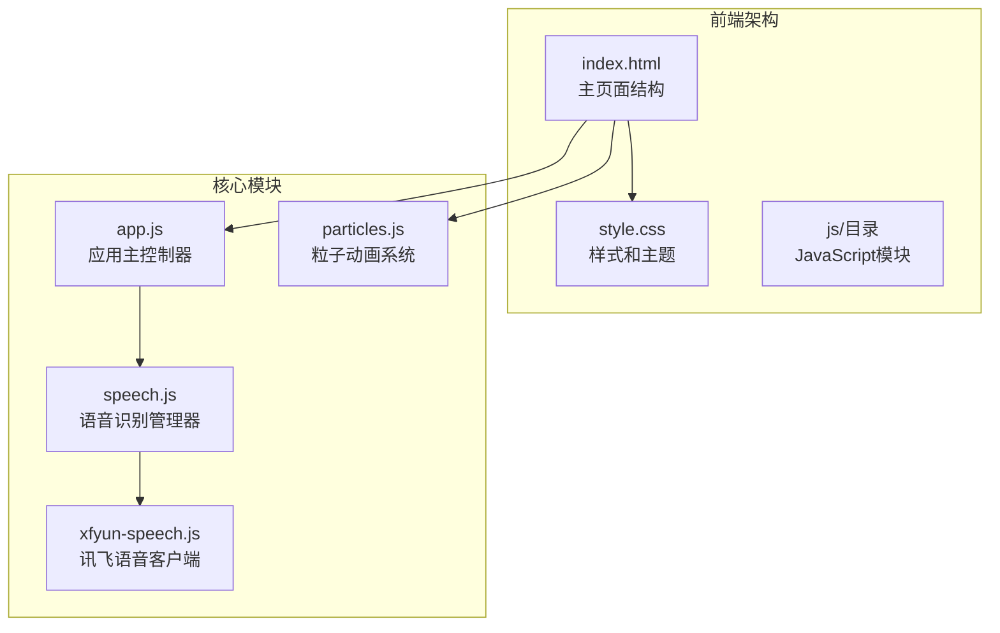
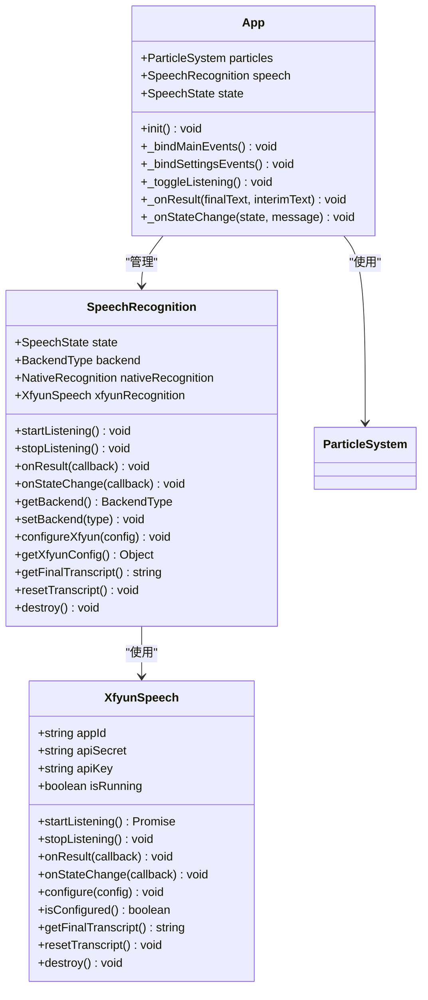
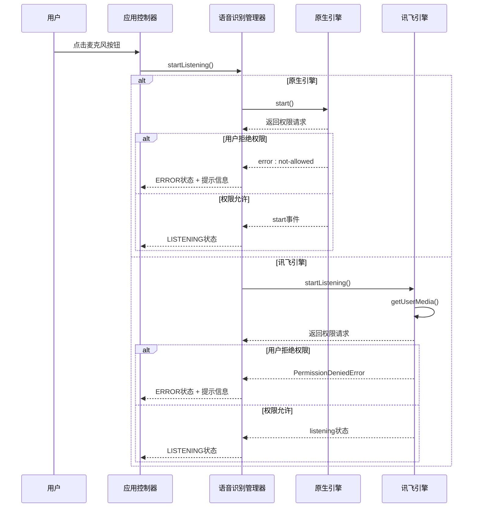
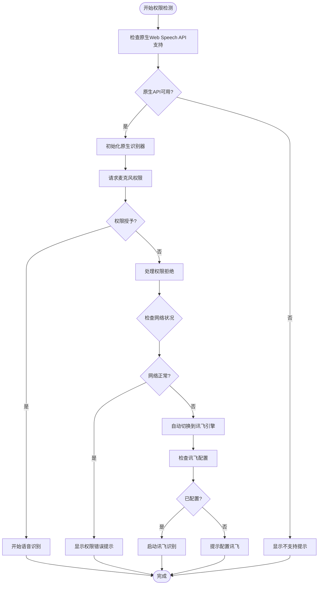
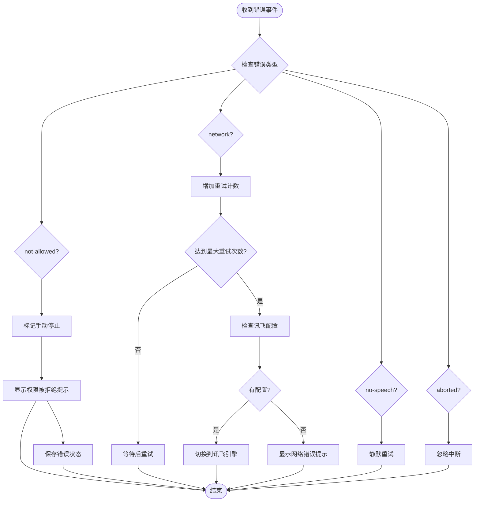
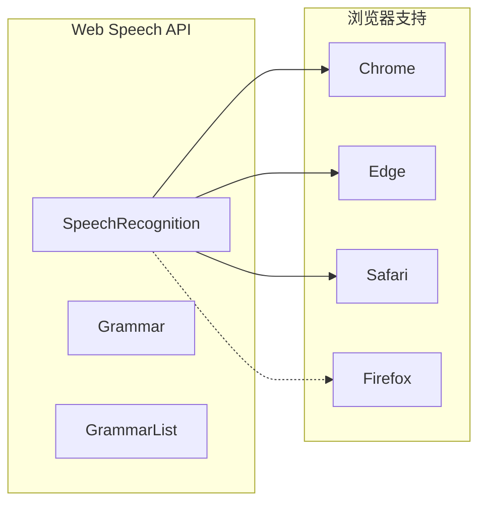
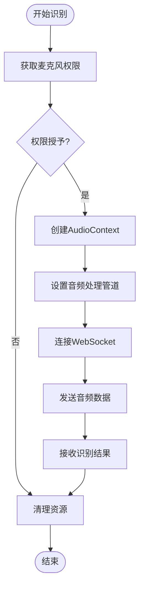
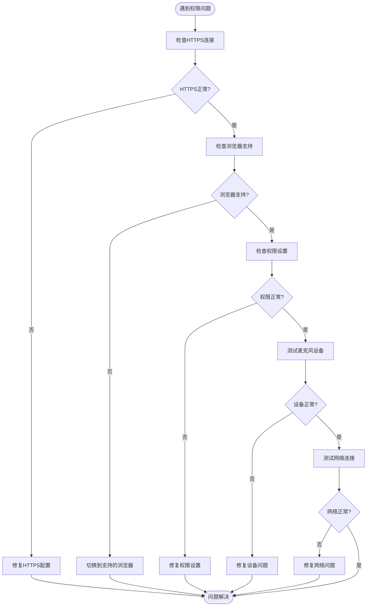

# 权限访问问题

<cite>
**本文档引用的文件**
- [index.html](file://index.html)
- [app.js](file://js/app.js)
- [speech.js](file://js/speech.js)
- [xfyun-speech.js](file://js/xfyun-speech.js)
- [style.css](file://css/style.css)
- [particles.js](file://js/particles.js)
</cite>

## 目录
1. [简介](#简介)
2. [项目结构](#项目结构)
3. [核心组件](#核心组件)
4. [架构概览](#架构概览)
5. [详细组件分析](#详细组件分析)
6. [权限问题排查指南](#权限问题排查指南)
7. [浏览器兼容性](#浏览器兼容性)
8. [错误代码和消息解释](#错误代码和消息解释)
9. [性能考虑](#性能考虑)
10. [故障排除指南](#故障排除指南)
11. [结论](#结论)

## 简介

本指南专注于解决语音识别应用中的权限访问问题，特别是麦克风权限获取失败的各种情况。该语音识别应用支持两种识别引擎：浏览器原生Web Speech API和讯飞语音识别服务，每种引擎都有不同的权限要求和错误处理机制。

## 项目结构

该项目采用模块化架构，主要包含以下核心文件：



**图表来源**
- [index.html:1-143](file://index.html#L1-L143)
- [app.js:1-292](file://js/app.js#L1-L292)
- [speech.js:1-371](file://js/speech.js#L1-L371)
- [xfyun-speech.js:1-404](file://js/xfyun-speech.js#L1-L404)

**章节来源**
- [index.html:1-143](file://index.html#L1-L143)
- [app.js:1-292](file://js/app.js#L1-L292)
- [speech.js:1-371](file://js/speech.js#L1-L371)

## 核心组件

### 语音识别管理器

语音识别管理器是整个权限系统的核心，负责协调两种识别引擎的工作：



**图表来源**
- [speech.js:21-371](file://js/speech.js#L21-L371)
- [xfyun-speech.js:17-404](file://js/xfyun-speech.js#L17-L404)
- [app.js:12-292](file://js/app.js#L12-L292)

**章节来源**
- [speech.js:10-371](file://js/speech.js#L10-L371)
- [xfyun-speech.js:17-404](file://js/xfyun-speech.js#L17-L404)
- [app.js:12-292](file://js/app.js#L12-L292)

## 架构概览

应用采用双引擎架构，支持自动切换机制：



**图表来源**
- [app.js:82-91](file://js/app.js#L82-L91)
- [speech.js:154-172](file://js/speech.js#L154-L172)
- [xfyun-speech.js:67-129](file://js/xfyun-speech.js#L67-L129)

## 详细组件分析

### 权限状态检测机制

应用实现了多层次的权限状态检测：



**图表来源**
- [speech.js:44-46](file://js/speech.js#L44-L46)
- [speech.js:201-216](file://js/speech.js#L201-L216)
- [speech.js:273-315](file://js/speech.js#L273-L315)

### 错误处理流程

应用针对不同类型的权限错误提供了专门的处理逻辑：



**图表来源**
- [speech.js:276-315](file://js/speech.js#L276-L315)
- [xfyun-speech.js:117-127](file://js/xfyun-speech.js#L117-L127)

**章节来源**
- [speech.js:273-315](file://js/speech.js#L273-L315)
- [xfyun-speech.js:114-129](file://js/xfyun-speech.js#L114-L129)

## 权限问题排查指南

### HTTPS要求检查

**问题症状**
- 页面加载时出现安全连接警告
- 麦克风权限请求无法弹出
- 浏览器控制台显示HTTPS相关错误

**排查步骤**
1. **验证HTTPS连接**
   - 确认网站通过HTTPS协议访问
   - 检查浏览器地址栏显示锁形图标
   - 验证SSL证书有效且未过期

2. **检查混合内容**
   - 确保所有资源（CSS、JS、字体）都通过HTTPS加载
   - 检查是否有HTTP资源被加载

3. **本地开发环境**
   - 使用localhost进行开发测试
   - 或配置自签名证书用于开发环境

**解决方案**
- 将应用部署到支持HTTPS的服务器
- 使用Cloudflare等CDN服务启用HTTPS
- 在开发环境中使用localhost或配置本地SSL

### 用户拒绝授权处理

**问题症状**
- 麦克风权限弹窗出现后立即消失
- 应用显示"权限被拒绝"错误
- 无法进行语音识别

**排查步骤**
1. **检查浏览器权限设置**
   - 查看网站权限历史记录
   - 确认麦克风权限状态
   - 检查是否选择了"始终拒绝"

2. **重新授予权限**
   - 清除网站权限缓存
   - 刷新页面重新请求权限
   - 检查浏览器扩展是否阻止了权限请求

3. **用户引导策略**
   - 显示清晰的权限请求说明
   - 提供权限设置链接
   - 展示权限对功能的重要性

**解决方案**
- 实现权限状态检测和用户引导
- 提供一键跳转到浏览器设置的功能
- 显示详细的权限使用说明

### 权限设置错误诊断

**问题症状**
- 权限弹窗显示但无响应
- 应用显示"未找到麦克风设备"错误
- 浏览器控制台显示设备相关错误

**排查步骤**
1. **检查硬件连接**
   - 确认麦克风设备正确连接
   - 检查USB接口或蓝牙连接状态
   - 验证设备在其他应用中正常工作

2. **验证设备权限**
   - 检查操作系统中的麦克风访问设置
   - 确认没有被系统级权限策略阻止
   - 验证驱动程序安装完整

3. **浏览器兼容性**
   - 确认浏览器版本支持Web Audio API
   - 检查浏览器扩展是否干扰设备访问
   - 验证隐私设置未过度限制

**解决方案**
- 提供设备检测和故障诊断功能
- 显示具体的设备连接状态
- 提供系统设置的直接链接

### 不同浏览器的权限设置步骤

#### Chrome浏览器

**步骤1：访问权限设置**
1. 点击地址栏左侧的锁形图标
2. 选择"网站设置"
3. 点击"权限"
4. 找到"麦克风"选项

**步骤2：配置麦克风权限**
1. 点击麦克风权限
2. 选择"允许"或"询问"
3. 如需永久允许，勾选"记住此决定"

**步骤3：检查权限历史**
1. 在权限设置中查看历史记录
2. 清除之前的拒绝记录
3. 重新加载页面测试

#### Firefox浏览器

**步骤1：访问权限设置**
1. 在地址栏输入 `about:permissions`
2. 搜索"麦克风"或"摄像头"
3. 查看权限状态

**步骤2：修改权限设置**
1. 点击权限右侧的编辑按钮
2. 选择"允许"或"询问"
3. 如需阻止，选择"阻止"

**步骤3：检查站点权限**
1. 在地址栏点击盾形图标
2. 选择"权限"
3. 管理特定站点的权限

#### Edge浏览器

**步骤1：访问设置**
1. 点击右上角三个点菜单
2. 选择"设置"
3. 点击"Cookie和网站权限"

**步骤2：管理麦克风权限**
1. 点击"麦克风"
2. 添加受信任的网站
3. 设置权限级别为"允许"

**步骤3：检查权限历史**
1. 查看"已阻止的网站"
2. 移除不需要的阻止记录
3. 重新测试权限

#### Safari浏览器

**步骤1：访问偏好设置**
1. 点击菜单栏的"Safari"
2. 选择"偏好设置"
3. 点击"网站"标签

**步骤2：管理麦克风权限**
1. 在左侧列表中选择"麦克风"
2. 在右侧勾选允许网站使用麦克风
3. 选择"仅在当前会话中允许"

**步骤3：检查权限状态**
1. 查看权限列表
2. 删除不需要的权限记录
3. 重新加载页面

### 权限状态检测方法

应用实现了多种权限状态检测机制：

**1. 原生API支持检测**
```javascript
// 检查浏览器是否支持Web Speech API
static isNativeSupported() {
    return !!(window.SpeechRecognition || window.webkitSpeechRecognition);
}
```

**2. 设备权限检测**
```javascript
// 检查媒体设备权限
async checkDevicePermissions() {
    try {
        const stream = await navigator.mediaDevices.getUserMedia({ audio: true });
        stream.getTracks().forEach(track => track.stop());
        return true;
    } catch (error) {
        return false;
    }
}
```

**3. 权限状态查询**
```javascript
// 查询特定权限的状态
async queryPermissionStatus(permission) {
    if ('permissions' in navigator) {
        const status = await navigator.permissions.query({ name: permission });
        return status.state;
    }
    return 'unknown';
}
```

### 用户引导策略

应用提供了多层次的用户引导：

**1. 状态提示系统**
- 显示当前操作状态
- 提供清晰的错误信息
- 展示下一步操作建议

**2. 视觉反馈**
- 录音按钮的颜色变化
- 波形动画效果
- 状态指示线

**3. 交互式帮助**
- 设置面板中的使用说明
- 权限设置的快捷链接
- 故障排除向导

**章节来源**
- [speech.js:44-46](file://js/speech.js#L44-L46)
- [xfyun-speech.js:77-84](file://js/xfyun-speech.js#L77-L84)
- [app.js:210-243](file://js/app.js#L210-L243)

## 浏览器兼容性

### 支持的浏览器

应用明确支持以下浏览器：
- Chrome
- Edge  
- Safari

**章节来源**
- [index.html:78-81](file://index.html#L78-L81)

### Web Speech API支持

应用使用了标准的Web Speech API接口：



**图表来源**
- [speech.js:87-98](file://js/speech.js#L87-L98)

## 错误代码和消息解释

### 原生Web Speech API错误代码

| 错误代码 | 描述 | 处理建议 |
|---------|------|----------|
| `not-allowed` | 用户拒绝麦克风权限 | 引导用户到浏览器设置授权 |
| `network` | 网络连接失败 | 自动切换到讯飞引擎 |
| `no-speech` | 未检测到语音 | 提示用户靠近麦克风 |
| `aborted` | 识别被中断 | 重新开始识别 |
| `other` | 其他未知错误 | 显示通用错误信息 |

### 讯飞语音API错误代码

| 错误代码 | 描述 | 处理建议 |
|---------|------|----------|
| 2003 | 缺少API密钥 | 引导用户配置API凭证 |
| 2004 | API密钥无效 | 检查密钥格式和有效期 |
| 2005 | 网络连接超时 | 检查网络连接状态 |
| 2006 | 语音质量差 | 提示用户改善录音环境 |
| 2007 | 识别结果为空 | 建议重新尝试识别 |

### 常见错误消息

**原生API错误消息**
- "麦克风权限被拒绝，请在浏览器设置中允许访问麦克风"
- "网络错误（可能无法访问Google服务），已自动切换到讯飞引擎"
- "浏览器不支持 Web Speech API 语音识别功能"

**讯飞API错误消息**
- "请先在设置中配置讯飞 API 凭证"
- "麦克风权限被拒绝"
- "连接讯飞服务失败，请检查网络和API配置"

**章节来源**
- [speech.js:276-315](file://js/speech.js#L276-L315)
- [xfyun-speech.js:117-127](file://js/xfyun-speech.js#L117-L127)

## 性能考虑

### 权限请求优化

应用采用了智能的权限请求策略：

1. **延迟初始化**：只在用户交互时请求权限
2. **自动重试机制**：网络错误时自动重试
3. **状态缓存**：避免重复的权限请求

### 资源管理



**图表来源**
- [xfyun-speech.js:67-129](file://js/xfyun-speech.js#L67-L129)

## 故障排除指南

### 常见问题诊断流程



### 诊断工具和技巧

**1. 浏览器开发者工具**
- 打开F12开发者工具
- 切换到Console标签
- 观察权限相关的错误信息

**2. 网络监控**
- 查看Network标签页
- 检查WebSocket连接状态
- 监控音频流传输

**3. 设备监控**
- 查看设备标签页
- 检查麦克风使用状态
- 监控权限请求历史

### 预防性措施

1. **用户教育**：在首次使用时提供权限说明
2. **渐进式授权**：只在需要时请求权限
3. **错误恢复**：提供一键重试和重置功能
4. **降级策略**：在网络异常时自动切换引擎

**章节来源**
- [speech.js:286-301](file://js/speech.js#L286-L301)
- [xfyun-speech.js:196-205](file://js/xfyun-speech.js#L196-L205)

## 结论

权限访问问题是语音识别应用中最常见的技术挑战之一。通过理解不同浏览器的权限模型、实现适当的错误处理机制以及提供清晰的用户引导，可以显著提升用户体验。

应用的双引擎架构为权限问题提供了有效的解决方案：
- 原生引擎优先使用，提供最佳的用户体验
- 讯飞引擎作为后备方案，确保在中国大陆网络环境下的稳定性
- 智能的错误检测和自动切换机制
- 完善的用户引导和故障排除功能

对于开发者而言，关键是要充分考虑各种边界情况，提供清晰的错误信息，并为用户提供解决问题的明确路径。对于用户而言，理解权限的重要性和正确的设置方法是成功使用语音识别功能的基础。