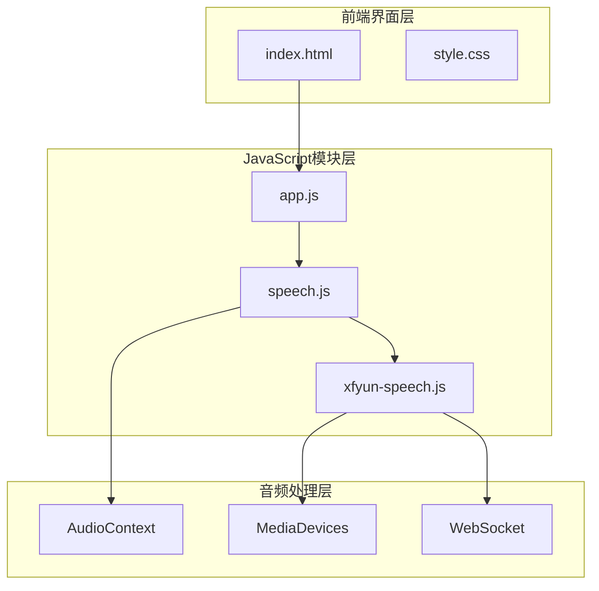
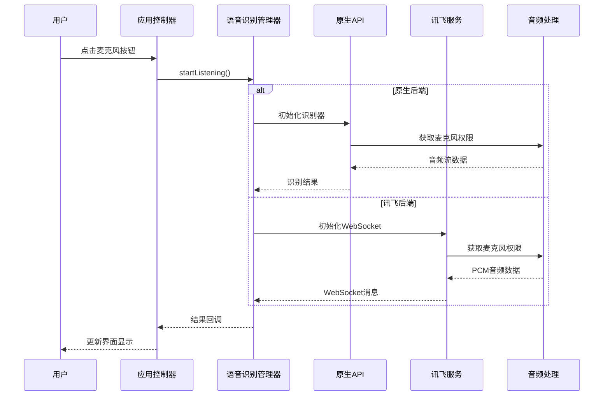
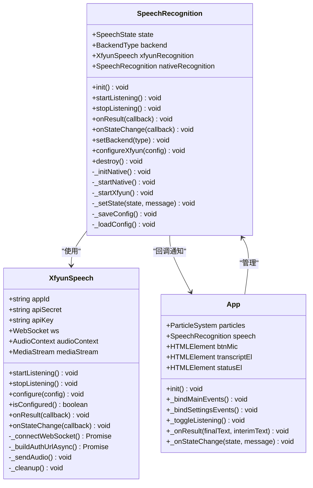
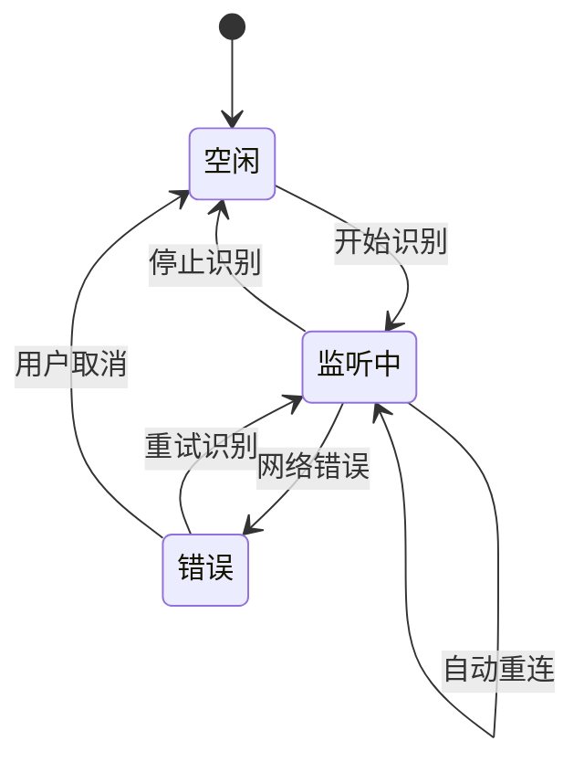
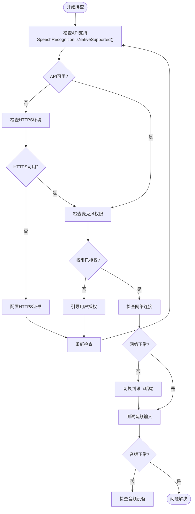

# 浏览器兼容性问题排查指南

<cite>
**本文档引用的文件**
- [index.html](file://index.html)
- [speech.js](file://js/speech.js)
- [app.js](file://js/app.js)
- [xfyun-speech.js](file://js/xfyun-speech.js)
- [style.css](file://css/style.css)
</cite>

## 目录
1. [简介](#简介)
2. [项目结构](#项目结构)
3. [核心组件](#核心组件)
4. [架构概览](#架构概览)
5. [详细组件分析](#详细组件分析)
6. [浏览器兼容性分析](#浏览器兼容性分析)
7. [常见兼容性问题排查](#常见兼容性问题排查)
8. [移动端特殊注意事项](#移动端特殊注意事项)
9. [开发者工具检查方法](#开发者工具检查方法)
10. [性能考虑](#性能考虑)
11. [故障排除指南](#故障排除指南)
12. [结论](#结论)

## 简介

本指南专注于Web Speech API在不同浏览器中的兼容性问题排查，基于MySpeechRecognition项目的实际实现，提供针对Chrome、Firefox、Safari、Edge等主流浏览器的兼容性分析和解决方案。项目实现了双后端架构，既支持浏览器原生Web Speech API，也支持讯飞语音识别服务，为不同网络环境提供了灵活的降级方案。

## 项目结构

MySpeechRecognition项目采用模块化架构设计，主要包含以下核心文件：



**图表来源**
- [index.html:1-143](file://index.html#L1-L143)
- [app.js:1-292](file://js/app.js#L1-L292)
- [speech.js:1-371](file://js/speech.js#L1-L371)
- [xfyun-speech.js:1-404](file://js/xfyun-speech.js#L1-L404)

**章节来源**
- [index.html:1-143](file://index.html#L1-L143)
- [app.js:1-292](file://js/app.js#L1-L292)
- [speech.js:1-371](file://js/speech.js#L1-L371)
- [xfyun-speech.js:1-404](file://js/xfyun-speech.js#L1-L404)

## 核心组件

项目的核心组件围绕语音识别功能构建，主要包括：

### 语音识别管理器 (SpeechRecognition)
- 支持双后端架构：浏览器原生 + 讯飞服务
- 自动检测和切换后端
- 状态管理和错误处理
- 配置持久化存储

### 应用控制器 (App)
- 用户界面交互管理
- 事件绑定和状态同步
- 设置面板管理
- 界面动画控制

### 讯飞语音客户端 (XfyunSpeech)
- WebSocket实时音频传输
- 音频PCM数据处理
- 认证和签名机制
- 错误恢复和重连逻辑

**章节来源**
- [speech.js:21-371](file://js/speech.js#L21-L371)
- [app.js:12-292](file://js/app.js#L12-L292)
- [xfyun-speech.js:17-404](file://js/xfyun-speech.js#L17-L404)

## 架构概览

系统采用分层架构设计，实现了完整的语音识别解决方案：



**图表来源**
- [speech.js:154-172](file://js/speech.js#L154-L172)
- [xfyun-speech.js:67-129](file://js/xfyun-speech.js#L67-L129)

## 详细组件分析

### 语音识别管理器架构



**图表来源**
- [speech.js:21-371](file://js/speech.js#L21-L371)
- [xfyun-speech.js:17-404](file://js/xfyun-speech.js#L17-L404)
- [app.js:12-292](file://js/app.js#L12-L292)

### 状态管理模式

系统实现了完整的状态管理机制，支持三种核心状态：



**图表来源**
- [speech.js:10-14](file://js/speech.js#L10-L14)
- [speech.js:329-336](file://js/speech.js#L329-L336)

**章节来源**
- [speech.js:21-371](file://js/speech.js#L21-L371)
- [xfyun-speech.js:17-404](file://js/xfyun-speech.js#L17-L404)
- [app.js:12-292](file://js/app.js#L12-L292)

## 浏览器兼容性分析

### Web Speech API支持情况

根据项目实现，Web Speech API的兼容性检测采用标准方法：

```javascript
// 兼容性检测方法
static isNativeSupported() {
  return !!(window.SpeechRecognition || window.webkitSpeechRecognition);
}
```

#### 各浏览器支持详情

| 浏览器 | Chrome | Firefox | Safari | Edge |
|--------|--------|---------|--------|------|
| **Web Speech API** | ✅ 完全支持 | ❌ 不支持 | ✅ 部分支持 | ✅ 部分支持 |
| **webkitSpeechRecognition** | ❌ 已废弃 | ❌ 不支持 | ❌ 不支持 | ❌ 不支持 |
| **WebSocket支持** | ✅ 完全支持 | ✅ 完全支持 | ✅ 完全支持 | ✅ 完全支持 |
| **AudioContext** | ✅ 完全支持 | ✅ 完全支持 | ✅ 完全支持 | ✅ 完全支持 |

### 兼容性差异分析

#### Chrome浏览器
- 完整支持Web Speech API
- 支持标准SpeechRecognition接口
- 无需前缀即可使用
- 网络依赖Google服务

#### Firefox浏览器
- 不支持Web Speech API
- 需要使用替代方案
- 建议使用讯飞后端

#### Safari浏览器
- 部分支持Web Speech API
- 需要HTTPS环境
- 可能存在功能限制

#### Edge浏览器
- 部分支持Web Speech API
- 与Chrome类似但功能受限

**章节来源**
- [speech.js:44-46](file://js/speech.js#L44-L46)
- [index.html:78-81](file://index.html#L78-L81)

## 常见兼容性问题排查

### 1. SpeechRecognition未定义错误

**问题描述**: 在某些浏览器中出现"SpeechRecognition未定义"错误

**解决方案**:
```javascript
// 检测和处理兼容性问题
if (!SpeechRecognition.isNativeSupported()) {
  // 切换到讯飞后端
  this.backend = BackendType.XFYUN;
  this._saveConfig();
}
```

**排查步骤**:
1. 检查浏览器控制台是否有错误信息
2. 验证HTTPS环境要求
3. 确认浏览器版本支持情况
4. 检查用户权限设置

### 2. webkitSpeechRecognition兼容性问题

**问题描述**: 使用webkitSpeechRecognition前缀导致的问题

**解决方案**:
```javascript
// 统一接口处理
const SR = window.SpeechRecognition || window.webkitSpeechRecognition;
this.nativeRecognition = new SR();
```

**最佳实践**:
- 始终使用检测方法获取正确接口
- 避免直接使用浏览器特定前缀
- 实现优雅降级机制

### 3. 网络错误和重连机制

**错误类型处理**:
- `network`: 网络连接失败，自动切换后端
- `not-allowed`: 麦克风权限被拒绝
- `no-speech`: 无语音输入
- `aborted`: 识别被中断

**自动重连逻辑**:
```javascript
// 指数退避重连
this._restartDelay = Math.min((this._restartDelay || 0) + 100, 2000);
```

**章节来源**
- [speech.js:273-315](file://js/speech.js#L273-L315)
- [speech.js:260-271](file://js/speech.js#L260-L271)

## 移动端特殊注意事项

### 移动端兼容性挑战

#### iOS Safari限制
- 需要在HTTPS环境下运行
- 音频录制需要用户手势触发
- 语音识别API支持有限

#### Android浏览器差异
- Chrome Android支持较好
- 其他浏览器支持程度不一
- 网络环境对识别质量影响大

### 移动端优化策略

#### 配置建议
```javascript
// 移动端音频配置
const mobileConstraints = {
  audio: {
    sampleRate: 16000,
    channelCount: 1,
    echoCancellation: true,
    noiseSuppression: true,
    deviceId: { exact: 'preferred-device-id' }
  }
};
```

#### 性能优化
- 降低音频采样率以节省带宽
- 实现智能重连机制
- 添加离线缓存支持

**章节来源**
- [xfyun-speech.js:77-84](file://js/xfyun-speech.js#L77-L84)
- [style.css:652-695](file://css/style.css#L652-L695)

## 开发者工具检查方法

### 浏览器控制台检查

#### JavaScript API检测
```javascript
// 检查Web Speech API支持
console.log('SpeechRecognition:', typeof SpeechRecognition);
console.log('webkitSpeechRecognition:', typeof window.webkitSpeechRecognition);

// 检查AudioContext支持
console.log('AudioContext:', typeof AudioContext);
console.log('webkitAudioContext:', typeof window.webkitAudioContext);

// 检查MediaDevices支持
console.log('MediaDevices:', typeof navigator.mediaDevices);
```

#### WebSocket连接测试
```javascript
// 测试WebSocket连接
const ws = new WebSocket('wss://iat-api.xfyun.cn/v2/iat');
ws.onopen = () => console.log('WebSocket连接成功');
ws.onerror = (error) => console.log('WebSocket错误:', error);
```

### 浏览器开发者工具技巧

#### 网络监控
- 使用Network面板监控WebSocket连接
- 检查音频流传输状态
- 监控API调用频率

#### 性能分析
- 使用Performance面板分析音频处理性能
- 监控内存使用情况
- 检查CPU占用率

#### 移动端调试
- 使用Chrome DevTools的设备模式
- 模拟不同网络条件
- 测试权限请求流程

**章节来源**
- [xfyun-speech.js:176-207](file://js/xfyun-speech.js#L176-L207)
- [speech.js:211-216](file://js/speech.js#L211-L216)

## 性能考虑

### 音频处理优化

#### 缓冲区管理
- 合理设置音频缓冲区大小
- 实现动态缓冲区调整
- 避免音频丢失和延迟

#### 连接池管理
- WebSocket连接复用
- 音频流管道优化
- 资源清理和释放

### 内存管理

#### 对象生命周期
- 及时清理AudioContext
- 释放MediaStream资源
- 关闭WebSocket连接

#### 存储优化
- 配置信息本地存储
- 识别结果增量更新
- 避免重复数据存储

**章节来源**
- [xfyun-speech.js:352-376](file://js/xfyun-speech.js#L352-L376)
- [speech.js:348-352](file://js/speech.js#L348-L352)

## 故障排除指南

### 常见错误诊断

#### 权限相关错误
```javascript
// 权限错误处理
switch(err.name) {
  case 'NotAllowedError':
  case 'PermissionDeniedError':
    // 提示用户手动授权
    break;
  case 'NotFoundError':
    // 设备未找到，提示检查硬件
    break;
}
```

#### 网络连接问题
```javascript
// 网络错误自动切换
if (event.error === 'network') {
  // 切换到讯飞后端
  this.backend = BackendType.XFYUN;
  this._saveConfig();
}
```

### 调试流程图



**图表来源**
- [speech.js:44-46](file://js/speech.js#L44-L46)
- [speech.js:273-315](file://js/speech.js#L273-L315)

### 预防性措施

#### 版本检测和降级
```javascript
// 检测浏览器版本
function detectBrowser() {
  const userAgent = navigator.userAgent;
  if (userAgent.indexOf('Chrome') > -1) {
    return 'chrome';
  } else if (userAgent.indexOf('Firefox') > -1) {
    return 'firefox';
  } else if (userAgent.indexOf('Safari') > -1) {
    return 'safari';
  } else if (userAgent.indexOf('Edg') > -1) {
    return 'edge';
  }
  return 'unknown';
}
```

#### 错误边界处理
- 实现全面的错误捕获机制
- 提供用户友好的错误提示
- 实现自动重试和降级策略

**章节来源**
- [speech.js:201-232](file://js/speech.js#L201-L232)
- [xfyun-speech.js:114-129](file://js/xfyun-speech.js#L114-L129)

## 结论

MySpeechRecognition项目通过双后端架构有效解决了Web Speech API的浏览器兼容性问题。项目实现了：

1. **完整的兼容性检测机制** - 自动检测浏览器支持情况
2. **智能后端切换** - 原生API不可用时自动切换到讯飞服务
3. **完善的错误处理** - 针对不同错误类型提供相应解决方案
4. **移动端优化** - 考虑移动设备的特殊需求和限制
5. **开发者友好** - 提供详细的调试工具和检查方法

对于开发者而言，关键是在项目初始化时进行充分的兼容性检测，并根据检测结果选择合适的后端实现。同时，要特别注意HTTPS环境要求、权限管理和网络稳定性等因素，确保在各种浏览器环境中都能提供良好的用户体验。