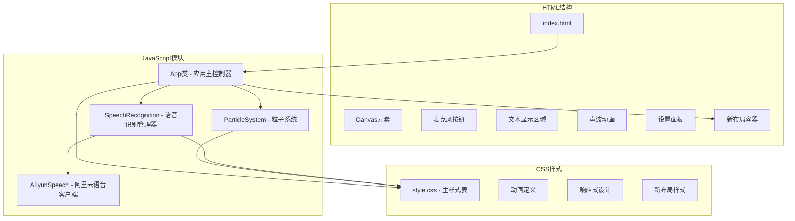
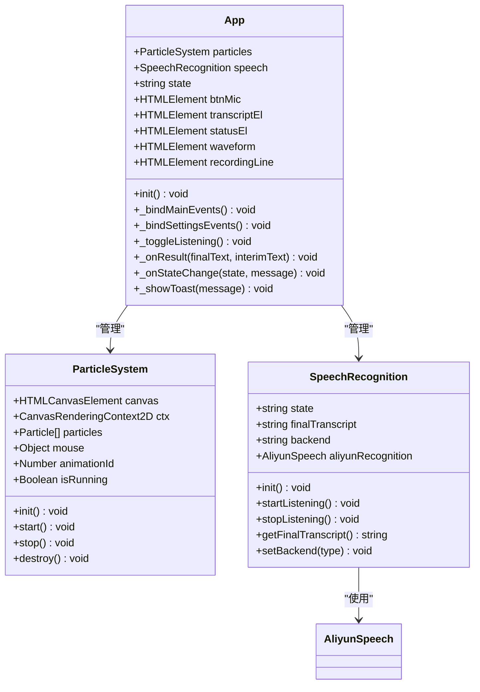
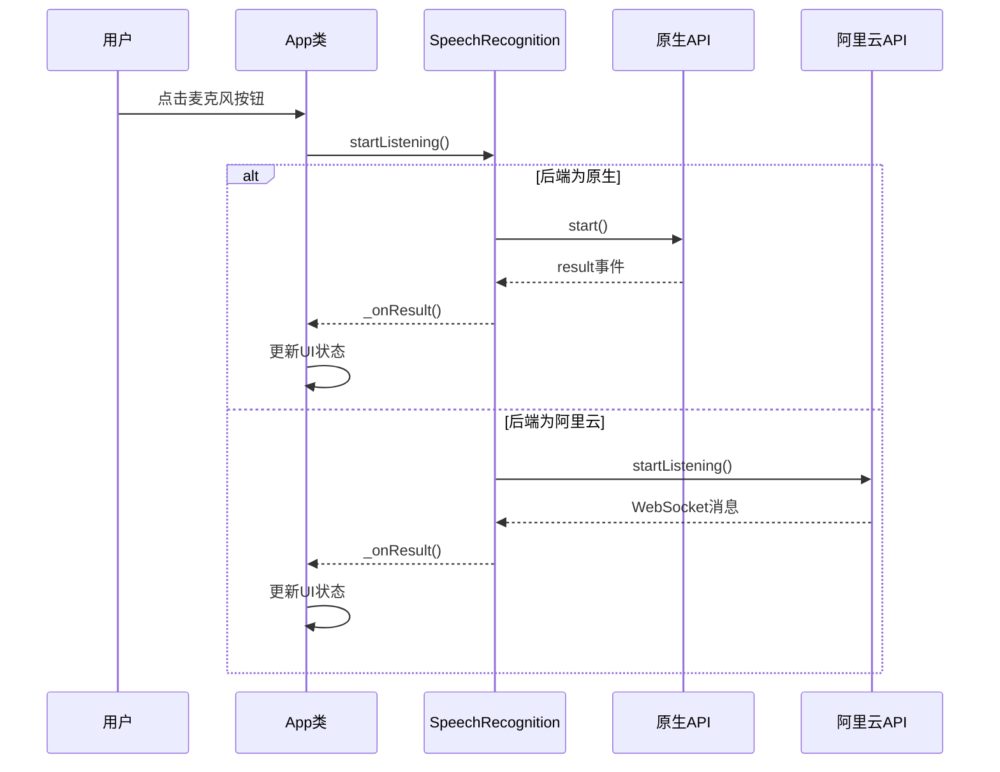
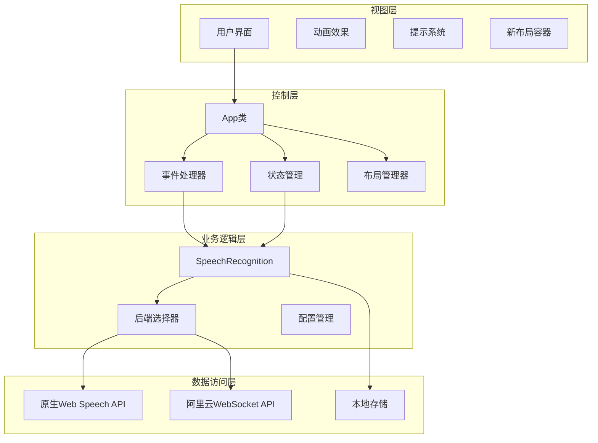
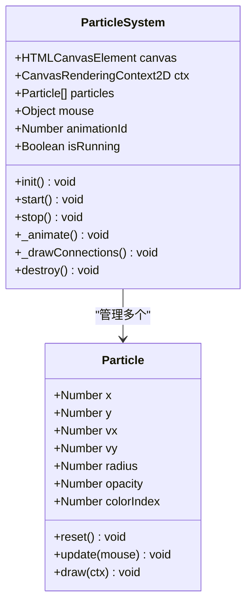
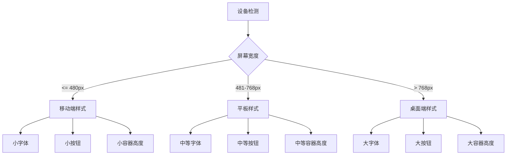
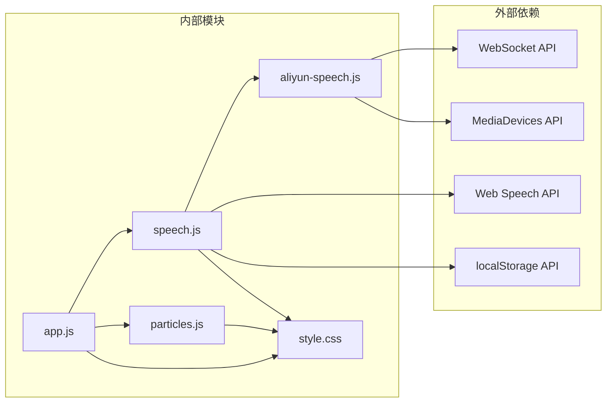
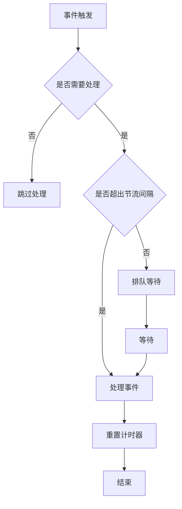

# 界面交互问题

<cite>
**本文档引用的文件**
- [index.html](file://index.html)
- [style.css](file://css/style.css)
- [app.js](file://js/app.js)
- [speech.js](file://js/speech.js)
- [particles.js](file://js/particles.js)
- [aliyun-speech.js](file://js/aliyun-speech.js)
- [README.md](file://README.md)
</cite>

## 更新摘要
**所做更改**
- 更新了布局调整和交互模式相关的故障排除内容
- 新增了界面重构后可能产生的新问题解决方案
- 优化了响应式设计和移动端适配的排查方法
- 增强了事件监听器和DOM操作的错误处理指导

## 目录
1. [简介](#简介)
2. [项目结构](#项目结构)
3. [核心组件](#核心组件)
4. [架构概览](#架构概览)
5. [详细组件分析](#详细组件分析)
6. [依赖关系分析](#依赖关系分析)
7. [性能考虑](#性能考虑)
8. [故障排除指南](#故障排除指南)
9. [结论](#结论)

## 简介

这是一个基于Web Speech API的语音识别应用，提供了麦克风按钮无响应、录音状态指示异常、文本显示错乱等UI相关问题的故障排除指南。该应用支持多种识别后端：浏览器原生Web Speech API和阿里云语音识别服务，并包含Canvas粒子动画背景系统。本次更新重点针对界面重构后的布局调整和交互模式变化，帮助用户解决可能因界面结构调整而产生的新问题。

## 项目结构

该项目采用模块化架构，主要由以下组件构成：



**图表来源**
- [index.html:1-143](file://index.html#L1-L143)
- [app.js:12-41](file://js/app.js#L12-L41)
- [speech.js:21-39](file://js/speech.js#L21-L39)
- [particles.js:69-82](file://js/particles.js#L69-L82)
- [aliyun-speech.js:17-32](file://js/aliyun-speech.js#L17-L32)

**章节来源**
- [index.html:1-143](file://index.html#L1-L143)
- [style.css:1-711](file://css/style.css#L1-L711)
- [app.js:1-296](file://js/app.js#L1-L296)

## 核心组件

### 应用主控制器 (App类)

App类作为整个应用的中央控制器，负责协调各个组件的工作：



**图表来源**
- [app.js:12-41](file://js/app.js#L12-L41)
- [app.js:138-291](file://js/app.js#L138-L291)
- [particles.js:69-82](file://js/particles.js#L69-L82)
- [speech.js:21-39](file://js/speech.js#L21-L39)

### 语音识别系统

语音识别系统支持多后端模式，提供智能切换机制：



**图表来源**
- [app.js:82-91](file://js/app.js#L82-L91)
- [speech.js:154-172](file://js/speech.js#L154-L172)
- [aliyun-speech.js:67-129](file://js/aliyun-speech.js#L67-129)

**章节来源**
- [app.js:12-296](file://js/app.js#L12-L296)
- [speech.js:10-383](file://js/speech.js#L10-L383)
- [particles.js:18-199](file://js/particles.js#L18-L199)
- [aliyun-speech.js:17-407](file://js/aliyun-speech.js#L17-L407)

## 架构概览

应用采用分层架构设计，各层职责明确：



**图表来源**
- [app.js:43-65](file://js/app.js#L43-L65)
- [speech.js:51-81](file://js/speech.js#L51-L81)
- [speech.js:154-184](file://js/speech.js#L154-L184)

## 详细组件分析

### Canvas粒子动画系统

粒子系统实现了复杂的动画效果，包含鼠标交互和性能优化：



**图表来源**
- [particles.js:18-67](file://js/particles.js#L18-L67)
- [particles.js:69-199](file://js/particles.js#L69-L199)

### 响应式设计实现

应用实现了完整的响应式设计，针对不同设备进行了优化：



**图表来源**
- [style.css:652-711](file://css/style.css#L652-L711)

**章节来源**
- [particles.js:84-199](file://js/particles.js#L84-L199)
- [style.css:650-711](file://css/style.css#L650-L711)

## 依赖关系分析

应用的模块间依赖关系清晰明确：



**图表来源**
- [app.js:9-10](file://js/app.js#L9-L10)
- [speech.js:8](file://js/speech.js#L8)
- [aliyun-speech.js:77-84](file://js/aliyun-speech.js#L77-L84)

**章节来源**
- [app.js:1-296](file://js/app.js#L1-L296)
- [speech.js:1-383](file://js/speech.js#L1-L383)
- [particles.js:1-199](file://js/particles.js#L1-L199)
- [aliyun-speech.js:1-407](file://js/aliyun-speech.js#L1-L407)

## 性能考虑

### Canvas渲染优化

粒子系统的渲染采用了多项优化技术：

1. **请求动画帧优化**: 使用 `requestAnimationFrame` 确保60fps渲染
2. **条件渲染**: 仅在窗口可见时进行渲染
3. **动态粒子数量**: 根据屏幕宽度调整粒子密度
4. **高效的连线算法**: 仅计算相邻粒子间的距离

### 事件处理优化

应用实现了防抖和节流机制：



**图表来源**
- [particles.js:130-136](file://js/particles.js#L130-L136)
- [speech.js:274-283](file://js/speech.js#L274-L283)

## 故障排除指南

### 麦克风按钮无响应问题

#### 问题症状
- 点击麦克风按钮无任何反应
- 按钮样式不发生变化
- 录音指示线不显示

#### 诊断步骤

1. **检查事件绑定**
   ```javascript
   // 检查按钮事件是否正确绑定
   this.btnMic.addEventListener('click', () => this._toggleListening());
   ```

2. **验证状态管理**
   ```javascript
   // 检查状态转换逻辑
   if (this.state === SpeechState.IDLE) {
       this.speech.startListening();
   } else if (this.state === SpeechState.LISTENING) {
       this.speech.stopListening();
   }
   ```

3. **调试语音识别状态**
   ```javascript
   // 添加状态日志
   console.log('Current state:', this.state);
   console.log('Button listening class:', this.btnMic.classList.contains('listening'));
   ```

#### 解决方案

1. **重新初始化应用**
   ```javascript
   // 在页面加载完成后确保应用正确初始化
   document.addEventListener('DOMContentLoaded', () => {
       const app = new App();
       app.init();
   });
   ```

2. **检查浏览器兼容性**
   ```javascript
   // 验证Web Speech API支持
   if (!SpeechRecognition.isNativeSupported()) {
       this.unsupportedEl.classList.remove('hidden');
   }
   ```

3. **处理权限问题**
   ```javascript
   // 检查麦克风权限状态
   navigator.permissions.query({name: 'microphone'}).then((permissionStatus) => {
       if (permissionStatus.state === 'denied') {
           // 显示权限错误提示
           this._showToast('麦克风权限被拒绝');
       }
   });
   ```

**章节来源**
- [app.js:69-91](file://js/app.js#L69-L91)
- [app.js:210-247](file://js/app.js#L210-L247)
- [speech.js:44-46](file://js/speech.js#L44-L46)

### 录音状态指示异常

#### 问题症状
- 录音指示线不显示或显示异常
- 声波动画不工作
- 麦克风按钮样式不更新

#### 诊断步骤

1. **检查DOM元素状态**
   ```javascript
   // 验证DOM元素是否存在
   console.log('Recording line element:', this.recordingLine);
   console.log('Waveform element:', this.waveform);
   console.log('Mic button element:', this.btnMic);
   ```

2. **验证CSS类添加**
   ```javascript
   // 检查状态类的正确添加和移除
   this.btnMic.classList.add('listening');  // 应该添加
   this.btnMic.classList.remove('listening'); // 应该移除
   ```

3. **调试状态变化**
   ```javascript
   // 监听状态变化事件
   this.speech.onStateChange((state, message) => {
       console.log('State changed:', state, message);
       this._onStateChange(state, message);
   });
   ```

#### 解决方案

1. **修复状态同步问题**
   ```javascript
   // 确保状态变化时UI正确更新
   _onStateChange(state, message, openSettings = false) {
       this.state = state;
       
       switch (state) {
           case SpeechState.IDLE:
               this._updateIdleState();
               break;
           case SpeechState.LISTENING:
               this._updateListeningState();
               break;
           case SpeechState.ERROR:
               this._updateErrorState();
               break;
       }
   }
   
   _updateIdleState() {
       this.btnMic.classList.remove('listening');
       this.waveform.classList.remove('active');
       this.recordingLine.classList.remove('active');
       this.statusEl.textContent = '点击麦克风按钮或按空格键开始';
       this.statusEl.className = '';
   }
   ```

2. **优化状态更新时机**
   ```javascript
   // 确保UI更新在事件循环的正确阶段
   requestAnimationFrame(() => {
       this.btnMic.classList.add('listening');
       this.waveform.classList.add('active');
       this.recordingLine.classList.add('active');
   });
   ```

**章节来源**
- [app.js:210-247](file://js/app.js#L210-L247)
- [style.css:86-88](file://css/style.css#L86-L88)
- [style.css:219-221](file://css/style.css#L219-L221)
- [style.css:288-296](file://css/style.css#L288-L296)

### 文本显示错乱问题

#### 问题症状
- 识别结果显示格式混乱
- 文本换行异常
- 中间结果和最终结果显示错误

#### 诊断步骤

1. **检查文本内容生成**
   ```javascript
   // 验证文本内容的正确拼接
   if (finalText) {
       const lines = finalText.split('\n').filter(line => line.trim());
       for (const line of lines) {
           const p = document.createElement('p');
           p.className = 'final';
           p.textContent = line;
           this.transcriptEl.appendChild(p);
       }
   }
   ```

2. **验证DOM操作顺序**
   ```javascript
   // 确保DOM操作的正确顺序
   this.transcriptEl.innerHTML = ''; // 先清空
   // 再添加新内容
   ```

3. **检查滚动行为**
   ```javascript
   // 验证滚动位置的正确设置
   this.transcriptContainer.scrollTop = this.transcriptContainer.scrollHeight;
   ```

#### 解决方案

1. **改进文本处理逻辑**
   ```javascript
   _onResult(finalText, interimText) {
       this.transcriptEl.innerHTML = '';
       
       if (!finalText && !interimText) {
           this.transcriptEl.innerHTML = '<p class="placeholder">正在聆听...</p>';
           return;
       }
       
       if (finalText) {
           const lines = finalText.split('\n').filter(line => line.trim());
           for (const line of lines) {
               const p = document.createElement('p');
               p.className = 'final';
               p.textContent = line;
               this.transcriptEl.appendChild(p);
           }
       }
       
       if (interimText) {
           const span = document.createElement('span');
           span.className = 'interim';
           span.textContent = interimText;
           this.transcriptEl.appendChild(span);
       }
       
       // 确保滚动到最后
       this.transcriptContainer.scrollTop = this.transcriptContainer.scrollHeight;
   }
   ```

2. **增强错误处理**
   ```javascript
   // 添加输入验证和错误处理
   if (typeof finalText !== 'string' || typeof interimText !== 'string') {
       console.warn('Invalid text types received:', finalText, interimText);
       return;
   }
   
   // 清理HTML内容防止XSS
   const cleanText = this._sanitizeHTML(finalText);
   ```

**章节来源**
- [app.js:182-208](file://js/app.js#L182-L208)
- [style.css:191-203](file://css/style.css#L191-203)

### Canvas粒子动画异常

#### 问题症状
- 粒子动画卡顿或停滞
- 粒子连线显示异常
- 内存占用持续增长

#### 诊断步骤

1. **检查Canvas上下文状态**
   ```javascript
   // 验证Canvas上下文的有效性
   if (!this.ctx) {
       console.error('Canvas context is null');
       return;
   }
   ```

2. **监控动画性能**
   ```javascript
   // 添加性能监控
   const startTime = performance.now();
   this._animate();
   const endTime = performance.now();
   console.log('Animation took:', endTime - startTime, 'ms');
   ```

3. **检查事件绑定状态**
   ```javascript
   // 验证事件监听器的状态
   console.log('Animation running:', this.isRunning);
   console.log('Animation ID:', this.animationId);
   ```

#### 解决方案

1. **修复动画循环问题**
   ```javascript
   _animate() {
       if (!this.isRunning) return;
       
       this.ctx.clearRect(0, 0, this.canvas.width, this.canvas.height);
       
       // 更新粒子位置
       for (const p of this.particles) {
           p.update(this.mouse);
           p.draw(this.ctx);
       }
       
       // 绘制连线
       this._drawConnections();
       
       // 继续动画循环
       this.animationId = requestAnimationFrame(() => this._animate());
   }
   ```

2. **优化内存管理**
   ```javascript
   // 确保正确的内存释放
   destroy() {
       this.stop();
       window.removeEventListener('resize', this._onResize);
       document.removeEventListener('mousemove', this._onMouseMove);
       document.removeEventListener('mouseleave', this._onMouseLeave);
       document.removeEventListener('visibilitychange', this._onVisibilityChange);
   }
   
   stop() {
       this.isRunning = false;
       if (this.animationId) {
           cancelAnimationFrame(this.animationId);
           this.animationId = null;
       }
   }
   ```

3. **改进粒子系统**
   ```javascript
   // 优化粒子创建和销毁
   _createParticles() {
       const count = Math.floor(window.innerWidth / 20); // 动态计算粒子数量
       this.particles = [];
       for (let i = 0; i < count; i++) {
           this.particles.push(new Particle(this.canvas));
       }
   }
   ```

**章节来源**
- [particles.js:152-167](file://js/particles.js#L152-L167)
- [particles.js:191-199](file://js/particles.js#L191-L199)
- [particles.js:96-102](file://js/particles.js#L96-L102)

### 响应式设计问题

#### 问题症状
- 移动设备上按钮过小难以点击
- 文本在小屏幕上显示不完整
- 布局在不同设备上错位

#### 诊断步骤

1. **检查媒体查询**
   ```css
   @media (max-width: 768px) {
       /* 验证样式规则 */
   }
   ```

2. **测试不同设备尺寸**
   ```javascript
   // 监控窗口尺寸变化
   window.addEventListener('resize', () => {
       console.log('Window size:', window.innerWidth, 'x', window.innerHeight);
   });
   ```

3. **验证触摸事件**
   ```javascript
   // 检查触摸设备的事件处理
   this.btnMic.addEventListener('touchstart', (e) => {
       e.preventDefault();
       this._toggleListening();
   });
   ```

#### 解决方案

1. **优化移动端交互**
   ```css
   @media (max-width: 768px) {
       .btn-mic {
           width: 56px;
           height: 56px;
       }
       
       .btn-secondary {
           width: 40px;
           height: 40px;
       }
       
       #transcript {
           font-size: 1.2rem;
       }
   }
   ```

2. **改进触摸友好的按钮设计**
   ```javascript
   // 确保按钮在移动设备上有足够的点击区域
   .btn-mic {
       min-width: 44px;
       min-height: 44px;
   }
   ```

3. **增强布局适应性**
   ```css
   #transcript-container {
       min-height: 200px;
       max-height: 50vh;
   }
   
   .controls {
       flex-wrap: wrap;
       justify-content: center;
   }
   ```

**章节来源**
- [style.css:652-711](file://css/style.css#L652-L711)
- [app.js:74-79](file://js/app.js#L74-L79)

### 事件监听器冲突

#### 问题症状
- 事件重复触发
- 内存泄漏
- 事件处理函数执行异常

#### 诊断步骤

1. **检查事件监听器数量**
   ```javascript
   // 监控事件监听器的添加和移除
   const originalAddEventListener = Element.prototype.addEventListener;
   Element.prototype.addEventListener = function(type, listener, options) {
       console.log(`Adding listener for ${type}:`, listener.toString());
       return originalAddEventListener.call(this, type, listener, options);
   };
   ```

2. **验证事件处理函数的唯一性**
   ```javascript
   // 确保事件处理函数不会被重复绑定
   this._bindMainEvents = () => {
       // 只绑定一次事件
       if (!this.mainEventsBound) {
           this.btnMic.addEventListener('click', () => this._toggleListening());
           this.mainEventsBound = true;
       }
   };
   ```

3. **检查事件冒泡和捕获**
   ```javascript
   // 验证事件处理的正确性
   this.settingsOverlay.addEventListener('click', (e) => {
       if (e.target === this.settingsOverlay) {
           this._closeSettings();
       }
   });
   ```

#### 解决方案

1. **实现事件监听器管理**
   ```javascript
   class EventManager {
       constructor() {
           this.listeners = new Map();
       }
       
       addListener(element, type, handler, options = {}) {
           const key = `${element.constructor.name}_${type}`;
           if (!this.listeners.has(key)) {
               this.listeners.set(key, []);
           }
           this.listeners.get(key).push({element, type, handler, options});
           element.addEventListener(type, handler, options);
       }
       
       removeAllListeners() {
           for (const [key, listeners] of this.listeners.entries()) {
               listeners.forEach(({element, type, handler, options}) => {
                   element.removeEventListener(type, handler, options);
               });
           }
           this.listeners.clear();
       }
   }
   ```

2. **清理事件监听器**
   ```javascript
   // 在应用销毁时清理所有事件监听器
   destroy() {
       this.eventManager.removeAllListeners();
       this.speech.destroy();
       this.particles.destroy();
   }
   ```

**章节来源**
- [app.js:69-120](file://js/app.js#L69-L120)
- [speech.js:341-382](file://js/speech.js#L341-L382)
- [particles.js:191-199](file://js/particles.js#L191-L199)

### DOM操作错误

#### 问题症状
- DOM元素找不到
- 属性设置失败
- 样式应用异常

#### 诊断步骤

1. **检查DOM元素存在性**
   ```javascript
   // 验证DOM元素是否正确获取
   this.btnMic = document.getElementById('btn-mic');
   if (!this.btnMic) {
       console.error('Microphone button not found');
       return;
   }
   ```

2. **验证DOM操作的时机**
   ```javascript
   // 确保在DOM加载完成后进行操作
   document.addEventListener('DOMContentLoaded', () => {
       this._initializeDOMElements();
   });
   ```

3. **检查CSS类操作**
   ```javascript
   // 验证CSS类的正确添加和移除
   this.btnMic.classList.toggle('listening');
   console.log('Has listening class:', this.btnMic.classList.contains('listening'));
   ```

#### 解决方案

1. **改进DOM元素管理**
   ```javascript
   class DOMManager {
       constructor() {
           this.elements = new Map();
       }
       
       getElement(id) {
           if (!this.elements.has(id)) {
               this.elements.set(id, document.getElementById(id));
           }
           return this.elements.get(id);
       }
       
       validateElement(element, id) {
           if (!element) {
               throw new Error(`DOM element '${id}' not found`);
           }
           return element;
       }
   }
   ```

2. **增强错误处理**
   ```javascript
   _getElementOrThrow(id) {
       const element = document.getElementById(id);
       if (!element) {
           throw new Error(`Element with id '${id}' not found`);
       }
       return element;
   }
   
   // 使用示例
   this.btnMic = this._getElementOrThrow('btn-mic');
   ```

**章节来源**
- [app.js:18-41](file://js/app.js#L18-L41)
- [app.js:182-208](file://js/app.js#L182-L208)

### 用户体验优化

#### 无障碍访问改进

1. **键盘导航支持**
   ```javascript
   // 支持Tab键导航和键盘操作
   this.btnMic.setAttribute('tabindex', '0');
   this.btnMic.setAttribute('aria-label', '开始/停止录音');
   ```

2. **屏幕阅读器支持**
   ```javascript
   // 添加ARIA标签
   this.statusEl.setAttribute('aria-live', 'polite');
   this.transcriptEl.setAttribute('aria-live', 'assertive');
   ```

3. **高对比度支持**
   ```css
   @media (prefers-contrast: high) {
       --bg-primary: #000;
       --text-primary: #fff;
       --accent-cyan: #fff;
   }
   ```

#### 性能优化建议

1. **懒加载策略**
   ```javascript
   // 延迟加载非关键资源
   window.addEventListener('load', () => {
       // 延迟初始化粒子系统
       setTimeout(() => this.particles.init(), 1000);
   });
   ```

2. **内存优化**
   ```javascript
   // 定期清理不需要的对象
   setInterval(() => {
       if (this.transcriptEl.children.length > 100) {
           // 移除最旧的文本节点
           this.transcriptEl.removeChild(this.transcriptEl.firstChild);
       }
   }, 30000);
   ```

3. **电池优化**
   ```javascript
   // 在后台标签页降低动画频率
   document.addEventListener('visibilitychange', () => {
       if (document.hidden) {
           this.particles.stop();
       } else {
           this.particles.start();
       }
   });
   ```

**章节来源**
- [style.css:15-27](file://css/style.css#L15-L27)
- [app.js:279-290](file://js/app.js#L279-L290)
- [particles.js:130-136](file://js/particles.js#L130-L136)

## 结论

本故障排除指南涵盖了语音识别应用中常见的界面交互问题及其解决方案。通过系统性的诊断方法和针对性的修复措施，可以有效解决麦克风按钮无响应、录音状态指示异常、文本显示错乱等UI问题。

关键要点包括：
- 建立完善的事件监听器管理和清理机制
- 实现健壮的状态同步和UI更新逻辑
- 优化Canvas动画性能和内存使用
- 确保响应式设计在各种设备上的正确表现
- 加强无障碍访问和用户体验优化

建议在开发过程中持续监控应用性能，定期进行代码审查，并根据用户反馈不断改进应用的质量和稳定性。

**更新说明** 本次更新特别关注了界面重构后的布局调整和交互模式变化，新增了针对新布局容器的故障排除方法，优化了响应式设计的排查流程，并增强了事件监听器和DOM操作的错误处理指导，帮助用户更好地解决因界面结构调整而产生的新问题。