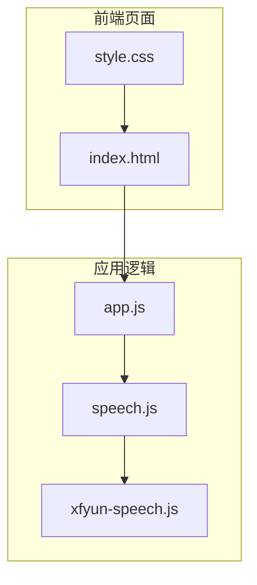
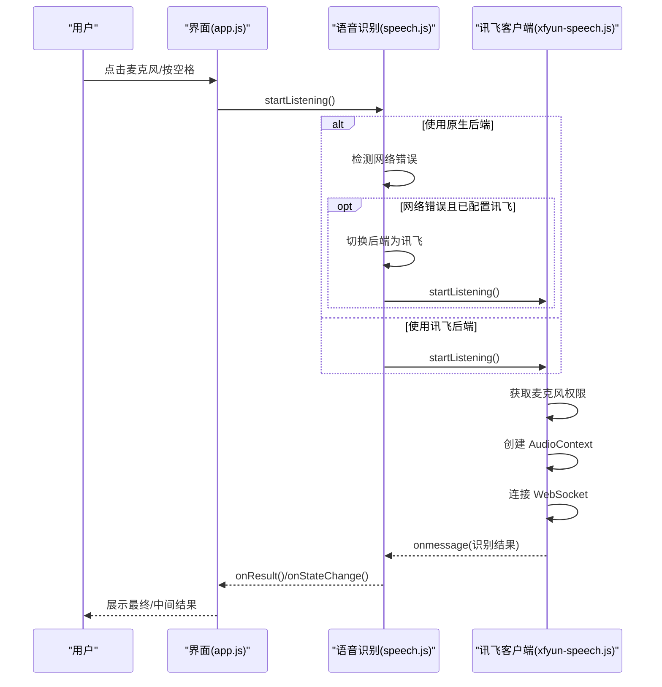
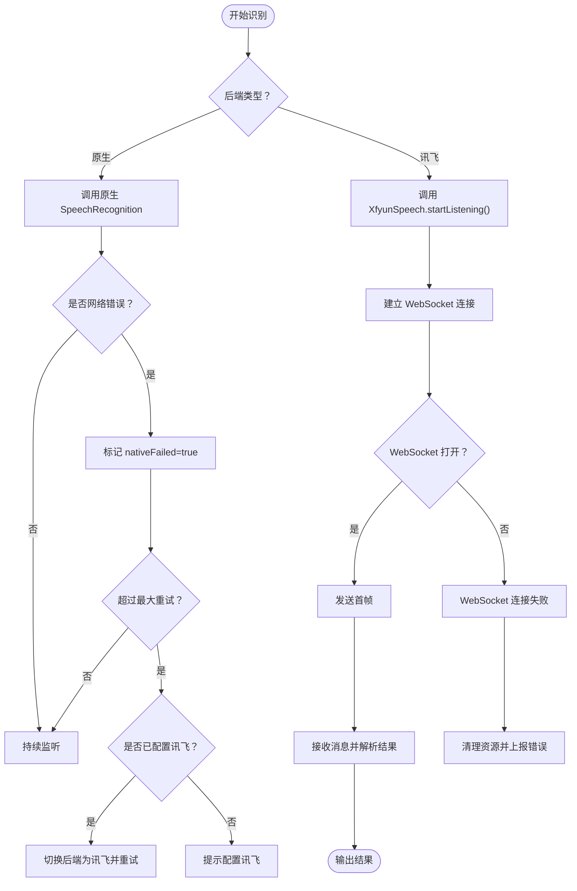
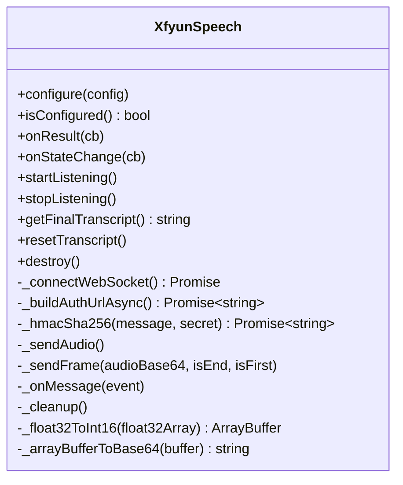
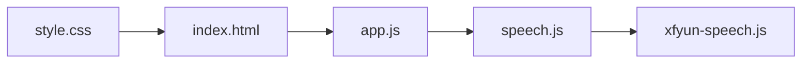

# 网络连接问题

<cite>
**本文引用的文件**
- [README.md](file://README.md)
- [index.html](file://index.html)
- [app.js](file://js/app.js)
- [speech.js](file://js/speech.js)
- [xfyun-speech.js](file://js/xfyun-speech.js)
- [style.css](file://css/style.css)
</cite>

## 目录
1. [简介](#简介)
2. [项目结构](#项目结构)
3. [核心组件](#核心组件)
4. [架构总览](#架构总览)
5. [详细组件分析](#详细组件分析)
6. [依赖关系分析](#依赖关系分析)
7. [性能考量](#性能考量)
8. [故障排查指南](#故障排查指南)
9. [结论](#结论)
10. [附录](#附录)

## 简介
本指南聚焦于本项目中可能出现的网络连接问题，涵盖 WebSocket 连接失败、网络超时、DNS 解析问题等常见异常，并提供针对讯飞 API 的专项排查方案（含防火墙、代理、SSL 证书验证等）。同时给出网络状态检测与重连机制的调试方法，帮助区分“网络错误”与“服务器错误”，并总结网络性能优化与连接池管理的最佳实践。

## 项目结构
该项目为前端语音识别应用，采用多后端架构：
- 原生 Web Speech API（浏览器依赖 Google 服务）
- 讯飞 WebSocket 语音听写 API（适用于中国大陆网络）

图表来源
- [index.html](file://index.html)
- [app.js](file://js/app.js)
- [speech.js](file://js/speech.js)
- [xfyun-speech.js](file://js/xfyun-speech.js)
- [style.css](file://css/style.css)

章节来源
- [index.html](file://index.html)
- [app.js](file://js/app.js)
- [speech.js](file://js/speech.js)
- [xfyun-speech.js](file://js/xfyun-speech.js)
- [style.css](file://css/style.css)

## 核心组件
- 应用入口与 UI 管理：负责初始化粒子背景、绑定事件、显示状态与结果、打开/保存设置。
- 语音识别管理器：统一调度原生与讯飞后端；在原生网络错误时自动切换至讯飞；支持本地持久化配置。
- 讯飞语音客户端：通过 WebSocket 与讯飞服务通信，使用 Web Audio API 捕获 PCM 音频并发送。

章节来源
- [app.js](file://js/app.js)
- [speech.js](file://js/speech.js)
- [xfyun-speech.js](file://js/xfyun-speech.js)

## 架构总览
下图展示了从用户交互到语音识别结果的端到端流程，重点标注了网络相关节点与错误路径。

图表来源
- [app.js](file://js/app.js)
- [speech.js](file://js/speech.js)
- [xfyun-speech.js](file://js/xfyun-speech.js)

## 详细组件分析

### 语音识别管理器（speech.js）
- 支持后端切换：原生 vs 讯飞
- 原生网络错误处理：当出现网络错误时，记录失败标记并在达到最大重试次数后自动切换至讯飞
- 状态管理：统一暴露 idle/listening/error 三种状态，并向 UI 回调
- 配置持久化：将后端选择与讯飞凭证保存到本地存储

图表来源
- [speech.js](file://js/speech.js)
- [xfyun-speech.js](file://js/xfyun-speech.js)

章节来源
- [speech.js](file://js/speech.js)

### 讯飞语音客户端（xfyun-speech.js）
- WebSocket 连接：基于授权 URL 建立 wss://iat-api.xfyun.cn/v2/iat
- 音频采集：使用 Web Audio API 捕获 PCM 数据，按帧发送
- 结果解析：解析服务端返回的 JSON，区分最终/中间结果
- 错误处理：对 WebSocket 错误、麦克风权限、设备缺失等情况进行分类提示

图表来源
- [xfyun-speech.js](file://js/xfyun-speech.js)

章节来源
- [xfyun-speech.js](file://js/xfyun-speech.js)

### 应用入口与 UI（app.js）
- 事件绑定：麦克风按钮、清空/复制文本、设置面板开关与保存
- 状态渲染：根据状态更新按钮、波形、录音指示线与状态提示
- 与语音识别模块解耦：通过回调驱动 UI 更新

章节来源
- [app.js](file://js/app.js)
- [index.html](file://index.html)
- [style.css](file://css/style.css)

## 依赖关系分析
- app.js 依赖 speech.js
- speech.js 依赖 xfyun-speech.js
- UI 由 index.html 与 style.css 提供

图表来源
- [app.js](file://js/app.js)
- [speech.js](file://js/speech.js)
- [xfyun-speech.js](file://js/xfyun-speech.js)
- [index.html](file://index.html)
- [style.css](file://css/style.css)

章节来源
- [app.js](file://js/app.js)
- [speech.js](file://js/speech.js)
- [xfyun-speech.js](file://js/xfyun-speech.js)
- [index.html](file://index.html)
- [style.css](file://css/style.css)

## 性能考量
- 原生后端重连策略：自动指数退避重连，避免频繁重启造成资源浪费
- 讯飞后端音频缓冲：按帧发送，减少单次传输体积，提升实时性
- WebSocket 生命周期：在停止识别时主动发送结束帧并清理资源，降低内存占用
- UI 渲染优化：仅在有新结果时更新文本区域，滚动到底部

章节来源
- [speech.js](file://js/speech.js)
- [xfyun-speech.js](file://js/xfyun-speech.js)

## 故障排查指南

### 一、WebSocket 连接失败
- 现象
  - 界面提示“连接讯飞服务失败，请检查网络和API配置”
  - WebSocket onerror/onclose 触发
- 排查步骤
  1) 确认网络可达
     - 在终端执行域名解析：nslookup iat-api.xfyun.cn
     - 使用浏览器开发者工具 Network 面板查看 WebSocket 握手是否成功
  2) 检查代理/防火墙
     - 若公司/校园网启用代理，确保代理允许 wss://iat-api.xfyun.cn
     - 防火墙放行 443 端口
  3) SSL/TLS 证书
     - 确保系统时间正确，避免证书校验失败
     - 如遇自签证书或企业 CA，确认浏览器信任链
  4) 服务端状态
     - 访问讯飞开放平台确认服务可用性
- 处理策略
  - 若为网络受限，优先配置讯飞后端并保存设置
  - 若为证书问题，升级浏览器或调整系统时间

章节来源
- [xfyun-speech.js](file://js/xfyun-speech.js)
- [speech.js](file://js/speech.js)

### 二、网络超时
- 现象
  - 原生后端出现 network 错误，触发自动切换
  - 讯飞 WebSocket onerror 或 onclose
- 排查步骤
  1) 延迟测试：ping/trace 该域名，观察丢包与 RTT
  2) 速率限制：确认是否被目标服务限速
  3) 本地网络：尝试切换到移动热点或不同网络
- 处理策略
  - 对于原生后端：自动切换至讯飞后端
  - 对于讯飞后端：增加重试间隔，必要时提示用户稍后再试

章节来源
- [speech.js](file://js/speech.js)
- [xfyun-speech.js](file://js/xfyun-speech.js)

### 三、DNS 解析问题
- 现象
  - WebSocket 握手失败，Network 显示 DNS 解析错误
- 排查步骤
  1) 使用 nslookup/dig 解析 iat-api.xfyun.cn
  2) 更换 DNS 服务器（如 8.8.8.8、114.114.114.114）
  3) 检查 hosts 文件是否有冲突
- 处理策略
  - 切换 DNS 或修复本地解析配置

章节来源
- [xfyun-speech.js](file://js/xfyun-speech.js)

### 四、讯飞 API 连接问题专项
- 必备条件
  - 已在讯飞开放平台注册并创建“语音听写”应用，获取 APPID、APIKey、APISecret
  - 在设置面板中填写并保存
- 常见问题与对策
  - 权限被拒/设备缺失
    - 检查浏览器权限与麦克风设备
  - WebSocket 连接断开
    - 检查网络稳定性与代理设置
  - 服务端错误码
    - 服务端返回 code 非 0 时，会提示具体错误信息
- 调试建议
  - 打开浏览器控制台，关注 WebSocket 错误日志与讯飞响应解析错误
  - 在设置面板中开启“讯飞”后端并保存，确保配置持久化

章节来源
- [index.html](file://index.html)
- [speech.js](file://js/speech.js)
- [xfyun-speech.js](file://js/xfyun-speech.js)

### 五、区分网络错误与服务器错误
- 网络错误（原生）
  - 事件 error 的 error 字段为 network
  - 表现为无法连接 Google 服务，自动切换至讯飞
- 服务器错误（讯飞）
  - WebSocket onerror 或服务端返回 code 非 0
  - 表现为服务端业务错误或鉴权失败

章节来源
- [speech.js](file://js/speech.js)
- [xfyun-speech.js](file://js/xfyun-speech.js)

### 六、网络状态检测与重连机制调试
- 原生后端
  - 监听 end 事件，按指数退避重连，避免频繁重启
- 讯飞后端
  - onclose 触发后清理资源并上报错误
  - 建议在 UI 上提供“重试”按钮或自动重试策略
- 调试要点
  - 在控制台观察 WebSocket readyState 变化
  - 检查音频缓冲队列长度与发送频率

章节来源
- [speech.js](file://js/speech.js)
- [xfyun-speech.js](file://js/xfyun-speech.js)

### 七、网络性能优化与连接池管理最佳实践
- 优化建议
  - 合理设置音频采样率与帧大小，平衡延迟与质量
  - 在高延迟网络下适当增大 VAD EOS，减少无效传输
  - 使用长连接复用，避免频繁握手
  - 对 WebSocket 进行心跳保活与异常恢复
- 连接池管理
  - 本项目未实现连接池，但可通过复用同一 WebSocket 实例与音频上下文减少资源创建成本
  - 停止识别时及时释放 MediaStream、AudioContext、WebSocket

章节来源
- [xfyun-speech.js](file://js/xfyun-speech.js)

## 结论
本项目通过“原生后端 + 讯飞后端”的双通道设计，在网络受限场景下具备良好的容错能力。针对 WebSocket 连接失败、DNS 解析、网络超时等问题，建议从网络可达性、代理/防火墙、证书校验与服务端状态四个维度排查，并结合自动切换与重连机制提升用户体验。对于性能优化，应关注音频帧策略、VAD 参数与资源生命周期管理。

## 附录

### A. 常见错误对照表
- 原生 SpeechRecognition error
  - network：网络错误，触发自动切换
  - not-allowed：权限被拒
  - no-speech：静默重试
  - aborted：手动停止
- 讯飞 WebSocket
  - onerror/onclose：网络异常或服务端断开
  - 服务端 code 非 0：业务错误，附带 message

章节来源
- [speech.js](file://js/speech.js)
- [xfyun-speech.js](file://js/xfyun-speech.js)