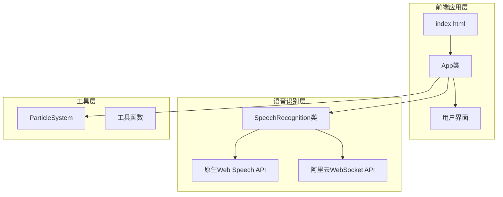
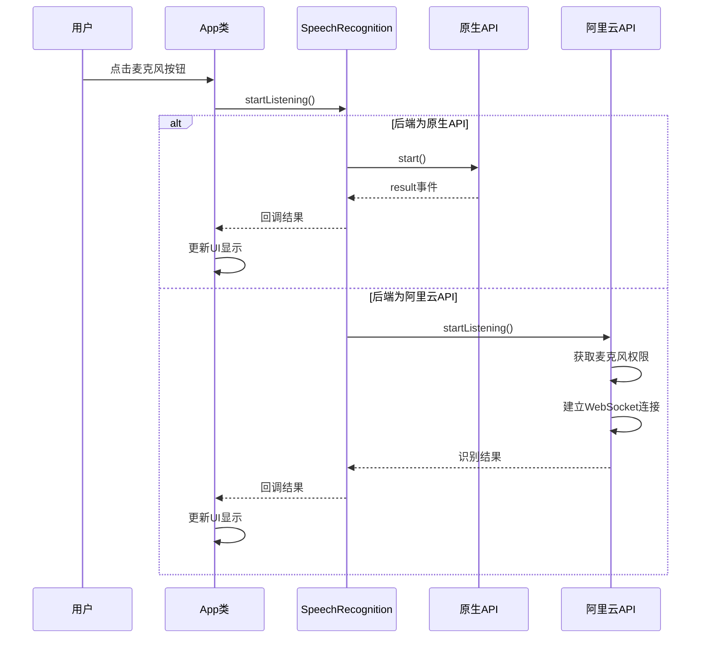
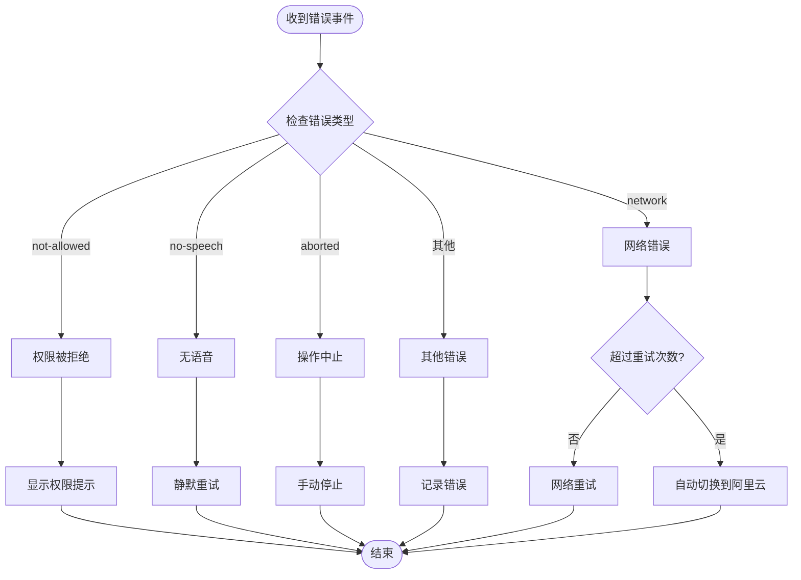
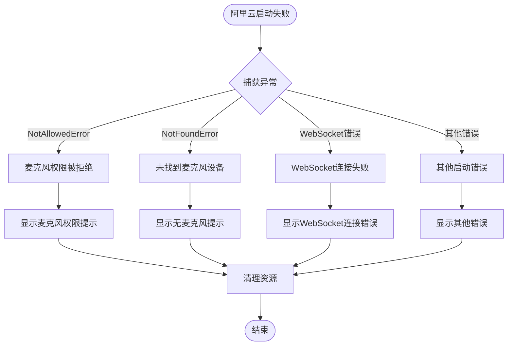
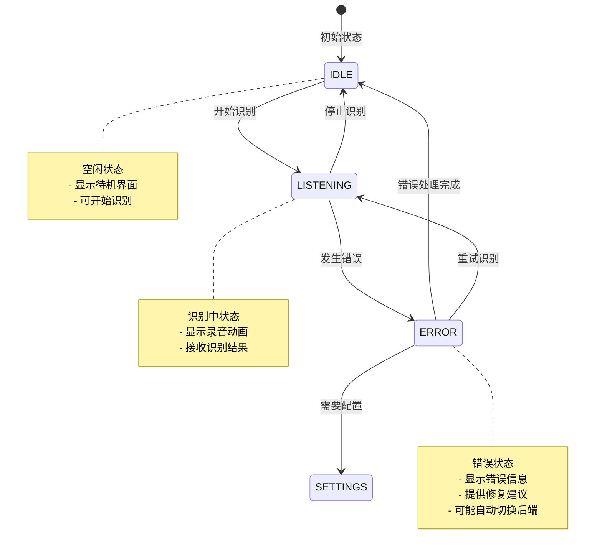
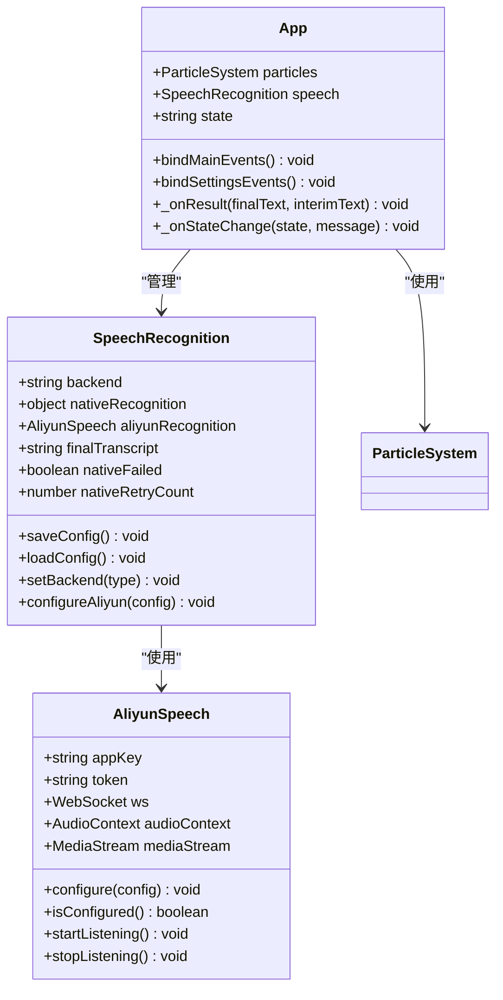
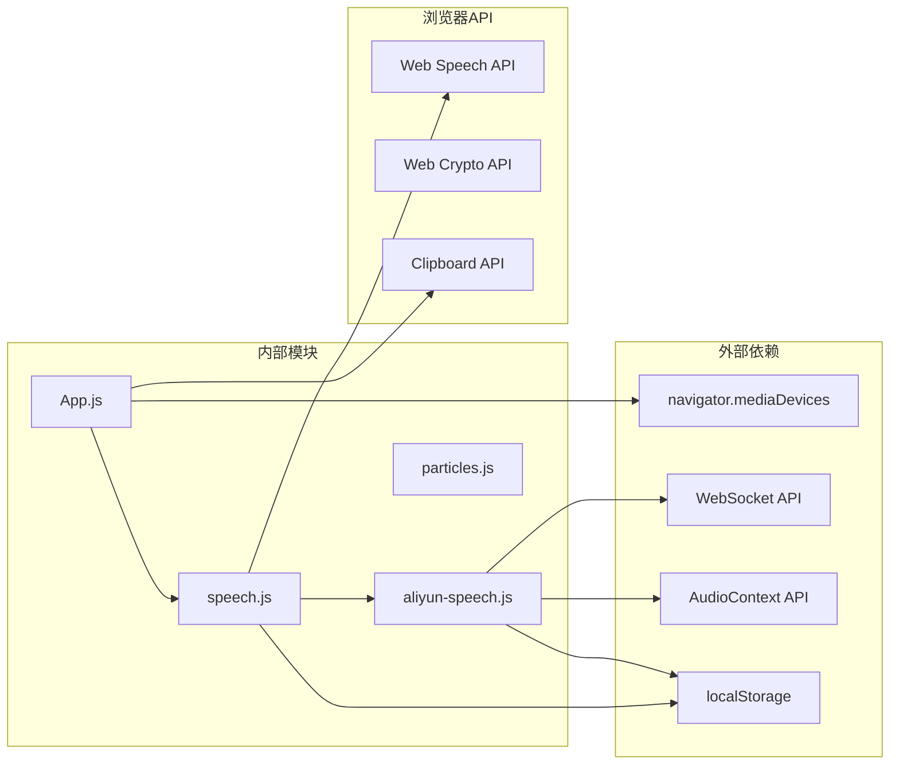
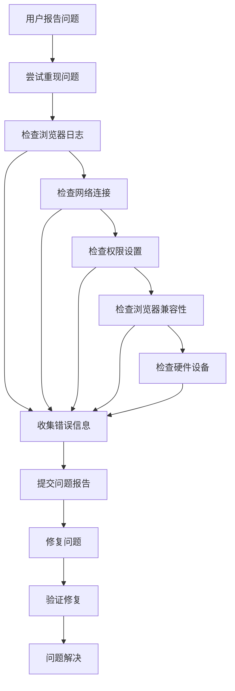

# 错误处理和调试

<cite>
**本文档引用的文件**
- [index.html](file://index.html)
- [app.js](file://js/app.js)
- [speech.js](file://js/speech.js)
- [aliyun-speech.js](file://js/aliyun-speech.js)
- [style.css](file://css/style.css)
</cite>

## 目录
1. [简介](#简介)
2. [项目结构](#项目结构)
3. [核心组件](#核心组件)
4. [架构概览](#架构概览)
5. [详细组件分析](#详细组件分析)
6. [依赖关系分析](#依赖关系分析)
7. [性能考虑](#性能考虑)
8. [故障排除指南](#故障排除指南)
9. [结论](#结论)

## 简介

本指南专注于语音识别应用的错误处理和调试策略。该应用提供了两种语音识别后端：浏览器原生 Web Speech API 和阿里云语音识别服务，具备自动故障转移机制。本文档将详细介绍如何使用浏览器开发者工具进行调试，包括控制台日志分析、断点调试、网络请求监控等技巧，并提供常见错误代码和异常信息的处理方法。

## 项目结构

该项目采用模块化架构，主要由以下组件构成：



**图表来源**
- [index.html:1-143](file://index.html#L1-L143)
- [app.js:12-41](file://js/app.js#L12-L41)
- [speech.js:21-39](file://js/speech.js#L21-L39)

**章节来源**
- [index.html:1-143](file://index.html#L1-L143)
- [app.js:12-41](file://js/app.js#L12-L41)
- [speech.js:21-39](file://js/speech.js#L21-L39)

## 核心组件

### 应用主控制器 (App类)

App类作为应用的主控制器，负责：
- 初始化粒子背景系统
- 管理语音识别实例
- 处理用户界面事件
- 状态管理和UI更新
- 设置面板管理

### 语音识别管理器 (SpeechRecognition类)

SpeechRecognition类提供多后端支持：
- 浏览器原生 Web Speech API
- 阿里云智能语音交互 WebSocket API
- 自动检测网络错误并切换后端
- 状态管理和错误处理

**章节来源**
- [app.js:12-296](file://js/app.js#L12-L296)
- [speech.js:21-383](file://js/speech.js#L21-L383)
- [aliyun-speech.js:17-478](file://js/aliyun-speech.js#L17-L478)

## 架构概览



**图表来源**
- [app.js:82-91](file://js/app.js#L82-L91)
- [speech.js:154-172](file://js/speech.js#L154-L172)
- [aliyun-speech.js:67-129](file://js/aliyun-speech.js#L67-L129)

## 详细组件分析

### 错误处理机制

#### 原生Web Speech API错误处理

原生API支持多种错误类型，系统提供了相应的处理策略：



**图表来源**
- [speech.js:285-327](file://js/speech.js#L285-L327)

#### 阿里云WebSocket错误处理

阿里云API的错误处理涉及多个层面：



**图表来源**
- [aliyun-speech.js:114-143](file://js/aliyun-speech.js#L114-L143)

**章节来源**
- [speech.js:285-327](file://js/speech.js#L285-L327)
- [aliyun-speech.js:114-143](file://js/aliyun-speech.js#L114-L143)

### 状态管理系统

应用实现了完整的状态管理机制：



**图表来源**
- [speech.js:10-19](file://js/speech.js#L10-L19)
- [speech.js:210-247](file://js/speech.js#L210-L247)

**章节来源**
- [speech.js:10-19](file://js/speech.js#L10-L19)
- [speech.js:210-247](file://js/speech.js#L210-L247)

### 配置管理

应用支持持久化配置存储：



**图表来源**
- [speech.js:21-39](file://js/speech.js#L21-L39)
- [aliyun-speech.js:17-48](file://js/aliyun-speech.js#L17-L48)
- [app.js:12-41](file://js/app.js#L12-L41)

**章节来源**
- [speech.js:21-39](file://js/speech.js#L21-L39)
- [aliyun-speech.js:17-48](file://js/aliyun-speech.js#L17-L48)
- [app.js:12-41](file://js/app.js#L12-L41)

## 依赖关系分析



**图表来源**
- [speech.js:8](file://js/speech.js#L8)
- [aliyun-speech.js:13](file://js/aliyun-speech.js#L13)
- [app.js:9](file://js/app.js#L9)

**章节来源**
- [speech.js:8](file://js/speech.js#L8)
- [aliyun-speech.js:13](file://js/aliyun-speech.js#L13)
- [app.js:9](file://js/app.js#L9)

## 性能考虑

### 音频处理优化

阿里云语音客户端实现了高效的音频处理机制：

- **采样率配置**: 16kHz采样率平衡音质和性能
- **缓冲区管理**: 使用数组队列避免内存泄漏
- **音频格式转换**: 快速Float32到Int16转换
- **分块传输**: 4KB分块减少网络延迟

### 网络连接优化

- **WebSocket复用**: 单连接传输多个音频帧
- **自动重连**: 智能退避算法避免过度重连
- **连接池管理**: 合理的连接生命周期管理

## 故障排除指南

### 浏览器开发者工具调试技巧

#### 控制台日志分析

1. **启用详细日志**
   - 打开浏览器开发者工具 (F12)
   - 切换到 Console 标签页
   - 观察应用启动过程中的日志输出

2. **关键日志位置**
   - 原生API错误: `console.warn('Native SpeechRecognition error:', ...)`
   - 阿里云API错误: `console.error('阿里云语音识别启动失败:', ...)`
   - WebSocket连接: `console.error('WebSocket error:', ...)`

3. **日志过滤技巧**
   - 使用过滤器查找特定关键词
   - 按时间排序查看错误发生的先后顺序
   - 导出日志用于后续分析

#### 断点调试

1. **设置断点位置**
   - 语音识别启动: `speech.js:213`
   - 阿里云启动: `aliyun-speech.js:67`
   - 错误处理: `speech.js:285`

2. **调试技巧**
   - 使用条件断点处理特定错误场景
   - 查看变量作用域中的状态信息
   - 监控异步操作的执行流程

#### 网络请求监控

1. **WebSocket连接监控**
   - 打开 Network 标签页
   - 过滤 WebSocket 请求
   - 查看握手过程和消息交换

2. **音频流监控**
   - 查看 MediaDevices API 的调用
   - 监控 AudioContext 的状态
   - 分析音频数据的传输情况

### 常见错误代码和处理方法

#### 原生Web Speech API错误

| 错误代码 | 含义 | 处理方法 |
|---------|------|----------|
| `not-allowed` | 权限被拒绝 | 引导用户在浏览器设置中允许麦克风访问 |
| `network` | 网络连接错误 | 自动切换到阿里云后端，提示配置API |
| `no-speech` | 无语音输入 | 静默重试，等待用户说话 |
| `aborted` | 操作被中止 | 正常停止状态，无需特殊处理 |

#### 阿里云WebSocket错误

| 错误类型 | 含义 | 处理方法 |
|---------|------|----------|
| `NotAllowedError` | 麦克风权限被拒绝 | 显示权限提示，引导用户授权 |
| `NotFoundError` | 未找到麦克风设备 | 提示检查硬件连接 |
| `WebSocket连接失败` | 网络连接问题 | 检查网络设置和Token配置 |
| `Token无效` | 凭证无效或过期 | 提示重新配置Token |

#### 异步错误处理

1. **Promise异常捕获**
   ```javascript
   // 复制文本功能的异步处理
   try {
       await navigator.clipboard.writeText(text);
   } catch (e) {
       // 回退到传统方法
       const textarea = document.createElement('textarea');
       textarea.value = text;
       document.body.appendChild(textarea);
       textarea.select();
       document.execCommand('copy');
       document.body.removeChild(textarea);
   }
   ```

2. **WebSocket连接错误**
   - 监听 `onerror` 和 `onclose` 事件
   - 实现自动重连机制
   - 提供用户友好的错误提示

3. **媒体设备错误**
   - 捕获 `getUserMedia` 异常
   - 提供设备检测和故障排除指导
   - 实现降级方案（如纯文本输入）

### 错误日志收集和分析

#### 日志收集策略

1. **结构化日志**
   - 包含时间戳、错误类型、错误信息
   - 记录用户操作上下文
   - 包含设备信息和浏览器版本

2. **错误分类**
   - 网络错误: 网络连接、API可用性
   - 权限错误: 麦克风、摄像头权限
   - 设备错误: 硬件兼容性问题
   - 配置错误: API凭证、参数设置

#### 用户反馈问题排查流程



**图表来源**
- [speech.js:285-327](file://js/speech.js#L285-L327)
- [aliyun-speech.js:114-143](file://js/aliyun-speech.js#L114-L143)

### 生产环境错误监控最佳实践

#### 错误监控系统

1. **错误上报机制**
   - 自动收集错误信息
   - 包含用户会话信息
   - 支持错误聚合和统计

2. **性能监控**
   - 监控识别成功率
   - 跟踪响应时间
   - 监控资源使用情况

3. **用户行为追踪**
   - 记录用户操作路径
   - 跟踪错误发生频率
   - 分析用户满意度指标

#### 日志记录策略

1. **日志级别**
   - 错误: 严重问题，需要立即关注
   - 警告: 潜在问题，需要关注
   - 信息: 正常操作记录
   - 调试: 详细的技术信息

2. **日志内容**
   - 时间戳和用户标识
   - 错误类型和详细描述
   - 相关的上下文信息
   - 用户操作历史

3. **隐私保护**
   - 不记录敏感信息
   - 遵守数据保护法规
   - 提供用户撤回同意的选项

**章节来源**
- [speech.js:285-327](file://js/speech.js#L285-L327)
- [aliyun-speech.js:114-143](file://js/aliyun-speech.js#L114-L143)
- [app.js:256-277](file://js/app.js#L256-L277)

## 结论

本指南详细介绍了语音识别应用的错误处理和调试策略。通过理解应用的多后端架构、状态管理系统和错误处理机制，开发者可以更有效地进行调试和故障排除。

关键要点包括：
- 利用浏览器开发者工具进行全面调试
- 理解不同错误类型的含义和处理策略
- 实现完善的错误监控和日志记录系统
- 建立标准化的问题排查流程
- 在生产环境中实施最佳的错误监控实践

这些实践不仅适用于当前项目，也为类似语音识别应用的开发和维护提供了宝贵的参考。