# 事件驱动架构

<cite>
**本文档引用的文件**
- [index.html](file://index.html)
- [app.js](file://js/app.js)
- [speech.js](file://js/speech.js)
- [xfyun-speech.js](file://js/xfyun-speech.js)
- [particles.js](file://js/particles.js)
- [style.css](file://css/style.css)
</cite>

## 目录
1. [简介](#简介)
2. [项目结构](#项目结构)
3. [核心组件](#核心组件)
4. [架构概览](#架构概览)
5. [详细组件分析](#详细组件分析)
6. [事件驱动模式实现](#事件驱动模式实现)
7. [回调函数机制](#回调函数机制)
8. [事件监听器使用](#事件监听器使用)
9. [状态变化处理流程](#状态变化处理流程)
10. [事件冒泡和捕获应用](#事件冒泡和捕获应用)
11. [事件绑定解绑最佳实践](#事件绑定解绑最佳实践)
12. [性能考虑](#性能考虑)
13. [故障排除指南](#故障排除指南)
14. [结论](#结论)

## 简介

MySpeechRecognition是一个基于Web Speech API的语音识别应用，采用事件驱动架构设计。该项目实现了多后端语音识别支持（浏览器原生Web Speech API和讯飞语音API），通过回调函数机制和事件监听器实现松耦合的组件通信。整个应用围绕事件驱动模式构建，实现了状态变化通知、结果回调处理、用户交互响应等功能。

## 项目结构

项目采用模块化架构，主要由以下核心模块组成：

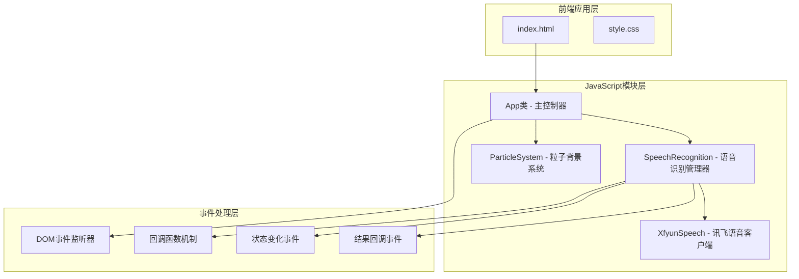

**图表来源**
- [index.html:1-143](file://index.html#L1-L143)
- [app.js:1-292](file://js/app.js#L1-L292)
- [speech.js:1-371](file://js/speech.js#L1-L371)

**章节来源**
- [index.html:1-143](file://index.html#L1-L143)
- [app.js:1-50](file://js/app.js#L1-L50)
- [speech.js:1-40](file://js/speech.js#L1-L40)

## 核心组件

### 主控制器 - App类

App类作为应用的主控制器，负责协调各个组件之间的通信。它继承了事件驱动架构的核心职责：

- **事件绑定管理**：管理DOM元素的事件监听器
- **状态同步**：维护应用状态并与UI保持同步
- **回调处理**：处理来自语音识别模块的状态变化和结果回调
- **设置管理**：处理用户配置和引擎切换

### 语音识别管理器 - SpeechRecognition

SpeechRecognition类实现了多后端语音识别支持，是事件驱动架构的核心组件：

- **后端抽象**：统一管理原生Web Speech API和讯飞语音API
- **状态管理**：跟踪识别状态（空闲、监听中、错误）
- **回调注册**：提供onResult和onStateChange回调接口
- **自动切换**：根据网络条件自动在不同后端之间切换

### 讯飞语音客户端 - XfyunSpeech

XfyunSpeech类专门处理讯飞语音API的WebSocket连接和音频数据传输：

- **WebSocket通信**：建立与讯飞服务器的实时连接
- **音频处理**：使用AudioContext捕获和处理PCM音频数据
- **认证机制**：实现HMAC-SHA256签名验证
- **状态通知**：向父组件报告连接状态变化

**章节来源**
- [app.js:12-41](file://js/app.js#L12-L41)
- [speech.js:21-39](file://js/speech.js#L21-L39)
- [xfyun-speech.js:17-32](file://js/xfyun-speech.js#L17-L32)

## 架构概览

MySpeechRecognition采用了分层的事件驱动架构：

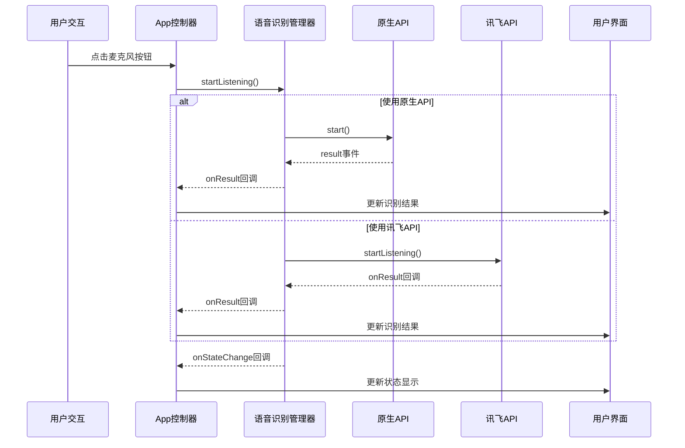

**图表来源**
- [app.js:82-91](file://js/app.js#L82-L91)
- [speech.js:154-172](file://js/speech.js#L154-L172)
- [xfyun-speech.js:67-129](file://js/xfyun-speech.js#L67-L129)

## 详细组件分析

### App控制器类结构

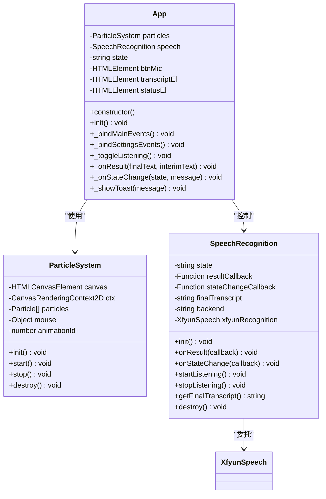

**图表来源**
- [app.js:12-287](file://js/app.js#L12-L287)
- [particles.js:69-198](file://js/particles.js#L69-L198)
- [speech.js:21-370](file://js/speech.js#L21-L370)

### 语音识别状态管理

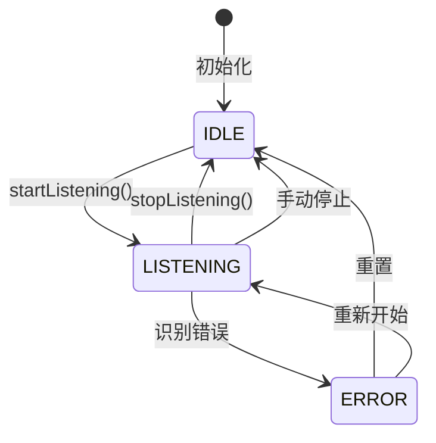

**图表来源**
- [speech.js:10-14](file://js/speech.js#L10-L14)
- [speech.js:329-336](file://js/speech.js#L329-L336)

**章节来源**
- [app.js:12-41](file://js/app.js#L12-L41)
- [speech.js:21-39](file://js/speech.js#L21-L39)

## 事件驱动模式实现

### 回调函数注册机制

项目实现了标准的观察者模式，通过回调函数实现松耦合通信：

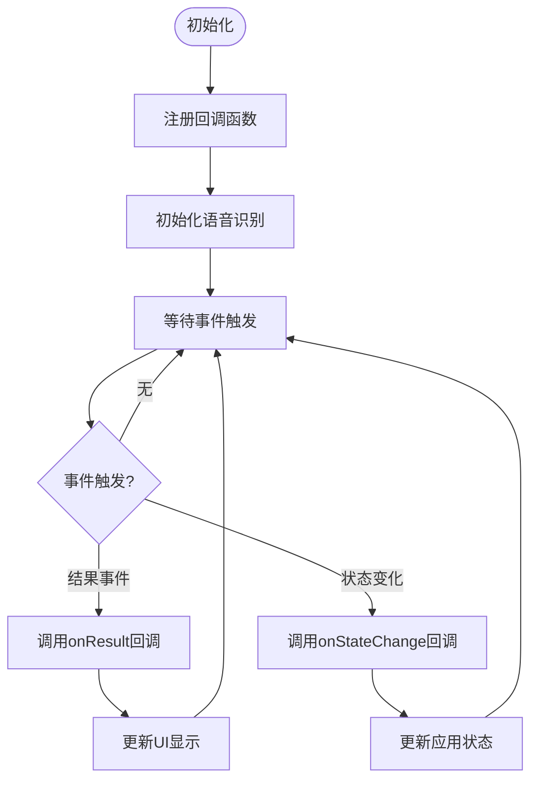

**图表来源**
- [speech.js:106-115](file://js/speech.js#L106-L115)
- [app.js:49-50](file://js/app.js#L49-L50)

### 事件监听器绑定策略

项目采用集中式的事件监听器管理策略：

**主界面事件绑定**：
- 麦克风按钮点击事件
- 清除按钮点击事件  
- 复制按钮点击事件
- 空格键键盘事件

**设置面板事件绑定**：
- 设置按钮点击事件
- 设置面板关闭事件
- 引擎切换事件
- ESC键关闭事件

**章节来源**
- [app.js:69-80](file://js/app.js#L69-L80)
- [app.js:95-120](file://js/app.js#L95-L120)

## 回调函数机制

### 结果回调处理

结果回调机制实现了双层回调设计：

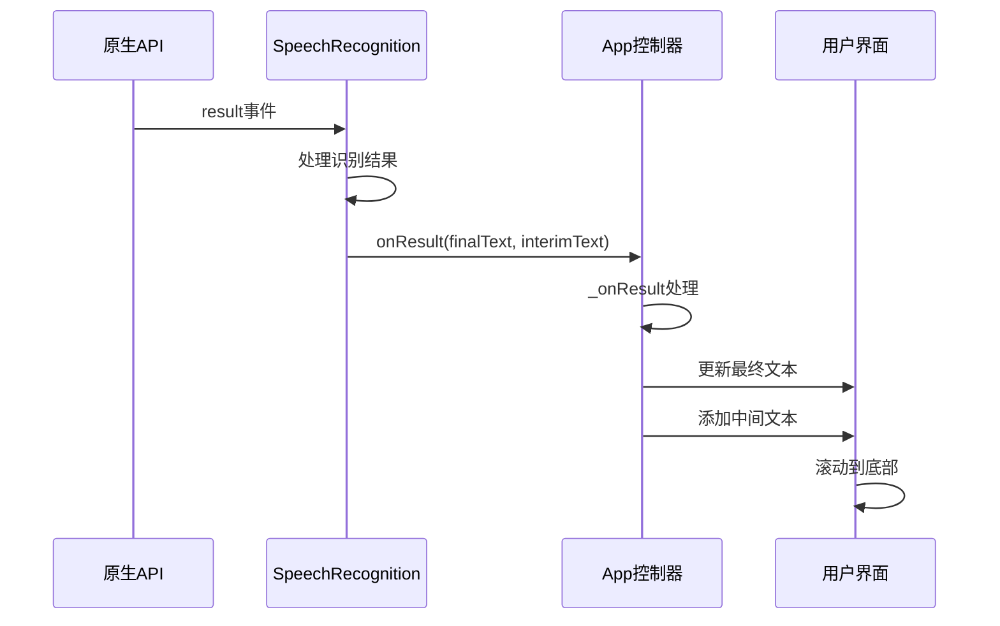

**图表来源**
- [speech.js:234-252](file://js/speech.js#L234-L252)
- [app.js:182-208](file://js/app.js#L182-L208)

### 状态变化回调

状态变化回调提供了完整的生命周期通知：

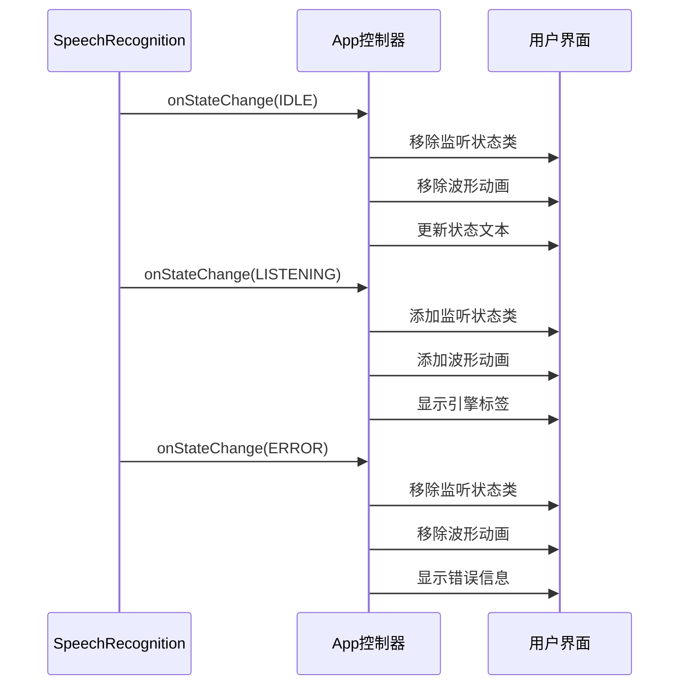

**图表来源**
- [speech.js:60-72](file://js/speech.js#L60-L72)
- [app.js:210-243](file://js/app.js#L210-L243)

**章节来源**
- [speech.js:106-115](file://js/speech.js#L106-L115)
- [app.js:182-243](file://js/app.js#L182-L243)

## 事件监听器使用

### DOM事件监听器管理

项目实现了完善的DOM事件监听器管理机制：

**事件绑定方法**：
- 使用addEventListener进行事件绑定
- 支持多种事件类型（click、keydown、change等）
- 实现事件委托和直接绑定相结合

**事件解绑策略**：
- 在组件销毁时清理所有事件监听器
- 使用弱引用避免内存泄漏
- 实现事件监听器的生命周期管理

### 事件处理器设计

每个事件处理器都遵循统一的设计模式：

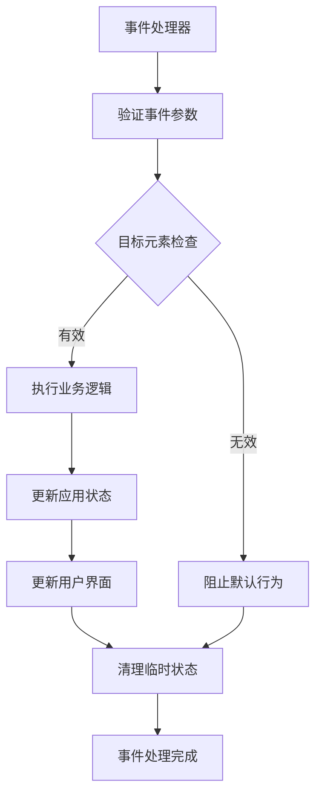

**图表来源**
- [app.js:74-79](file://js/app.js#L74-L79)
- [app.js:115-119](file://js/app.js#L115-L119)

**章节来源**
- [app.js:69-120](file://js/app.js#L69-L120)
- [particles.js:104-113](file://js/particles.js#L104-L113)

## 状态变化处理流程

### 状态转换机制

项目实现了完整的状态转换机制，确保状态变化的正确性和一致性：

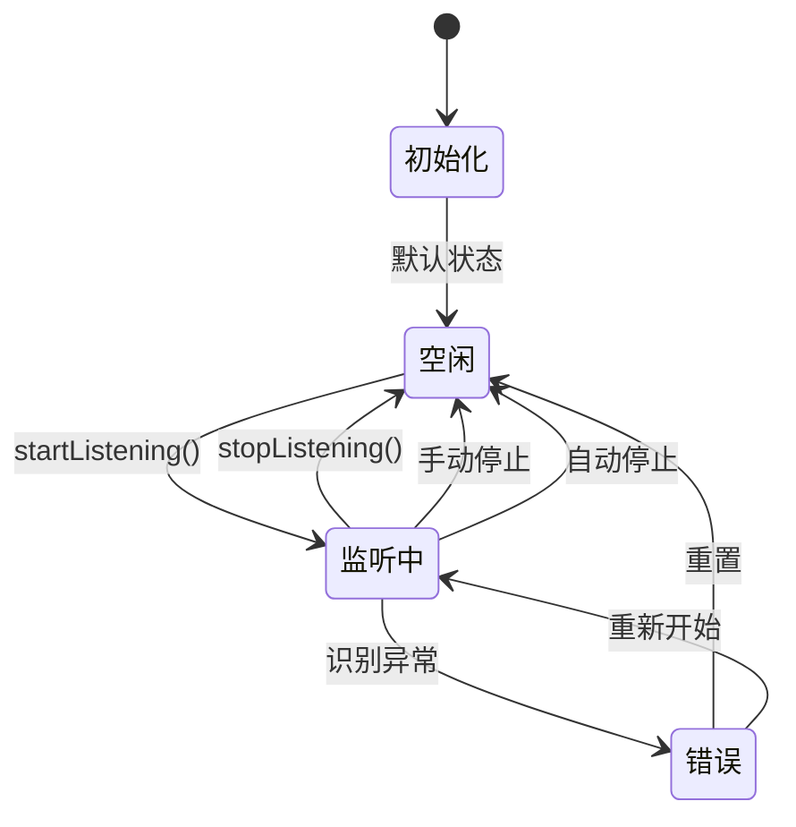

**图表来源**
- [speech.js:10-14](file://js/speech.js#L10-L14)
- [speech.js:329-336](file://js/speech.js#L329-L336)

### 状态同步机制

状态变化通过回调机制实现实时同步：

**状态更新流程**：
1. 语音识别模块检测状态变化
2. 调用onStateChange回调函数
3. App控制器接收状态变化通知
4. 更新应用内部状态
5. 同步UI状态显示
6. 触发相应的视觉反馈

**章节来源**
- [speech.js:329-336](file://js/speech.js#L329-L336)
- [app.js:210-243](file://js/app.js#L210-L243)

## 事件冒泡和捕获应用

### 事件传播机制

项目充分利用了DOM事件的冒泡和捕获特性：

**捕获阶段应用**：
- 在document级别监听keydown事件
- 实现全局快捷键处理
- 避免事件重复处理

**冒泡阶段应用**：
- 设置面板的点击事件处理
- 实现点击外部区域关闭面板的功能
- 利用事件冒泡实现委托模式

### 事件委托模式

项目广泛使用事件委托减少事件监听器数量：

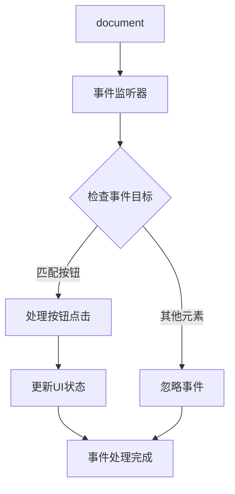

**图表来源**
- [app.js:101-105](file://js/app.js#L101-L105)
- [app.js:115-119](file://js/app.js#L115-L119)

**章节来源**
- [app.js:74-79](file://js/app.js#L74-L79)
- [app.js:101-119](file://js/app.js#L101-L119)

## 事件绑定解绑最佳实践

### 内存泄漏防护

项目实现了全面的内存泄漏防护机制：

**事件监听器清理**：
- 在组件销毁时移除所有事件监听器
- 使用removeEventListener确保正确解绑
- 避免循环引用导致的内存泄漏

**定时器清理**：
- 及时清理setTimeout和setInterval
- 在组件卸载时取消动画帧请求
- 确保WebSocket连接正确关闭

### 生命周期管理

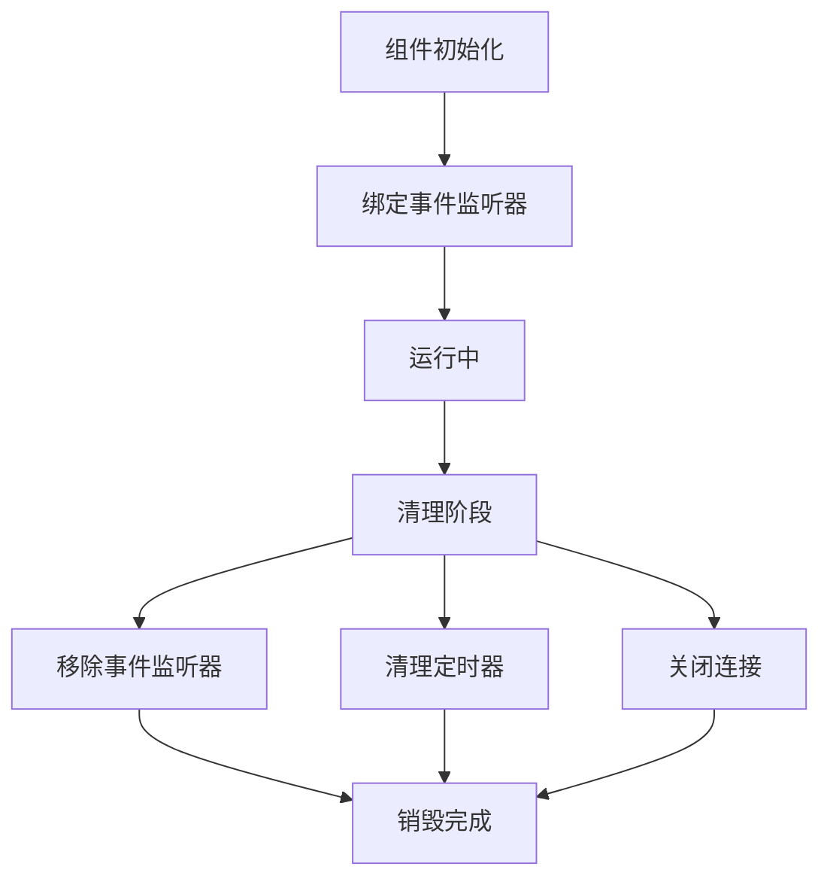

**图表来源**
- [particles.js:191-197](file://js/particles.js#L191-L197)
- [speech.js:194-197](file://js/speech.js#L194-L197)

**章节来源**
- [particles.js:191-197](file://js/particles.js#L191-L197)
- [speech.js:194-197](file://js/speech.js#L194-L197)

## 性能考虑

### 事件处理优化

项目在事件处理方面采用了多项优化措施：

**事件节流**：
- 避免频繁的状态更新
- 合并UI更新操作
- 减少重绘和回流

**异步处理**：
- 使用Promise处理异步操作
- 避免阻塞主线程
- 提供更好的用户体验

**内存优化**：
- 及时清理事件监听器
- 合理使用WeakMap存储事件数据
- 避免创建不必要的DOM元素

## 故障排除指南

### 常见问题诊断

**事件监听器失效**：
- 检查事件绑定时机
- 确认作用域绑定正确
- 验证事件目标元素存在

**状态同步问题**：
- 检查回调函数注册顺序
- 验证状态转换逻辑
- 确认UI更新时机

**内存泄漏检测**：
- 使用浏览器开发者工具监控内存
- 检查事件监听器数量
- 验证组件销毁流程

### 调试技巧

**事件追踪**：
- 在关键事件点添加日志
- 使用console.trace追踪调用栈
- 监控事件处理性能

**状态监控**：
- 实时显示应用状态
- 跟踪状态变化历史
- 验证状态转换有效性

**章节来源**
- [app.js:275-286](file://js/app.js#L275-L286)
- [speech.js:273-315](file://js/speech.js#L273-L315)

## 结论

MySpeechRecognition项目成功实现了基于事件驱动架构的语音识别应用。通过回调函数机制和事件监听器的有机结合，项目实现了：

1. **松耦合设计**：各组件通过事件进行通信，降低耦合度
2. **可扩展性**：新增后端或功能模块只需实现相应的事件接口
3. **可维护性**：清晰的事件处理流程便于调试和维护
4. **性能优化**：合理的事件管理和内存清理机制

该架构为类似的应用开发提供了优秀的参考模式，特别是在需要处理复杂异步操作和多后端支持的场景中。