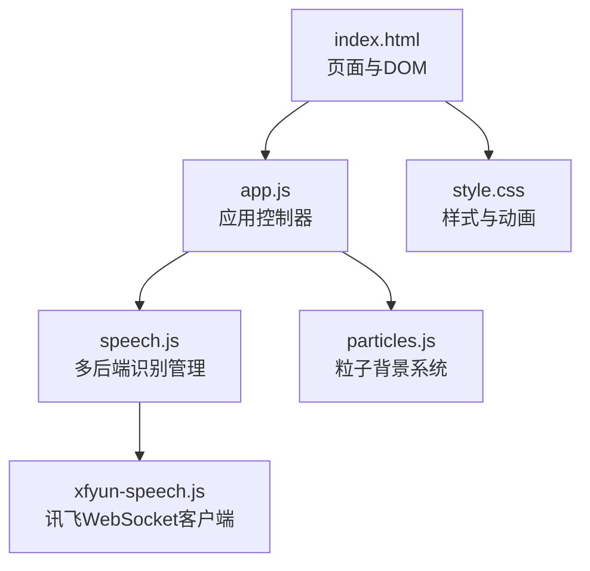
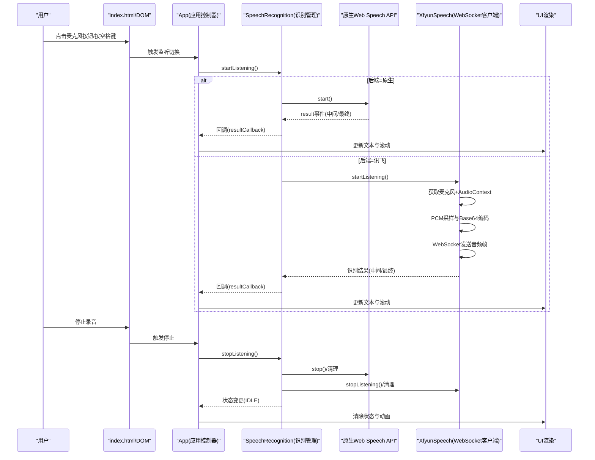
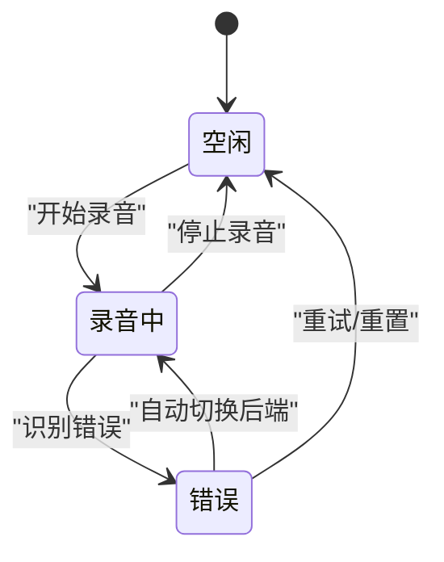
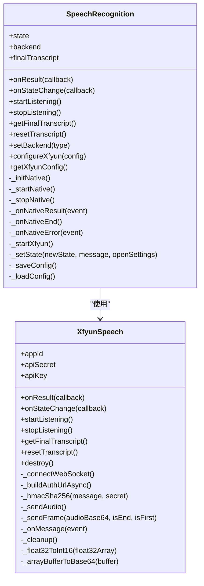
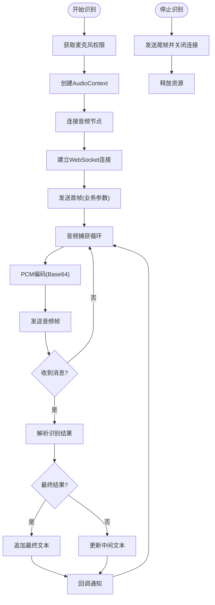
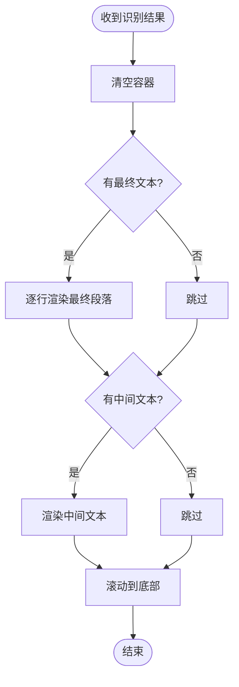
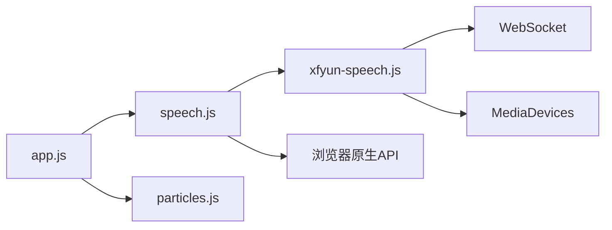

# 数据流处理

<cite>
**本文引用的文件**
- [index.html](file://index.html)
- [app.js](file://js/app.js)
- [speech.js](file://js/speech.js)
- [xfyun-speech.js](file://js/xfyun-speech.js)
- [particles.js](file://js/particles.js)
- [style.css](file://css/style.css)
</cite>

## 目录
1. [简介](#简介)
2. [项目结构](#项目结构)
3. [核心组件](#核心组件)
4. [架构总览](#架构总览)
5. [详细组件分析](#详细组件分析)
6. [依赖关系分析](#依赖关系分析)
7. [性能考量](#性能考量)
8. [故障排查指南](#故障排查指南)
9. [结论](#结论)

## 简介
本文件面向MySpeechRecognition项目，系统性梳理从用户语音输入到文本输出的完整数据流处理过程。文档覆盖音频采集、语音识别、文本处理与UI渲染各环节，解释中间结果与最终结果的数据结构与处理策略，阐述模块间数据传递与格式转换，说明异步数据处理与并发控制机制，并提供数据流图与时序图，以及数据验证与错误处理的实现细节。

## 项目结构
项目采用前端单页应用架构，主要由HTML页面、CSS样式、以及三个JavaScript模块组成：
- 页面层：index.html，负责UI布局与事件绑定
- 应用层：app.js，应用主控制器，协调UI与语音识别
- 识别层：speech.js，多后端语音识别管理器（原生Web Speech API与讯飞WebSocket）
- 讯飞客户端：xfyun-speech.js，封装讯飞WebSocket音频采集与识别
- 粒子背景：particles.js，Canvas粒子动画系统
- 样式层：style.css，主题化UI与动画

**图表来源**
- [index.html:1-143](file://index.html#L1-L143)
- [app.js:1-296](file://js/app.js#L1-L296)
- [speech.js:1-383](file://js/speech.js#L1-L383)
- [xfyun-speech.js:1-407](file://js/xfyun-speech.js#L1-L407)
- [particles.js:1-199](file://js/particles.js#L1-L199)
- [style.css:1-711](file://css/style.css#L1-L711)

**章节来源**
- [index.html:1-143](file://index.html#L1-L143)
- [app.js:1-296](file://js/app.js#L1-L296)
- [speech.js:1-383](file://js/speech.js#L1-L383)
- [xfyun-speech.js:1-407](file://js/xfyun-speech.js#L1-L407)
- [particles.js:1-199](file://js/particles.js#L1-L199)
- [style.css:1-711](file://css/style.css#L1-L711)

## 核心组件
- 应用控制器App：初始化粒子背景与语音识别，绑定主界面与设置面板事件，处理状态变更与UI更新，提供复制与清空文本能力
- 语音识别管理器SpeechRecognition：统一管理原生Web Speech API与讯飞WebSocket两种后端；维护识别状态、自动切换逻辑、本地持久化配置
- 讯飞WebSocket客户端XfyunSpeech：负责麦克风权限申请、AudioContext音频捕获、PCM数据编码、WebSocket鉴权与消息处理、结果聚合
- 粒子背景ParticleSystem：Canvas粒子系统，用于页面视觉增强

**章节来源**
- [app.js:12-296](file://js/app.js#L12-L296)
- [speech.js:21-383](file://js/speech.js#L21-L383)
- [xfyun-speech.js:17-407](file://js/xfyun-speech.js#L17-L407)
- [particles.js:69-199](file://js/particles.js#L69-L199)

## 架构总览
下图展示从用户触发录音到UI呈现文本的端到端数据流，包括原生与讯飞两条路径及状态切换。

**图表来源**
- [app.js:69-91](file://js/app.js#L69-L91)
- [speech.js:154-184](file://js/speech.js#L154-L184)
- [xfyun-speech.js:67-148](file://js/xfyun-speech.js#L67-L148)

## 详细组件分析

### 1) 用户交互与状态机
- 事件绑定：主界面按钮与键盘事件触发录音/停止；设置面板事件管理后端与配置
- 状态机：IDLE/LISTENING/ERROR三态，驱动UI状态、波形动画与录音指示线
- 状态切换：根据识别后端与错误类型动态调整UI与提示信息

**图表来源**
- [speech.js:10-19](file://js/speech.js#L10-L19)
- [speech.js:341-348](file://js/speech.js#L341-L348)
- [app.js:210-247](file://js/app.js#L210-L247)

**章节来源**
- [app.js:69-120](file://js/app.js#L69-L120)
- [app.js:210-247](file://js/app.js#L210-L247)
- [speech.js:10-19](file://js/speech.js#L10-L19)
- [speech.js:341-348](file://js/speech.js#L341-L348)

### 2) 语音识别管理器（多后端）
- 后端选择：NATIVE/XFYUN，支持自动切换与持久化
- 原生API：连续识别、中间结果、错误分类（网络/权限/无语音等）
- 讯飞API：WebSocket鉴权、音频帧发送、结果解析与状态管理
- 配置持久化：localStorage存储后端与讯飞凭证

**图表来源**
- [speech.js:21-383](file://js/speech.js#L21-L383)
- [xfyun-speech.js:17-407](file://js/xfyun-speech.js#L17-L407)

**章节来源**
- [speech.js:21-383](file://js/speech.js#L21-L383)
- [xfyun-speech.js:17-407](file://js/xfyun-speech.js#L17-L407)

### 3) 讯飞WebSocket客户端（音频采集与识别）
- 音频采集：getUserMedia获取麦克风，AudioContext创建节点，ScriptProcessor捕获PCM
- 编码与发送：Float32转Int16，再转Base64，按帧发送至WebSocket
- 鉴权与握手：HMAC-SHA256签名，构建Authorization头，建立WebSocket连接
- 结果解析：解析JSON响应，区分中间与最终结果，拼接最终文本

**图表来源**
- [xfyun-speech.js:67-148](file://js/xfyun-speech.js#L67-L148)
- [xfyun-speech.js:176-207](file://js/xfyun-speech.js#L176-L207)
- [xfyun-speech.js:251-296](file://js/xfyun-speech.js#L251-L296)
- [xfyun-speech.js:301-350](file://js/xfyun-speech.js#L301-L350)

**章节来源**
- [xfyun-speech.js:67-148](file://js/xfyun-speech.js#L67-L148)
- [xfyun-speech.js:176-207](file://js/xfyun-speech.js#L176-L207)
- [xfyun-speech.js:251-296](file://js/xfyun-speech.js#L251-L296)
- [xfyun-speech.js:301-350](file://js/xfyun-speech.js#L301-L350)

### 4) 文本处理与UI渲染
- 文本结构：最终文本与中间文本分别渲染，最终文本带强调样式，中间文本半透明弱化
- 滚动行为：新内容追加后自动滚动到底部
- 状态提示：根据状态显示不同颜色与文案，错误时可自动打开设置面板
- 复制与清空：通过剪贴板API或临时textarea实现复制；清空时重置文本与占位符

**图表来源**
- [app.js:182-208](file://js/app.js#L182-L208)
- [style.css:190-204](file://css/style.css#L190-L204)

**章节来源**
- [app.js:182-208](file://js/app.js#L182-L208)
- [style.css:190-204](file://css/style.css#L190-L204)

### 5) 粒子背景系统
- 粒子运动：位置更新、边界环绕、鼠标吸引
- 连线绘制：基于距离阈值绘制半透明连线
- 生命周期：窗口尺寸变化、可见性变化、动画帧调度

**章节来源**
- [particles.js:69-199](file://js/particles.js#L69-L199)

## 依赖关系分析
- 模块耦合
  - app.js依赖speech.js与particles.js，负责事件绑定与UI更新
  - speech.js依赖xfyun-speech.js，作为多后端统一入口
  - xfyun-speech.js依赖浏览器Web Audio与WebSocket能力
- 外部依赖
  - Web Speech API（原生后端）
  - WebSocket（讯飞后端）
  - MediaDevices（麦克风权限）
  - localStorage（配置持久化）

**图表来源**
- [app.js:9-10](file://js/app.js#L9-L10)
- [speech.js](file://js/speech.js#L8)
- [xfyun-speech.js:13-15](file://js/xfyun-speech.js#L13-L15)

**章节来源**
- [app.js:9-10](file://js/app.js#L9-L10)
- [speech.js](file://js/speech.js#L8)
- [xfyun-speech.js:13-15](file://js/xfyun-speech.js#L13-L15)

## 性能考量
- 原生后端自动重连：监听结束事件后指数退避重连，避免频繁重启
- 讯飞音频缓冲：脚本处理器回调中批量发送，减少WebSocket压力
- UI渲染优化：仅在有结果时更新DOM，避免无效重绘
- 资源释放：停止识别时及时断开音频节点、关闭WebSocket、释放媒体流
- 动画节流：粒子系统使用requestAnimationFrame，窗口隐藏时暂停动画

**章节来源**
- [speech.js:273-283](file://js/speech.js#L273-L283)
- [xfyun-speech.js:94-102](file://js/xfyun-speech.js#L94-L102)
- [xfyun-speech.js:355-379](file://js/xfyun-speech.js#L355-L379)
- [particles.js:138-150](file://js/particles.js#L138-L150)

## 故障排查指南
- 原生API错误
  - 权限被拒：提示用户开启麦克风权限
  - 网络错误：自动切换到讯飞后端并提示
  - 无语音/中断：静默重试或自动重连
- 讯飞API错误
  - 未配置凭证：提示先在设置中填写
  - WebSocket连接失败：检查网络与凭证
  - 服务端错误码：解析错误信息并停止识别
- UI与状态
  - 状态提示颜色异常：检查状态机与CSS类名
  - 文本不更新：确认回调链路与DOM操作顺序
  - 复制失败：回退到临时textarea方案

**章节来源**
- [speech.js:285-327](file://js/speech.js#L285-L327)
- [xfyun-speech.js:114-129](file://js/xfyun-speech.js#L114-L129)
- [xfyun-speech.js:306-313](file://js/xfyun-speech.js#L306-L313)
- [app.js:256-277](file://js/app.js#L256-L277)

## 结论
本项目通过清晰的分层架构实现了从语音输入到文本输出的完整数据流：应用控制器负责事件与UI，识别管理器统一对接原生与讯飞后端，WebSocket客户端完成音频采集与识别，样式系统提供沉浸式体验。系统具备完善的错误处理与状态管理，支持自动后端切换与本地配置持久化，满足国内用户的使用场景需求。