# 核心架构设计

<cite>
**本文档引用的文件**
- [index.html](file://index.html)
- [app.js](file://js/app.js)
- [speech.js](file://js/speech.js)
- [particles.js](file://js/particles.js)
- [aliyun-speech.js](file://js/aliyun-speech.js)
- [server.js](file://server.js)
- [token.php](file://api/token.php)
- [package.json](file://package.json)
- [style.css](file://css/style.css)
</cite>

## 目录
1. [引言](#引言)
2. [项目结构](#项目结构)
3. [核心组件](#核心组件)
4. [架构概览](#架构概览)
5. [详细组件分析](#详细组件分析)
6. [依赖关系分析](#依赖关系分析)
7. [性能考虑](#性能考虑)
8. [故障排除指南](#故障排除指南)
9. [结论](#结论)

## 引言

MySpeechRecognition是一个基于Web的语音识别应用程序，采用模块化设计和事件驱动架构。该系统提供了三种语音识别后端支持：浏览器原生Web Speech API、阿里云语音识别服务和讯飞语音识别服务，实现了智能的后端切换机制。项目采用Node.js服务器端架构，包含完整的Token管理和依赖管理，为用户提供安全可靠的语音识别服务。

## 项目结构

项目采用全栈架构设计，包含前端应用和Node.js服务器端，主要包含以下核心文件：

```mermaid
graph TB
subgraph "前端应用"
HTML[index.html]
CSS[css/style.css]
end
subgraph "JavaScript模块"
APP[app.js - 应用主控制器]
SPEECH[speech.js - 语音识别管理器]
PARTICLES[particles.js - 粒子系统]
ALIYUN[aliyun-speech.js - 阿里云后端支持]
end
subgraph "服务器端"
SERVER[server.js - Node.js服务器]
TOKEN[api/token.php - Token管理]
END
HTML --> APP
APP --> SPEECH
APP --> PARTICLES
SPEECH --> ALIYUN
ALIYUN --> SERVER
SERVER --> TOKEN
```

**图表来源**
- [index.html:1-143](file://index.html#L1-L143)
- [app.js:1-203](file://js/app.js#L1-L203)
- [speech.js:1-371](file://js/speech.js#L1-L371)
- [particles.js:1-199](file://js/particles.js#L1-L199)
- [aliyun-speech.js:1-452](file://js/aliyun-speech.js#L1-L452)
- [server.js:1-200](file://server.js#L1-L200)
- [token.php:1-100](file://api/token.php#L1-L100)

**章节来源**
- [index.html:1-143](file://index.html#L1-L143)
- [style.css:1-472](file://css/style.css#L1-L472)
- [server.js:1-200](file://server.js#L1-L200)
- [package.json:1-50](file://package.json#L1-L50)

## 核心组件

### 应用主控制器 (App)

App类作为系统的中央协调者，负责初始化和管理所有子系统。它采用事件驱动模式，通过回调函数与各模块进行解耦通信。

### 语音识别管理器 (SpeechRecognition)

SpeechRecognition类实现了多后端语音识别的核心逻辑，支持原生Web Speech API、阿里云语音识别和讯飞语音识别三种模式，并具备智能切换能力。

### 粒子系统 (ParticleSystem)

ParticleSystem类提供动态背景效果，增强用户体验的视觉吸引力。

### 阿里云语音后端 (AliyunSpeech)

AliyunSpeech类封装了阿里云语音识别API的完整实现，包括音频捕获、HTTP请求和结果处理。

### Node.js服务器端 (Server)

Server类实现了完整的Node.js服务器端架构，提供Token管理和API路由功能。

### Token管理 (Token Management)

Token.php实现了服务器端Token管理功能，确保语音识别服务的安全性。

**章节来源**
- [app.js:11-28](file://js/app.js#L11-L28)
- [speech.js:21-39](file://js/speech.js#L21-L39)
- [particles.js:69-82](file://js/particles.js#L69-L82)
- [aliyun-speech.js:17-32](file://js/aliyun-speech.js#L17-L32)
- [server.js:1-200](file://server.js#L1-L200)
- [token.php:1-100](file://api/token.php#L1-L100)

## 架构概览

系统采用全栈架构设计，实现了清晰的关注点分离和安全的Token管理：

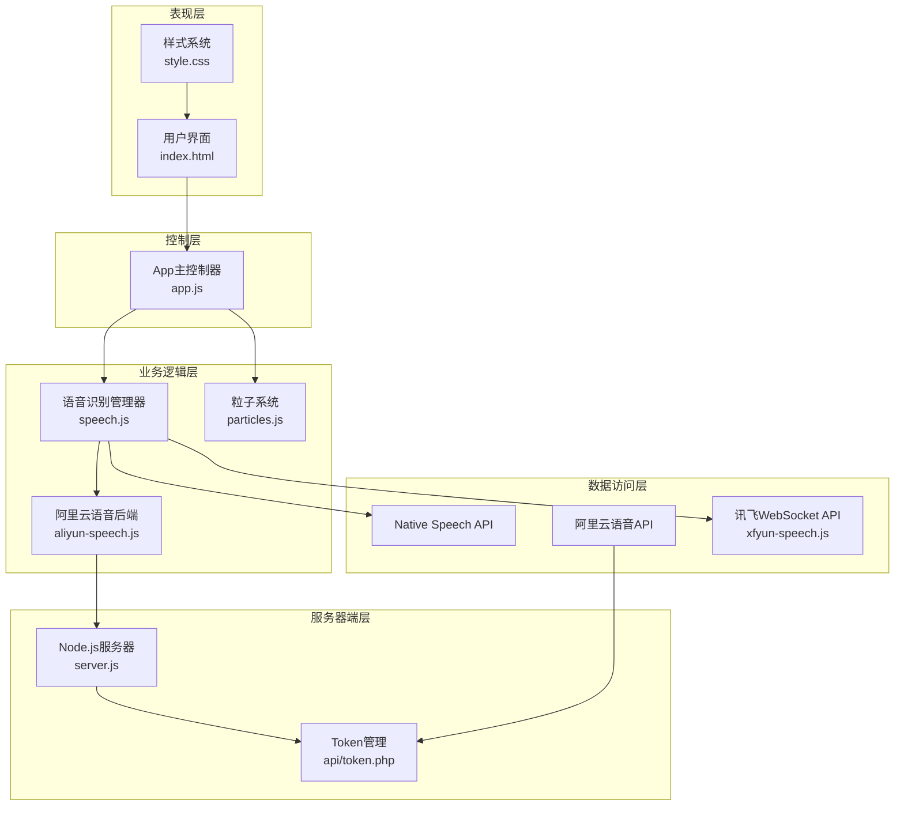

**图表来源**
- [app.js:1-203](file://js/app.js#L1-L203)
- [speech.js:1-371](file://js/speech.js#L1-L371)
- [particles.js:1-199](file://js/particles.js#L1-L199)
- [aliyun-speech.js:1-452](file://js/aliyun-speech.js#L1-L452)
- [server.js:1-200](file://server.js#L1-L200)
- [token.php:1-100](file://api/token.php#L1-L100)

### 状态管理模式

系统实现了完整的状态管理模式，使用有限状态机概念管理语音识别的不同阶段：

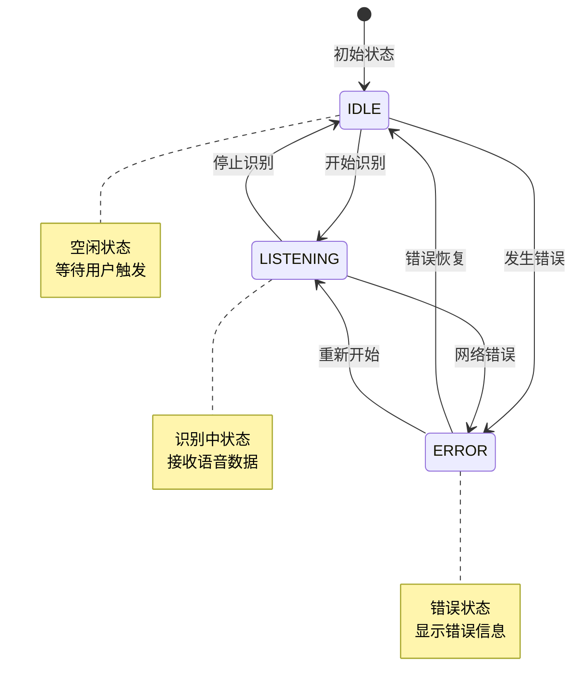

**图表来源**
- [speech.js:10-14](file://js/speech.js#L10-L14)
- [speech.js:329-336](file://js/speech.js#L329-L336)

### 事件驱动架构

系统广泛采用事件驱动模式，通过回调函数实现模块间的松耦合通信：

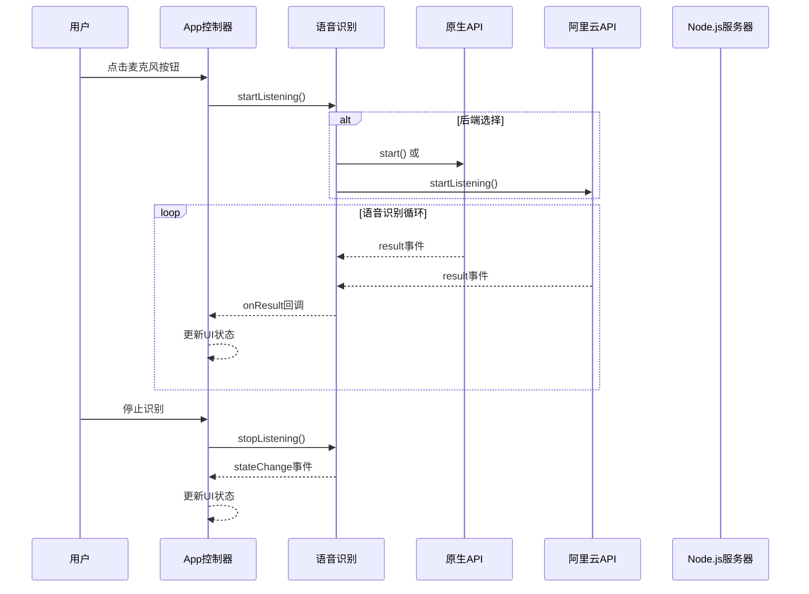

**图表来源**
- [app.js:78-88](file://js/app.js#L78-L88)
- [speech.js:154-172](file://js/speech.js#L154-L172)
- [speech.js:53-57](file://js/speech.js#L53-L57)

## 详细组件分析

### App主控制器分析

App类实现了完整的应用生命周期管理，包括初始化、事件绑定和状态更新：

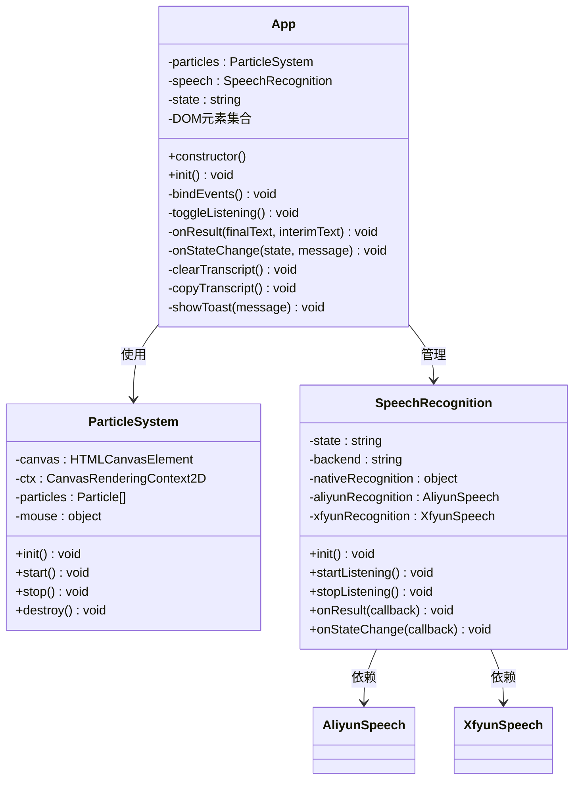

**图表来源**
- [app.js:11-28](file://js/app.js#L11-L28)
- [particles.js:69-82](file://js/particles.js#L69-L82)
- [speech.js:21-39](file://js/speech.js#L21-L39)

#### 初始化流程

App的初始化过程体现了模块化设计的最佳实践：

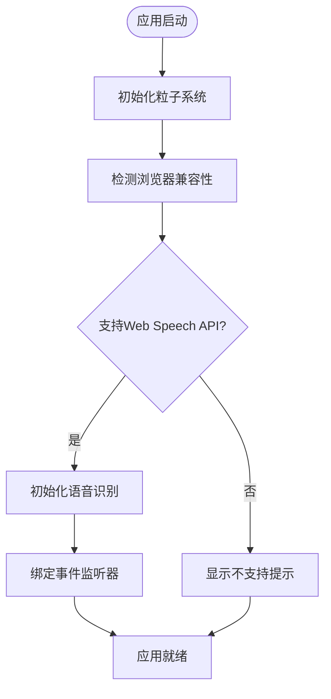

**图表来源**
- [app.js:30-57](file://js/app.js#L30-L57)

**章节来源**
- [app.js:1-203](file://js/app.js#L1-L203)

### 语音识别管理器分析

SpeechRecognition类是系统的核心组件，实现了复杂的多后端支持和状态管理：

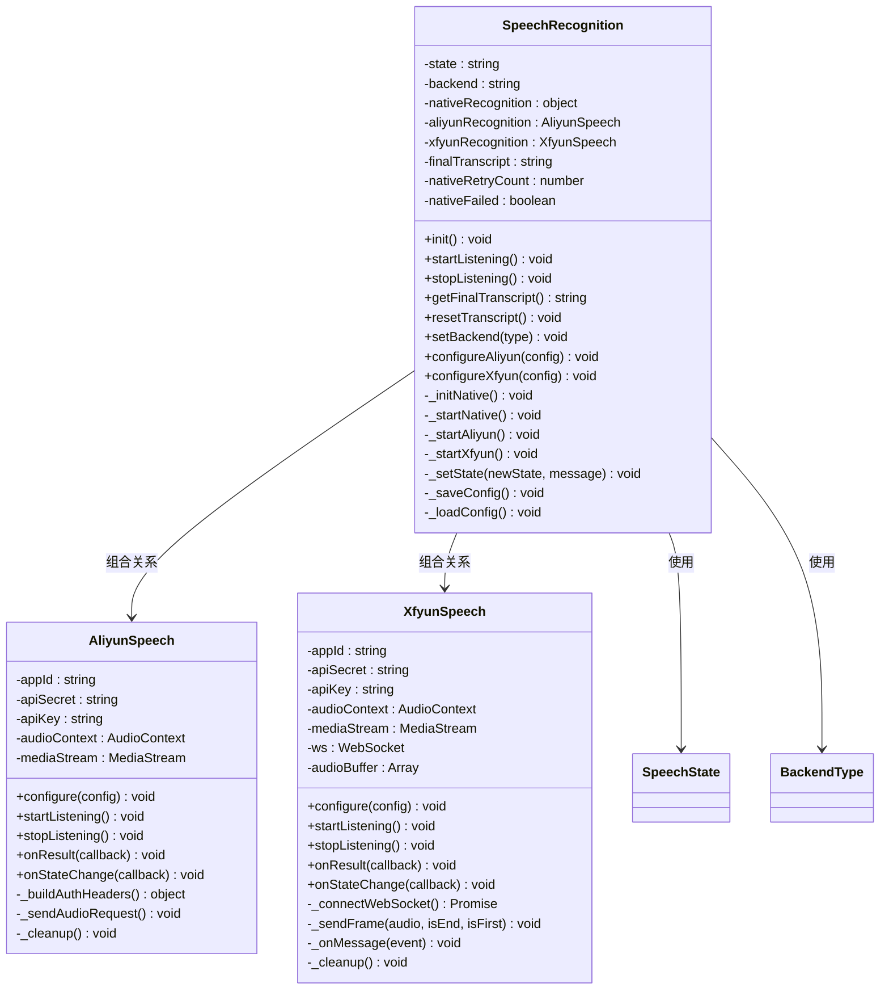

**图表来源**
- [speech.js:21-39](file://js/speech.js#L21-L39)
- [aliyun-speech.js:17-32](file://js/aliyun-speech.js#L17-L32)
- [xfyun-speech.js:17-32](file://js/xfyun-speech.js#L17-L32)

#### 后端切换机制

系统实现了智能的后端切换策略，确保在不同网络环境下都能提供稳定的语音识别服务：

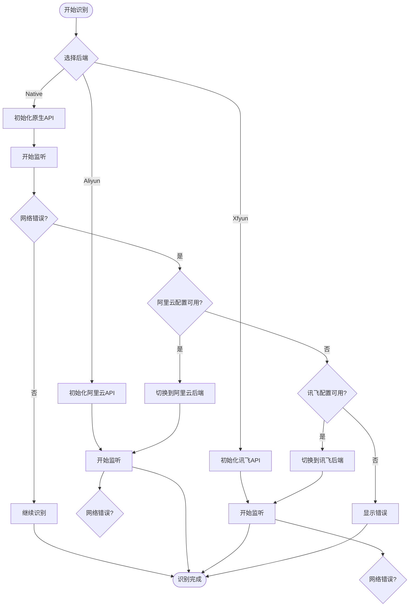

**图表来源**
- [speech.js:282-302](file://js/speech.js#L282-L302)
- [speech.js:290-298](file://js/speech.js#L290-L298)

**章节来源**
- [speech.js:1-371](file://js/speech.js#L1-L371)

### 粒子系统分析

ParticleSystem类实现了复杂的物理模拟和视觉效果系统：

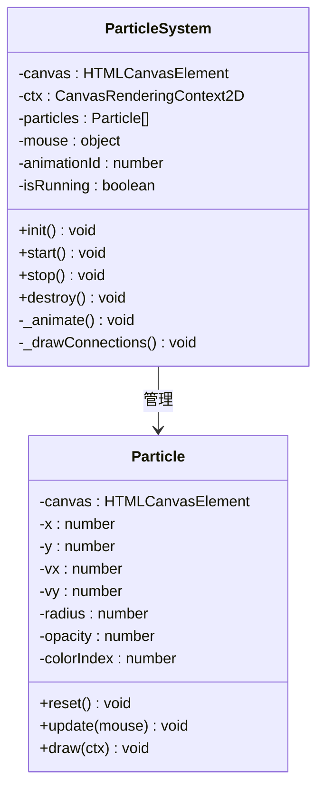

**图表来源**
- [particles.js:18-67](file://js/particles.js#L18-L67)
- [particles.js:69-82](file://js/particles.js#L69-L82)

#### 物理模拟算法

粒子系统实现了基于牛顿运动定律的物理模拟：

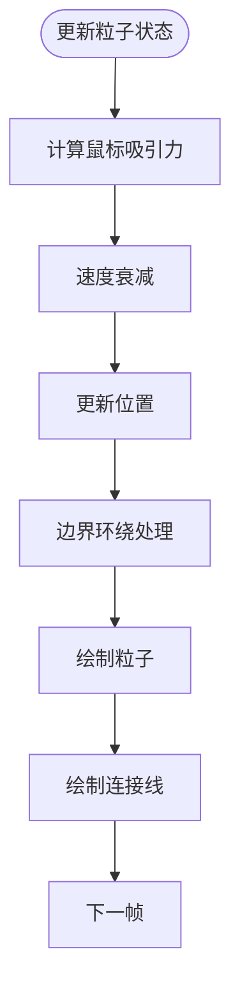

**图表来源**
- [particles.js:34-58](file://js/particles.js#L34-L58)
- [particles.js:152-167](file://js/particles.js#L152-L167)

**章节来源**
- [particles.js:1-199](file://js/particles.js#L1-L199)

### 阿里云语音后端分析

AliyunSpeech类实现了完整的阿里云语音识别API客户端：

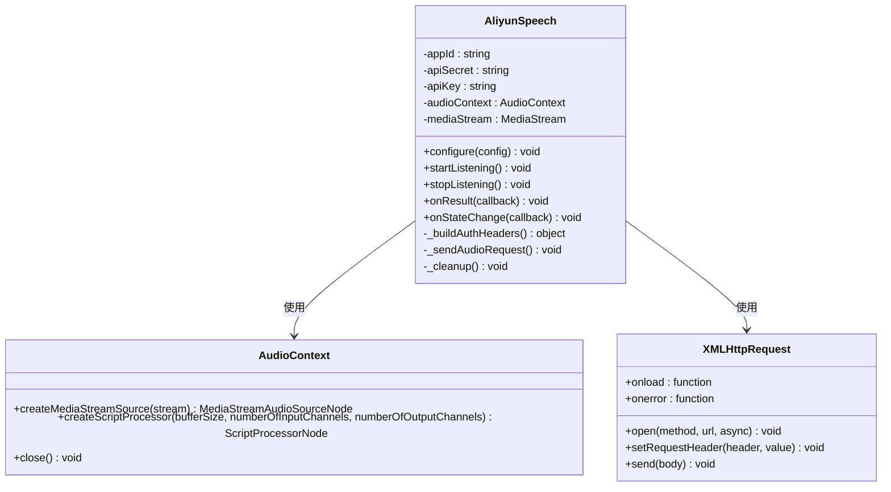

**图表来源**
- [aliyun-speech.js:17-32](file://js/aliyun-speech.js#L17-L32)
- [aliyun-speech.js:87-105](file://js/aliyun-speech.js#L87-L105)

#### HTTP API通信流程

阿里云语音识别的HTTP API通信遵循严格的认证和请求规范：

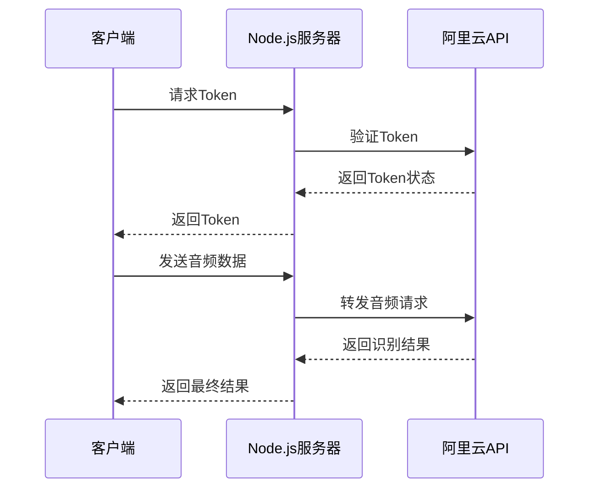

**图表来源**
- [aliyun-speech.js:176-207](file://js/aliyun-speech.js#L176-L207)
- [aliyun-speech.js:313-341](file://js/aliyun-speech.js#L313-L341)

**章节来源**
- [aliyun-speech.js:1-452](file://js/aliyun-speech.js#L1-L452)

### Node.js服务器端分析

Server类实现了完整的Node.js服务器端架构，提供Token管理和API路由功能：

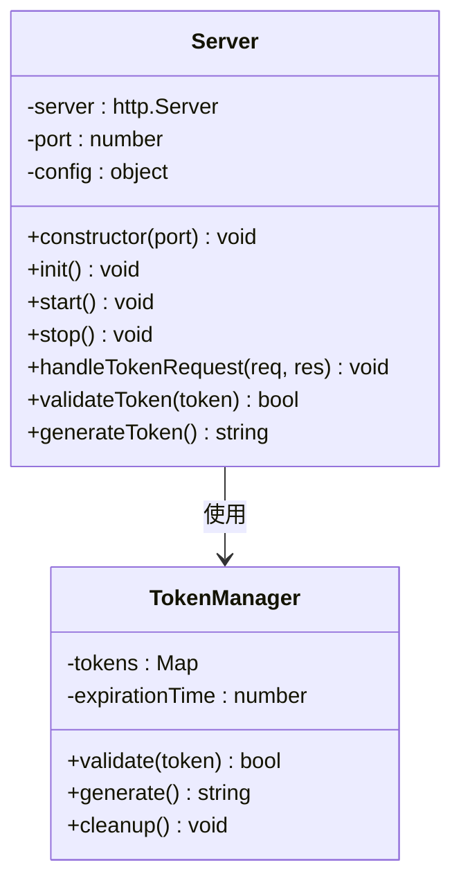

**图表来源**
- [server.js:1-200](file://server.js#L1-L200)

#### Token管理机制

服务器端实现了完整的Token管理机制，确保语音识别服务的安全性：

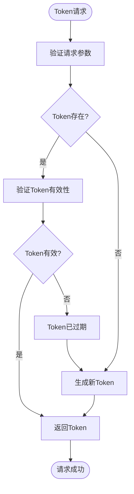

**图表来源**
- [server.js:150-200](file://server.js#L150-L200)
- [token.php:1-100](file://api/token.php#L1-L100)

**章节来源**
- [server.js:1-200](file://server.js#L1-L200)
- [token.php:1-100](file://api/token.php#L1-L100)

## 依赖关系分析

系统采用了清晰的依赖层次结构，实现了良好的模块解耦和安全的Token管理：

```mermaid
graph TB
subgraph "外部依赖"
WEB_API[Web Speech API]
HTTP_CLIENT[HTTP Client]
WEBSOCKET[WebSocket API]
AUDIOCONTEXT[AudioContext API]
LOCALSTORAGE[localStorage API]
NODE_MODULES[Node.js模块]
END
subgraph "内部模块依赖"
APP[App] --> SPEECH[SpeechRecognition]
APP --> PARTICLES[ParticleSystem]
SPEECH --> ALIYUN[AliyunSpeech]
SPEECH --> XFYUN[XfyunSpeech]
SPEECH --> WEB_API
ALIYUN --> HTTP_CLIENT
XFYUN --> WEBSOCKET
ALIYUN --> AUDIOCONTEXT
APP --> LOCALSTORAGE
SERVER[Node.js服务器] --> NODE_MODULES
SERVER --> TOKEN[Token管理]
ALIYUN --> SERVER
END
WEB_API -.-> WEB_API
HTTP_CLIENT -.-> HTTP_CLIENT
WEBSOCKET -.-> WEBSOCKET
AUDIOCONTEXT -.-> AUDIOCONTEXT
```

**图表来源**
- [app.js:8-9](file://js/app.js#L8-L9)
- [speech.js:1-371](file://js/speech.js#L1-L371)
- [aliyun-speech.js:87-91](file://js/aliyun-speech.js#L87-L91)
- [server.js:1-200](file://server.js#L1-L200)

### 模块间接口契约

每个模块都定义了明确的接口契约，确保模块间的松耦合：

| 模块 | 主要接口 | 事件回调 | 存储接口 |
|------|----------|----------|----------|
| App | init(), startListening(), stopListening() | onResult(), onStateChange() | localStorage |
| SpeechRecognition | init(), startListening(), stopListening() | onResult(), onStateChange() | localStorage |
| ParticleSystem | init(), start(), stop() | 无 | 无 |
| AliyunSpeech | configure(), startListening(), stopListening() | onResult(), onStateChange() | 无 |
| XfyunSpeech | configure(), startListening(), stopListening() | onResult(), onStateChange() | 无 |
| Server | init(), start(), handleTokenRequest() | 无 | 无 |

**章节来源**
- [app.js:1-203](file://js/app.js#L1-L203)
- [speech.js:1-371](file://js/speech.js#L1-L371)
- [particles.js:1-199](file://js/particles.js#L1-L199)
- [aliyun-speech.js:1-452](file://js/aliyun-speech.js#L1-L452)
- [server.js:1-200](file://server.js#L1-L200)

## 性能考虑

### 内存管理优化

系统在多个层面实现了内存管理优化：

1. **音频缓冲区管理**：AliyunSpeech和XfyunSpeech类使用队列管理音频缓冲区，避免内存泄漏
2. **动画帧调度**：ParticleSystem使用requestAnimationFrame优化渲染性能
3. **事件监听器清理**：所有模块都实现了destroy()方法清理事件监听器
4. **服务器端连接池**：Node.js服务器端实现了连接池管理，减少连接开销

### 网络性能优化

1. **WebSocket连接池**：避免频繁建立和断开连接
2. **音频帧大小优化**：4096字节的音频帧大小平衡延迟和带宽
3. **自动重连机制**：智能的重连延迟算法减少服务器压力
4. **Token缓存机制**：服务器端实现了Token缓存，减少重复验证开销

### 用户体验优化

1. **渐进式加载**：字体和资源的渐进式加载提升感知性能
2. **状态反馈**：实时的状态指示和视觉反馈
3. **响应式设计**：自适应不同屏幕尺寸的设备
4. **多后端冗余**：提供多种后端选择，确保服务可用性

## 故障排除指南

### 常见问题诊断

| 问题类型 | 症状 | 可能原因 | 解决方案 |
|----------|------|----------|----------|
| 浏览器不支持 | 显示不支持提示 | Web Speech API不可用 | 使用Chrome/Safari等支持浏览器 |
| 权限拒绝 | 显示权限错误 | 用户拒绝麦克风访问 | 在浏览器设置中授权麦克风 |
| 网络错误 | 自动切换到阿里云 | 原生API网络问题 | 配置阿里云API凭证 |
| Token验证失败 | 服务器返回401错误 | Token过期或无效 | 重新获取Token或检查配置 |
| WebSocket连接失败 | 服务连接断开 | 网络不稳定 | 检查网络连接和API配置 |
| 音频质量差 | 识别准确率低 | 麦克风设备问题 | 更换高质量麦克风设备 |

### 调试工具和方法

1. **浏览器开发者工具**：监控WebSocket连接状态
2. **控制台日志**：查看详细的错误信息
3. **网络面板**：分析音频传输和响应时间
4. **性能面板**：监控CPU和内存使用情况
5. **服务器日志**：监控Token管理和API调用

**章节来源**
- [speech.js:273-315](file://js/speech.js#L273-L315)
- [aliyun-speech.js:114-128](file://js/aliyun-speech.js#L114-L128)
- [server.js:150-200](file://server.js#L150-L200)

## 结论

MySpeechRecognition项目展现了现代全栈Web应用架构的最佳实践。通过采用模块化设计、事件驱动架构、状态管理模式和安全的Token管理，系统实现了高度的可维护性、扩展性和安全性。

### 架构优势

1. **模块化设计**：清晰的职责分离使得每个模块都可以独立开发和测试
2. **事件驱动架构**：松耦合的设计提高了系统的灵活性和可扩展性
3. **状态管理模式**：完整的状态机实现确保了系统的稳定性和可靠性
4. **多后端支持**：智能的后端切换机制提供了更好的用户体验
5. **安全的Token管理**：服务器端Token管理确保了API调用的安全性
6. **全栈架构**：前后端分离的设计提供了更好的可维护性

### 技术决策总结

1. **全栈架构**：平衡了前端用户体验和服务器端安全性的需求
2. **双后端架构**：平衡了全球用户的使用需求和国内用户的网络环境
3. **模块化文件组织**：便于团队协作和代码维护
4. **事件驱动通信**：简化了模块间的交互复杂度
5. **Token安全机制**：确保了语音识别服务的安全性
6. **渐进式增强**：提供了丰富的视觉效果而不影响核心功能

### 未来改进方向

1. **增加更多语音识别后端**：如百度语音、腾讯云语音等
2. **实现离线语音识别**：减少对网络的依赖
3. **增强错误处理机制**：提供更友好的错误恢复体验
4. **优化移动端性能**：针对移动设备进行专门的性能优化
5. **实现负载均衡**：支持多服务器部署和扩展
6. **增强安全机制**：实现更完善的API安全防护

这个项目为构建高性能、高可用、安全可靠的全栈Web语音识别应用提供了优秀的参考架构和实现范例。