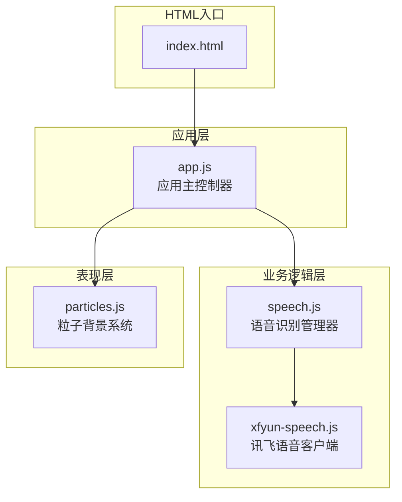
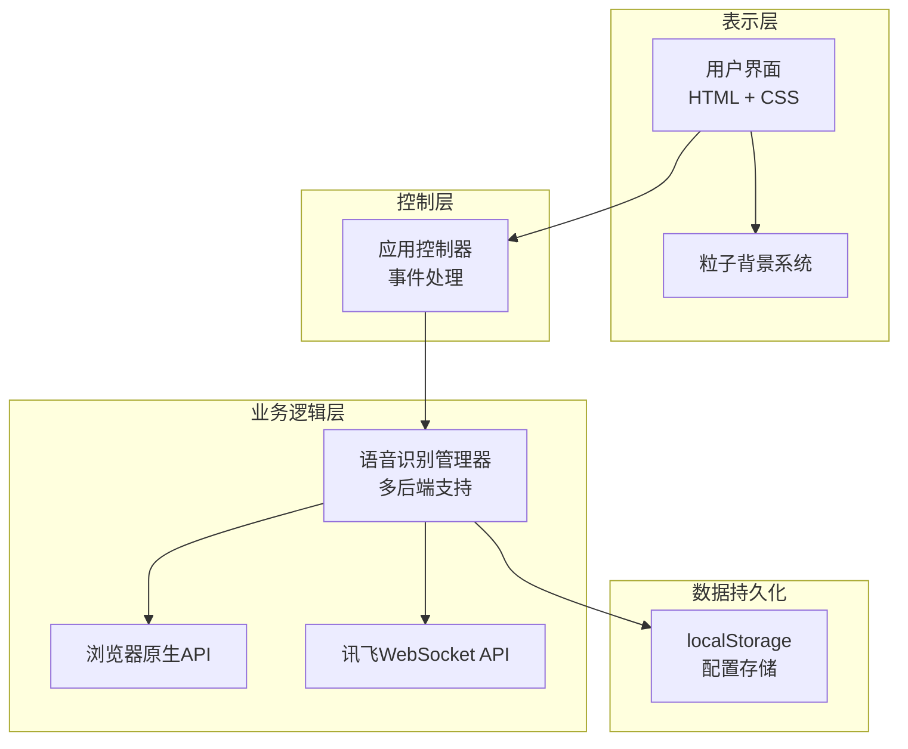
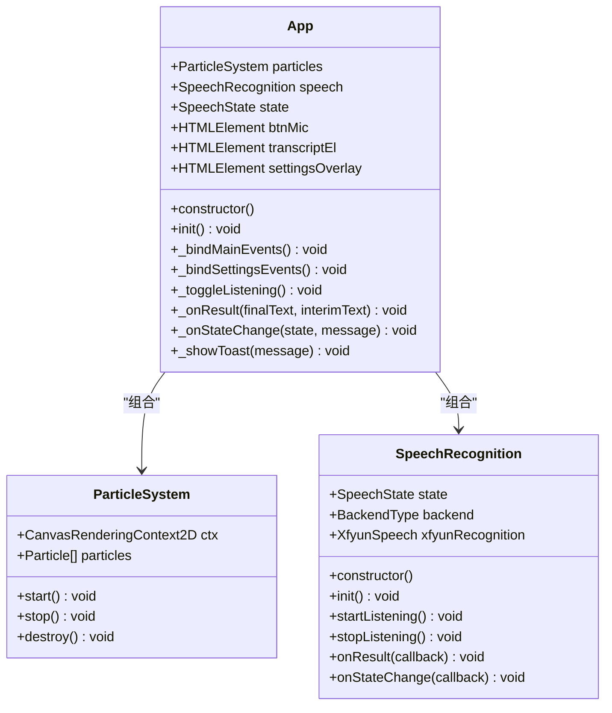
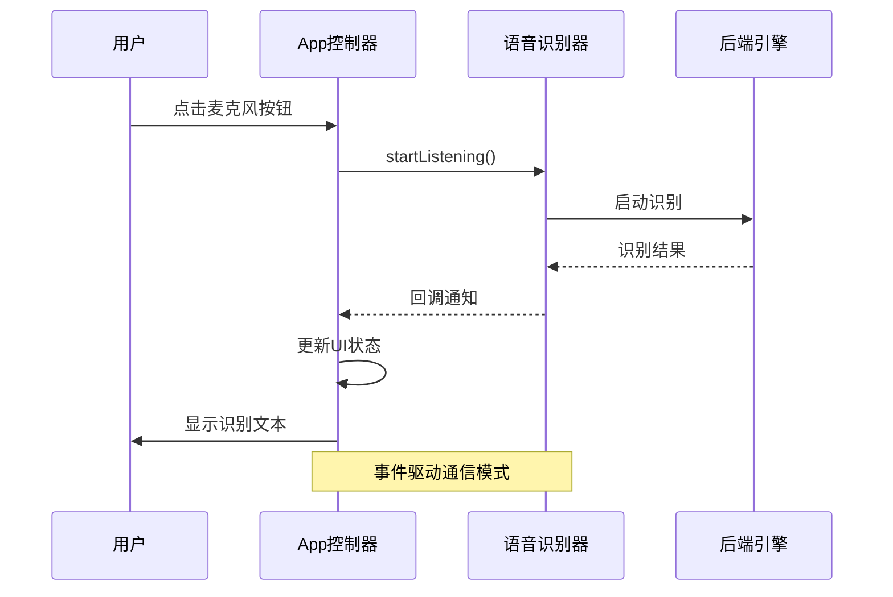
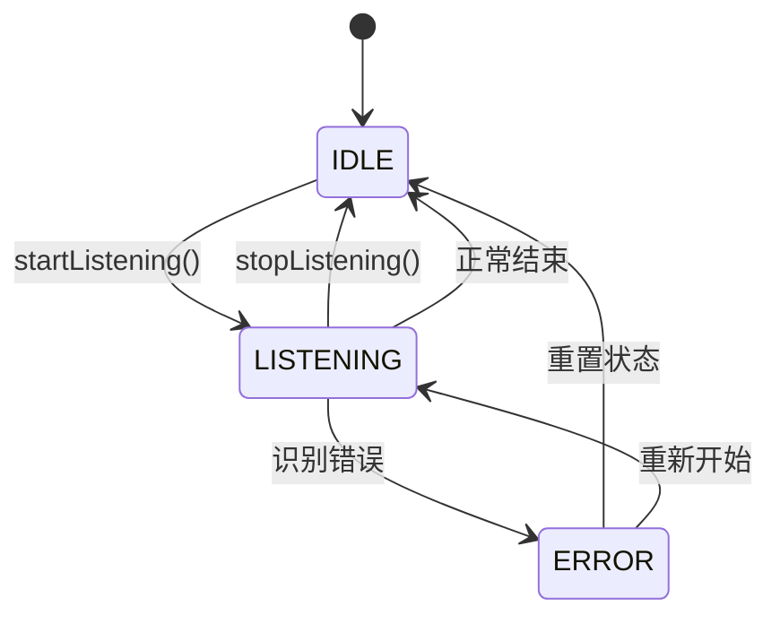
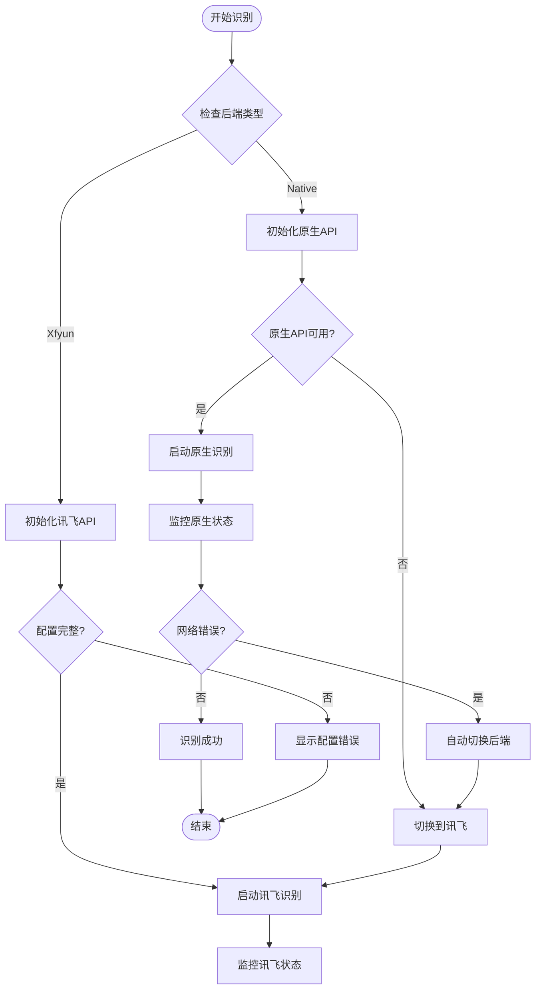
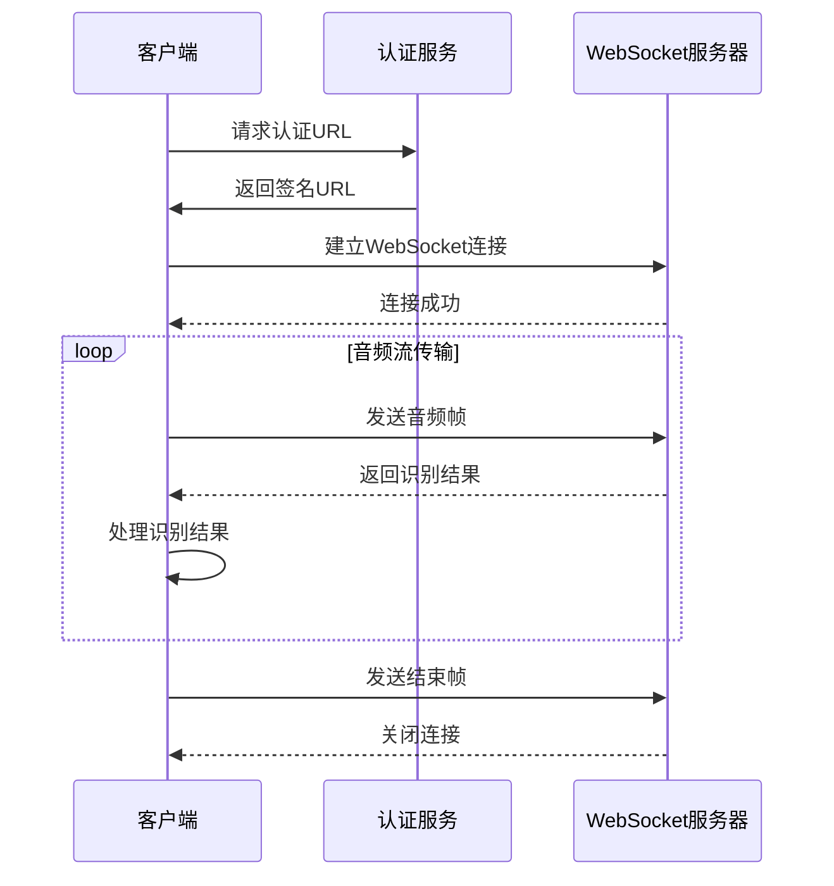
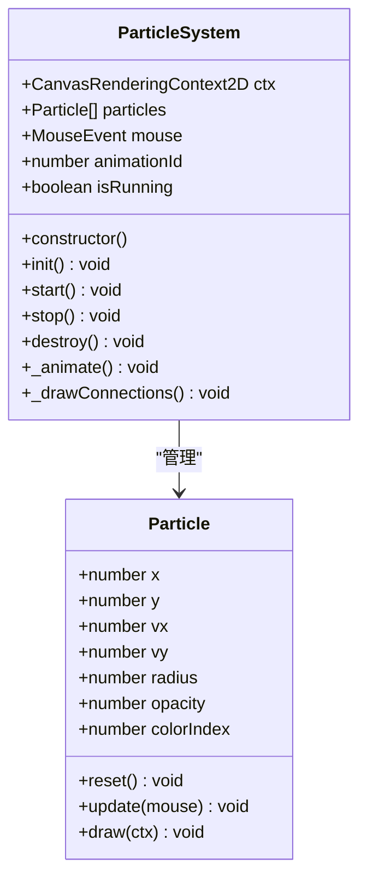
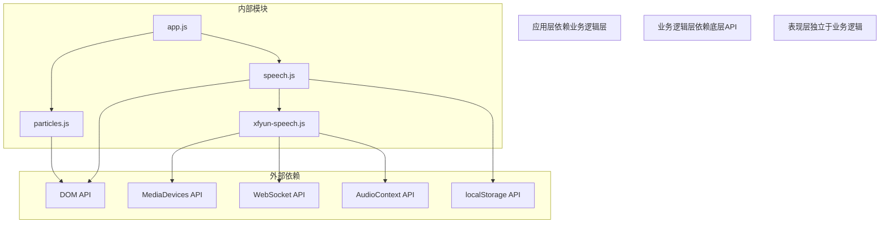

# 模块化设计原则

<cite>
**本文档引用的文件**
- [app.js](file://js/app.js)
- [speech.js](file://js/speech.js)
- [xfyun-speech.js](file://js/xfyun-speech.js)
- [particles.js](file://js/particles.js)
- [index.html](file://index.html)
</cite>

## 目录
1. [引言](#引言)
2. [项目结构](#项目结构)
3. [核心组件](#核心组件)
4. [架构概览](#架构概览)
5. [详细组件分析](#详细组件分析)
6. [依赖关系分析](#依赖关系分析)
7. [性能考虑](#性能考虑)
8. [故障排除指南](#故障排除指南)
9. [结论](#结论)

## 引言

MySpeechRecognition项目采用现代ES6+模块系统实现了高度模块化的前端架构。该项目展示了如何通过合理的模块设计实现代码复用、维护性和可扩展性。项目包含三个主要模块：应用主控制器、语音识别管理器和粒子背景系统，每个模块都遵循单一职责原则，通过清晰的接口进行交互。

## 项目结构

项目采用基于功能的模块组织方式，每个JavaScript文件专注于特定的功能领域：



**图表来源**
- [index.html:140](file://index.html#L140)
- [app.js:9-10](file://js/app.js#L9-L10)
- [speech.js:8](file://js/speech.js#L8)
- [xfyun-speech.js:17](file://js/xfyun-speech.js#L17)
- [particles.js:69](file://js/particles.js#L69)

**章节来源**
- [index.html:1-143](file://index.html#L1-L143)
- [app.js:1-292](file://js/app.js#L1-L292)

## 核心组件

### ES6+模块系统最佳实践

项目中的模块系统展现了ES6+标准的正确使用方式：

#### 导入语句规范
- **具名导入**：用于导入常量、类和函数
- **默认导入**：用于导入单个主要类
- **相对路径**：使用相对路径确保模块定位准确

#### 导出语句规范
- **命名导出**：用于导出多个常量和类
- **默认导出**：用于导出主要类
- **混合导出**：在同一模块中同时使用命名导出和默认导出

**章节来源**
- [app.js:9-10](file://js/app.js#L9-L10)
- [speech.js:10-19](file://js/speech.js#L10-L19)
- [xfyun-speech.js:17](file://js/xfyun-speech.js#L17)

## 架构概览

项目采用分层架构模式，实现了清晰的关注点分离：



**图表来源**
- [app.js:12-41](file://js/app.js#L12-L41)
- [speech.js:21-39](file://js/speech.js#L21-L39)
- [xfyun-speech.js:17-32](file://js/xfyun-speech.js#L17-L32)

## 详细组件分析

### 应用主控制器模块

应用主控制器作为整个应用的协调者，负责模块间的通信和状态管理。

#### 类设计模式


**图表来源**
- [app.js:12-287](file://js/app.js#L12-L287)
- [particles.js:69-198](file://js/particles.js#L69-L198)
- [speech.js:21-370](file://js/speech.js#L21-L370)

#### 事件驱动架构
应用控制器采用事件驱动模式，通过回调函数实现松耦合通信：



**图表来源**
- [app.js:82-91](file://js/app.js#L82-L91)
- [speech.js:106-115](file://js/speech.js#L106-L115)

**章节来源**
- [app.js:12-287](file://js/app.js#L12-L287)

### 语音识别管理器模块

语音识别管理器实现了多后端支持的统一接口，展现了良好的抽象设计。

#### 状态管理模式


**图表来源**
- [speech.js:10-14](file://js/speech.js#L10-L14)
- [speech.js:329-336](file://js/speech.js#L329-L336)

#### 后端切换机制
语音识别器支持动态后端切换，体现了模块化的可扩展性：



**图表来源**
- [speech.js:154-172](file://js/speech.js#L154-L172)
- [speech.js:282-302](file://js/speech.js#L282-L302)

**章节来源**
- [speech.js:21-370](file://js/speech.js#L21-L370)

### 讯飞语音客户端模块

讯飞语音客户端实现了完整的WebSocket通信协议，展现了复杂异步操作的模块化处理。

#### WebSocket通信流程


**图表来源**
- [xfyun-speech.js:176-207](file://js/xfyun-speech.js#L176-L207)
- [xfyun-speech.js:265-293](file://js/xfyun-speech.js#L265-L293)

**章节来源**
- [xfyun-speech.js:17-403](file://js/xfyun-speech.js#L17-L403)

### 粒子背景系统模块

粒子背景系统展示了独立功能模块的设计原则，具有完整的生命周期管理。

#### 粒子系统架构


**图表来源**
- [particles.js:18-67](file://js/particles.js#L18-L67)
- [particles.js:69-198](file://js/particles.js#L69-L198)

**章节来源**
- [particles.js:1-199](file://js/particles.js#L1-L199)

## 依赖关系分析

项目中的模块依赖关系清晰明确，遵循了依赖倒置原则：



**图表来源**
- [app.js:9-10](file://js/app.js#L9-L10)
- [speech.js:8](file://js/speech.js#L8)
- [xfyun-speech.js:77-105](file://js/xfyun-speech.js#L77-L105)

**章节来源**
- [app.js:1-292](file://js/app.js#L1-L292)
- [speech.js:1-371](file://js/speech.js#L1-L371)
- [xfyun-speech.js:1-404](file://js/xfyun-speech.js#L1-L404)
- [particles.js:1-199](file://js/particles.js#L1-L199)

## 性能考虑

### 模块化对性能的影响

1. **按需加载**：ES6模块支持静态分析，可以实现按需加载优化
2. **代码分割**：模块边界清晰便于实现代码分割
3. **缓存友好**：独立模块便于浏览器缓存
4. **内存管理**：模块化设计便于资源清理和垃圾回收

### 事件驱动的性能优化

```mermaid
flowchart TD
Event[用户事件] --> Debounce["防抖处理"]
Debounce --> Throttle["节流处理"]
Throttle --> Callback["回调执行"]
Callback --> UpdateUI["UI更新"]
subgraph "性能优化策略"
Debounce --> "减少重复计算"
Throttle --> "限制更新频率"
UpdateUI --> "批量DOM操作"
end
```

## 故障排除指南

### 常见模块化问题

1. **循环依赖问题**
   - 检查模块导入顺序
   - 使用工厂函数或延迟初始化
   - 重构共享依赖到独立模块

2. **作用域污染**
   - 使用立即执行函数表达式(IIFE)
   - 采用模块封装
   - 避免全局变量

3. **内存泄漏**
   - 及时清理事件监听器
   - 在模块销毁时释放资源
   - 使用弱引用避免循环引用

**章节来源**
- [speech.js:349-370](file://js/speech.js#L349-L370)
- [xfyun-speech.js:352-376](file://js/xfyun-speech.js#L352-L376)
- [particles.js:191-198](file://js/particles.js#L191-L198)

## 结论

MySpeechRecognition项目展示了ES6+模块系统的最佳实践，通过合理的模块设计实现了：

1. **高内聚低耦合**：每个模块职责明确，接口清晰
2. **可维护性**：模块边界清晰，便于单独测试和修改
3. **可扩展性**：新的后端或功能可以通过添加新模块实现
4. **可测试性**：独立模块便于单元测试和集成测试
5. **性能优化**：模块化设计支持按需加载和代码分割

这种模块化设计为类似项目提供了优秀的参考模板，特别是在需要处理复杂异步操作和多后端支持的场景中。