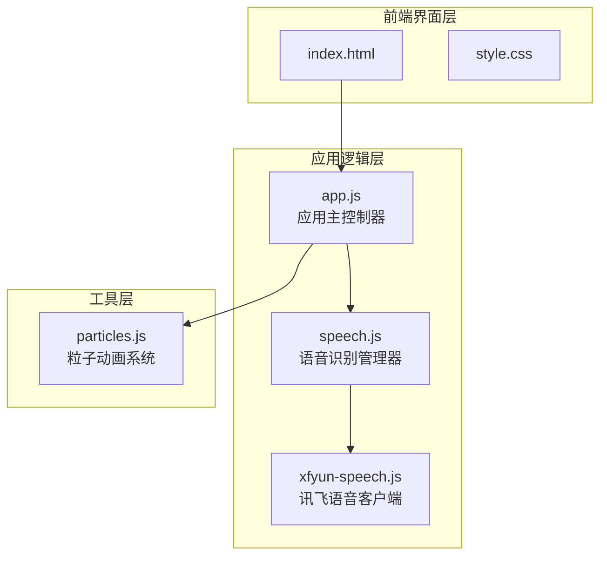
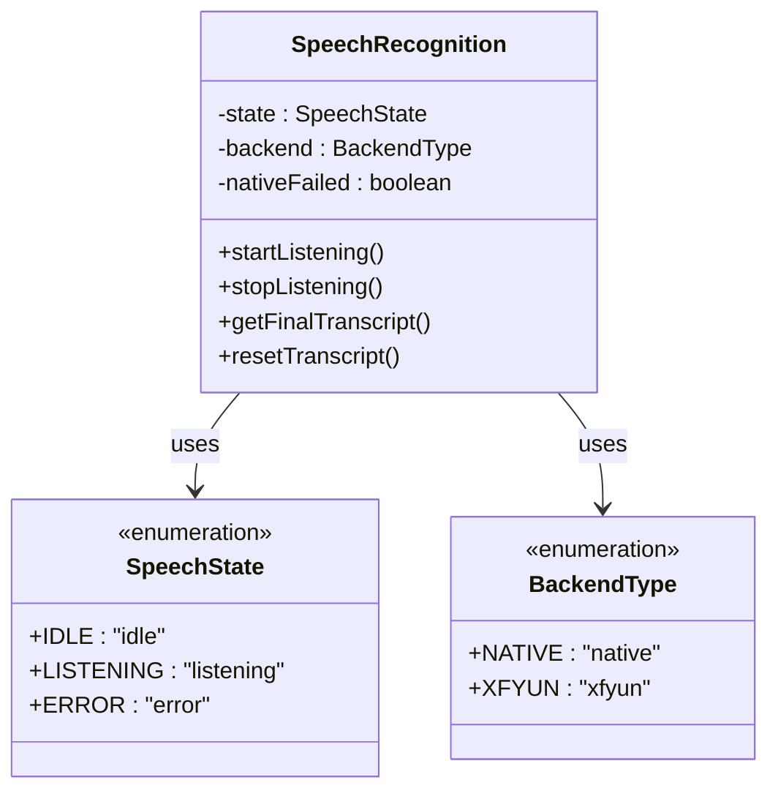
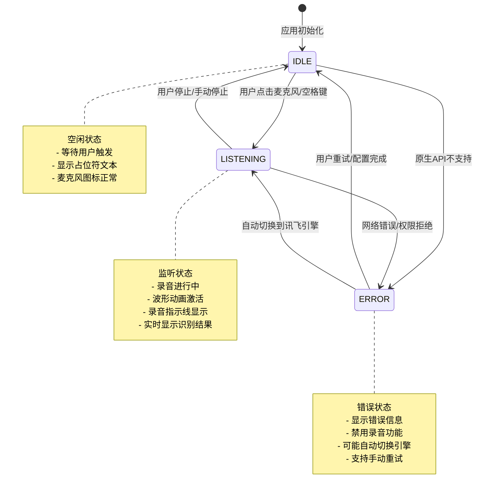
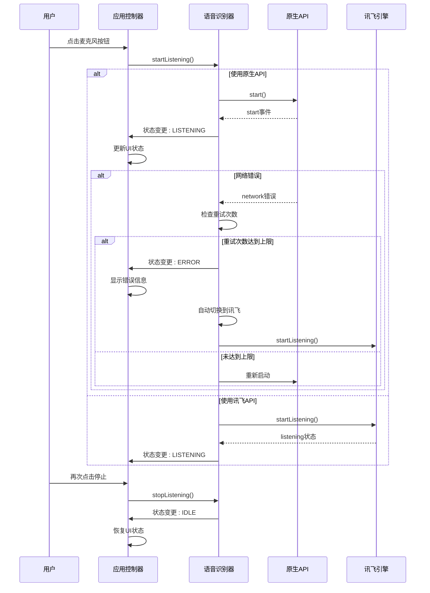
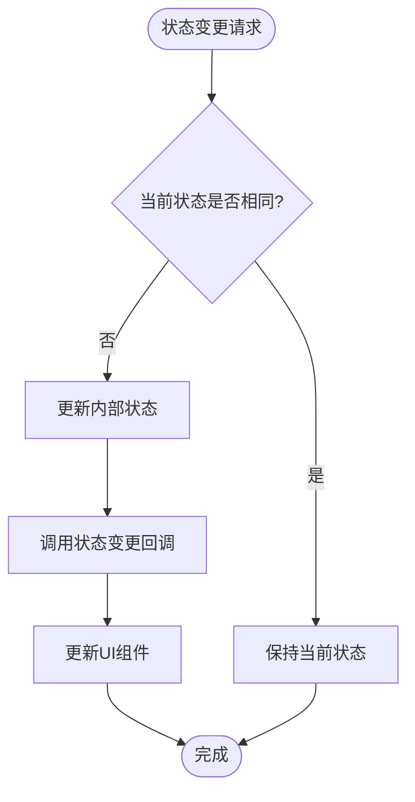
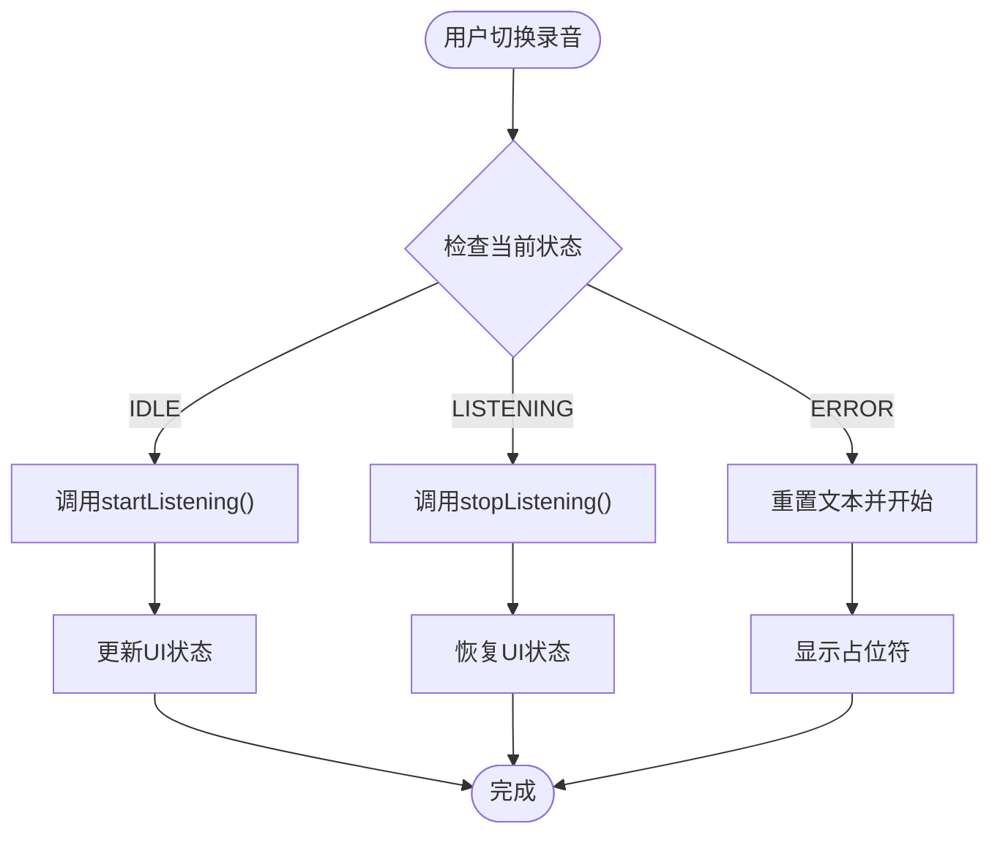
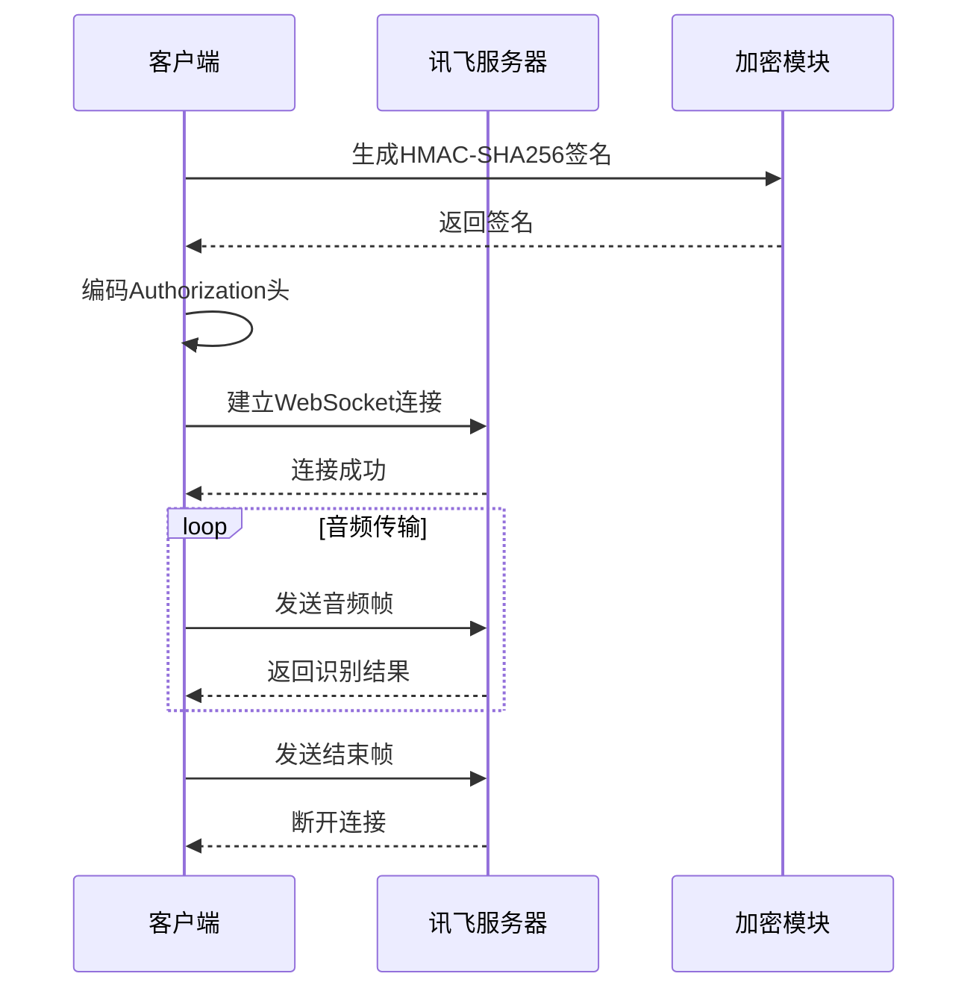
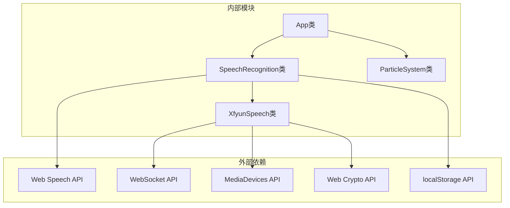
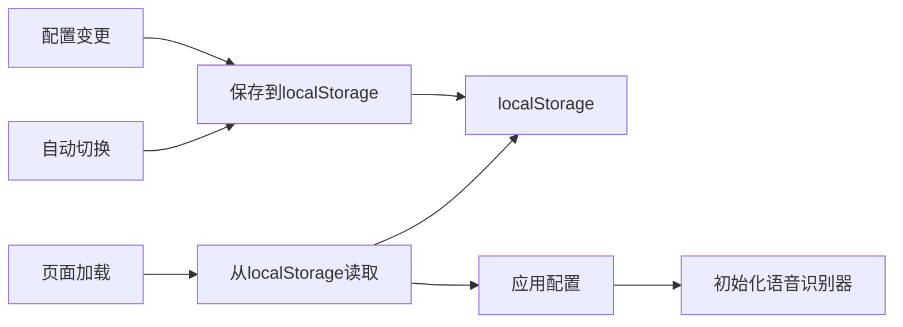

# 状态管理模式

<cite>
**本文档引用的文件**
- [index.html](file://index.html)
- [app.js](file://js/app.js)
- [speech.js](file://js/speech.js)
- [xfyun-speech.js](file://js/xfyun-speech.js)
- [README.md](file://README.md)
</cite>

## 目录
1. [引言](#引言)
2. [项目结构](#项目结构)
3. [核心组件](#核心组件)
4. [架构概览](#架构概览)
5. [详细组件分析](#详细组件分析)
6. [依赖关系分析](#依赖关系分析)
7. [性能考虑](#性能考虑)
8. [故障排除指南](#故障排除指南)
9. [结论](#结论)

## 引言

MySpeechRecognition项目采用状态机模式来管理语音识别应用的生命周期和状态转换。该模式通过明确定义的状态集合和状态转换规则，确保应用在不同识别场景下的行为一致性和可预测性。

项目的核心状态机包含三个主要状态：
- **IDLE（空闲）**：应用初始状态，等待用户触发识别
- **LISTENING（监听中）**：正在进行语音识别的状态
- **ERROR（错误）**：发生异常或错误的状态

这种状态管理模式为用户提供了清晰的视觉反馈和一致的操作体验。

## 项目结构

项目采用模块化的JavaScript架构，主要文件组织如下：

**图表来源**
- [index.html:1-143](file://index.html#L1-L143)
- [app.js:1-296](file://js/app.js#L1-L296)
- [speech.js:1-383](file://js/speech.js#L1-L383)
- [xfyun-speech.js:1-407](file://js/xfyun-speech.js#L1-L407)

**章节来源**
- [index.html:1-143](file://index.html#L1-L143)
- [app.js:1-296](file://js/app.js#L1-L296)
- [speech.js:1-383](file://js/speech.js#L1-L383)

## 核心组件

### 状态枚举定义

项目定义了两个核心的枚举常量来管理状态：

**图表来源**
- [speech.js:10-19](file://js/speech.js#L10-L19)
- [speech.js:21-39](file://js/speech.js#L21-L39)

### 状态管理策略

应用采用集中式状态管理模式，通过以下策略确保状态的一致性：

1. **单一真相源**：所有状态变更都通过`_setState`方法进行
2. **状态守卫**：在状态转换前进行条件检查
3. **回调通知**：状态变更时通知UI组件更新
4. **持久化存储**：关键配置状态保存到localStorage

**章节来源**
- [speech.js:341-348](file://js/speech.js#L341-L348)
- [speech.js:350-381](file://js/speech.js#L350-L381)

## 架构概览

### 状态机架构图

**图表来源**
- [speech.js:10-14](file://js/speech.js#L10-L14)
- [speech.js:21-39](file://js/speech.js#L21-L39)
- [app.js:210-247](file://js/app.js#L210-L247)

### 状态转换流程

**图表来源**
- [app.js:82-91](file://js/app.js#L82-L91)
- [speech.js:154-184](file://js/speech.js#L154-L184)
- [speech.js:285-327](file://js/speech.js#L285-L327)

**章节来源**
- [app.js:82-91](file://js/app.js#L82-L91)
- [speech.js:154-184](file://js/speech.js#L154-L184)

## 详细组件分析

### 语音识别管理器（SpeechRecognition）

SpeechRecognition类是整个状态管理系统的核心组件，负责：

#### 状态管理实现

**图表来源**
- [speech.js:341-348](file://js/speech.js#L341-L348)

#### 状态转换规则

| 当前状态 | 触发条件 | 目标状态 | 行为描述 |
|---------|---------|---------|----------|
| IDLE | startListening() | LISTENING | 开始语音识别 |
| IDLE | 原生API不支持 | ERROR | 显示不支持信息 |
| LISTENING | stopListening() | IDLE | 停止语音识别 |
| LISTENING | 网络错误 | ERROR | 显示错误信息 |
| ERROR | 配置完成 | IDLE | 允许重新尝试 |
| ERROR | 用户重试 | LISTENING | 自动切换引擎 |

**章节来源**
- [speech.js:341-348](file://js/speech.js#L341-L348)
- [speech.js:285-327](file://js/speech.js#L285-L327)

### 应用控制器（App）

应用控制器负责协调状态管理和UI更新：

#### 状态守卫实现

**图表来源**
- [app.js:82-91](file://js/app.js#L82-L91)

#### UI状态同步

应用控制器维护多个DOM元素的状态同步：

| 状态 | 麦克风按钮 | 波形动画 | 录音指示线 | 状态文本 |
|------|-----------|---------|-----------|---------|
| IDLE | 移除监听类 | 移除激活类 | 移除激活类 | "点击开始" |
| LISTENING | 添加监听类 | 添加激活类 | 添加激活类 | "正在聆听..." |
| ERROR | 移除监听类 | 移除激活类 | 移除激活类 | 错误信息 |

**章节来源**
- [app.js:210-247](file://js/app.js#L210-L247)

### 讯飞语音客户端（XfyunSpeech）

讯飞语音客户端实现了完整的WebSocket通信协议：

#### 认证流程

**图表来源**
- [xfyun-speech.js:176-207](file://js/xfyun-speech.js#L176-L207)
- [xfyun-speech.js:212-225](file://js/xfyun-speech.js#L212-L225)

**章节来源**
- [xfyun-speech.js:17-407](file://js/xfyun-speech.js#L17-L407)

## 依赖关系分析

### 组件依赖图

**图表来源**
- [app.js:9-10](file://js/app.js#L9-L10)
- [speech.js:8-35](file://js/speech.js#L8-L35)
- [xfyun-speech.js:13-15](file://js/xfyun-speech.js#L13-L15)

### 状态持久化机制

应用实现了完整的状态持久化策略：

**图表来源**
- [speech.js:350-381](file://js/speech.js#L350-L381)

**章节来源**
- [speech.js:350-381](file://js/speech.js#L350-L381)

## 性能考虑

### 状态转换优化

1. **状态守卫优化**：避免不必要的状态变更
2. **回调去重**：相同状态不重复触发回调
3. **资源清理**：状态变更时及时释放资源

### 内存管理

- 音频缓冲区大小控制（4096字节）
- WebSocket连接池管理
- 定时器清理机制

### 网络优化

- 自适应重连延迟（最大2秒）
- 网络错误自动切换
- 配置缓存机制

## 故障排除指南

### 常见状态问题

| 问题现象 | 可能原因 | 解决方案 |
|---------|---------|---------|
| 状态卡在IDLE | 权限未授权 | 检查浏览器权限设置 |
| 状态频繁切换 | 网络不稳定 | 切换到讯飞引擎 |
| 状态停留在ERROR | 配置无效 | 检查API凭证 |
| UI不更新 | 回调未注册 | 确认事件绑定 |

### 状态调试技巧

1. **启用详细日志**：在开发环境中输出状态变更日志
2. **监控资源使用**：观察音频流和WebSocket连接状态
3. **测试边界条件**：模拟各种错误场景验证状态恢复

**章节来源**
- [speech.js:285-327](file://js/speech.js#L285-L327)
- [app.js:210-247](file://js/app.js#L210-L247)

## 结论

MySpeechRecognition项目的状态管理模式体现了现代前端应用的最佳实践：

### 设计优势

1. **明确的状态定义**：清晰的枚举常量确保代码可读性
2. **严格的转换规则**：防止非法状态转换
3. **完善的错误处理**：提供优雅的降级机制
4. **一致的用户体验**：通过UI状态同步确保交互一致性

### 技术亮点

- **多后端支持**：原生API与讯飞引擎的无缝切换
- **智能错误恢复**：网络错误时的自动故障转移
- **状态持久化**：配置状态的本地存储机制
- **响应式UI更新**：状态变更驱动的界面更新

### 改进建议

1. **状态历史记录**：添加状态变更日志便于调试
2. **状态机可视化**：提供状态转换图的可视化工具
3. **单元测试覆盖**：为关键状态转换编写测试用例
4. **性能监控**：添加状态转换耗时统计

这个状态管理模式为类似的应用开发提供了优秀的参考模板，通过明确的状态定义和严格的转换规则，确保了应用的稳定性和用户体验的一致性。