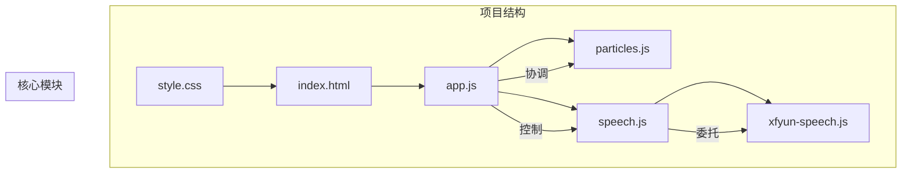
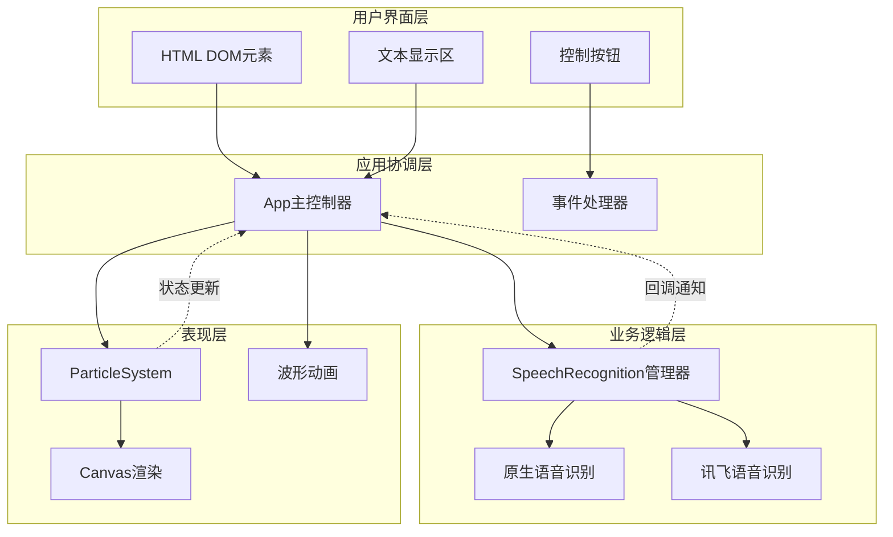
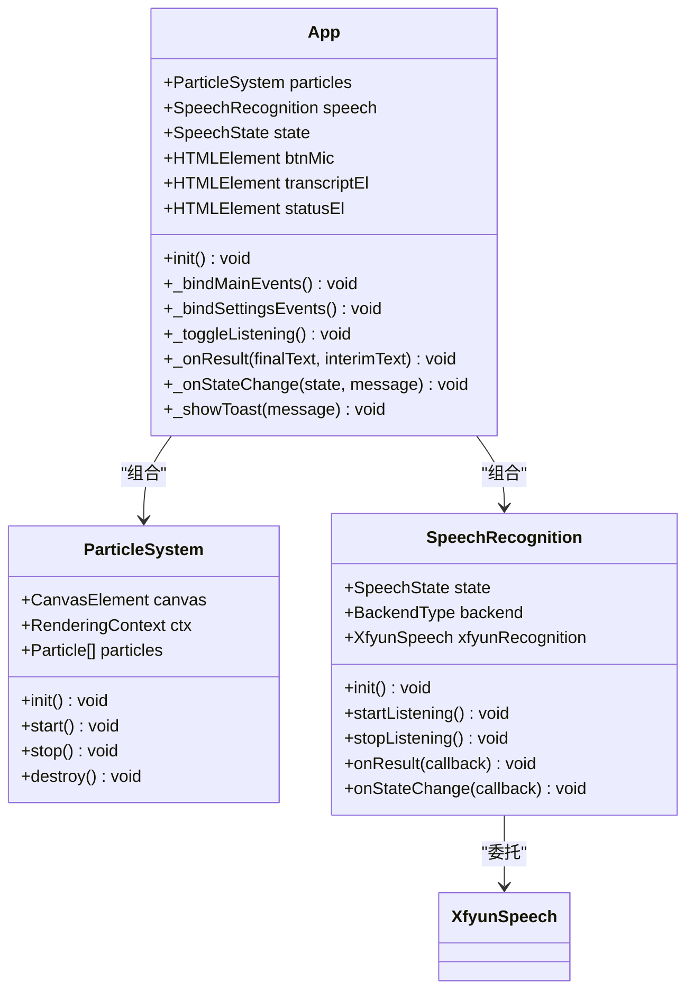
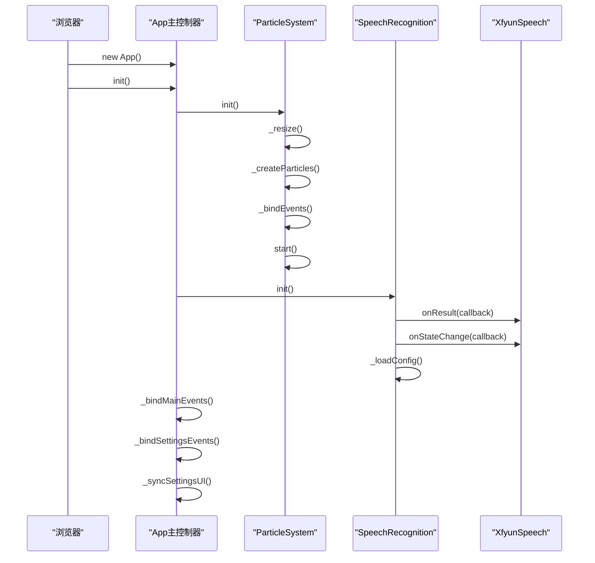
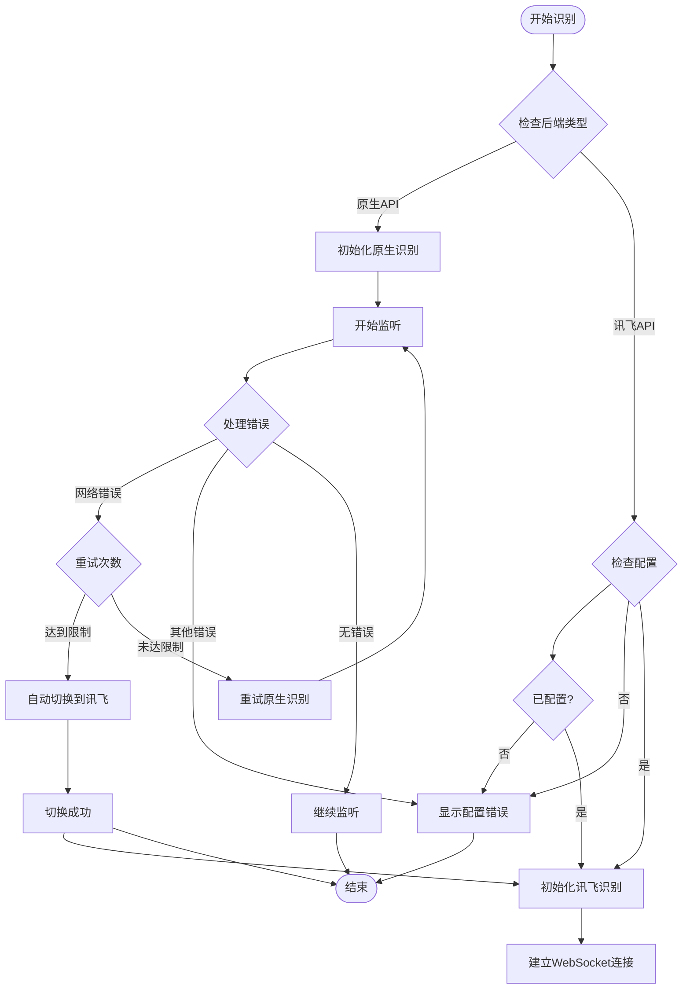
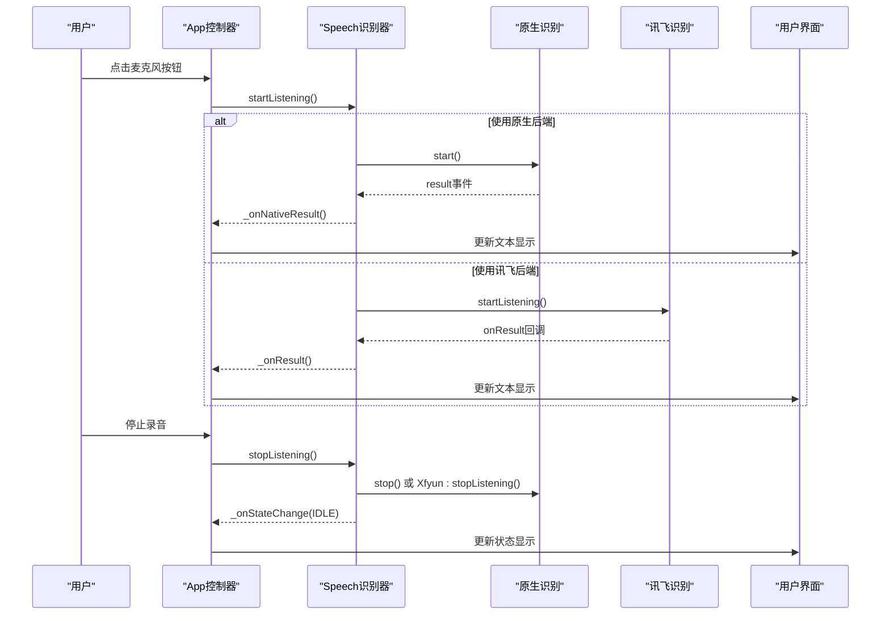
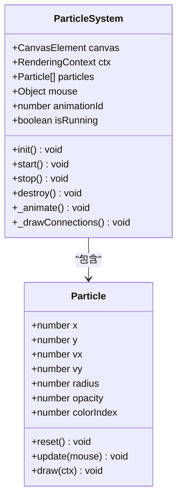
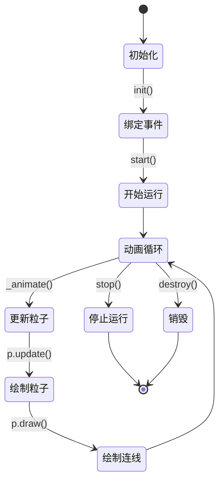
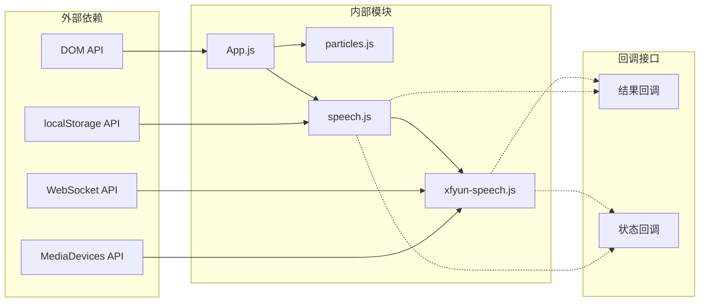

# 组件交互机制

<cite>
**本文档引用的文件**
- [index.html](file://index.html)
- [app.js](file://js/app.js)
- [particles.js](file://js/particles.js)
- [speech.js](file://js/speech.js)
- [xfyun-speech.js](file://js/xfyun-speech.js)
- [style.css](file://css/style.css)
</cite>

## 目录
1. [简介](#简介)
2. [项目结构](#项目结构)
3. [核心组件](#核心组件)
4. [架构概览](#架构概览)
5. [详细组件分析](#详细组件分析)
6. [依赖关系分析](#依赖关系分析)
7. [性能考虑](#性能考虑)
8. [故障排除指南](#故障排除指南)
9. [结论](#结论)

## 简介

MySpeechRecognition是一个基于Web的语音识别应用，采用模块化架构设计，支持多种语音识别后端。该应用的核心特点是通过App主控制器协调Particle系统和SpeechRecognition模块，实现流畅的用户体验和灵活的组件交互机制。

该系统主要包含三个核心组件：
- **App主控制器**：负责整体协调和状态管理
- **ParticleSystem粒子系统**：提供视觉背景效果
- **SpeechRecognition语音识别模块**：支持多后端语音识别

## 项目结构

项目采用清晰的模块化组织结构，每个功能模块独立封装，通过ES6模块系统进行导入导出。

**图表来源**
- [index.html:1-143](file://index.html#L1-L143)
- [app.js:1-292](file://js/app.js#L1-L292)
- [particles.js:1-199](file://js/particles.js#L1-L199)
- [speech.js:1-371](file://js/speech.js#L1-L371)
- [xfyun-speech.js:1-404](file://js/xfyun-speech.js#L1-L404)

**章节来源**
- [index.html:1-143](file://index.html#L1-L143)
- [app.js:1-292](file://js/app.js#L1-L292)

## 核心组件

### App主控制器
App类作为整个应用的协调中心，负责：
- 初始化和管理其他组件
- 处理用户界面事件
- 协调组件间的通信
- 管理应用状态和生命周期

### ParticleSystem粒子系统
提供动态背景效果，包含：
- 粒子生成和动画
- 鼠标交互效果
- 连接线绘制
- 性能优化的渲染循环

### SpeechRecognition语音识别模块
支持双后端架构：
- **原生Web Speech API**：浏览器内置识别
- **讯飞WebSocket API**：适用于国内网络环境
- 自动错误检测和后端切换
- 配置持久化存储

**章节来源**
- [app.js:12-41](file://js/app.js#L12-L41)
- [particles.js:69-82](file://js/particles.js#L69-L82)
- [speech.js:21-39](file://js/speech.js#L21-L39)

## 架构概览

系统采用分层架构设计，通过事件驱动的方式实现组件解耦。

**图表来源**
- [app.js:43-65](file://js/app.js#L43-L65)
- [speech.js:51-81](file://js/speech.js#L51-L81)
- [particles.js:84-89](file://js/particles.js#L84-L89)

## 详细组件分析

### App主控制器组件分析

App类实现了完整的应用生命周期管理：

**图表来源**
- [app.js:12-41](file://js/app.js#L12-L41)
- [particles.js:69-82](file://js/particles.js#L69-L82)
- [speech.js:21-39](file://js/speech.js#L21-L39)

#### 组件初始化流程

**图表来源**
- [app.js:43-65](file://js/app.js#L43-L65)
- [speech.js:51-81](file://js/speech.js#L51-L81)
- [particles.js:84-89](file://js/particles.js#L84-L89)

**章节来源**
- [app.js:43-65](file://js/app.js#L43-L65)
- [app.js:12-41](file://js/app.js#L12-L41)

### 语音识别组件交互

语音识别模块实现了智能的后端切换机制：

**图表来源**
- [speech.js:154-172](file://js/speech.js#L154-L172)
- [speech.js:282-302](file://js/speech.js#L282-L302)
- [xfyun-speech.js:67-129](file://js/xfyun-speech.js#L67-L129)

#### 事件驱动的数据流

**图表来源**
- [app.js:82-91](file://js/app.js#L82-L91)
- [speech.js:154-172](file://js/speech.js#L154-L172)
- [speech.js:53-58](file://js/speech.js#L53-L58)

**章节来源**
- [speech.js:154-172](file://js/speech.js#L154-L172)
- [app.js:182-243](file://js/app.js#L182-L243)

### 粒子系统组件分析

ParticleSystem提供了高性能的Canvas动画效果：

**图表来源**
- [particles.js:18-67](file://js/particles.js#L18-L67)
- [particles.js:69-199](file://js/particles.js#L69-L199)

#### 粒子动画生命周期

**图表来源**
- [particles.js:138-167](file://js/particles.js#L138-L167)
- [particles.js:191-199](file://js/particles.js#L191-L199)

**章节来源**
- [particles.js:138-167](file://js/particles.js#L138-L167)
- [particles.js:69-199](file://js/particles.js#L69-L199)

## 依赖关系分析

系统采用松耦合的设计模式，通过接口抽象实现组件间的解耦：

**图表来源**
- [app.js:9-10](file://js/app.js#L9-L10)
- [speech.js:8](file://js/speech.js#L8)
- [xfyun-speech.js:77-84](file://js/xfyun-speech.js#L77-L84)

### 组件解耦策略

系统采用了多种解耦策略：

1. **回调函数模式**：通过onResult和onStateChange实现松耦合通信
2. **事件驱动架构**：组件间通过事件而非直接调用交互
3. **接口抽象**：不同后端实现统一的接口规范
4. **配置分离**：后端配置通过localStorage持久化

**章节来源**
- [speech.js:106-115](file://js/speech.js#L106-L115)
- [speech.js:338-369](file://js/speech.js#L338-L369)

## 性能考虑

### 渲染性能优化

粒子系统采用了多项性能优化技术：

- **requestAnimationFrame**：使用浏览器优化的动画循环
- **边界环绕**：避免粒子重新创建，提高内存效率
- **条件渲染**：仅在可见时执行动画
- **批量操作**：减少DOM操作次数

### 语音识别性能

- **自动重试机制**：原生API网络错误时自动切换后端
- **配置缓存**：本地存储避免重复配置
- **资源清理**：及时释放媒体流和WebSocket连接

## 故障排除指南

### 常见问题及解决方案

1. **麦克风权限问题**
   - 检查浏览器设置中的麦克风权限
   - 确认HTTPS环境下的安全要求
   - 验证设备连接状态

2. **网络连接问题**
   - 检查网络连接稳定性
   - 考虑使用讯飞后端替代原生API
   - 验证API凭证配置正确性

3. **浏览器兼容性**
   - 确认使用支持Web Speech API的浏览器
   - 检查JavaScript模块加载状态
   - 验证Canvas渲染支持

**章节来源**
- [speech.js:273-315](file://js/speech.js#L273-L315)
- [xfyun-speech.js:114-128](file://js/xfyun-speech.js#L114-L128)

## 结论

MySpeechRecognition项目展现了优秀的前端架构设计，通过模块化组件和事件驱动的交互机制，实现了高度解耦和可扩展的应用系统。主要特点包括：

1. **清晰的职责分离**：每个组件都有明确的功能边界
2. **灵活的后端切换**：支持多种语音识别方案
3. **优雅的错误处理**：完善的异常情况处理机制
4. **良好的用户体验**：流畅的动画效果和即时反馈

该架构为类似语音识别应用提供了优秀的参考模板，其组件交互模式和解耦策略值得其他开发者借鉴学习。