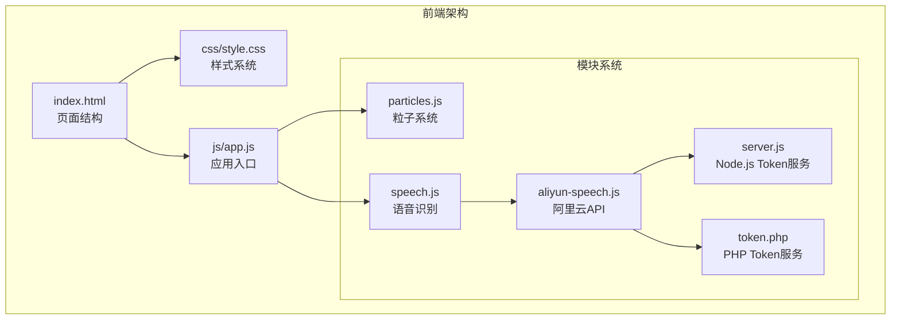
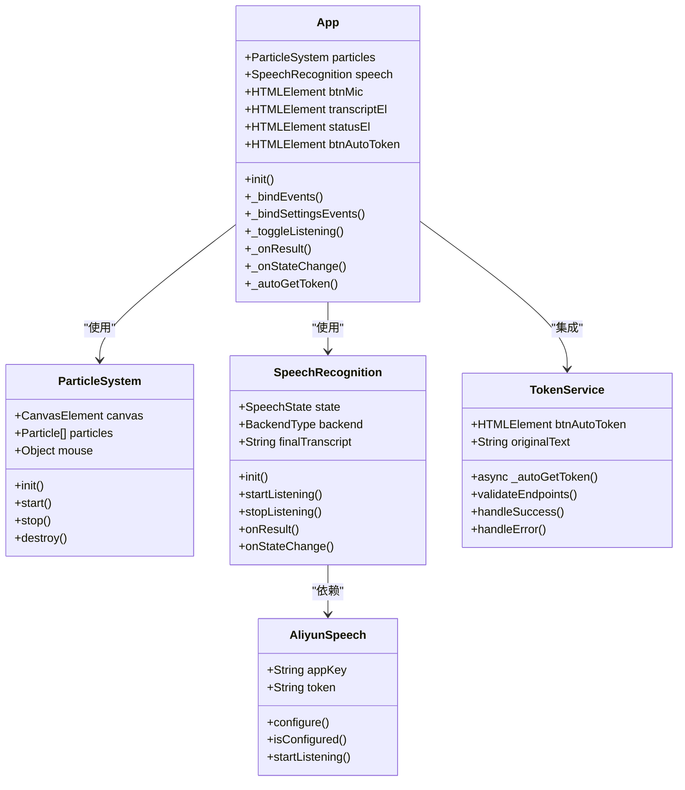
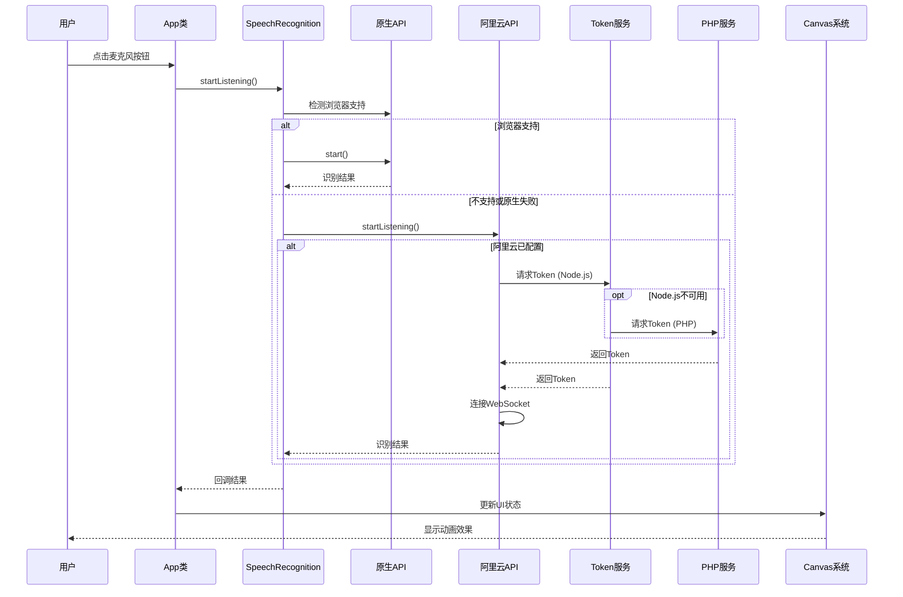
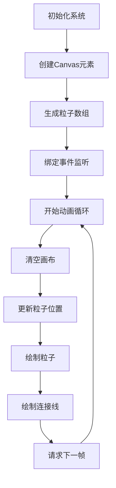
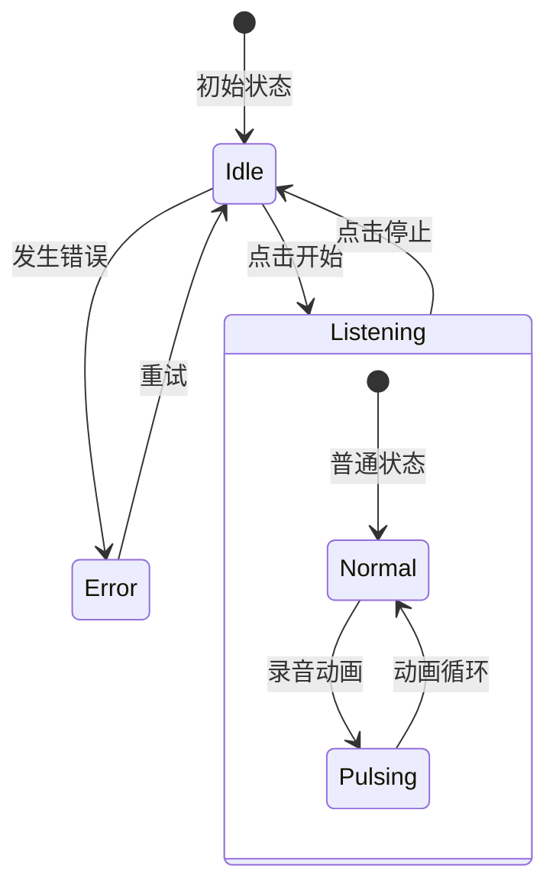
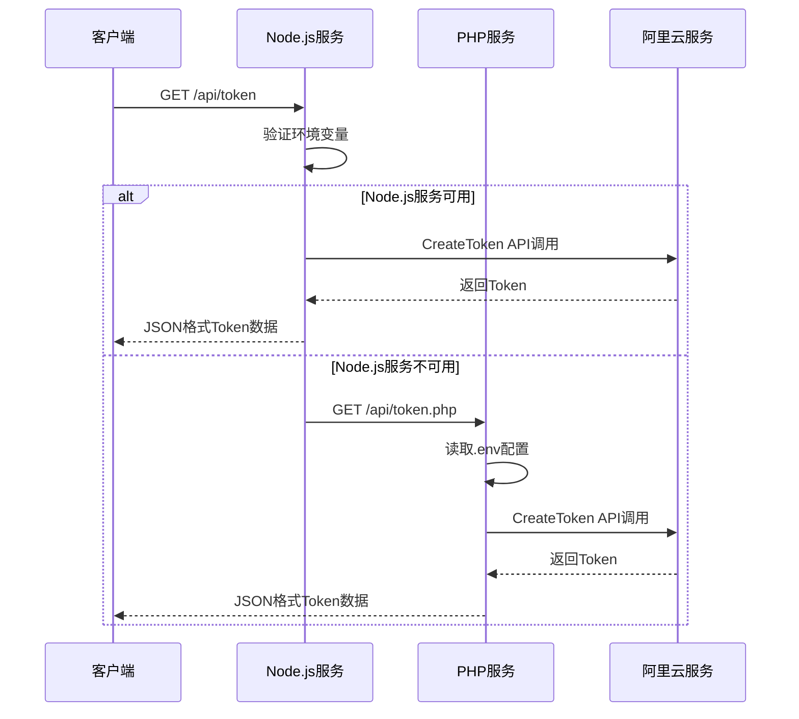

# 用户界面设计

<cite>
**本文档引用的文件**
- [index.html](file://index.html)
- [style.css](file://css/style.css)
- [app.js](file://js/app.js)
- [particles.js](file://js/particles.js)
- [speech.js](file://js/speech.js)
- [aliyun-speech.js](file://js/aliyun-speech.js)
- [server.js](file://server.js)
- [token.php](file://api/token.php)
</cite>

## 更新摘要
**变更内容**
- 新增PHP版本Token服务的用户界面集成
- 实现双端点支持的Token获取流程（Node.js和PHP）
- 更新阿里云NLS API集成章节以反映新的双端点架构
- 增强Token获取的错误提示和状态反馈机制

## 目录
1. [简介](#简介)
2. [项目结构](#项目结构)
3. [核心组件](#核心组件)
4. [架构概览](#架构概览)
5. [详细组件分析](#详细组件分析)
6. [依赖关系分析](#依赖关系分析)
7. [性能考虑](#性能考虑)
8. [故障排除指南](#故障排除指南)
9. [结论](#结论)

## 简介

这是一个基于Web Speech API的语音识别应用，采用科幻暗色主题设计。该应用提供了实时语音转文字的功能，具有丰富的用户界面交互效果，包括粒子背景动画、声波动画、状态指示器等现代化UI元素。应用支持双后端架构（浏览器原生和阿里云NLS API），并具备完整的设置面板和响应式设计。

**更新** 新增了自动获取Token功能，提供一键式Token获取服务，支持Node.js和PHP两种后端实现。用户界面现在支持双端点并行尝试，提高了Token获取的成功率和可靠性。

## 项目结构

项目采用模块化架构，主要由HTML页面结构、CSS样式系统和JavaScript模块组成：



**图表来源**
- [index.html:1-141](file://index.html#L1-L141)
- [style.css:1-809](file://css/style.css#L1-L809)
- [app.js:1-375](file://js/app.js#L1-L375)
- [server.js:1-83](file://server.js#L1-L83)
- [token.php:1-146](file://api/token.php#L1-L146)

**章节来源**
- [index.html:1-141](file://index.html#L1-L141)
- [style.css:1-809](file://css/style.css#L1-L809)
- [app.js:1-375](file://js/app.js#L1-L375)
- [server.js:1-83](file://server.js#L1-L83)
- [token.php:1-146](file://api/token.php#L1-L146)

## 核心组件

### 界面布局结构

应用采用垂直居中的布局设计，主要包含以下核心区域：

1. **粒子背景画布** - 全屏覆盖的动态背景
2. **录音指示线** - 顶部固定宽度的进度条
3. **主内容区域** - 包含标题、文本显示区、控制按钮
4. **状态提示区** - 底部状态信息显示
5. **设置面板** - 可选的配置界面，支持阿里云NLS API配置，包含新增的自动获取Token功能

### 主要UI元素



**图表来源**
- [app.js:12-375](file://js/app.js#L12-L375)
- [particles.js:69-199](file://js/particles.js#L69-L199)
- [speech.js:21-390](file://js/speech.js#L21-L390)
- [aliyun-speech.js:41-479](file://js/aliyun-speech.js#L41-L479)

**章节来源**
- [app.js:12-375](file://js/app.js#L12-L375)
- [particles.js:69-199](file://js/particles.js#L69-L199)
- [speech.js:21-390](file://js/speech.js#L21-L390)
- [aliyun-speech.js:41-479](file://js/aliyun-speech.js#L41-L479)

## 架构概览

应用采用分层架构设计，实现了清晰的关注点分离：



**图表来源**
- [app.js:82-91](file://js/app.js#L82-L91)
- [speech.js:154-172](file://js/speech.js#L154-L172)
- [aliyun-speech.js:74-101](file://js/aliyun-speech.js#L74-L101)
- [server.js:19-63](file://server.js#L19-L63)
- [token.php:1-146](file://api/token.php#L1-L146)

## 详细组件分析

### 科幻暗色主题设计

#### 色彩系统

应用采用了统一的科幻暗色主题，通过CSS变量实现主题定制：

| 颜色类别 | 颜色值 | 用途 |
|---------|--------|------|
| 主背景 | `#0a0a0f` | 页面整体背景 |
| 次要背景 | `#12121a` | 卡片和面板背景 |
| 主要文字 | `#e0e0ff` | 标题和主要文本 |
| 次要文字 | `#6a6a8a` | 描述和辅助文本 |
| 青色强调 | `#00f0ff` | 动画和高亮元素 |
| 紫色强调 | `#bf00ff` | 装饰和特殊效果 |
| 成功状态 | `#00ff88` | 录音状态指示 |
| 错误状态 | `#ff3366` | 错误信息显示 |

#### 字体系统

应用集成了自定义字体和系统字体回退机制：

- **主字体**: `HYNiaoWen` - 自定义手写字体
- **UI字体**: `Microsoft YaHei` - 中文界面字体
- **备用字体**: `sans-serif` - 系统默认字体

**章节来源**
- [style.css:14-27](file://css/style.css#L14-L27)
- [style.css:6-12](file://css/style.css#L6-L12)

### 粒子背景系统

#### 实现原理

粒子系统使用Canvas API实现高性能的动画效果：



**图表来源**
- [particles.js:84-167](file://js/particles.js#L84-L167)

#### 动画特性

- **粒子数量**: 小屏幕40个，大屏幕80个
- **颜色方案**: 青色和紫色渐变
- **鼠标交互**: 鼠标靠近时粒子被吸引
- **边界处理**: 支持粒子边界环绕
- **性能优化**: 使用requestAnimationFrame

**章节来源**
- [particles.js:69-199](file://js/particles.js#L69-L199)

### 语音识别界面组件

#### 麦克风按钮

麦克风按钮是核心交互元素，具有多种状态：



**图表来源**
- [app.js:82-91](file://js/app.js#L82-L91)
- [style.css:287-310](file://css/style.css#L287-L310)

#### 文本显示区域

文本展示区支持最终结果和中间结果的区分显示：

- **最终结果**: 使用`final`类，具有霓虹效果
- **中间结果**: 使用`interim`类，半透明显示
- **占位符文本**: 无内容时显示提示信息

#### 声波动画

声波动画通过CSS动画实现：

- **动画元素**: 5个等间距的矩形条
- **动画效果**: 高度在8px到32px之间周期性变化
- **延迟序列**: 每个条有0.1秒的延迟差

**章节来源**
- [app.js:182-208](file://js/app.js#L182-L208)
- [style.css:208-246](file://css/style.css#L208-L246)

### 录音进度指示器

#### 实现机制

录音进度指示器是一个位于页面顶部的进度条，用于显示录音状态：

- **初始状态**: 宽度为0，完全隐藏
- **录音状态**: 宽度扩展到100%，显示青色发光效果
- **动画过渡**: 使用0.5秒的ease过渡动画
- **阴影效果**: 青色光晕增强视觉效果

**章节来源**
- [index.html:13-14](file://index.html#L13-L14)
- [style.css:73-88](file://css/style.css#L73-L88)

### 设置界面

#### 设置面板设计

设置面板采用模态对话框形式，包含以下功能：

- **引擎选择**: 原生浏览器引擎 vs 阿里云NLS引擎
- **API配置**: 阿里云AppKey、Access Token输入
- **即时反馈**: 引擎切换时的UI状态同步
- **配置持久化**: 使用localStorage保存用户设置
- **默认值支持**: 阿里云AppKey提供默认值'dvMfm92KGSftjpep'
- **自动获取Token**: 新增一键获取Token功能，支持双端点并行尝试

#### 配置验证和同步

- **默认值提供**: 阿里云AppKey字段预设默认值'dvMfm92KGSftjpep'
- **双向同步**: `_syncSettingsUI()`方法确保UI与实际配置保持一致
- **智能同步**: 当配置为空时保留当前UI值，当配置有值时更新UI
- **必填字段**: 阿里云API凭证的完整性检查
- **自动切换**: 原生API失败时的智能切换逻辑
- **错误提示**: 用户友好的错误信息显示

**更新** 新增阿里云AppKey默认值支持和改进的配置同步逻辑，以及自动获取Token功能

#### 自动获取Token功能

**更新** 新增自动获取Token功能，提供一键式Token获取服务：

- **按钮设计**: `.btn-auto-token`类，支持加载、成功、错误三种状态
- **多端点支持**: 同时支持Node.js (`/api/token`) 和 PHP (`/api/token.php`) 端点
- **状态管理**: 完整的加载、成功、错误状态反馈
- **用户提示**: Toast通知和按钮文本状态变化
- **错误处理**: 多端点失败时的优雅降级
- **双端点并行尝试**: 优先尝试Node.js端点，失败时自动切换到PHP端点

**章节来源**
- [index.html:111-135](file://index.html#L111-L135)
- [app.js:127-186](file://js/app.js#L127-L186)
- [app.js:188-253](file://js/app.js#L188-L253)
- [aliyun-speech.js:45-55](file://js/aliyun-speech.js#L45-L55)
- [style.css:672-721](file://css/style.css#L672-L721)

### 响应式设计实现

应用采用移动优先的设计策略：

#### 断点设计

| 断点 | 屏幕宽度 | 主要调整 |
|------|----------|----------|
| 默认 | ≥768px | 标准布局 |
| 平板 | ≤768px | 缩小按钮尺寸，调整字体大小 |
| 手机 | ≤480px | 进一步缩小，优化触摸体验 |

#### 关键响应式调整

- **标题字体**: 从2.5rem减少到1.2rem
- **按钮尺寸**: 从64px减少到40px
- **内边距**: 从24px减少到16px
- **最大高度**: 从60vh减少到50vh

**章节来源**
- [style.css:747-809](file://css/style.css#L747-L809)

### 交互效果和用户体验

#### 状态指示系统

应用实现了完整的状态管理系统：

1. **空闲状态**: 标准UI外观
2. **录音状态**: 按钮发光，显示声波动画
3. **错误状态**: 显示错误信息，禁用交互
4. **Token获取状态**: 按钮加载、成功、错误状态反馈

#### 动画反馈

- **按钮悬停效果**: 阴影和边框颜色变化
- **录音脉冲动画**: 按钮外发光效果
- **Toast提示**: 底部弹出通知
- **平滑过渡**: 所有状态变化都有0.3秒过渡时间

**更新** 新增Token获取过程的状态反馈动画

**章节来源**
- [app.js:210-247](file://js/app.js#L210-L247)
- [style.css:298-310](file://css/style.css#L298-L310)

### 主题定制指南

#### CSS变量定制

可以通过修改`:root`中的CSS变量来自定义主题：

```css
:root {
  --bg-primary: #0a0a0f;      /* 主背景 */
  --bg-secondary: #12121a;     /* 次要背景 */
  --text-primary: #e0e0ff;     /* 主要文字 */
  --accent-cyan: #00f0ff;      /* 青色强调 */
  --accent-purple: #bf00ff;    /* 紫色强调 */
}
```

#### 字体定制

1. **替换自定义字体**: 修改`@font-face`规则
2. **调整字体回退**: 修改`font-family`属性
3. **字体加载优化**: 使用`font-display: swap`

**章节来源**
- [style.css:14-27](file://css/style.css#L14-L27)
- [style.css:6-12](file://css/style.css#L6-L12)

### 阿里云NLS API集成

#### Token服务架构

**更新** 新增完整的Token获取服务架构，支持Node.js和PHP两种实现：



**图表来源**
- [server.js:19-63](file://server.js#L19-L63)
- [token.php:1-146](file://api/token.php#L1-L146)

#### 配置管理

- **服务端安全**: AccessKey仅在服务端使用，不暴露给前端
- **客户端配置**: 支持AppKey和Token的独立配置
- **自动获取**: 提供一键获取Token的功能
- **错误处理**: 完善的错误提示和状态反馈
- **多端点支持**: Node.js和PHP两种Token获取端点

**更新** 新增PHP版本Token服务，提供与Node.js版本相同的API接口

#### Token获取流程优化

**更新** 新增双端点并行尝试机制：

- **优先级策略**: 首先尝试Node.js端点（`/api/token`），失败时自动切换到PHP端点（`/api/token.php`）
- **并行尝试**: 同时尝试两个端点，使用第一个成功的响应
- **快速失败**: 当一个端点不可用时立即尝试下一个
- **状态反馈**: 实时的加载状态提示和错误信息
- **优雅降级**: 所有端点失败时的完整错误处理

**章节来源**
- [server.js:1-83](file://server.js#L1-83)
- [app.js:188-253](file://js/app.js#L188-L253)
- [aliyun-speech.js:45-55](file://js/aliyun-speech.js#L45-L55)
- [token.php:1-146](file://api/token.php#L1-L146)

## 依赖关系分析

```mermaid
graph TB
subgraph "应用层"
App[app.js]
Settings[设置面板]
TokenService[Token服务]
end
subgraph "系统层"
Speech[speech.js]
Particles[particles.js]
Aliyun[aliyun-speech.js]
Server[server.js]
PHP[token.php]
end
subgraph "外部接口"
Native[Web Speech API]
AliyunAPI[AWS WebSocket API]
Canvas[Canvas API]
Express[Express框架]
Dotenv[dotenv]
PopCore[@alicloud/pop-core]
PHP[PHP内置函数]
cURL[cURL扩展]
end
App --> Speech
App --> Particles
Speech --> Native
Speech --> Aliyun
Particles --> Canvas
Settings --> Speech
TokenService --> Server
TokenService --> PHP
Server --> Express
Server --> Dotenv
Server --> PopCore
PHP --> cURL
Aliyun --> AliyunAPI
```

**图表来源**
- [app.js:9-10](file://js/app.js#L9-L10)
- [speech.js:8](file://js/speech.js#L8)
- [particles.js:69](file://js/particles.js#L69)
- [server.js:8-11](file://server.js#L8-L11)
- [aliyun-speech.js:1-40](file://js/aliyun-speech.js#L1-L40)
- [token.php:1-146](file://api/token.php#L1-L146)

**章节来源**
- [app.js:9-10](file://js/app.js#L9-L10)
- [speech.js:8](file://js/speech.js#L8)
- [particles.js:69](file://js/particles.js#L69)
- [server.js:8-11](file://server.js#L8-L11)
- [aliyun-speech.js:1-40](file://js/aliyun-speech.js#L1-L40)
- [token.php:1-146](file://api/token.php#L1-L146)

## 性能考虑

### Canvas性能优化

1. **帧率控制**: 使用`requestAnimationFrame`确保60fps
2. **批量绘制**: 合并绘制操作减少重绘
3. **内存管理**: 及时清理Canvas上下文和事件监听器

### 语音识别性能

1. **自动重连**: 原生API断开后自动重连
2. **网络错误处理**: 智能切换到阿里云NLS API
3. **缓冲管理**: 音频数据缓冲避免丢失

### 响应式性能

1. **媒体查询**: 使用CSS媒体查询优化不同设备
2. **触摸优化**: 按钮尺寸适合触摸操作
3. **字体优化**: 使用`font-display: swap`提升加载性能

### 阿里云API性能

1. **Token缓存**: 避免频繁请求Token
2. **连接池管理**: 优化WebSocket连接复用
3. **错误重试**: 智能的重试机制和退避策略

### Token获取性能

**更新** 新增Token获取性能优化：

1. **双端点并行尝试**: 同时尝试Node.js和PHP端点，提高成功率
2. **快速失败**: 端点不可用时快速切换到下一个
3. **状态反馈**: 实时的加载状态提示
4. **错误降级**: 所有端点失败时的优雅降级
5. **并行优化**: 使用Promise.allSettled或类似的并发控制策略

## 故障排除指南

### 浏览器兼容性问题

| 问题 | 原因 | 解决方案 |
|------|------|----------|
| 语音识别不可用 | 浏览器不支持 | 显示不支持提示，启用阿里云模式 |
| 录音权限被拒绝 | 用户拒绝权限 | 引导用户手动授权 |
| 网络错误 | 服务不可达 | 自动切换到阿里云NLS API |
| Canvas性能问题 | 设备性能不足 | 降低粒子数量 |

### 阿里云API问题

1. **Token获取失败**: 检查服务端环境变量配置
2. **AppKey无效**: 验证阿里云控制台配置
3. **连接超时**: 检查网络连接和防火墙设置
4. **Token过期**: 使用自动获取功能刷新Token

### Token获取问题

**更新** 新增Token获取故障排除指南：

1. **Node.js服务未启动**: 确保执行`npm start`启动服务
2. **PHP服务未配置**: 确保PHP服务器正确配置
3. **环境变量缺失**: 检查`.env`文件中的AccessKey配置
4. **网络连接问题**: 检查阿里云服务的网络可达性
5. **双端点失败**: 系统会自动尝试两个端点，都失败时显示详细错误信息
6. **PHP cURL扩展**: 确保PHP服务器安装了cURL扩展

### 常见UI问题

1. **粒子动画卡顿**: 检查Canvas尺寸和粒子数量
2. **按钮无响应**: 确认事件绑定和状态管理
3. **文本显示异常**: 验证DOM元素存在性和样式应用
4. **设置面板显示问题**: 检查CSS类名和样式冲突
5. **Token按钮状态异常**: 检查按钮类名和状态切换逻辑
6. **双端点切换问题**: 确认fetch请求的错误处理逻辑

**章节来源**
- [app.js:34-43](file://js/app.js#L34-L43)
- [speech.js:273-315](file://js/speech.js#L273-L315)
- [aliyun-speech.js:75-80](file://js/aliyun-speech.js#L75-L80)
- [app.js:190-253](file://js/app.js#L190-L253)

## 结论

这个语音识别应用展现了现代Web应用的优秀设计实践。通过科幻暗色主题、粒子背景动画、响应式布局和流畅的交互效果，为用户提供了沉浸式的语音识别体验。

**更新** 新增的自动获取Token功能进一步提升了用户体验，简化了阿里云API的配置流程。双端点支持的Token获取机制确保了更高的可用性和可靠性。

### 设计亮点

1. **统一的主题系统**: 通过CSS变量实现一致的视觉风格
2. **丰富的动画效果**: Canvas粒子系统和CSS动画的完美结合
3. **智能的状态管理**: 多种状态的清晰区分和反馈
4. **优秀的响应式设计**: 针对不同设备的优化适配
5. **完善的错误处理**: 用户友好的错误提示和恢复机制
6. **安全的API集成**: 服务端Token管理确保凭证安全
7. **便捷的默认配置**: 阿里云AppKey提供默认值简化用户配置
8. **一键式Token获取**: 新增的自动获取功能大幅简化配置流程
9. **双端点并行尝试**: 新增的双端点支持提高了Token获取的成功率
10. **优雅的错误降级**: 多端点失败时的完整错误处理机制

### 技术优势

1. **模块化架构**: 清晰的代码组织和职责分离
2. **性能优化**: Canvas动画和语音处理的性能考量
3. **可扩展性**: 易于添加新功能和主题定制
4. **跨浏览器兼容**: 对不同浏览器的兼容性处理
5. **安全的API设计**: 服务端凭证管理和Token安全传输
6. **多端点支持**: Node.js和PHP两种Token获取服务
7. **智能降级**: 多端点失败时的优雅降级机制
8. **并行优化**: 双端点并行尝试提升用户体验

### 用户体验改进

1. **默认值支持**: 减少用户初始配置负担
2. **智能同步**: 保持UI状态与实际配置的一致性
3. **一键获取**: 简化的Token获取流程
4. **完善的状态反馈**: 清晰的操作结果提示
5. **双端点并行尝试**: 提升Token获取的成功率和速度
6. **详细的错误提示**: 帮助用户快速定位和解决问题
7. **优雅的错误降级**: 多端点失败时的友好处理
8. **实时状态指示**: 加载、成功、错误状态的可视化反馈

这个项目为Web语音应用开发提供了优秀的参考模板，展示了如何将技术功能与美观的用户界面相结合，同时注重用户体验和安全性。新增的自动获取Token功能和双端点支持进一步体现了开发者对用户体验的关注，使得阿里云API的配置变得更加简单直观，同时提高了系统的可靠性和可用性。