# 用户界面设计

<cite>
**本文档引用的文件**
- [index.html](file://index.html)
- [style.css](file://css/style.css)
- [app.js](file://js/app.js)
- [particles.js](file://js/particles.js)
- [speech.js](file://js/speech.js)
- [aliyun-speech.js](file://js/aliyun-speech.js)
- [server.js](file://server.js)
- [token.php](file://api/token.php)
</cite>

## 更新摘要
**变更内容**
- CSS字体配置微调：优化字体加载和回退机制，提升跨平台显示一致性
- 字体文件路径更新：确保自定义字体文件的正确引用和加载
- 字体渲染性能优化：改进字体加载策略以减少页面闪烁

## 目录
1. [简介](#简介)
2. [项目结构](#项目结构)
3. [核心组件](#核心组件)
4. [架构概览](#架构概览)
5. [详细组件分析](#详细组件分析)
6. [依赖关系分析](#依赖关系分析)
7. [性能考虑](#性能考虑)
8. [故障排除指南](#故障排除指南)
9. [结论](#结论)

## 简介

这是一个基于Web Speech API的语音识别应用，采用精致的暗色主题设计。该应用提供了实时语音转文字的功能，具有丰富的用户界面交互效果，包括可切换的背景系统（粒子动画或背景图片）、声波动画、状态指示器等现代化UI元素。应用支持双后端架构（浏览器原生和阿里云NLS API），并具备完整的设置面板和响应式设计。

**更新** 应用经历了重大视觉重设计，从之前的青色强调霓虹主题转变为更加精致和专业的暗色界面。CSS配色方案得到全面优化，录音按钮采用全新的白色圆形卡片设计，显著提升交互体验。新增了背景图片层系统，支持用户选择使用粒子动画或静态背景图片，同时增强了设置面板的交互体验。最新的更新引入了卡片主容器结构和独立提示文本系统，进一步提升了用户体验和界面一致性。本次更新重点改进了麦克风按钮包装器系统、背景初始化逻辑和移动端响应式体验，特别是波形动画组件的重新定位和CSS定位系统的优化。字体配置得到进一步优化，确保更好的跨平台字体显示一致性。

## 项目结构

项目采用模块化架构，主要由HTML页面结构、CSS样式系统和JavaScript模块组成：

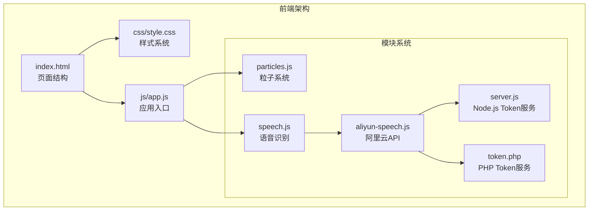

**图表来源**
- [index.html:1-168](file://index.html#L1-L168)
- [style.css:1-1043](file://css/style.css#L1-L1043)
- [app.js:1-409](file://js/app.js#L1-L409)
- [server.js:1-83](file://server.js#L1-L83)
- [token.php:1-146](file://api/token.php#L1-L146)

**章节来源**
- [index.html:1-168](file://index.html#L1-L168)
- [style.css:1-1043](file://css/style.css#L1-L1043)
- [app.js:1-409](file://js/app.js#L1-L409)
- [server.js:1-83](file://server.js#L1-L83)
- [token.php:1-146](file://api/token.php#L1-L146)

## 核心组件

### 界面布局结构

应用采用垂直居中的布局设计，主要包含以下核心区域：

1. **背景层系统** - 支持粒子动画和背景图片两种模式的可切换背景
2. **Logo显示区** - 右下角的品牌标识展示
3. **录音指示线** - 顶部固定宽度的进度条
4. **主内容区域** - 包含标题、文本显示区、控制按钮
5. **右侧工具栏** - 删除和复制功能的快捷操作
6. **状态提示区** - 卡片内部的状态信息显示
7. **提示文本系统** - 独立的引导文案显示区域
8. **设置面板** - 可选的配置界面，支持引擎选择、背景切换和阿里云配置

### 主要UI元素

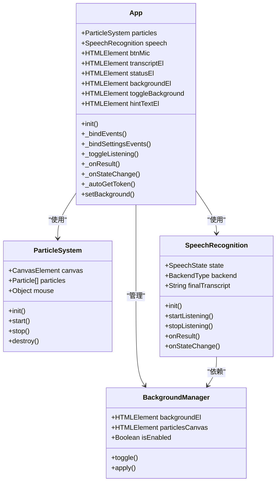

**图表来源**
- [app.js:12-409](file://js/app.js#L12-L409)
- [particles.js:69-199](file://js/particles.js#L69-L199)
- [speech.js:21-390](file://js/speech.js#L21-L390)
- [aliyun-speech.js:41-479](file://js/aliyun-speech.js#L41-L479)

**章节来源**
- [app.js:12-409](file://js/app.js#L12-L409)
- [particles.js:69-199](file://js/particles.js#L69-L199)
- [speech.js:21-390](file://js/speech.js#L21-L390)
- [aliyun-speech.js:41-479](file://js/aliyun-speech.js#L41-L479)

## 架构概览

应用采用分层架构设计，实现了清晰的关注点分离：

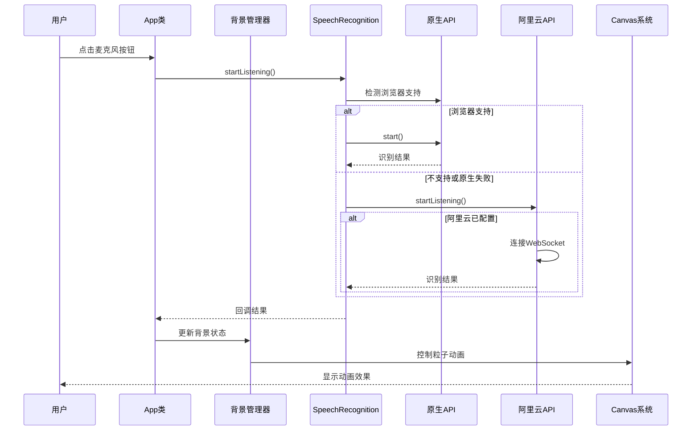

**图表来源**
- [app.js:90-99](file://js/app.js#L90-L99)
- [speech.js:154-172](file://js/speech.js#L154-L172)
- [aliyun-speech.js:74-101](file://js/aliyun-speech.js#L74-L101)
- [app.js:206-215](file://js/app.js#L206-215)

## 详细组件分析

### 精致暗色主题设计

#### 色彩系统

应用采用了统一的精致暗色主题，通过CSS变量实现主题定制：

| 颜色类别 | 颜色值 | 用途 |
|---------|--------|------|
| 主背景 | `#0a0a0f` | 页面整体背景 |
| 次要背景 | `#12121a` | 卡片和面板背景 |
| 主要文字 | `#e0e0ff` | 标题和主要文本 |
| 次要文字 | `#6a6a8a` | 描述和辅助文本 |
| 青色强调 | `#00f0ff` | 动画和高亮元素 |
| 紫色强调 | `#bf00ff` | 装饰和特殊效果 |
| 成功状态 | `#00ff88` | 录音状态指示 |
| 错误状态 | `#ff3366` | 错误信息显示 |

#### 背景渐变系统

应用现在使用径向渐变作为背景基础，提供更丰富的视觉层次：

- **主背景**: 径向渐变从中心向边缘过渡 (`#262630` → `#12121a` → `#07070a`)
- **文本容器**: 独立的径向渐变背景，增强内容可读性
- **多层叠加**: 支持背景图片和粒子系统的灵活切换

#### 字体系统

**更新** 字体系统经过优化，改进了字体加载和回退机制：

- **主字体**: `HYNiaoWen` - 自定义手写字体，优化了字体文件路径和加载策略
- **UI字体**: `Microsoft YaHei` - 中文界面字体，增强了跨平台兼容性
- **备用字体**: `sans-serif` - 系统默认字体，确保降级显示效果
- **字体加载优化**: 采用更高效的字体加载策略，减少页面闪烁

**更新** 字体大小进行了优化调整，采用更紧凑的字号提升整体视觉效果，同时改进了字体渲染性能

**章节来源**
- [style.css:14-27](file://css/style.css#L14-L27)
- [style.css:43-51](file://css/style.css#L43-L51)
- [style.css:6-12](file://css/style.css#L6-L12)

### 卡片主容器结构

#### 新的布局架构

应用引入了全新的卡片主容器结构，采用现代化的flexbox布局：

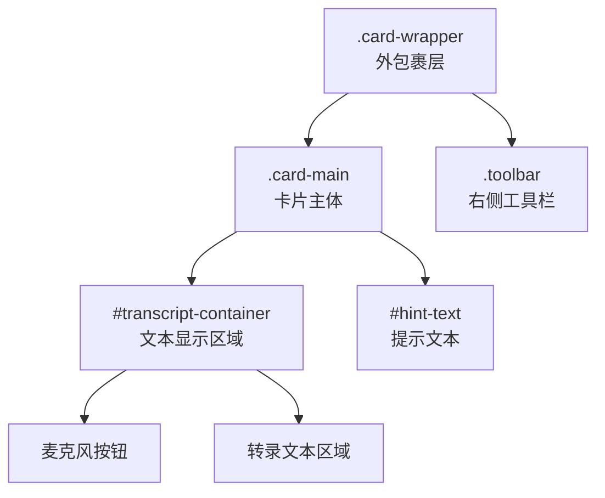

**图表来源**
- [index.html:37-86](file://index.html#L37-86)
- [style.css:202-217](file://css/style.css#L202-217)

#### 垂直Flexbox布局特性

- **弹性布局**: 使用`display: flex`和`flex-direction: column`实现垂直排列
- **对齐方式**: `align-items: center`确保内容水平居中
- **宽度适配**: `width: 100%`确保响应式适配
- **间距控制**: 合理的margin和padding设置

#### aspect-ratio响应式设计

文本显示区域采用现代CSS的aspect-ratio属性：

- **比例保持**: `aspect-ratio: 1080 / 640`确保固定宽高比
- **最大高度限制**: `max-height: 70vh`防止过度拉伸
- **响应式适配**: 在不同屏幕尺寸下保持视觉一致性
- **滚动优化**: 超出部分自动启用滚动条

**章节来源**
- [index.html:37-86](file://index.html#L37-86)
- [style.css:174-217](file://css/style.css#L174-217)

### 独立提示文本系统

#### 提示文本架构

应用新增了独立的提示文本系统，提供用户引导功能：

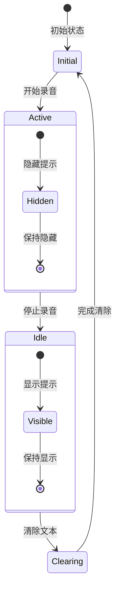

**图表来源**
- [app.js:328-329](file://js/app.js#L328-329)
- [app.js:341](file://js/app.js#L341)
- [app.js:363-364](file://js/app.js#L363-364)

#### 提示文本样式特性

- **位置定位**: 位于文本显示区域正下方，`margin-top: 10px`
- **透明度控制**: 默认半透明`rgba(255, 255, 255, 0.45)`
- **过渡动画**: `transition: opacity 0.3s ease`平滑显示/隐藏
- **隐藏状态**: `.hidden`类控制完全隐藏和禁用交互
- **字体样式**: 使用UI字体，字号0.9rem，居中对齐

#### 动态状态管理

提示文本根据应用状态动态变化：

- **空闲状态**: 显示"点击上方麦克风按钮开始语音识别"
- **录音状态**: 自动隐藏提示文本
- **清除状态**: 重新显示初始提示
- **错误状态**: 保持当前提示不变

**章节来源**
- [index.html:65-66](file://index.html#L65-66)
- [style.css:240-253](file://css/style.css#L240-253)
- [app.js:328-329](file://js/app.js#L328-329)
- [app.js:341](file://js/app.js#L341)
- [app.js:363-364](file://js/app.js#L363-364)

### 麦克风按钮包装器系统

#### 新的包装器架构

麦克风按钮系统经过重大重构，采用新的 `.btn-mic-wrapper` 包装器结构：

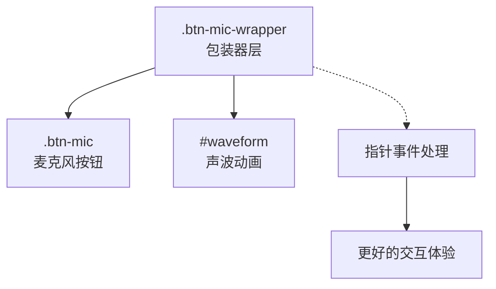

**图表来源**
- [index.html:44-63](file://index.html#L44-63)
- [style.css:322-331](file://css/style.css#L322-331)

#### 包装器特性

- **绝对定位**: 使用 `position: absolute` 相对于卡片主体定位
- **指针事件隔离**: 包装器设置 `pointer-events: none`，按钮设置 `pointer-events: auto`
- **居中布局**: 使用 `display: flex` 和 `justify-content: center` 实现水平居中
- **底部定位**: 固定在卡片底部 `bottom: 40px` 位置
- **层级管理**: `z-index: 5` 确保在正确层级显示

#### 改进的指针事件处理

新的包装器系统提供了更好的指针事件处理：

- **事件冒泡控制**: 包装器不拦截事件，直接传递给按钮
- **触摸优化**: 改进的移动设备触摸响应
- **悬停效果**: 增强的鼠标悬停反馈
- **焦点管理**: 更好的键盘导航支持

**章节来源**
- [index.html:44-63](file://index.html#L44-63)
- [style.css:322-331](file://css/style.css#L322-331)
- [style.css:333-391](file://css/style.css#L333-391)

### 波形动画组件重新定位

#### 新的定位策略

波形动画组件经历了重要的重新定位，从页面底部移动到麦克风按钮正下方：

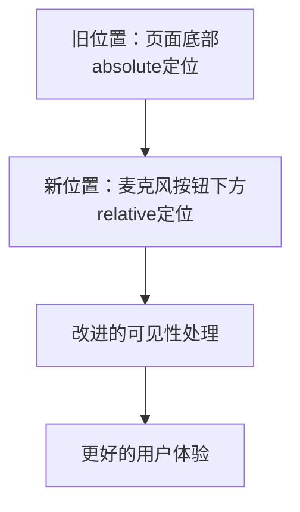

**图表来源**
- [style.css:274-318](file://css/style.css#L274-318)
- [index.html:55-62](file://index.html#L55-62)

#### 重新定位的技术实现

波形动画的定位系统得到了显著改进：

- **相对定位**: 使用 `position: relative` 相对于包装器定位
- **精确对齐**: `left: 50%; top: 100%; transform: translateX(-50%)` 实现完美居中
- **间距控制**: `margin-top: 20px` 提供适当的视觉间隔
- **可见性管理**: 通过 `opacity` 和 `visibility` 双重控制显示状态

#### 改进的可见性处理

可见性处理机制得到全面增强：

- **双重控制**: 同时使用 `opacity` 和 `visibility` 属性
- **过渡动画**: `transition: opacity 0.3s ease, visibility 0.3s ease` 平滑显示/隐藏
- **性能优化**: `pointer-events: none` 避免不必要的交互计算
- **状态同步**: 与录音状态保持精确同步

#### 声波动画特性

声波动画通过CSS动画实现：

- **动画元素**: 5个等间距的矩形条
- **动画效果**: 高度在8px到32px之间周期性变化
- **延迟序列**: 每个条有0.1秒的延迟差
- **颜色方案**: 绿色发光效果配合阴影

**章节来源**
- [style.css:274-318](file://css/style.css#L274-318)
- [index.html:55-62](file://index.html#L55-62)
- [app.js:324](file://js/app.js#L324)
- [app.js:334](file://js/app.js#L334)

### 背景层系统

#### 实现原理

应用现在支持两种背景模式的灵活切换，并增强了初始化逻辑：

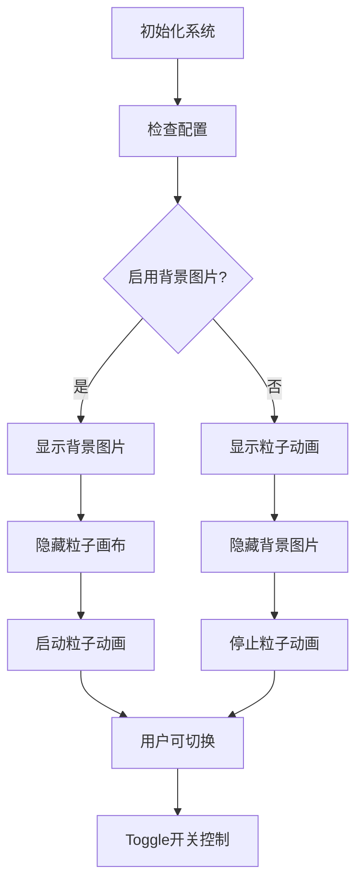

**图表来源**
- [app.js:210-220](file://js/app.js#L210-220)
- [style.css:60-71](file://css/style.css#L60-71)

#### 增强的背景初始化逻辑

背景初始化逻辑得到显著改进，特别针对首次访问用户：

- **默认值处理**: 首次访问时默认启用背景图片 (`localStorage.getItem('background-enabled') === null ? true : stored === 'true'`)
- **智能同步**: `_syncSettingsUI()` 方法确保UI与实际配置保持一致
- **双向绑定**: UI状态与localStorage的双向同步
- **状态持久化**: 用户选择的背景模式持久保存

#### 背景图片层特性

- **定位方式**: 固定定位覆盖全屏
- **缩放模式**: `cover`确保完整显示
- **层级管理**: `z-index: -1`置于最底层
- **交互禁用**: `pointer-events: none`避免干扰用户操作
- **动态切换**: 通过JavaScript控制显示/隐藏

#### Logo显示系统

新增右下角Logo显示功能：

- **位置**: 固定在右下角，距离边缘24px
- **尺寸**: 桌面端128×128px，移动端64×64px
- **透明度**: 0.75确保不干扰主要内容
- **过渡效果**: 平滑的透明度变化动画

**章节来源**
- [style.css:60-96](file://css/style.css#L60-96)
- [app.js:210-220](file://js/app.js#L210-220)
- [app.js:157-160](file://js/app.js#L157-160)

### 粒子背景系统

#### 实现原理

粒子系统使用Canvas API实现高性能的动画效果：

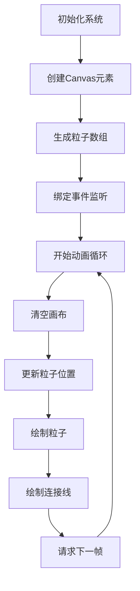

**图表来源**
- [particles.js:84-167](file://js/particles.js#L84-167)

#### 动画特性

- **粒子数量**: 小屏幕40个，大屏幕80个
- **颜色方案**: 青色和紫色渐变
- **鼠标交互**: 鼠标靠近时粒子被吸引
- **边界处理**: 支持粒子边界环绕
- **性能优化**: 使用requestAnimationFrame

**章节来源**
- [particles.js:69-199](file://js/particles.js#L69-199)

### 语音识别界面组件

#### 麦克风按钮

麦克风按钮重新设计为白色圆形卡片样式，配合新的包装器系统：

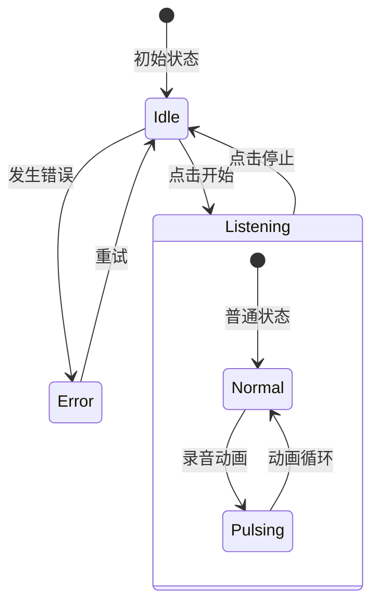

**图表来源**
- [app.js:90-99](file://js/app.js#L90-99)
- [style.css:333-391](file://css/style.css#L333-391)

#### 文本显示区域

文本展示区域获得显著的视觉增强：

- **容器设计**: 增加内边距至32px，圆角半径24px
- **背景效果**: 径向渐变背景配合毛玻璃效果
- **网格纹理**: 添加微妙的点阵纹理增强质感
- **滚动优化**: 自定义滚动条样式
- **阴影层次**: 多层阴影营造深度感

#### 右侧工具栏

新增右侧工具栏，提供快速操作：

- **位置**: 绝对定位在卡片右侧
- **功能**: 删除文本和复制文本
- **图标设计**: SVG图标配合简洁标签
- **悬停效果**: 上浮动画和发光效果

#### 声波动画

声波动画组件重新定位后获得更好的视觉效果：

- **位置优化**: 从页面底部移至麦克风按钮正下方
- **视觉关联**: 与录音状态建立直接的视觉联系
- **动画流畅度**: 改进的过渡动画和状态切换
- **响应式适配**: 在不同屏幕尺寸下的良好表现

**章节来源**
- [app.js:286-312](file://js/app.js#L286-312)
- [style.css:174-310](file://css/style.css#L174-310)

### 录音进度指示器

#### 实现机制

录音进度指示器是一个位于页面顶部的进度条，用于显示录音状态：

- **初始状态**: 宽度为0，完全隐藏
- **录音状态**: 宽度扩展到100%，显示绿色发光效果
- **动画过渡**: 使用0.5秒的ease过渡动画
- **阴影效果**: 绿色光晕增强视觉效果

**章节来源**
- [index.html:19-20](file://index.html#L19-20)
- [style.css:114-129](file://css/style.css#L114-129)

### 设置界面

#### 设置面板设计

设置面板经过全面重新设计，采用现代化的UI组件：

- **模态对话框**: 半透明遮罩配合模糊背景
- **卡片设计**: 圆角边框和阴影效果
- **分区布局**: 清晰的功能区域划分
- **响应式适配**: 移动端友好的布局调整

#### 新增功能特性

1. **背景图片开关**: Toggle开关控制背景图片显示
2. **现代化控件**: 自定义样式的单选按钮和输入框
3. **即时反馈**: 设置更改的实时预览
4. **智能同步**: UI状态与实际配置的自动同步

#### 配置验证和同步

- **默认值提供**: 阿里云AppKey字段预设默认值'dvMfm92KGSftjpep'
- **双向同步**: `_syncSettingsUI()`方法确保UI与实际配置保持一致
- **智能同步**: 当配置为空时保留当前UI值，当配置有值时更新UI
- **必填字段**: 阿里云API凭证的完整性检查
- **自动切换**: 原生API失败时的智能切换逻辑
- **错误提示**: 用户友好的错误信息显示

#### 自动获取Token功能

新增自动获取Token功能，提供一键式Token获取服务：

- **按钮设计**: `.btn-auto-token`类，支持加载、成功、错误三种状态
- **多端点支持**: 同时支持Node.js (`/api/token`) 和 PHP (`/api/token.php`) 端点
- **状态管理**: 完整的加载、成功、错误状态反馈
- **用户提示**: Toast通知和按钮文本状态变化
- **错误处理**: 多端点失败时的优雅降级
- **双端点并行尝试**: 优先尝试Node.js端点，失败时自动切换到PHP端点

**章节来源**
- [index.html:98-160](file://index.html#L98-160)
- [app.js:103-204](file://js/app.js#L103-204)
- [app.js:222-287](file://js/app.js#L222-287)
- [style.css:843-892](file://css/style.css#L843-892)

### 响应式设计实现

应用采用移动优先的设计策略：

#### 断点设计

| 断点 | 屏幕宽度 | 主要调整 |
|------|----------|----------|
| 默认 | ≥768px | 标准布局，右侧工具栏 |
| 平板 | ≤768px | 缩小按钮尺寸，调整字体大小 |
| 手机 | ≤480px | 工具栏移至底部，进一步优化触摸体验 |

#### 关键响应式调整

响应式适配得到显著改进，特别是移动端体验：

- **标题字体**: 从2.5rem减少到1.2rem
- **按钮尺寸**: 从64px减少到40px
- **内边距**: 从24px减少到16px
- **最大高度**: 从60vh减少到50vh
- **工具栏位置**: 移动端从右侧移至底部
- **Logo尺寸**: 移动端从128px缩小到64px
- **麦克风按钮**: 移动端尺寸调整为60px，图标24px
- **包装器定位**: 移动端底部定位调整为36px

**章节来源**
- [style.css:918-1043](file://css/style.css#L918-L1043)

### 交互效果和用户体验

#### 状态指示系统

应用实现了完整的状态管理系统：

1. **空闲状态**: 标准UI外观
2. **录音状态**: 按钮发光，显示声波动画
3. **错误状态**: 显示错误信息，禁用交互
4. **Token获取状态**: 按钮加载、成功、错误状态反馈

#### 动画反馈

- **按钮悬停效果**: 阴影和边框颜色变化
- **录音脉冲动画**: 按钮外发光效果
- **Toast提示**: 底部弹出通知
- **平滑过渡**: 所有状态变化都有0.3秒过渡时间
- **背景切换**: 背景图片与粒子动画的平滑过渡

新增背景切换动画和增强的状态反馈效果，特别是波形动画的重新定位带来了更好的视觉关联

**章节来源**
- [app.js:314-353](file://js/app.js#L314-353)
- [style.css:338-391](file://css/style.css#L338-391)

### 主题定制指南

#### CSS变量定制

可以通过修改`:root`中的CSS变量来自定义主题：

```css
:root {
  --bg-primary: #0a0a0f;      /* 主背景 */
  --bg-secondary: #12121a;     /* 次要背景 */
  --text-primary: e0e0ff;     /* 主要文字 */
  --accent-cyan: #00f0ff;      /* 青色强调 */
  --accent-purple: #bf00ff;    /* 紫色强调 */
}
```

#### 字体定制

1. **替换自定义字体**: 修改`@font-face`规则
2. **调整字体回退**: 修改`font-family`属性
3. **字体加载优化**: 使用`font-display: swap`

**章节来源**
- [style.css:14-27](file://css/style.css#L14-27)
- [style.css:6-12](file://css/style.css#L6-12)

### 阿里云NLS API集成

#### Token服务架构

新增完整的Token获取服务架构，支持Node.js和PHP两种实现：

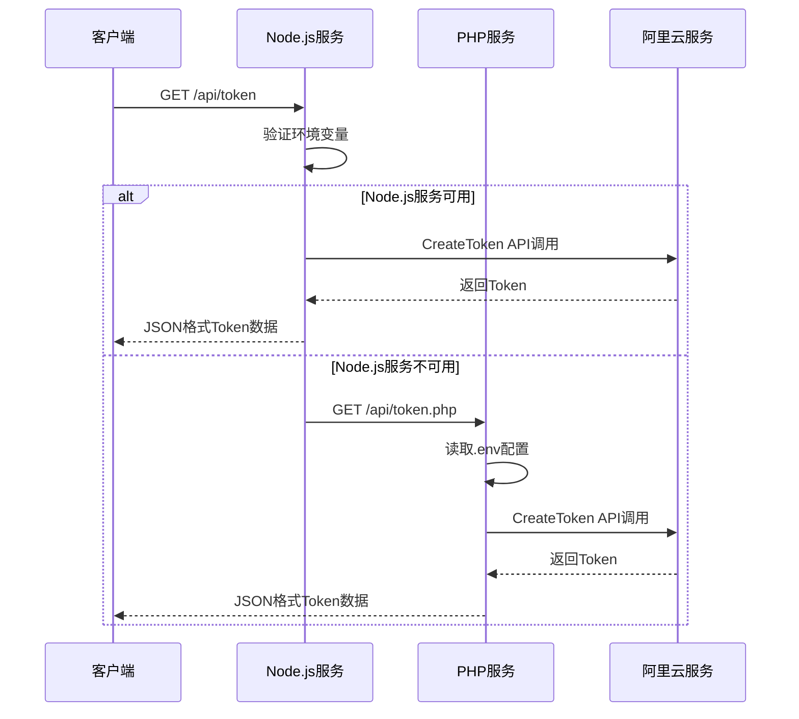

**图表来源**
- [server.js:19-63](file://server.js#L19-63)
- [token.php:1-146](file://api/token.php#L1-146)

#### 配置管理

- **服务端安全**: AccessKey仅在服务端使用，不暴露给前端
- **客户端配置**: 支持AppKey和Token的独立配置
- **自动获取**: 提供一键获取Token的功能
- **错误处理**: 完善的错误提示和状态反馈
- **多端点支持**: Node.js和PHP两种Token获取端点

#### Token获取流程优化

新增双端点并行尝试机制：

- **优先级策略**: 首先尝试Node.js端点（`/api/token`），失败时自动切换到PHP端点（`/api/token.php`）
- **并行尝试**: 同时尝试两个端点，使用第一个成功的响应
- **快速失败**: 当一个端点不可用时立即尝试下一个
- **状态反馈**: 实时的加载状态提示和错误信息
- **优雅降级**: 所有端点失败时的完整错误处理

**章节来源**
- [server.js:1-83](file://server.js#L1-83)
- [app.js:222-287](file://js/app.js#L222-287)
- [aliyun-speech.js:45-55](file://js/aliyun-speech.js#L45-55)
- [token.php:1-146](file://api/token.php#L1-146)

## 依赖关系分析

```mermaid
graph TB
subgraph "应用层"
App[app.js]
Settings[设置面板]
TokenService[Token服务]
BackgroundMgr[背景管理器]
end
subgraph "系统层"
Speech[speech.js]
Particles[particles.js]
Aliyun[aliyun-speech.js]
Server[server.js]
PHP[token.php]
end
subgraph "外部接口"
Native[Web Speech API]
AliyunAPI[AWS WebSocket API]
Canvas[Canvas API]
Express[Express框架]
Dotenv[dotenv]
PopCore[@alicloud/pop-core]
PHP[PHP内置函数]
cURL[cURL扩展]
end
App --> Speech
App --> Particles
App --> BackgroundMgr
Speech --> Native
Speech --> Aliyun
Particles --> Canvas
Settings --> Speech
TokenService --> Server
TokenService --> PHP
Server --> Express
Server --> Dotenv
Server --> PopCore
PHP --> cURL
Aliyun --> AliyunAPI
```

**图表来源**
- [app.js:9-10](file://js/app.js#L9-10)
- [speech.js:8](file://js/speech.js#L8)
- [particles.js:69](file://js/particles.js#L69)
- [server.js:8-11](file://server.js#L8-11)
- [aliyun-speech.js:1-40](file://js/aliyun-speech.js#L1-40)
- [token.php:1-146](file://api/token.php#L1-146)

**章节来源**
- [app.js:9-10](file://js/app.js#L9-10)
- [speech.js:8](file://js/speech.js#L8)
- [particles.js:69](file://js/particles.js#L69)
- [server.js:8-11](file://server.js#L8-11)
- [aliyun-speech.js:1-40](file://js/aliyun-speech.js#L1-40)
- [token.php:1-146](file://api/token.php#L1-146)

## 性能考虑

### Canvas性能优化

1. **帧率控制**: 使用`requestAnimationFrame`确保60fps
2. **批量绘制**: 合并绘制操作减少重绘
3. **内存管理**: 及时清理Canvas上下文和事件监听器
4. **可见性优化**: 页面不可见时暂停动画

### 背景系统性能

新增背景系统性能优化：

1. **按需渲染**: 根据用户选择动态加载背景资源
2. **资源预加载**: 背景图片的预加载优化
3. **内存释放**: 切换背景时及时释放不再使用的资源
4. **GPU加速**: 利用CSS transform和opacity实现硬件加速

### 语音识别性能

1. **自动重连**: 原生API断开后自动重连
2. **网络错误处理**: 智能切换到阿里云NLS API
3. **缓冲管理**: 音频数据缓冲避免丢失

### 响应式性能

1. **媒体查询**: 使用CSS媒体查询优化不同设备
2. **触摸优化**: 按钮尺寸适合触摸操作
3. **字体优化**: 使用`font-display: swap`提升加载性能

### Token获取性能

新增Token获取性能优化：

1. **双端点并行尝试**: 同时尝试Node.js和PHP端点，提高成功率
2. **快速失败**: 端点不可用时快速切换到下一个
3. **状态反馈**: 实时的加载状态提示
4. **错误降级**: 所有端点失败时的优雅降级
5. **并发控制**: 使用Promise.allSettled或类似的并发控制策略

### 波形动画性能优化

波形动画组件的性能得到显著改善：

1. **CSS动画优化**: 使用transform和opacity实现硬件加速
2. **可见性控制**: 通过visibility属性避免不必要的重排重绘
3. **事件委托**: 减少DOM操作和事件监听器数量
4. **内存管理**: 动画状态的正确清理和资源释放

### 字体加载性能优化

**更新** 字体加载性能得到进一步优化：

1. **字体文件优化**: 改进字体文件路径和压缩策略
2. **加载策略优化**: 采用更高效的字体加载顺序
3. **回退机制增强**: 改进的字体回退机制减少显示闪烁
4. **缓存策略**: 优化字体文件的浏览器缓存策略

## 故障排除指南

### 浏览器兼容性问题

| 问题 | 原因 | 解决方案 |
|------|------|----------|
| 语音识别不可用 | 浏览器不支持 | 显示不支持提示，启用阿里云模式 |
| 录音权限被拒绝 | 用户拒绝权限 | 引导用户手动授权 |
| 网络错误 | 服务不可达 | 自动切换到阿里云NLS API |
| Canvas性能问题 | 设备性能不足 | 降低粒子数量 |
| 背景图片加载失败 | 图片路径错误 | 检查img/background.png文件存在性 |

### 背景系统问题

新增背景系统故障排除：

1. **背景图片无法显示**: 检查img/background.png文件是否存在
2. **粒子动画卡顿**: 检查Canvas尺寸和粒子数量
3. **背景切换无效**: 确认localStorage存储和DOM操作正常
4. **Logo显示异常**: 检查img/logo.png文件和CSS定位
5. **初始化问题**: 检查首次访问用户的默认背景设置

### 阿里云API问题

1. **Token获取失败**: 检查服务端环境变量配置
2. **AppKey无效**: 验证阿里云控制台配置
3. **连接超时**: 检查网络连接和防火墙设置
4. **Token过期**: 使用自动获取功能刷新Token

### Token获取问题

新增Token获取故障排除指南：

1. **Node.js服务未启动**: 确保执行`npm start`启动服务
2. **PHP服务未配置**: 确保PHP服务器正确配置
3. **环境变量缺失**: 检查`.env`文件中的AccessKey配置
4. **网络连接问题**: 检查阿里云服务的网络可达性
5. **双端点失败**: 系统会自动尝试两个端点，都失败时显示详细错误信息
6. **PHP cURL扩展**: 确保PHP服务器安装了cURL扩展

### 常见UI问题

1. **设置面板显示异常**: 检查CSS类名和样式冲突
2. **Toggle开关无响应**: 确认事件绑定和状态管理
3. **工具栏位置错乱**: 检查响应式CSS媒体查询
4. **文本显示异常**: 验证DOM元素存在性和样式应用
5. **按钮状态异常**: 检查按钮类名和状态切换逻辑
6. **双端点切换问题**: 确认fetch请求的错误处理逻辑
7. **提示文本不显示**: 检查#hint-text元素和CSS类名
8. **卡片布局异常**: 验证.card-main和.card-wrapper的flexbox属性
9. **麦克风按钮交互问题**: 检查.btn-mic-wrapper包装器和指针事件处理
10. **移动端适配问题**: 验证响应式媒体查询和触摸事件
11. **波形动画位置异常**: 检查.relative定位和transform属性
12. **声波动画不显示**: 确认.active类名和visibility属性
13. **状态指示器失效**: 检查.onStateChange回调和DOM操作
14. **字体显示异常**: 检查字体文件路径和@font-face配置
15. **跨平台字体不一致**: 验证字体回退机制和CSS font-family设置

**章节来源**
- [app.js:34-43](file://js/app.js#L34-43)
- [speech.js:273-315](file://js/speech.js#L273-315)
- [aliyun-speech.js:75-80](file://js/aliyun-speech.js#L75-80)
- [app.js:222-287](file://js/app.js#L222-287)

## 结论

这个语音识别应用展现了现代Web应用的优秀设计实践。通过精致的暗色主题、可切换的背景系统、响应式布局和流畅的交互效果，为用户提供了沉浸式的语音识别体验。

**更新** 重大视觉重设计使应用从之前的青色霓虹风格转变为更加专业和现代的暗色界面。CSS配色方案得到全面优化，录音按钮采用全新的白色圆形卡片设计，显著提升交互体验。新增的背景图片层系统为用户提供了更多个性化选择，而增强的设置面板和现代化的UI组件进一步提升了用户体验。最新的卡片主容器结构和独立提示文本系统，进一步改善了界面的组织性和用户引导体验。字体配置得到进一步优化，确保更好的跨平台显示一致性。

### 设计亮点

1. **精致的主题系统**: 通过CSS变量实现一致的暗色视觉风格
2. **可切换的背景系统**: 粒子动画与背景图片的灵活切换
3. **丰富的动画效果**: Canvas粒子系统和CSS动画的完美结合
4. **智能的状态管理**: 多种状态的清晰区分和反馈
5. **优秀的响应式设计**: 针对不同设备的优化适配
6. **完善的错误处理**: 用户友好的错误提示和恢复机制
7. **安全的API集成**: 服务端Token管理确保凭证安全
8. **便捷的默认配置**: 阿里云AppKey提供默认值简化用户配置
9. **一键式Token获取**: 新增的自动获取功能大幅简化配置流程
10. **双端点并行尝试**: 新增的双端点支持提高了Token获取的成功率
11. **现代化UI组件**: Toggle开关、卡片布局等现代设计元素
12. **优雅的视觉层次**: 多层阴影、渐变背景和毛玻璃效果
13. **卡片主容器结构**: 全新的flexbox布局提升界面组织性
14. **独立提示文本系统**: 动态用户引导增强用户体验
15. **aspect-ratio响应式**: 现代CSS属性确保视觉一致性
16. **麦克风按钮包装器**: 改进的指针事件处理和交互体验
17. **增强的初始化逻辑**: 首次访问用户的智能默认值处理
18. **波形动画重新定位**: 改进的视觉关联和用户体验
19. **CSS定位系统优化**: 相对定位带来的更好可见性控制
20. **状态指示器增强**: 更精确的状态反馈和视觉提示
21. **字体系统优化**: 改进的字体加载和回退机制提升跨平台一致性

### 技术优势

1. **模块化架构**: 清晰的代码组织和职责分离
2. **性能优化**: Canvas动画和语音处理的性能考量
3. **可扩展性**: 易于添加新功能和主题定制
4. **跨浏览器兼容**: 对不同浏览器的兼容性处理
5. **安全的API设计**: 服务端凭证管理和Token安全传输
6. **多端点支持**: Node.js和PHP两种Token获取服务
7. **智能降级**: 多端点失败时的优雅降级机制
8. **并行优化**: 双端点并行尝试提升用户体验
9. **背景系统灵活性**: 支持多种背景渲染方式的动态切换
10. **GPU加速**: 利用现代CSS特性实现硬件加速动画
11. **现代CSS特性**: aspect-ratio和flexbox的现代布局技术
12. **动态状态管理**: JavaScript驱动的UI状态同步
13. **改进的事件处理**: 包装器系统的指针事件优化
14. **移动端优先**: 专门的移动设备适配和触摸优化
15. **波形动画性能**: 优化的CSS动画和可见性控制
16. **定位系统改进**: 相对定位带来的更好的布局控制
17. **状态同步优化**: 改进的状态指示和视觉反馈
18. **字体加载优化**: 改进的字体加载策略和回退机制

### 用户体验改进

1. **默认值支持**: 减少用户初始配置负担
2. **智能同步**: 保持UI状态与实际配置的一致性
3. **一键获取**: 简化的Token获取流程
4. **完善的状态反馈**: 清晰的操作结果提示
5. **双端点并行尝试**: 提升Token获取的成功率和速度
6. **详细的错误提示**: 帮助用户快速定位和解决问题
7. **优雅的错误降级**: 多端点失败时的友好处理
8. **实时状态指示**: 加载、成功、错误状态的可视化反馈
9. **背景个性化**: 用户可选择喜欢的背景风格
10. **现代化交互**: Toggle开关和卡片式布局提升操作体验
11. **视觉层次优化**: 改进的排版和间距提升可读性
12. **移动端优化**: 专门的移动端布局和触摸优化
13. **用户引导系统**: 独立的提示文本提供清晰的操作指导
14. **卡片化布局**: 更好的内容组织和视觉层次
15. **响应式比例**: aspect-ratio确保不同屏幕下的视觉一致性
16. **改进的按钮交互**: 包装器系统提供更好的触摸和鼠标体验
17. **智能初始化**: 首次访问用户的无缝体验
18. **波形动画关联**: 改进的视觉位置和状态同步
19. **可见性控制优化**: 更精确的显示/隐藏控制
20. **交互反馈增强**: 更好的用户操作反馈和状态指示
21. **字体显示一致性**: 改进的字体加载和回退机制确保跨平台一致显示

这个项目为Web语音应用开发提供了优秀的参考模板，展示了如何将技术功能与美观的用户界面相结合，同时注重用户体验和安全性。最新的视觉重设计和界面结构优化进一步体现了开发者对用户体验的关注，使得应用不仅功能强大，而且在视觉上更加专业和用户友好。新增的背景系统、现代化UI组件、卡片主容器结构、提示文本系统以及改进的麦克风按钮包装器，都为现代Web应用开发树立了良好的标杆。特别是波形动画组件的重新定位、CSS定位系统的优化以及字体配置的改进，进一步提升了应用的交互体验和视觉连贯性。