# Web Speech API 集成

<cite>
**本文档引用的文件**
- [README.md](file://README.md)
- [index.html](file://index.html)
- [speech.js](file://js/speech.js)
- [app.js](file://js/app.js)
- [xfyun-speech.js](file://js/xfyun-speech.js)
- [style.css](file://css/style.css)
</cite>

## 目录
1. [简介](#简介)
2. [项目结构](#项目结构)
3. [核心组件](#核心组件)
4. [架构概览](#架构概览)
5. [详细组件分析](#详细组件分析)
6. [依赖关系分析](#依赖关系分析)
7. [性能考虑](#性能考虑)
8. [故障排除指南](#故障排除指南)
9. [结论](#结论)
10. [附录](#附录)

## 简介

这是一个基于Web Speech API的中文语音识别系统，提供了浏览器原生语音识别和讯飞语音识别两种后端支持。项目采用现代化的前端架构，实现了智能的后端切换机制，能够在网络条件不佳时自动切换到国内可用的讯飞语音服务。

该系统的核心特性包括：
- 多后端支持：浏览器原生Web Speech API + 讯飞语音识别
- 智能重连算法：原生API断线自动重连
- 中文语音识别：支持zh-CN语言设置
- 实时中间结果：支持连续识别和中间结果处理
- 用户友好的界面：包含录音动画、状态提示等功能

## 项目结构

项目采用模块化架构，主要由以下几个核心部分组成：

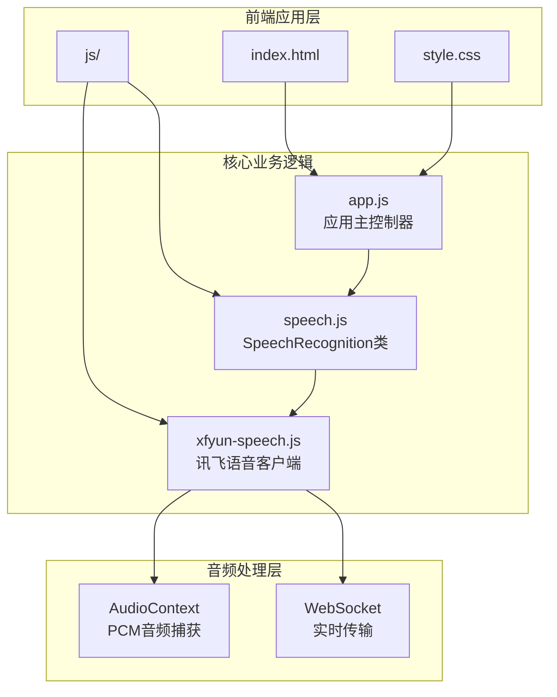

**图表来源**
- [index.html:1-143](file://index.html#L1-L143)
- [speech.js:1-371](file://js/speech.js#L1-L371)
- [app.js:1-292](file://js/app.js#L1-L292)
- [xfyun-speech.js:1-452](file://js/xfyun-speech.js#L1-L452)

**章节来源**
- [index.html:1-143](file://index.html#L1-L143)
- [speech.js:1-371](file://js/speech.js#L1-L371)
- [app.js:1-292](file://js/app.js#L1-L292)
- [xfyun-speech.js:1-452](file://js/xfyun-speech.js#L1-L452)

## 核心组件

### SpeechRecognition 类

SpeechRecognition 是整个语音识别系统的核心类，负责管理多后端语音识别的生命周期和状态转换。

#### 主要属性和状态

| 属性 | 类型 | 描述 | 默认值 |
|------|------|------|--------|
| state | string | 当前识别状态 | 'idle' |
| resultCallback | function | 结果回调函数 | null |
| stateChangeCallback | function | 状态变化回调 | null |
| finalTranscript | string | 已确认的最终文本 | '' |
| backend | string | 当前后端类型 | 'native' |
| nativeRetryCount | number | 原生API重试次数 | 0 |
| maxNativeRetry | number | 原生API最大重试次数 | 1 |

#### 状态枚举

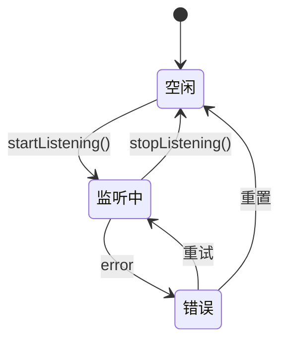

**图表来源**
- [speech.js:10-19](file://js/speech.js#L10-L19)
- [speech.js:21-39](file://js/speech.js#L21-L39)

#### 后端类型枚举

| 常量 | 值 | 描述 |
|------|----|------|
| NATIVE | 'native' | 浏览器原生Web Speech API |
| XFYUN | 'xfyun' | 讯飞语音识别服务 |

**章节来源**
- [speech.js:10-39](file://js/speech.js#L10-L39)

## 架构概览

系统采用分层架构设计，实现了清晰的关注点分离：

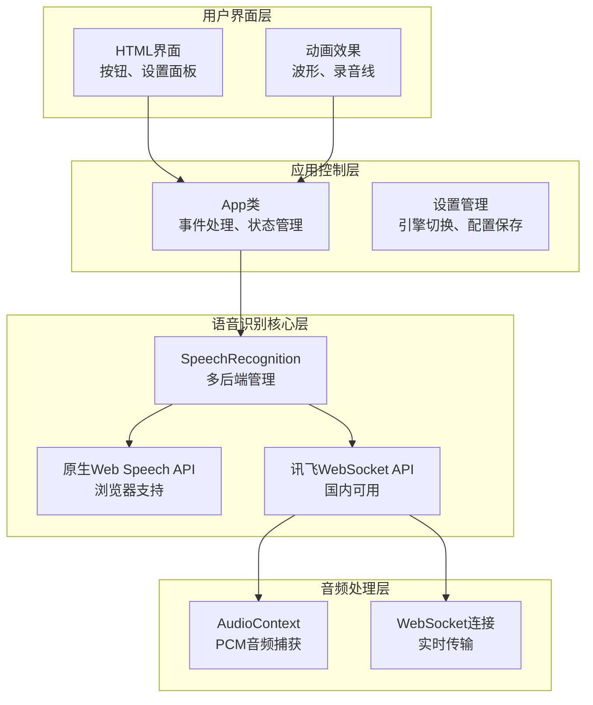

**图表来源**
- [app.js:12-41](file://js/app.js#L12-L41)
- [speech.js:21-39](file://js/speech.js#L21-L39)
- [xfyun-speech.js:17-32](file://js/xfyun-speech.js#L17-L32)

## 详细组件分析

### 浏览器兼容性检测机制

系统实现了robust的浏览器兼容性检测，支持标准API和WebKit前缀版本：

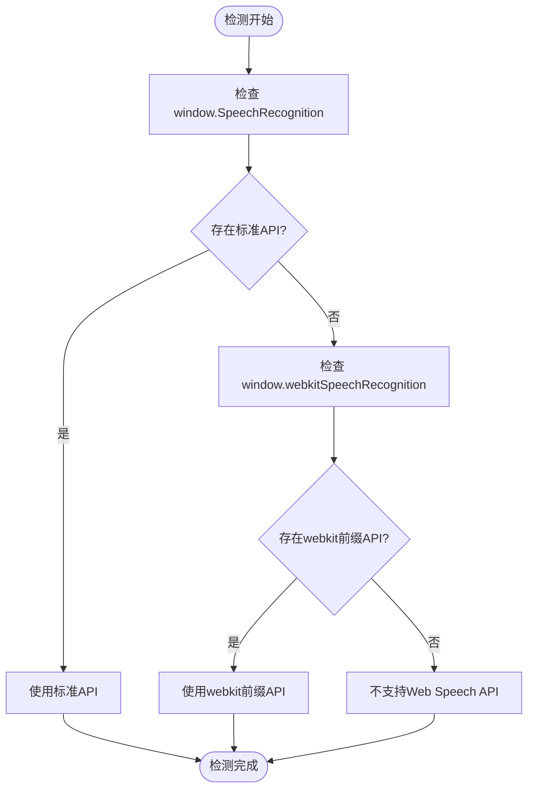

**图表来源**
- [speech.js:44-46](file://js/speech.js#L44-L46)

#### 兼容性检测实现

检测逻辑简洁而有效，确保了跨浏览器的兼容性：

- **标准API检测**：`window.SpeechRecognition`
- **WebKit前缀检测**：`window.webkitSpeechRecognition`
- **统一返回值**：使用逻辑非运算符确保布尔值返回

**章节来源**
- [speech.js:44-46](file://js/speech.js#L44-L46)

### 原生API初始化配置

原生Web Speech API的初始化配置包含了中文语音识别所需的关键参数：

#### 语言设置配置

| 参数 | 值 | 说明 | 影响范围 |
|------|----|------|----------|
| lang | 'zh-CN' | 中文简体语言代码 | 语音识别语言 |
| continuous | true | 连续识别模式 | 识别持续进行 |
| interimResults | true | 中间结果支持 | 实时显示中间文本 |
| maxAlternatives | 1 | 最大候选结果数量 | 识别准确性 |

#### 事件监听器配置

系统注册了四个关键事件监听器：

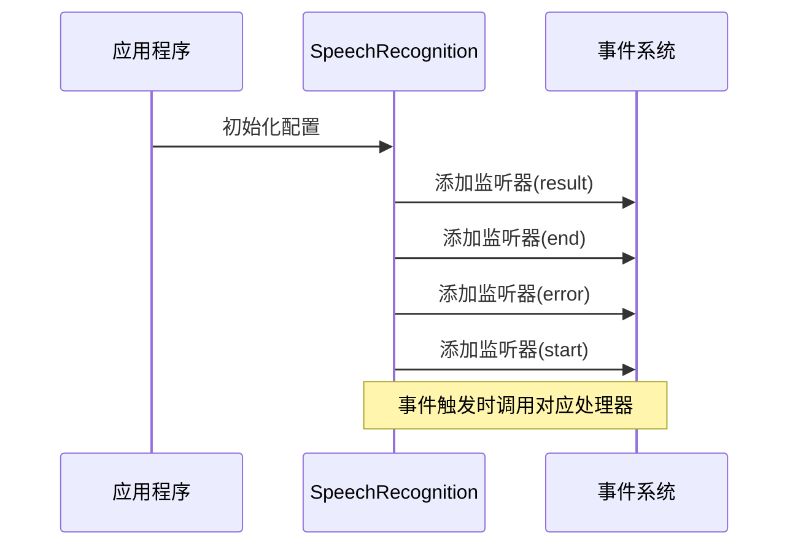

**图表来源**
- [speech.js:86-101](file://js/speech.js#L86-L101)

**章节来源**
- [speech.js:86-101](file://js/speech.js#L86-L101)

### 事件监听器处理机制

#### result事件处理

result事件是语音识别的核心事件，负责处理最终和中间识别结果：

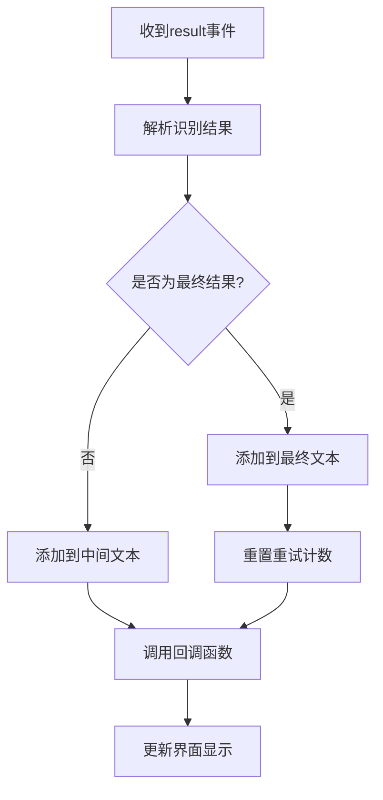

**图表来源**
- [speech.js:234-252](file://js/speech.js#L234-L252)

#### end事件处理

end事件处理原生API的正常结束情况：

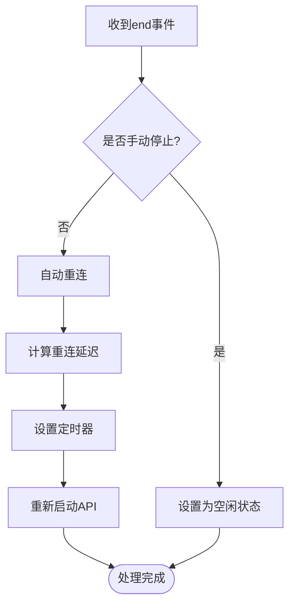

**图表来源**
- [speech.js:254-271](file://js/speech.js#L254-L271)

#### error事件处理

error事件处理各种错误情况，特别是网络错误的自动切换：

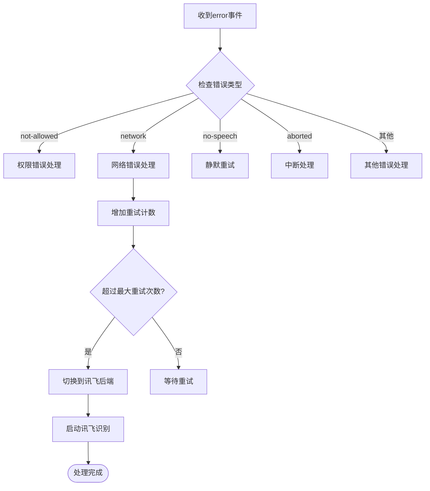

**图表来源**
- [speech.js:273-315](file://js/speech.js#L273-L315)

**章节来源**
- [speech.js:234-315](file://js/speech.js#L234-L315)

### 自动重连算法实现

系统实现了智能的自动重连算法，能够根据网络状况和错误类型动态调整重连策略：

#### 重连延迟计算

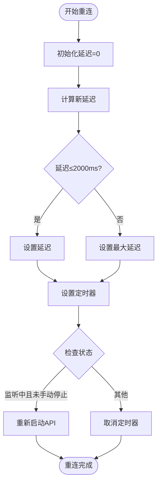

**图表来源**
- [speech.js:260-271](file://js/speech.js#L260-L271)

#### 重连策略特点

- **指数退避**：延迟时间逐步增加，最多2秒
- **状态检查**：确保只有在监听状态且未手动停止时才重连
- **异常处理**：捕获重连过程中的异常并记录日志

**章节来源**
- [speech.js:260-271](file://js/speech.js#L260-L271)

### 讯飞语音识别集成

讯飞语音识别提供了国内网络环境下的稳定解决方案，具有以下特点：

#### 音频处理流程

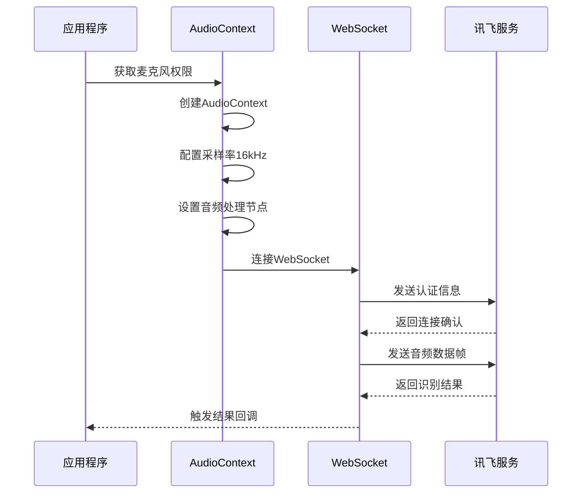

**图表来源**
- [xfyun-speech.js:67-129](file://js/xfyun-speech.js#L67-L129)

#### WebSocket认证机制

讯飞服务使用HMAC-SHA256签名进行认证：

| 认证要素 | 说明 | 示例 |
|----------|------|------|
| Host | 服务器地址 | iat-api.xfyun.cn |
| Date | UTC时间戳 | Mon, 01 Jan 2024 00:00:00 GMT |
| Request-Line | HTTP请求行 | GET /v2/iat HTTP/1.1 |
| Signature | HMAC-SHA256签名 | 32位十六进制字符串 |

**章节来源**
- [xfyun-speech.js:67-129](file://js/xfyun-speech.js#L67-L129)
- [xfyun-speech.js:212-229](file://js/xfyun-speech.js#L212-L229)

## 依赖关系分析

系统的依赖关系清晰明确，遵循单一职责原则：

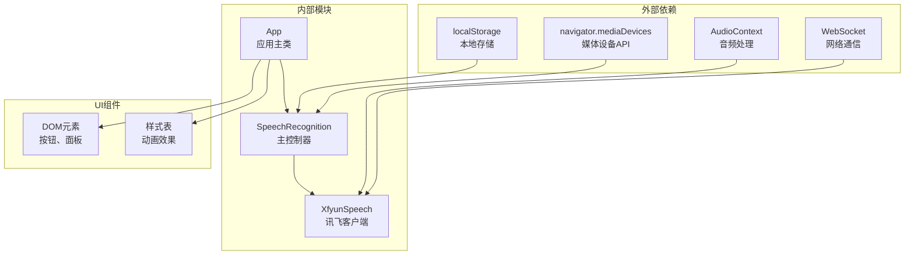

**图表来源**
- [speech.js:8-8](file://js/speech.js#L8)
- [xfyun-speech.js:17-32](file://js/xfyun-speech.js#L17-L32)
- [app.js:9-10](file://js/app.js#L9-L10)

### 模块间交互

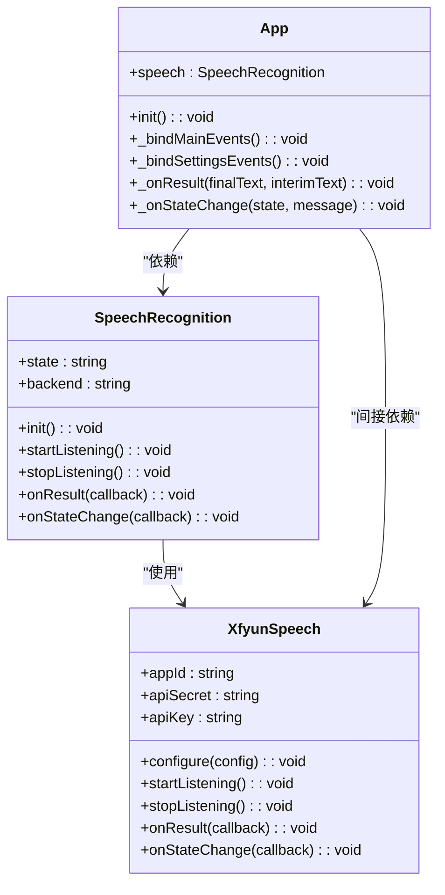

**图表来源**
- [speech.js:21-371](file://js/speech.js#L21-L371)
- [xfyun-speech.js:17-452](file://js/xfyun-speech.js#L17-L452)
- [app.js:12-292](file://js/app.js#L12-L292)

**章节来源**
- [speech.js:21-371](file://js/speech.js#L21-L371)
- [xfyun-speech.js:17-452](file://js/xfyun-speech.js#L17-L452)
- [app.js:12-292](file://js/app.js#L12-L292)

## 性能考虑

### 音频处理优化

系统在音频处理方面采用了多项优化措施：

- **采样率优化**：使用16kHz采样率平衡音质和性能
- **缓冲区管理**：合理设置音频缓冲区大小避免内存溢出
- **异步处理**：音频处理和WebSocket通信采用异步模式
- **资源清理**：及时释放AudioContext和WebSocket连接

### 网络通信优化

- **连接池管理**：WebSocket连接的生命周期管理
- **错误重试**：智能的网络错误重试机制
- **超时控制**：合理的连接超时和读取超时设置
- **流量控制**：音频数据的分帧传输避免过大包

### 内存管理

- **对象池**：音频数据的循环使用避免频繁分配
- **事件解绑**：组件销毁时及时解绑事件监听器
- **定时器清理**：防止内存泄漏的定时器管理
- **缓存策略**：本地配置的持久化存储

## 故障排除指南

### 常见问题及解决方案

#### 浏览器兼容性问题

| 问题描述 | 可能原因 | 解决方案 |
|----------|----------|----------|
| 不支持Web Speech API | 浏览器版本过低 | 升级浏览器或使用讯飞后端 |
| 权限被拒绝 | 用户拒绝麦克风访问 | 检查浏览器设置和HTTPS要求 |
| 语言不支持 | 语言代码不正确 | 使用'zh-CN'或其他支持的语言代码 |

#### 网络连接问题

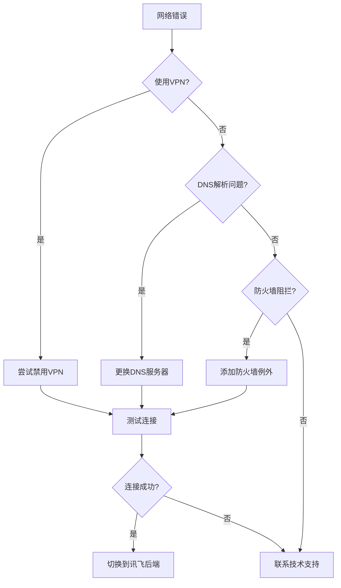

#### 音频输入问题

| 问题症状 | 可能原因 | 解决方案 |
|----------|----------|----------|
| 无声音输入 | 麦克风未连接 | 检查硬件连接和驱动 |
| 声音质量差 | 音频干扰 | 远离干扰源，使用耳机 |
| 延迟过高 | 系统负载过高 | 关闭其他应用程序 |
| 声音失真 | 音频采样率不匹配 | 调整系统音频设置 |

**章节来源**
- [speech.js:273-315](file://js/speech.js#L273-L315)
- [xfyun-speech.js:114-129](file://js/xfyun-speech.js#L114-L129)

### 调试技巧

#### 日志记录

系统提供了详细的日志记录机制：

- **错误日志**：所有异常都会记录到控制台
- **状态变更**：识别状态的每次变化都会记录
- **性能指标**：关键操作的执行时间记录
- **网络状态**：WebSocket连接状态的监控

#### 开发者工具

使用浏览器开发者工具可以：

- **Network标签**：监控WebSocket连接和音频数据传输
- **Console标签**：查看详细的错误信息和调试输出
- **Performance标签**：分析音频处理的性能瓶颈
- **Application标签**：检查localStorage中的配置信息

## 结论

这个Web Speech API集成项目展示了现代前端语音识别的最佳实践。通过精心设计的架构和完善的错误处理机制，系统实现了：

### 技术优势

1. **多后端支持**：灵活的后端选择机制，适应不同网络环境
2. **智能重连**：自适应的重连算法，提升用户体验
3. **中文优化**：专门针对中文语音识别的配置和优化
4. **用户友好**：直观的界面设计和丰富的视觉反馈

### 架构特色

- **模块化设计**：清晰的职责分离和接口定义
- **事件驱动**：基于事件的异步处理机制
- **状态管理**：完整的状态机设计确保系统稳定性
- **资源管理**：完善的生命周期管理和资源清理

### 应用价值

该项目不仅是一个功能完整的语音识别系统，更是学习现代前端架构设计的优秀案例。其设计理念和实现技巧可以广泛应用于类似的多媒体应用开发中。

## 附录

### API使用示例

#### 基本使用流程

```javascript
// 初始化语音识别
const speech = new SpeechRecognition();
speech.init();

// 注册回调函数
speech.onResult((finalText, interimText) => {
    console.log('最终文本:', finalText);
    console.log('中间文本:', interimText);
});

speech.onStateChange((state, message) => {
    console.log('状态变化:', state, message);
});

// 开始识别
speech.startListening();

// 停止识别
speech.stopListening();
```

#### 高级配置选项

```javascript
// 设置后端类型
speech.setBackend('native'); // 使用浏览器原生API
speech.setBackend('xfyun');  // 使用讯飞API

// 配置讯飞凭证
speech.configureXfyun({
    appId: 'your_app_id',
    apiSecret: 'your_api_secret', 
    apiKey: 'your_api_key'
});
```

### 配置参数参考

| 参数名称 | 类型 | 默认值 | 说明 |
|----------|------|--------|------|
| lang | string | 'zh-CN' | 识别语言代码 |
| continuous | boolean | true | 是否连续识别 |
| interimResults | boolean | true | 是否显示中间结果 |
| maxAlternatives | number | 1 | 最大候选结果数量 |
| maxNativeRetry | number | 1 | 原生API最大重试次数 |
| nativeRetryDelay | number | 100 | 重连延迟增量(ms) |
| maxRetryDelay | number | 2000 | 最大重连延迟(ms) |

### 支持的浏览器

- **Chrome**: 28+ 版本
- **Edge**: 79+ 版本  
- **Firefox**: 44+ 版本
- **Safari**: 9+ 版本
- **移动端**: iOS Safari 14.0+, Android Chrome 80+

### 许可证信息

本项目采用MIT许可证，允许自由使用、修改和分发，但需要保留版权声明和许可证声明。