# 多后端管理机制

<cite>
**本文档引用的文件**
- [index.html](file://index.html)
- [app.js](file://js/app.js)
- [speech.js](file://js/speech.js)
- [aliyun-speech.js](file://js/aliyun-speech.js)
- [server.js](file://server.js)
- [token.php](file://api/token.php)
- [package.json](file://package.json)
- [style.css](file://css/style.css)
</cite>

## 更新摘要
**所做更改**
- 新增PHP版本Token获取服务，支持双后端架构（Node.js和PHP）
- 更新BackendType枚举，保持NATIVE和ALIYUN两种后端类型
- 增强自动切换算法，支持双Token获取端点（/api/token和/api/token.php）
- 新增PHP版阿里云Token服务，与Node.js版本返回格式完全一致
- 更新架构图和组件分析以反映双后端Token获取机制
- 添加PHP服务端配置和部署说明

## 目录
1. [简介](#简介)
2. [项目结构](#项目结构)
3. [核心组件](#核心组件)
4. [架构总览](#架构总览)
5. [详细组件分析](#详细组件分析)
6. [双后端Token获取机制](#双后端token获取机制)
7. [依赖关系分析](#依赖关系分析)
8. [性能考量](#性能考量)
9. [故障排查指南](#故障排查指南)
10. [结论](#结论)
11. [附录](#附录)

## 简介
本项目实现了"多后端语音识别管理机制"，通过统一的管理器在浏览器原生 Web Speech API 与阿里云智能语音交互 WebSocket API 之间进行无缝切换。其核心目标包括：
- BackendType枚举设计与使用：NATIVE和ALIYUN两种后端类型的标识与切换逻辑
- 自动切换算法：基于网络错误检测与阿里云后端的自动切换机制
- 状态管理策略：SpeechState枚举的状态及其转换逻辑
- 配置持久化：localStorage的使用与配置恢复
- 双后端Token获取：Node.js和PHP两种服务端实现的Token获取机制
- 最佳实践与性能对比：为不同网络环境与用户场景提供指导
- 代码示例路径：展示如何在应用中实现灵活的后端管理

**更新** 系统现已支持双后端架构，前端JavaScript同时支持Node.js和PHP版本的Token获取服务，提升了系统的部署灵活性和可用性。

## 项目结构
前端采用模块化组织，核心逻辑集中在js目录，新增PHP服务端支持：
- index.html：页面骨架与设置面板
- js/app.js：应用主入口，负责事件绑定、UI更新与后端配置同步
- js/speech.js：语音识别管理器，封装多后端切换与状态管理
- js/aliyun-speech.js：阿里云WebSocket客户端，负责音频采集与识别
- server.js：Node.js版本Token获取服务
- api/token.php：PHP版本Token获取服务
- package.json：Node.js依赖配置
- css/style.css：主题样式与交互反馈

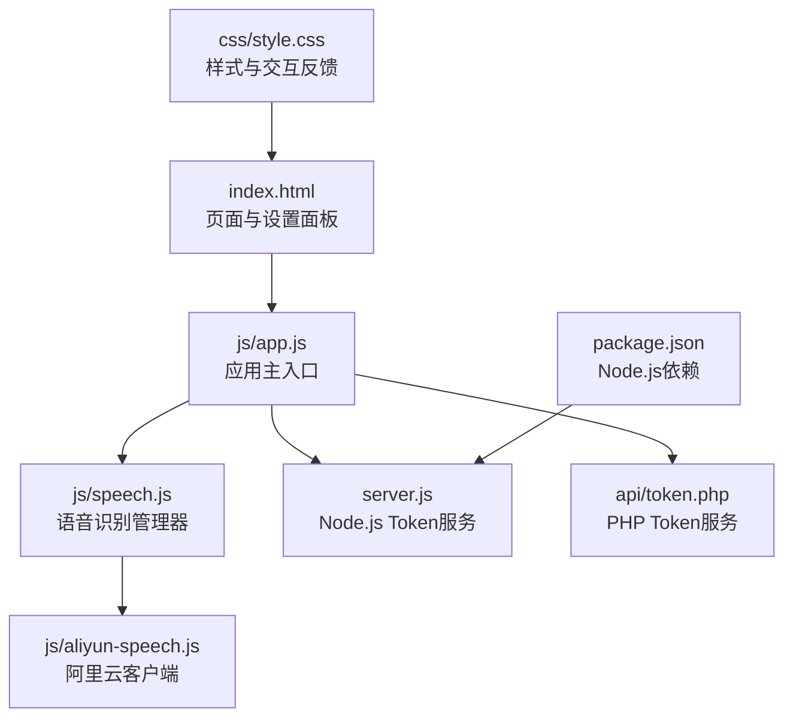

**图表来源**
- [index.html:1-140](file://index.html#L1-L140)
- [app.js:1-375](file://js/app.js#L1-L375)
- [speech.js:1-390](file://js/speech.js#L1-L390)
- [aliyun-speech.js:1-479](file://js/aliyun-speech.js#L1-L479)
- [server.js:1-83](file://server.js#L1-L83)
- [token.php:1-146](file://api/token.php#L1-L146)
- [package.json:1-15](file://package.json#L1-L15)
- [style.css:1-758](file://css/style.css#L1-L758)

**章节来源**
- [index.html:1-140](file://index.html#L1-L140)
- [app.js:1-375](file://js/app.js#L1-L375)
- [speech.js:1-390](file://js/speech.js#L1-L390)
- [aliyun-speech.js:1-479](file://js/aliyun-speech.js#L1-L479)
- [server.js:1-83](file://server.js#L1-L83)
- [token.php:1-146](file://api/token.php#L1-L146)
- [package.json:1-15](file://package.json#L1-L15)
- [style.css:1-758](file://css/style.css#L1-L758)

## 核心组件
- BackendType枚举：用于标识当前使用的后端类型（NATIVE / ALIYUN）
- SpeechState枚举：用于表示语音识别的状态（IDLE / LISTENING / ERROR）
- SpeechRecognition类：统一的语音识别管理器，负责初始化、启动/停止、结果回调、状态变更、配置持久化与后端切换
- AliyunSpeech类：阿里云WebSocket客户端，负责麦克风权限获取、PCM音频捕获、WebSocket认证与消息处理
- App类：应用主控制器，负责UI事件绑定、状态更新与设置面板同步
- Token获取服务：支持Node.js和PHP两种实现的阿里云Token获取服务

**更新** 新增PHP版本Token获取服务，提供与Node.js版本兼容的双后端架构支持。

**章节来源**
- [speech.js:16-19](file://js/speech.js#L16-L19)
- [speech.js:10-14](file://js/speech.js#L10-L14)
- [speech.js:21-390](file://js/speech.js#L21-L390)
- [aliyun-speech.js:17-479](file://js/aliyun-speech.js#L17-L479)
- [app.js:12-375](file://js/app.js#L12-L375)
- [server.js:1-83](file://server.js#L1-83)
- [token.php:1-146](file://api/token.php#L1-L146)

## 架构总览
系统采用"管理器 + 多后端客户端 + 双Token服务"的分层架构：
- 管理器层：SpeechRecognition统一调度与状态管理
- 原生后端：浏览器Web Speech API（仅在支持环境下启用）
- 阿里云后端：WebSocket实时识别，提供智能语音交互能力
- Token服务层：Node.js和PHP双版本Token获取服务
- UI层：App类负责事件绑定与状态渲染

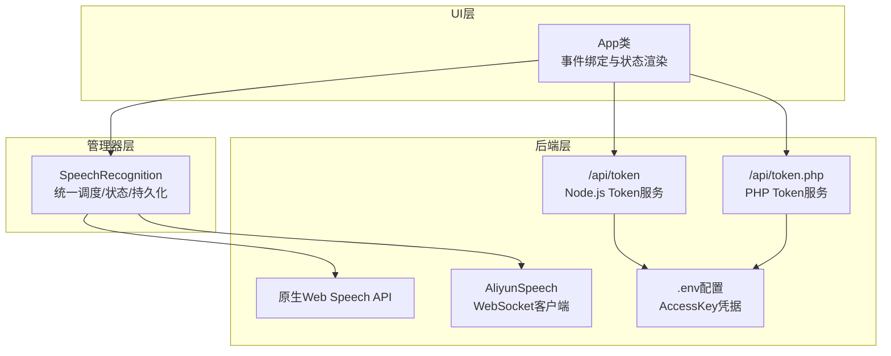

**图表来源**
- [app.js:12-375](file://js/app.js#L12-L375)
- [speech.js:21-390](file://js/speech.js#L21-L390)
- [aliyun-speech.js:17-479](file://js/aliyun-speech.js#L17-L479)
- [server.js:19-76](file://server.js#L19-L76)
- [token.php:12-37](file://api/token.php#L12-L37)

## 详细组件分析

### BackendType枚举与使用
- 设计目的：通过字符串常量标识后端类型，避免魔法字符串，提升可读性与可维护性
- 使用位置：
  - 初始化默认后端为NATIVE
  - 通过设置面板切换后端类型并持久化
  - 在启动识别时根据backend决定调用原生或阿里云

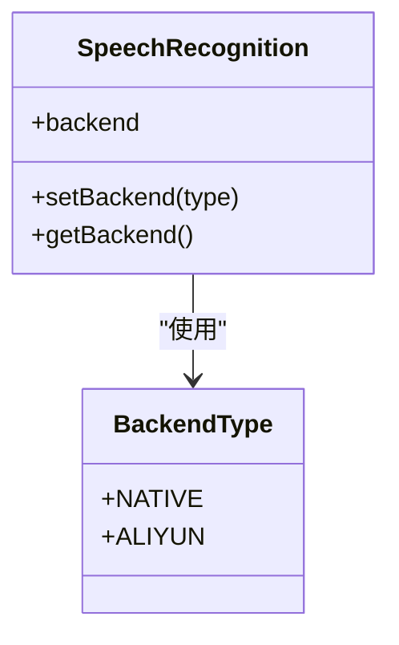

**图表来源**
- [speech.js:16-19](file://js/speech.js#L16-L19)
- [speech.js:120-130](file://js/speech.js#L120-L130)

**章节来源**
- [speech.js:16-19](file://js/speech.js#L16-L19)
- [speech.js:120-130](file://js/speech.js#L120-L130)
- [app.js:163-182](file://js/app.js#L163-L182)

### 自动切换算法与失败重试机制
- 触发条件：
  - 原生API报错类型为network且达到最大重试次数
  - 管理器记录nativeFailed标志，提示自动切换到ALIYUN
- 切换流程：
  - 若已配置阿里云凭证，则自动切换backend为ALIYUN并启动识别
  - 若未配置阿里云凭证，则提示需要在设置中配置阿里云后端
- 失败重试：
  - 原生API在非手动停止状态下，每次end事件会指数退避重连，最多延时至2秒

**更新** 移除了XFYUN相关的自动切换逻辑，系统现在只支持阿里云后端的自动切换。

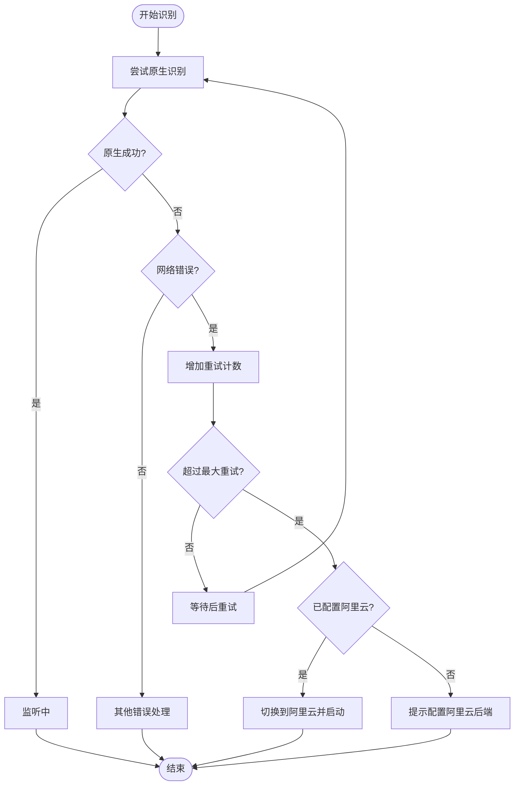

**图表来源**
- [speech.js:288-330](file://js/speech.js#L288-L330)

**章节来源**
- [speech.js:288-330](file://js/speech.js#L288-L330)

### 状态管理策略（SpeechState）
- 状态定义：
  - IDLE：空闲
  - LISTENING：正在监听
  - ERROR：发生错误
- 状态转换：
  - 原生start -> LISTENING
  - 原生end（非手动）-> LISTENING（自动重连）
  - 原生end（手动）-> IDLE
  - 原生error -> ERROR（根据错误类型）
  - 阿里云onStateChange -> 对应映射（idle/listening/error）

**更新** 移除了XFYUN相关状态管理，现在只处理原生和阿里云两个后端的状态。

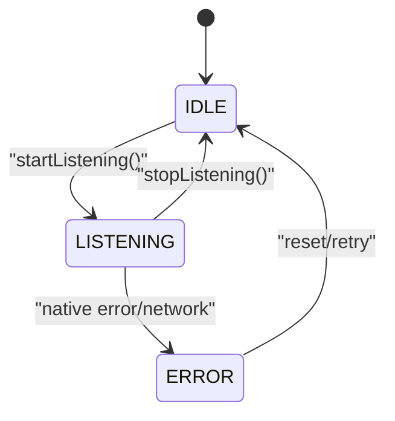

**图表来源**
- [speech.js:10-14](file://js/speech.js#L10-L14)
- [speech.js:60-72](file://js/speech.js#L60-L72)
- [speech.js:344-351](file://js/speech.js#L344-L351)

**章节来源**
- [speech.js:10-14](file://js/speech.js#L10-L14)
- [speech.js:60-72](file://js/speech.js#L60-L72)
- [speech.js:344-351](file://js/speech.js#L344-L351)
- [app.js:214-253](file://js/app.js#L214-L253)

### 配置持久化与恢复（localStorage）
- 存储内容：
  - backend：当前后端类型
  - aliyun：appKey、token
- 恢复时机：
  - 初始化时从localStorage加载配置并恢复后端与凭证
- 保存时机：
  - 切换后端或配置阿里云凭证后立即保存
- 兼容性处理：
  - 从旧配置中兼容xfyun后端类型，自动映射为native

**更新** 移除了XFYUN相关配置持久化逻辑，现在只处理阿里云配置的存储与恢复。

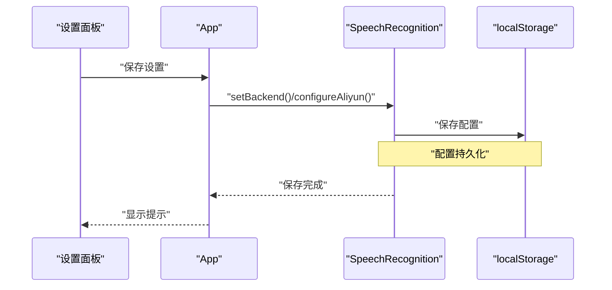

**图表来源**
- [app.js:163-182](file://js/app.js#L163-L182)
- [speech.js:353-366](file://js/speech.js#L353-L366)

**章节来源**
- [app.js:163-182](file://js/app.js#L163-L182)
- [speech.js:353-366](file://js/speech.js#L353-L366)

### 阿里云WebSocket客户端（AliyunSpeech）
- 功能要点：
  - 获取麦克风权限与创建AudioContext
  - 使用ScriptProcessorNode捕获PCM音频帧
  - 通过WebSocket与阿里云服务建立认证连接并发送音频帧
  - 解析服务端返回的识别结果（含最终与中间结果）
  - 支持智能语音交互功能
- 错误处理：
  - 权限拒绝、设备不存在、WebSocket连接失败、服务端错误等均映射为ERROR状态
- 生命周期：
  - startListening() -> 运行中 -> stopListening() -> 清理资源

**更新** 新增阿里云WebSocket客户端，提供智能语音交互能力，支持更丰富的语音处理功能。

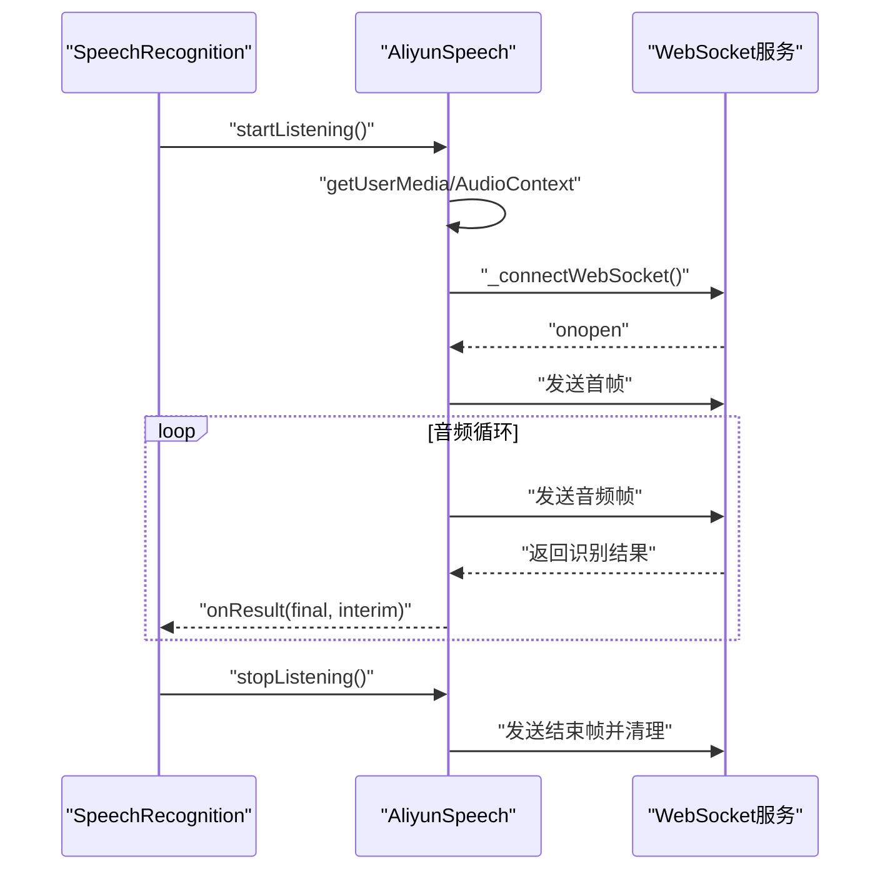

**图表来源**
- [speech.js:334-340](file://js/speech.js#L334-L340)
- [aliyun-speech.js:74-144](file://js/aliyun-speech.js#L74-L144)
- [aliyun-speech.js:204-244](file://js/aliyun-speech.js#L204-L244)
- [aliyun-speech.js:318-387](file://js/aliyun-speech.js#L318-L387)

**章节来源**
- [aliyun-speech.js:1-479](file://js/aliyun-speech.js#L1-L479)
- [speech.js:334-340](file://js/speech.js#L334-L340)

### UI与状态联动（App类）
- 事件绑定：
  - 主界面：麦克风按钮、清空、复制
  - 设置面板：打开/关闭、引擎切换、保存设置
- 状态联动：
  - 根据SpeechState更新按钮样式、波形动画、录音指示线与状态提示
  - 支持键盘快捷键（空格键）控制录音
  - 根据当前后端类型显示相应的引擎标签

**更新** 设置面板移除了XFYUN引擎选项，现在只支持原生和阿里云两个引擎的选择。

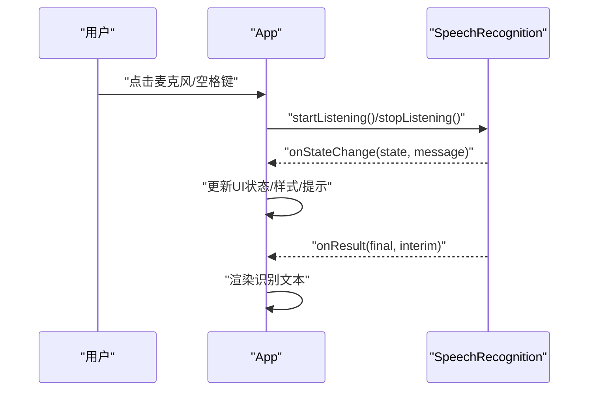

**图表来源**
- [app.js:68-90](file://js/app.js#L68-L90)
- [app.js:214-253](file://js/app.js#L214-L253)
- [app.js:186-212](file://js/app.js#L186-L212)

**章节来源**
- [app.js:68-90](file://js/app.js#L68-L90)
- [app.js:214-253](file://js/app.js#L214-L253)
- [app.js:186-212](file://js/app.js#L186-L212)

## 双后端Token获取机制

### Token获取服务架构
系统现在支持两种Token获取服务实现，确保在不同部署环境下的可用性：

- Node.js版本（server.js）
  - 基于Express框架
  - 使用@alicloud/pop-core SDK
  - 提供/api/token端点
  - 读取.env配置文件中的AccessKey凭据

- PHP版本（api/token.php）
  - 基于cURL的原生实现
  - 使用HMAC-SHA1签名算法
  - 提供/api/token.php端点
  - 读取.env配置文件中的AccessKey凭据
  - 与Node.js版本返回格式完全一致

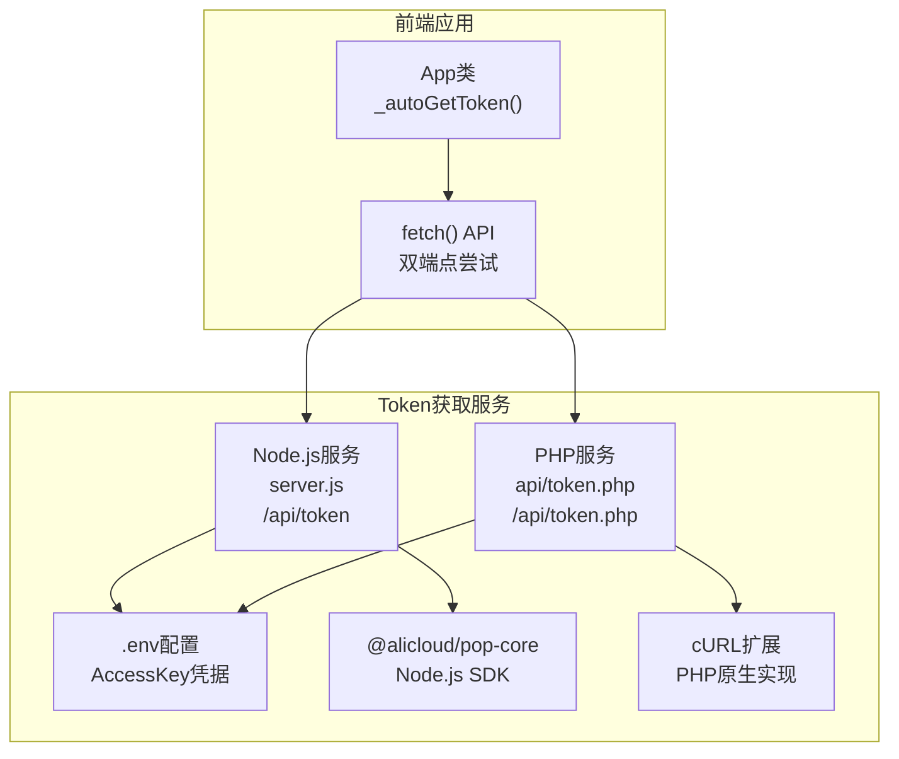

**图表来源**
- [server.js:19-76](file://server.js#L19-L76)
- [token.php:12-37](file://api/token.php#L12-L37)
- [app.js:200-216](file://js/app.js#L200-L216)

### Token获取流程
前端应用通过双端点机制自动选择可用的服务：

1. **优先尝试Node.js端点**：/api/token
2. **回退尝试PHP端点**：/api/token.php
3. **错误处理**：当两个端点都不可用时，显示详细的错误信息
4. **配置更新**：成功获取Token后自动填充到设置面板

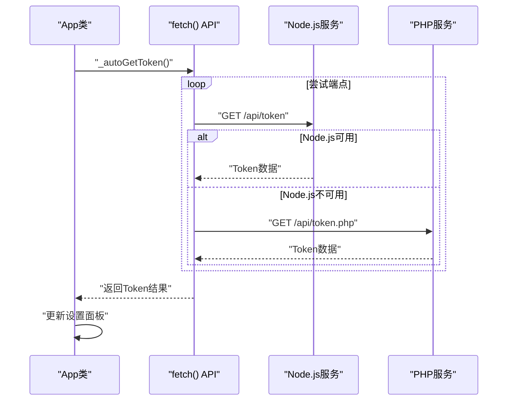

**图表来源**
- [app.js:190-253](file://js/app.js#L190-L253)
- [server.js:19-76](file://server.js#L19-L76)
- [token.php:84-145](file://api/token.php#L84-L145)

### 配置文件支持
两种Token服务都支持.env配置文件：

- **配置项**：
  - ALIYUN_ACCESS_KEY_ID：阿里云AccessKey ID
  - ALIYUN_ACCESS_KEY_SECRET：阿里云AccessKey Secret

- **错误处理**：
  - 当缺少必要配置时，返回详细的错误信息
  - 提供权限不足的特定错误提示
  - 支持网络请求超时和解析错误处理

**章节来源**
- [server.js:19-76](file://server.js#L19-L76)
- [token.php:12-37](file://api/token.php#L12-L37)
- [token.php:120-130](file://api/token.php#L120-L130)
- [app.js:190-253](file://js/app.js#L190-L253)

## 依赖关系分析
- 模块依赖：
  - app.js依赖speech.js（导入BackendType、SpeechState、SpeechRecognition）
  - speech.js依赖aliyun-speech.js（导入AliyunSpeech）
  - index.html通过module script引入app.js
- 耦合度与内聚性：
  - 低耦合：UI与业务逻辑分离，管理器集中处理后端切换与状态
  - 高内聚：每个类职责单一，AliyunSpeech专注WebSocket识别
- Token服务依赖：
  - Node.js版本依赖@alicloud/pop-core和dotenv
  - PHP版本依赖cURL扩展和HMAC函数

**更新** 新增PHP服务端依赖关系，支持双后端Token获取架构。

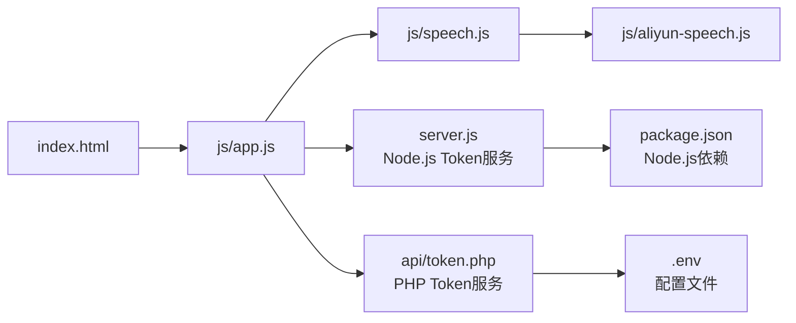

**图表来源**
- [index.html:137](file://index.html#L137)
- [app.js:10](file://js/app.js#L10)
- [speech.js:8](file://js/speech.js#L8)
- [server.js:8-14](file://server.js#L8-L14)
- [package.json:9-13](file://package.json#L9-L13)

**章节来源**
- [index.html:137](file://index.html#L137)
- [app.js:10](file://js/app.js#L10)
- [speech.js:8](file://js/speech.js#L8)
- [server.js:8-14](file://server.js#L8-L14)
- [package.json:9-13](file://package.json#L9-L13)

## 性能考量
- 原生Web Speech API
  - 优点：无需额外网络请求，延迟低；适合国际网络环境
  - 缺点：国内网络可能受限（网络错误），自动重连存在退避延迟
- 阿里云WebSocket
  - 优点：针对国内网络优化，稳定性较好；支持实时流式识别；提供智能语音交互能力
  - 缺点：需要网络与鉴权配置；WebSocket连接与音频编码有额外开销
- Token获取服务
  - Node.js版本：使用SDK，功能完整但有额外依赖
  - PHP版本：原生实现，轻量级但功能相对简单
  - 双端点机制：提升可用性，但增加了一次HTTP往返时间
- 最佳实践
  - 默认使用原生后端，遇到网络错误自动切换至阿里云
  - 在设置中预填阿里云凭证，减少首次切换成本
  - 合理设置自动重试上限，避免频繁重试影响体验
  - 使用UI状态提示与波形动画增强用户感知

**更新** 新增双Token服务的性能对比分析，Node.js和PHP版本各有优缺点。

## 故障排查指南
- 常见问题与定位
  - 原生网络错误：检查网络连通性与浏览器代理设置；观察自动切换日志
  - 阿里云未配置：在设置面板填写AppKey/Token；保存后重启识别
  - 权限被拒：检查浏览器麦克风权限；重新授权后重试
  - WebSocket连接失败：检查网络与API配置；查看错误提示
  - Token获取失败：检查Node.js或PHP服务是否启动；验证.env配置
- 日志与提示
  - 原生错误类型会在控制台输出；UI显示对应错误信息
  - 阿里云错误消息会打印到控制台；UI显示错误状态
  - Token服务错误会显示具体的API错误码和消息

**更新** 新增Token获取服务相关的故障排查指导。

**章节来源**
- [speech.js:288-330](file://js/speech.js#L288-L330)
- [aliyun-speech.js:129-144](file://js/aliyun-speech.js#L129-L144)
- [aliyun-speech.js:318-387](file://js/aliyun-speech.js#L318-L387)
- [server.js:24-29](file://server.js#L24-L29)
- [token.php:31-37](file://api/token.php#L31-L37)

## 结论
该多后端语音识别管理机制通过清晰的枚举设计、完善的自动切换算法与状态管理，以及可靠的配置持久化，实现了在不同网络环境下的稳定识别体验。新增的PHP版本Token获取服务进一步提升了系统的部署灵活性，前端JavaScript通过双端点机制自动选择可用的服务，确保了更好的用户体验。移除XFYUN后端支持后，系统变得更加简洁可靠，用户可以在浏览器原生和阿里云之间自由切换，并获得一致的使用感受。阿里云后端提供了更强大的智能语音交互能力，适合需要高级语音处理功能的应用场景。

## 附录

### 代码示例路径（如何在应用中实现灵活的后端管理）
- 在设置面板中切换后端并保存配置
  - 示例路径：[app.js:163-182](file://js/app.js#L163-L182)
- 初始化语音识别并注册回调
  - 示例路径：[app.js:42-50](file://js/app.js#L42-L50)
- 根据状态更新UI
  - 示例路径：[app.js:214-253](file://js/app.js#L214-L253)
- 管理器内部的后端切换与错误处理
  - 示例路径：[speech.js:288-330](file://js/speech.js#L288-L330)
- 阿里云WebSocket客户端的启动与消息处理
  - 示例路径：[aliyun-speech.js:74-144](file://js/aliyun-speech.js#L74-L144)
  - 示例路径：[aliyun-speech.js:318-387](file://js/aliyun-speech.js#L318-L387)
- 双Token获取服务的实现
  - 示例路径：[app.js:200-216](file://js/app.js#L200-L216)
  - 示例路径：[server.js:19-76](file://server.js#L19-L76)
  - 示例路径：[token.php:12-37](file://api/token.php#L12-L37)