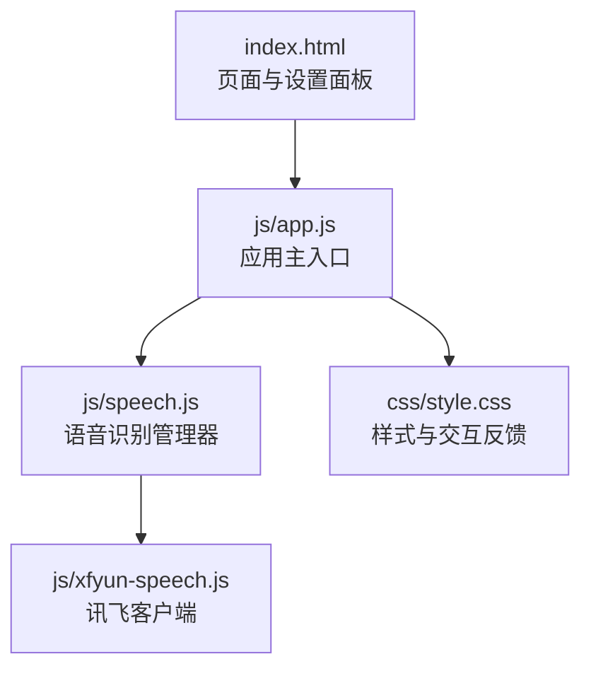
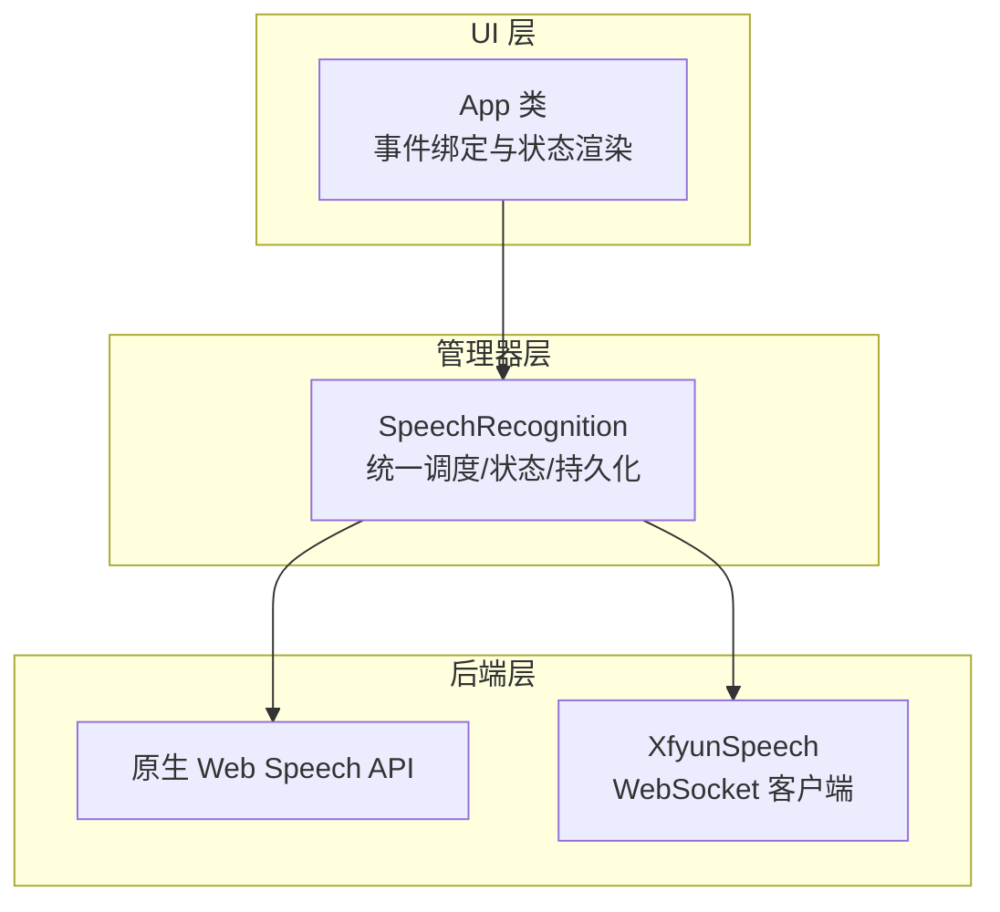
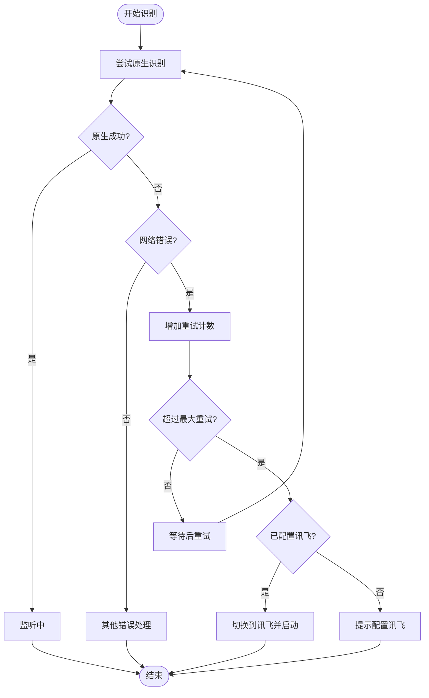
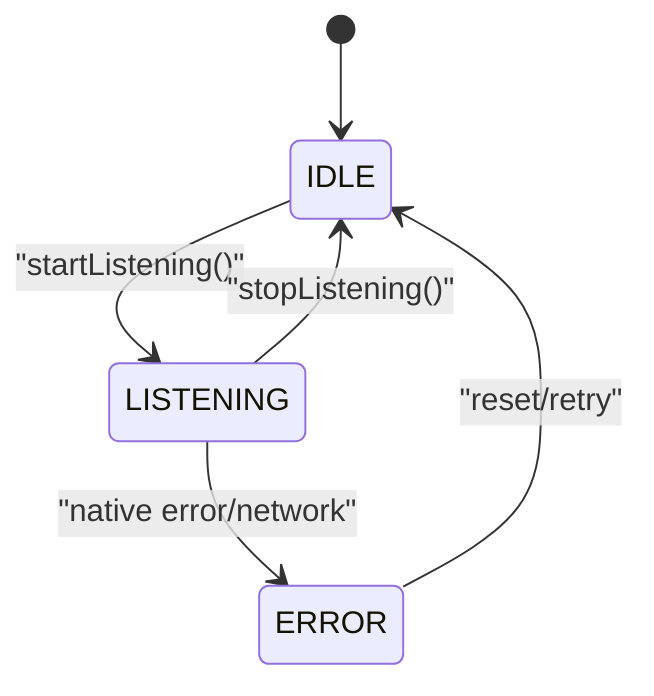
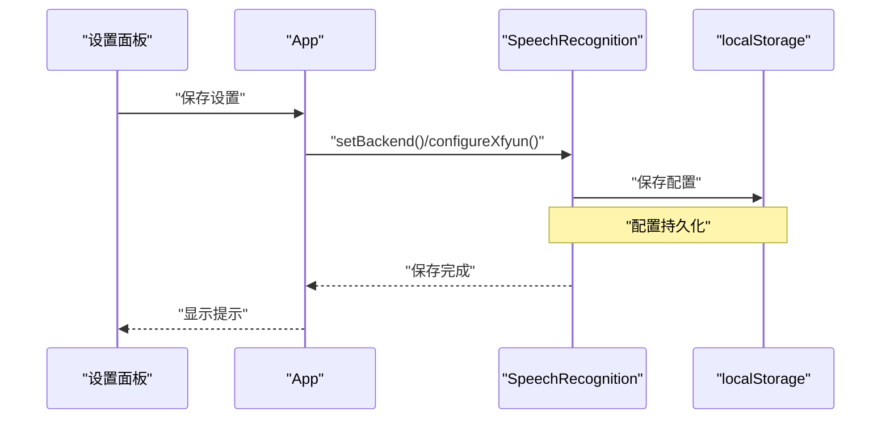
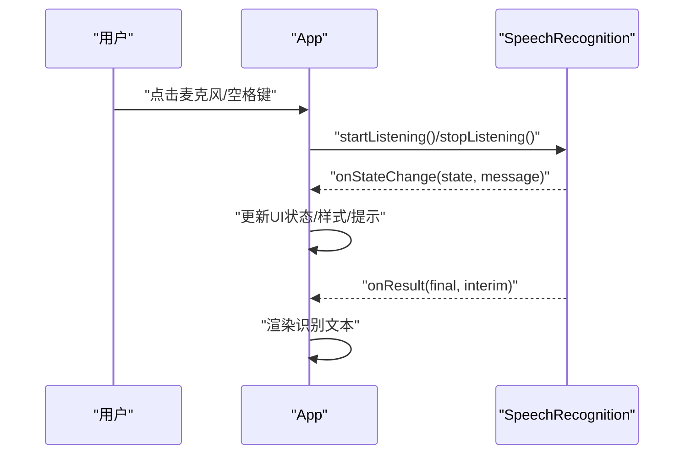
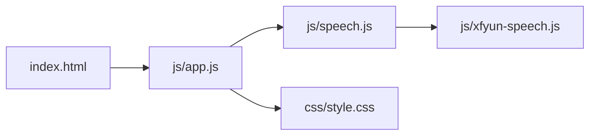

# 多后端管理机制

<cite>
**本文引用的文件**
- [index.html](file://index.html)
- [app.js](file://js/app.js)
- [speech.js](file://js/speech.js)
- [xfyun-speech.js](file://js/xfyun-speech.js)
- [style.css](file://css/style.css)
</cite>

## 目录
1. [简介](#简介)
2. [项目结构](#项目结构)
3. [核心组件](#核心组件)
4. [架构总览](#架构总览)
5. [详细组件分析](#详细组件分析)
6. [依赖关系分析](#依赖关系分析)
7. [性能考量](#性能考量)
8. [故障排查指南](#故障排查指南)
9. [结论](#结论)
10. [附录](#附录)

## 简介
本项目实现了“多后端语音识别管理机制”，通过统一的管理器在浏览器原生 Web Speech API 与讯飞语音听写 WebSocket API 之间进行无缝切换。其核心目标包括：
- BackendType 枚举设计与使用：NATIVE 与 XFYUN 的后端类型标识与切换逻辑
- 自动切换算法：基于网络错误检测、失败重试与后端切换条件
- 状态管理策略：SpeechState 枚举的状态及其转换逻辑
- 配置持久化：localStorage 的使用与配置恢复
- 最佳实践与性能对比：为不同网络环境与用户场景提供指导
- 代码示例路径：展示如何在应用中实现灵活的后端管理

## 项目结构
前端采用模块化组织，核心逻辑集中在 js 目录：
- index.html：页面骨架与设置面板
- js/app.js：应用主入口，负责事件绑定、UI 更新与后端配置同步
- js/speech.js：语音识别管理器，封装多后端切换与状态管理
- js/xfyun-speech.js：讯飞 WebSocket 客户端，负责音频采集与识别
- css/style.css：主题样式与交互反馈

图表来源
- [index.html:1-143](file://index.html#L1-L143)
- [app.js:1-292](file://js/app.js#L1-L292)
- [speech.js:1-371](file://js/speech.js#L1-L371)
- [xfyun-speech.js:1-404](file://js/xfyun-speech.js#L1-L404)
- [style.css:1-711](file://css/style.css#L1-L711)

章节来源
- [index.html:1-143](file://index.html#L1-L143)
- [app.js:1-292](file://js/app.js#L1-L292)
- [speech.js:1-371](file://js/speech.js#L1-L371)
- [xfyun-speech.js:1-404](file://js/xfyun-speech.js#L1-L404)
- [style.css:1-711](file://css/style.css#L1-L711)

## 核心组件
- BackendType 枚举：用于标识当前使用的后端类型（NATIVE / XFYUN）
- SpeechState 枚举：用于表示语音识别的状态（IDLE / LISTENING / ERROR）
- SpeechRecognition 类：统一的语音识别管理器，负责初始化、启动/停止、结果回调、状态变更、配置持久化与后端切换
- XfyunSpeech 类：讯飞 WebSocket 客户端，负责麦克风权限获取、PCM 音频捕获、WebSocket 认证与消息处理
- App 类：应用主控制器，负责 UI 事件绑定、状态更新与设置面板同步

章节来源
- [speech.js:10-39](file://js/speech.js#L10-L39)
- [speech.js:21-371](file://js/speech.js#L21-L371)
- [xfyun-speech.js:17-404](file://js/xfyun-speech.js#L17-L404)
- [app.js:12-292](file://js/app.js#L12-L292)

## 架构总览
系统采用“管理器 + 多后端客户端”的分层架构：
- 管理器层：SpeechRecognition 统一调度与状态管理
- 原生后端：浏览器 Web Speech API（仅在支持环境下启用）
- 讯飞后端：WebSocket 实时识别，适合国内网络环境
- UI 层：App 类负责事件绑定与状态渲染

图表来源
- [app.js:12-292](file://js/app.js#L12-L292)
- [speech.js:21-371](file://js/speech.js#L21-L371)
- [xfyun-speech.js:17-404](file://js/xfyun-speech.js#L17-L404)

## 详细组件分析

### BackendType 枚举与使用
- 设计目的：通过字符串常量标识后端类型，避免魔法字符串，提升可读性与可维护性
- 使用位置：
  - 初始化默认后端为 NATIVE
  - 通过设置面板切换后端类型并持久化
  - 在启动识别时根据 backend 决定调用原生或讯飞

图表来源
- [speech.js:16-39](file://js/speech.js#L16-L39)
- [speech.js:117-130](file://js/speech.js#L117-L130)

章节来源
- [speech.js:16-39](file://js/speech.js#L16-L39)
- [speech.js:117-130](file://js/speech.js#L117-L130)
- [app.js:163-178](file://js/app.js#L163-L178)

### 自动切换算法与失败重试机制
- 触发条件：
  - 原生 API 报错类型为 network 且达到最大重试次数
  - 管理器记录 nativeFailed 标志，提示自动切换到 XFYUN
- 切换流程：
  - 若已配置讯飞凭证，则自动切换 backend 为 XFYUN 并短暂延迟后启动讯飞识别
  - 若未配置，则提示需要在设置中配置讯飞 API
- 失败重试：
  - 原生 API 在非手动停止状态下，每次 end 事件会指数退避重连，最多延时至 2 秒

图表来源
- [speech.js:201-315](file://js/speech.js#L201-L315)
- [speech.js:319-325](file://js/speech.js#L319-L325)

章节来源
- [speech.js:201-315](file://js/speech.js#L201-L315)
- [speech.js:319-325](file://js/speech.js#L319-L325)

### 状态管理策略（SpeechState）
- 状态定义：
  - IDLE：空闲
  - LISTENING：正在监听
  - ERROR：发生错误
- 状态转换：
  - 原生 start -> LISTENING
  - 原生 end（非手动） -> LISTENING（自动重连）
  - 原生 end（手动） -> IDLE
  - 原生 error -> ERROR（根据错误类型）
  - 讯飞 onStateChange -> 对应映射（idle/listening/error）

图表来源
- [speech.js:10-14](file://js/speech.js#L10-L14)
- [speech.js:60-72](file://js/speech.js#L60-L72)
- [speech.js:329-336](file://js/speech.js#L329-L336)

章节来源
- [speech.js:10-14](file://js/speech.js#L10-L14)
- [speech.js:60-72](file://js/speech.js#L60-L72)
- [speech.js:329-336](file://js/speech.js#L329-L336)
- [app.js:210-243](file://js/app.js#L210-L243)

### 配置持久化与恢复（localStorage）
- 存储内容：
  - backend：当前后端类型
  - xfyun：appId、apiSecret、apiKey
- 恢复时机：
  - 初始化时从 localStorage 加载配置并恢复后端与凭证
- 保存时机：
  - 切换后端或配置讯飞凭证后立即保存

图表来源
- [app.js:163-178](file://js/app.js#L163-L178)
- [speech.js:338-370](file://js/speech.js#L338-L370)

章节来源
- [app.js:163-178](file://js/app.js#L163-L178)
- [speech.js:338-370](file://js/speech.js#L338-L370)

### 讯飞 WebSocket 客户端（XfyunSpeech）
- 功能要点：
  - 获取麦克风权限与创建 AudioContext
  - 使用 ScriptProcessorNode 捕获 PCM 音频帧
  - 通过 WebSocket 与讯飞服务建立认证连接并发送音频帧
  - 解析服务端返回的识别结果（含最终与中间结果）
- 错误处理：
  - 权限拒绝、设备不存在、WebSocket 连接失败等均映射为 ERROR 状态
- 生命周期：
  - startListening() -> 运行中 -> stopListening() -> 清理资源

图表来源
- [speech.js:319-325](file://js/speech.js#L319-L325)
- [xfyun-speech.js:67-129](file://js/xfyun-speech.js#L67-L129)
- [xfyun-speech.js:176-207](file://js/xfyun-speech.js#L176-L207)
- [xfyun-speech.js:298-347](file://js/xfyun-speech.js#L298-L347)

章节来源
- [xfyun-speech.js:17-404](file://js/xfyun-speech.js#L17-L404)
- [speech.js:319-325](file://js/speech.js#L319-L325)

### UI 与状态联动（App 类）
- 事件绑定：
  - 主界面：麦克风按钮、清空、复制
  - 设置面板：打开/关闭、引擎切换、保存设置
- 状态联动：
  - 根据 SpeechState 更新按钮样式、波形动画、录音指示线与状态提示
  - 支持键盘快捷键（空格键）控制录音

图表来源
- [app.js:69-91](file://js/app.js#L69-L91)
- [app.js:210-243](file://js/app.js#L210-L243)
- [app.js:182-208](file://js/app.js#L182-L208)

章节来源
- [app.js:69-91](file://js/app.js#L69-L91)
- [app.js:210-243](file://js/app.js#L210-L243)
- [app.js:182-208](file://js/app.js#L182-L208)

## 依赖关系分析
- 模块依赖：
  - app.js 依赖 speech.js（导入 BackendType、SpeechState、SpeechRecognition）
  - speech.js 依赖 xfyun-speech.js（导入 XfyunSpeech）
  - index.html 通过 module script 引入 app.js
- 耦合度与内聚性：
  - 低耦合：UI 与业务逻辑分离，管理器集中处理后端切换与状态
  - 高内聚：每个类职责单一，XfyunSpeech 专注 WebSocket 识别

图表来源
- [index.html:140](file://index.html#L140)
- [app.js:9-11](file://js/app.js#L9-L11)
- [speech.js:8](file://js/speech.js#L8)

章节来源
- [index.html:140](file://index.html#L140)
- [app.js:9-11](file://js/app.js#L9-L11)
- [speech.js:8](file://js/speech.js#L8)

## 性能考量
- 原生 Web Speech API
  - 优点：无需额外网络请求，延迟低；适合国际网络环境
  - 缺点：国内网络可能受限（网络错误），自动重连存在退避延迟
- 讯飞 WebSocket
  - 优点：针对国内网络优化，稳定性较好；支持实时流式识别
  - 缺点：需要网络与鉴权配置；WebSocket 连接与音频编码有额外开销
- 最佳实践
  - 默认使用原生后端，遇到网络错误自动切换至讯飞
  - 在设置中预填讯飞凭证，减少首次切换成本
  - 合理设置自动重试上限，避免频繁重试影响体验
  - 使用 UI 状态提示与波形动画增强用户感知

[本节为通用性能讨论，不直接分析具体文件]

## 故障排查指南
- 常见问题与定位
  - 原生网络错误：检查网络连通性与浏览器代理设置；观察自动切换日志
  - 讯飞未配置：在设置面板填写 APPID/APISecret/APIKey；保存后重启识别
  - 权限被拒：检查浏览器麦克风权限；重新授权后重试
  - WebSocket 连接失败：检查网络与 API 配置；查看错误提示
- 日志与提示
  - 原生错误类型会在控制台输出；UI 显示对应错误信息
  - 讯飞错误码与消息会打印到控制台；UI 显示错误状态

章节来源
- [speech.js:273-315](file://js/speech.js#L273-L315)
- [xfyun-speech.js:114-128](file://js/xfyun-speech.js#L114-L128)
- [xfyun-speech.js:298-347](file://js/xfyun-speech.js#L298-L347)

## 结论
该多后端语音识别管理机制通过清晰的枚举设计、完善的自动切换算法与状态管理，以及可靠的配置持久化，实现了在不同网络环境下的稳定识别体验。结合 UI 的即时反馈与设置面板的灵活配置，用户可在浏览器原生与讯飞之间自由切换，并获得一致的使用感受。

[本节为总结性内容，不直接分析具体文件]

## 附录

### 代码示例路径（如何在应用中实现灵活的后端管理）
- 在设置面板中切换后端并保存配置
  - 示例路径：[app.js:163-178](file://js/app.js#L163-L178)
- 初始化语音识别并注册回调
  - 示例路径：[app.js:47-50](file://js/app.js#L47-L50)
- 根据状态更新 UI
  - 示例路径：[app.js:210-243](file://js/app.js#L210-L243)
- 管理器内部的后端切换与错误处理
  - 示例路径：[speech.js:273-315](file://js/speech.js#L273-L315)
- 讯飞 WebSocket 客户端的启动与消息处理
  - 示例路径：[xfyun-speech.js:67-129](file://js/xfyun-speech.js#L67-L129)
  - 示例路径：[xfyun-speech.js:298-347](file://js/xfyun-speech.js#L298-L347)