# 讯飞后端支持

<cite>
**本文档引用的文件**
- [xfyun-speech.js](file://js/xfyun-speech.js)
- [speech.js](file://js/speech.js)
- [app.js](file://js/app.js)
- [index.html](file://index.html)
- [style.css](file://css/style.css)
</cite>

## 目录
1. [简介](#简介)
2. [项目结构](#项目结构)
3. [核心组件](#核心组件)
4. [架构概览](#架构概览)
5. [详细组件分析](#详细组件分析)
6. [依赖关系分析](#依赖关系分析)
7. [性能考虑](#性能考虑)
8. [故障排除指南](#故障排除指南)
9. [结论](#结论)

## 简介

这是一个基于Web技术的语音识别系统，支持多后端识别引擎，包括浏览器原生Web Speech API和讯飞WebSocket语音识别服务。该系统提供了完整的语音识别解决方案，具有自动降级机制，能够在不同网络环境下智能切换识别引擎。

系统的核心特性包括：
- 支持浏览器原生语音识别和讯飞云端识别
- 自动网络错误检测和引擎切换
- 实时音频流处理和WebSocket通信
- 完整的UI状态管理和用户体验优化
- 本地存储配置持久化

## 项目结构

该项目采用模块化的JavaScript架构，主要包含以下核心文件：

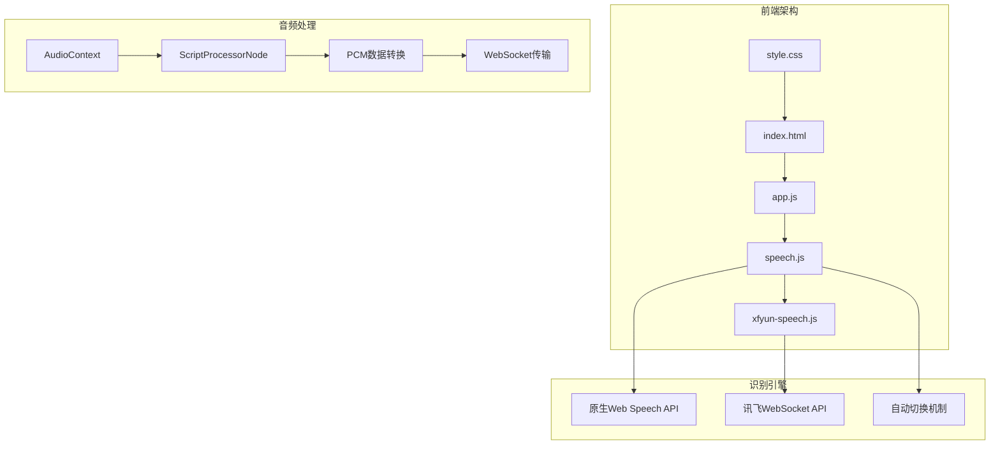

**图表来源**
- [index.html:1-143](file://index.html#L1-L143)
- [app.js:1-292](file://js/app.js#L1-L292)
- [speech.js:1-371](file://js/speech.js#L1-L371)
- [xfyun-speech.js:1-404](file://js/xfyun-speech.js#L1-L404)

**章节来源**
- [index.html:1-143](file://index.html#L1-L143)
- [app.js:1-292](file://js/app.js#L1-L292)
- [speech.js:1-371](file://js/speech.js#L1-L371)
- [xfyun-speech.js:1-404](file://js/xfyun-speech.js#L1-L404)

## 核心组件

### XfyunSpeech 类

XfyunSpeech类是讯飞WebSocket语音识别的核心实现，负责处理所有与讯飞API的交互。

**主要职责：**
- WebSocket连接建立和维护
- 麦克风音频数据捕获和处理
- 讯飞API认证和签名生成
- 实时音频流传输和识别结果处理

**关键配置参数：**
- `appId`: 讯飞应用标识符
- `apiSecret`: API密钥，用于HMAC-SHA256签名
- `apiKey`: 认证API密钥

**章节来源**
- [xfyun-speech.js:17-41](file://js/xfyun-speech.js#L17-L41)
- [xfyun-speech.js:37-41](file://js/xfyun-speech.js#L37-L41)

### SpeechRecognition 管理器

SpeechRecognition类提供统一的语音识别接口，支持多种后端引擎的无缝切换。

**核心功能：**
- 多后端引擎管理（原生API vs 讯飞）
- 自动网络错误检测和降级
- 状态管理和回调处理
- 配置持久化存储

**章节来源**
- [speech.js:21-39](file://js/speech.js#L21-L39)
- [speech.js:16-19](file://js/speech.js#L16-L19)

### 应用主控制器

App类作为应用程序的主控制器，负责UI交互、事件处理和状态同步。

**主要职责：**
- 用户界面事件绑定和处理
- 语音识别状态与UI的双向同步
- 设置面板的显示和配置管理
- 系统初始化和资源管理

**章节来源**
- [app.js:12-41](file://js/app.js#L12-L41)
- [app.js:43-65](file://js/app.js#L43-L65)

## 架构概览

系统采用分层架构设计，实现了清晰的关注点分离：

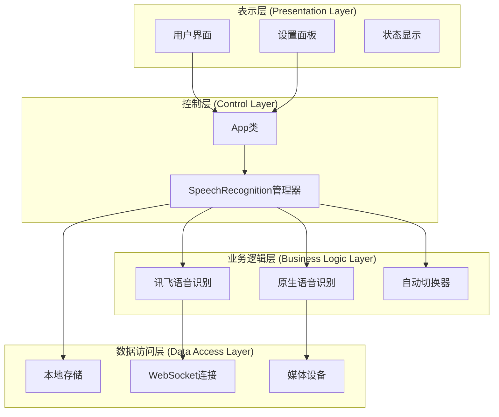

**图表来源**
- [app.js:12-41](file://js/app.js#L12-L41)
- [speech.js:21-39](file://js/speech.js#L21-L39)
- [xfyun-speech.js:17-32](file://js/xfyun-speech.js#L17-L32)

## 详细组件分析

### 讯飞WebSocket连接机制

#### 连接建立流程

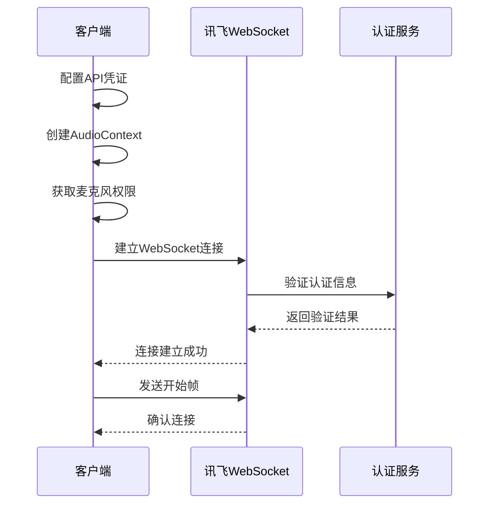

**图表来源**
- [xfyun-speech.js:67-129](file://js/xfyun-speech.js#L67-L129)
- [xfyun-speech.js:176-207](file://js/xfyun-speech.js#L176-L207)

#### 认证机制实现

讯飞API使用HMAC-SHA256签名进行安全认证：

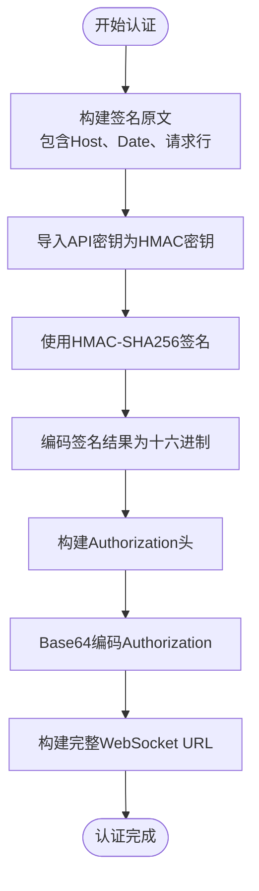

**图表来源**
- [xfyun-speech.js:212-225](file://js/xfyun-speech.js#L212-L225)
- [xfyun-speech.js:228-246](file://js/xfyun-speech.js#L228-L246)

**章节来源**
- [xfyun-speech.js:176-225](file://js/xfyun-speech.js#L176-L225)
- [xfyun-speech.js:228-246](file://js/xfyun-speech.js#L228-L246)

### WebSocket数据传输协议

#### 音频帧格式

讯飞WebSocket使用JSON格式传输音频数据：

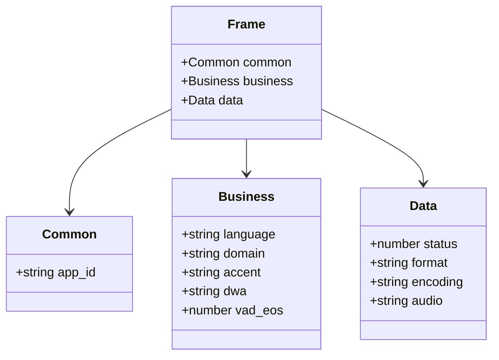

**图表来源**
- [xfyun-speech.js:265-293](file://js/xfyun-speech.js#L265-L293)

#### 音频数据处理流程

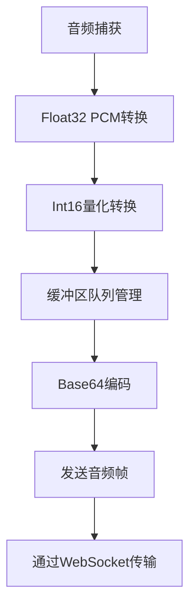

**图表来源**
- [xfyun-speech.js:381-402](file://js/xfyun-speech.js#L381-L402)
- [xfyun-speech.js:251-260](file://js/xfyun-speech.js#L251-L260)

**章节来源**
- [xfyun-speech.js:251-293](file://js/xfyun-speech.js#L251-L293)
- [xfyun-speech.js:381-402](file://js/xfyun-speech.js#L381-L402)

### 自动降级策略

#### 网络错误检测机制

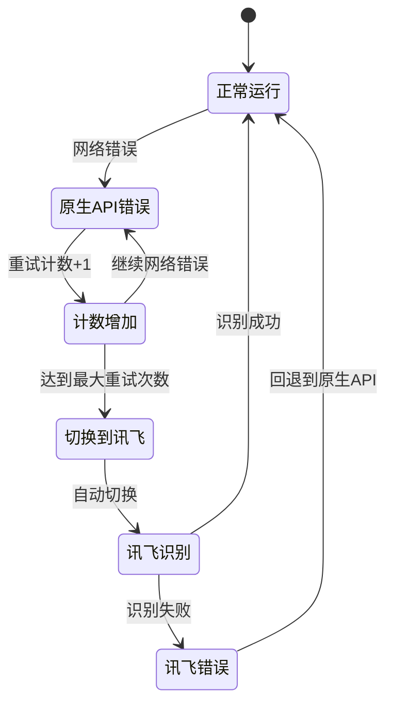

**图表来源**
- [speech.js:282-302](file://js/speech.js#L282-L302)
- [speech.js:294-297](file://js/speech.js#L294-L297)

#### 降级触发条件

系统会在以下情况下自动切换到讯飞引擎：
- 原生API返回网络错误
- 达到最大重试次数（默认1次）
- 讯飞API凭证已配置
- 自动切换机制启用

**章节来源**
- [speech.js:282-315](file://js/speech.js#L282-L315)
- [speech.js:294-297](file://js/speech.js#L294-L297)

### 配置管理系统

#### 配置存储结构

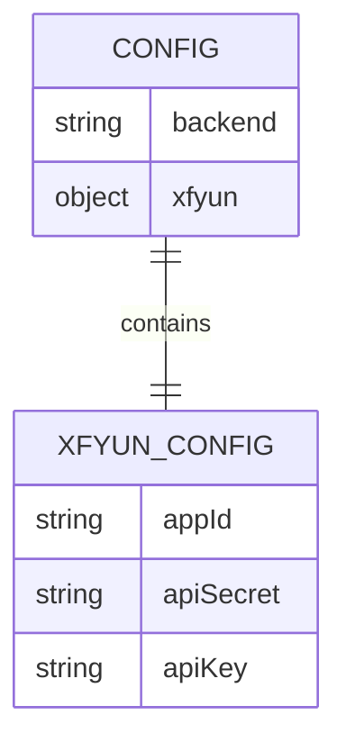

**图表来源**
- [speech.js:340-352](file://js/speech.js#L340-L352)
- [speech.js:354-369](file://js/speech.js#L354-L369)

#### 配置持久化流程

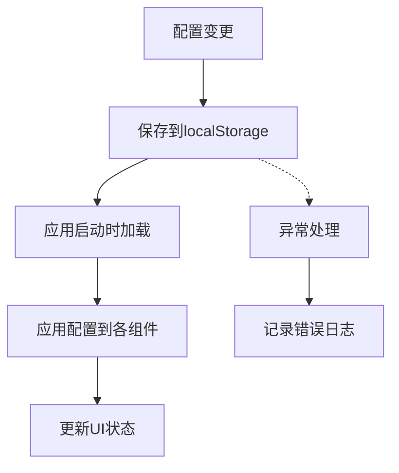

**图表来源**
- [speech.js:338-369](file://js/speech.js#L338-L369)

**章节来源**
- [speech.js:338-369](file://js/speech.js#L338-L369)

## 依赖关系分析

### 模块依赖图

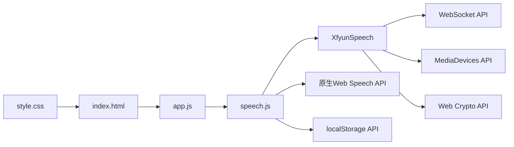

**图表来源**
- [app.js:9-10](file://js/app.js#L9-L10)
- [speech.js:8](file://js/speech.js#L8)
- [xfyun-speech.js:13](file://js/xfyun-speech.js#L13)

### 外部API依赖

系统依赖以下Web标准API：

| API类别 | 用途 | 版本要求 |
|---------|------|----------|
| WebSocket | 与讯飞服务器通信 | HTML5 |
| MediaDevices | 麦克风权限和音频输入 | HTML5 |
| AudioContext | 音频处理和采样 | Web Audio API |
| ScriptProcessorNode | PCM数据捕获 | Web Audio API |
| localStorage | 配置持久化 | HTML5 |
| Web Crypto API | HMAC-SHA256签名 | Web Crypto API |

**章节来源**
- [xfyun-speech.js:13](file://js/xfyun-speech.js#L13)
- [xfyun-speech.js:87-89](file://js/xfyun-speech.js#L87-L89)
- [xfyun-speech.js:230-246](file://js/xfyun-speech.js#L230-L246)

## 性能考虑

### 音频处理优化

系统采用了多项性能优化措施：

1. **缓冲区管理**：使用队列管理音频数据，避免内存泄漏
2. **采样率优化**：16kHz采样率平衡质量与性能
3. **帧大小调优**：4096字节帧大小优化网络传输效率
4. **异步处理**：使用Promise和async/await避免阻塞主线程

### 内存管理策略

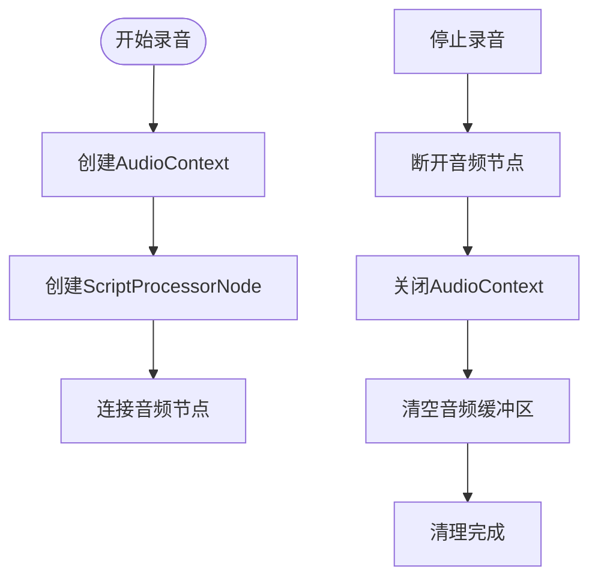

**图表来源**
- [xfyun-speech.js:352-376](file://js/xfyun-speech.js#L352-L376)

### 网络优化策略

1. **连接池管理**：单个WebSocket连接处理所有音频传输
2. **错误重试**：智能重试机制避免频繁连接失败
3. **流量控制**：根据音频质量动态调整传输频率
4. **资源回收**：及时释放音频和网络资源

## 故障排除指南

### 常见问题及解决方案

#### 讯飞API配置问题

**问题症状：**
- "请先在设置中配置讯飞 API 凭证"
- WebSocket连接失败

**解决步骤：**
1. 登录讯飞开放平台创建应用
2. 获取APPID、APISecret、APIKey
3. 在设置面板中正确填写凭证
4. 确保网络可以访问讯飞服务

**章节来源**
- [xfyun-speech.js:68-73](file://js/xfyun-speech.js#L68-L73)
- [speech.js:319-324](file://js/speech.js#L319-L324)

#### 麦克风权限问题

**问题症状：**
- "麦克风权限被拒绝"
- "未找到麦克风设备"

**解决步骤：**
1. 检查浏览器权限设置
2. 确认麦克风设备正常工作
3. 尝试使用HTTPS协议
4. 重新授权麦克风访问

**章节来源**
- [xfyun-speech.js:117-127](file://js/xfyun-speech.js#L117-L127)

#### 网络连接问题

**问题症状：**
- "连接讯飞服务失败，请检查网络和API配置"
- "讯飞服务连接断开"

**解决步骤：**
1. 检查网络连接稳定性
2. 确认防火墙设置允许WebSocket连接
3. 验证API凭证有效性
4. 尝试切换到原生引擎

**章节来源**
- [xfyun-speech.js:121-127](file://js/xfyun-speech.js#L121-L127)
- [speech.js:201-204](file://js/speech.js#L201-L204)

### 调试工具和技巧

1. **浏览器开发者工具**：监控WebSocket连接状态
2. **控制台日志**：查看详细的错误信息
3. **网络面板**：分析音频数据传输
4. **音频分析器**：验证PCM数据质量

## 结论

本项目提供了一个完整且高效的语音识别解决方案，具有以下优势：

1. **多后端支持**：灵活的引擎选择和自动切换机制
2. **完整的功能实现**：从音频捕获到识别结果的全流程处理
3. **良好的用户体验**：直观的UI界面和流畅的操作体验
4. **健壮的错误处理**：完善的异常处理和降级策略
5. **现代化的架构**：模块化设计便于维护和扩展

系统特别适合在中国大陆网络环境下使用，通过自动切换机制确保在各种网络条件下都能提供稳定的语音识别服务。开发者可以根据具体需求进一步定制和扩展功能。