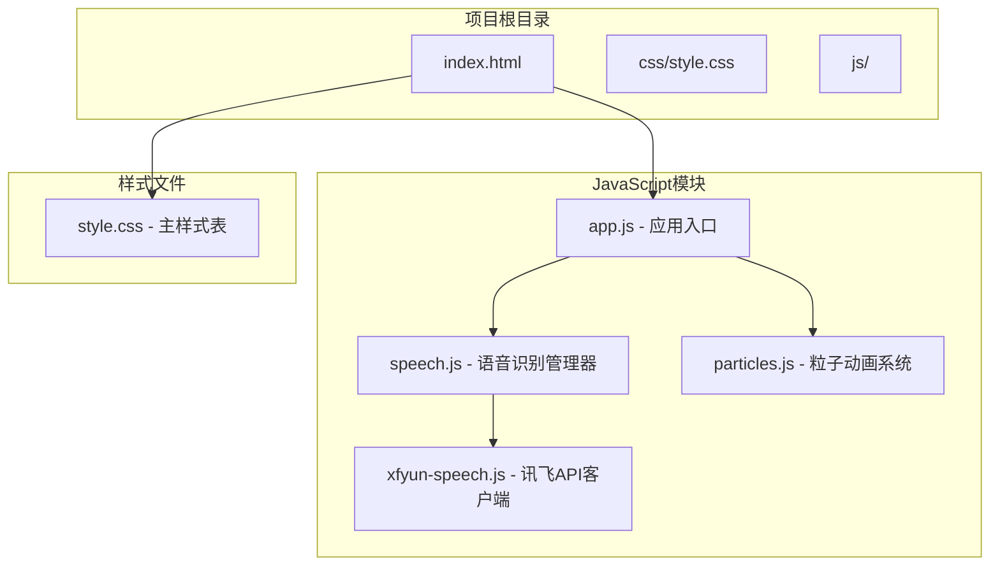
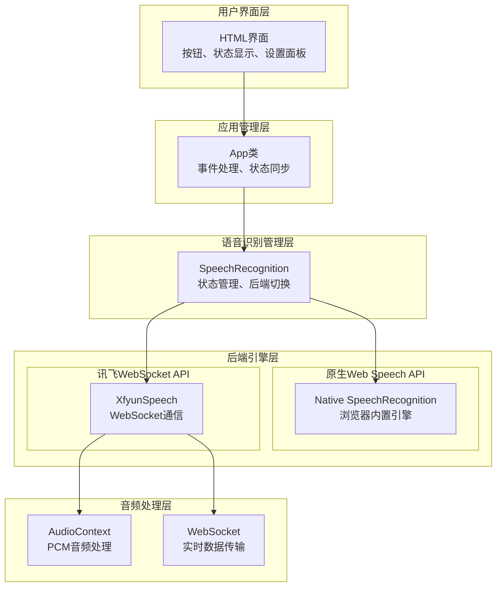
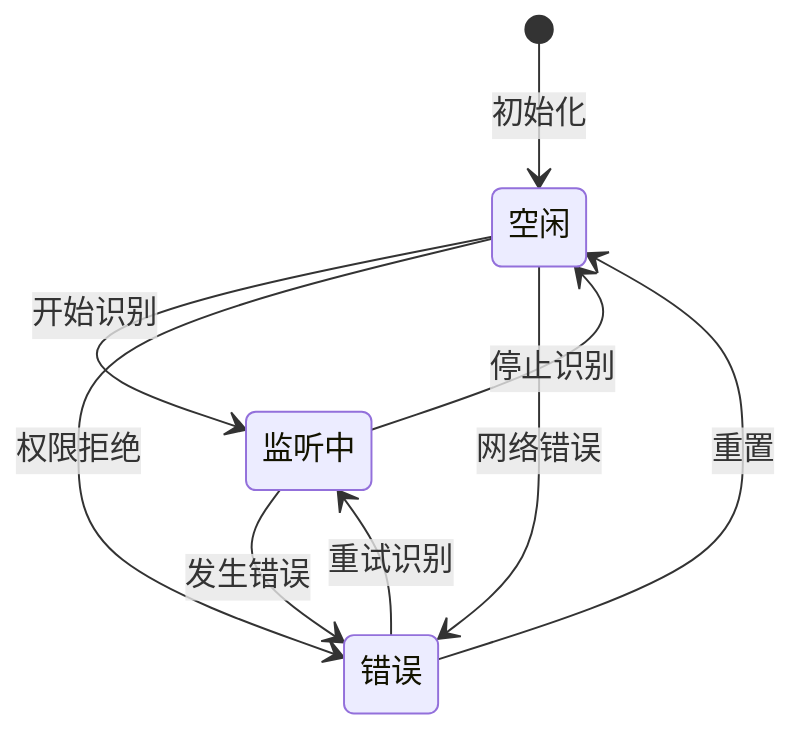
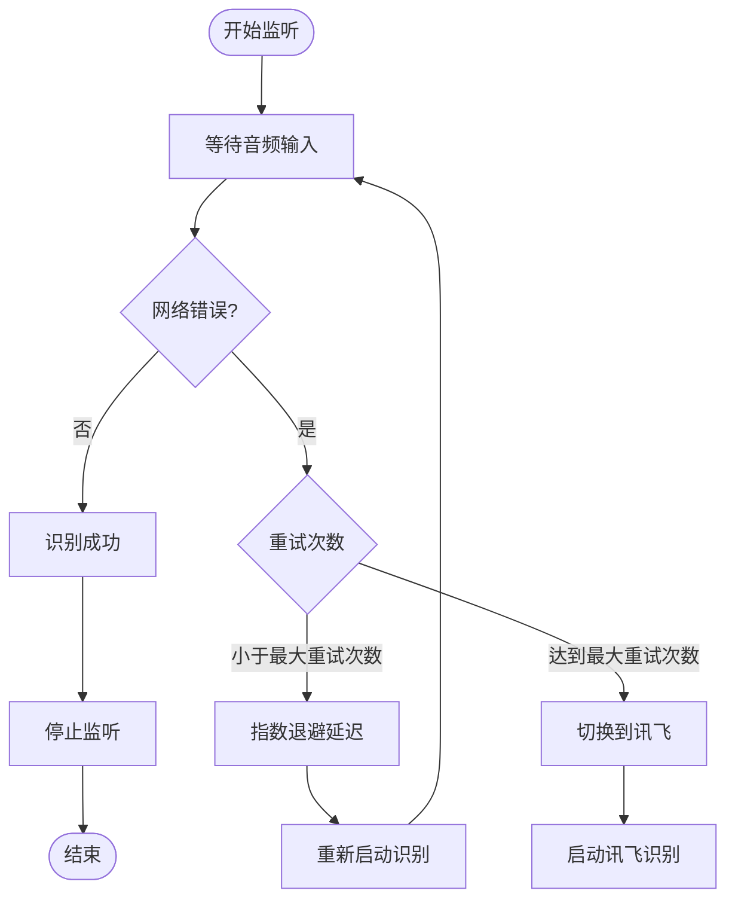
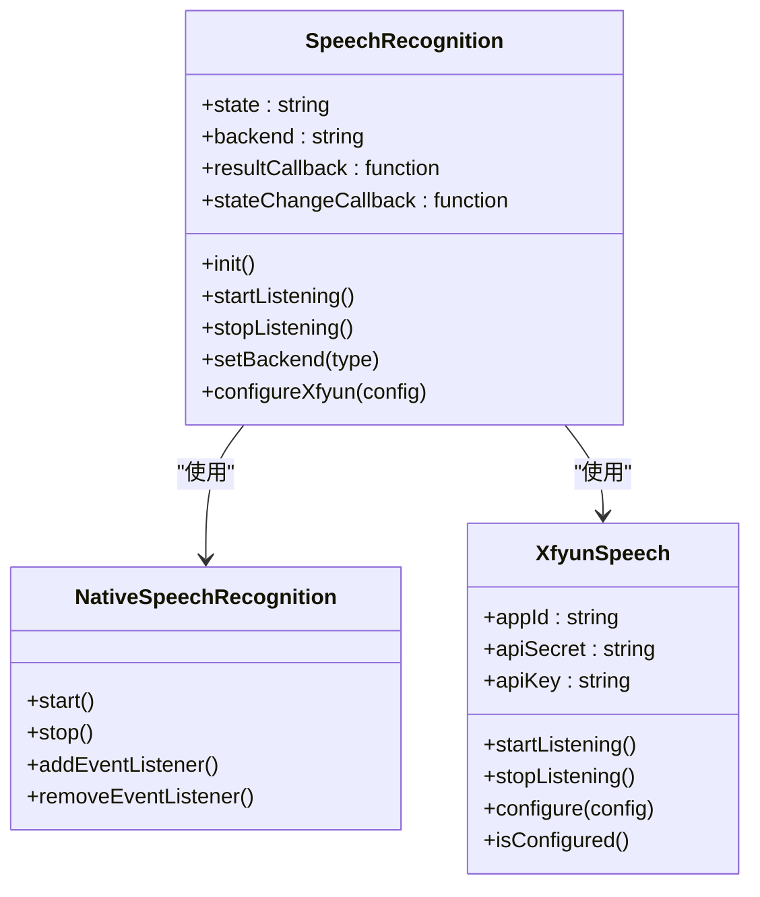
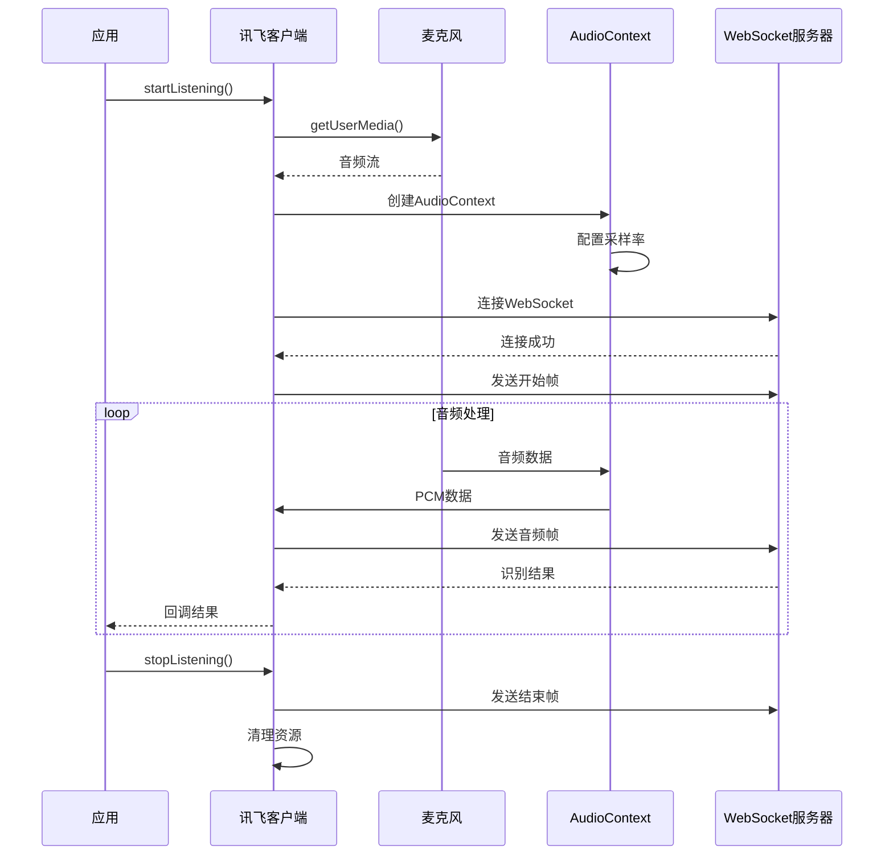
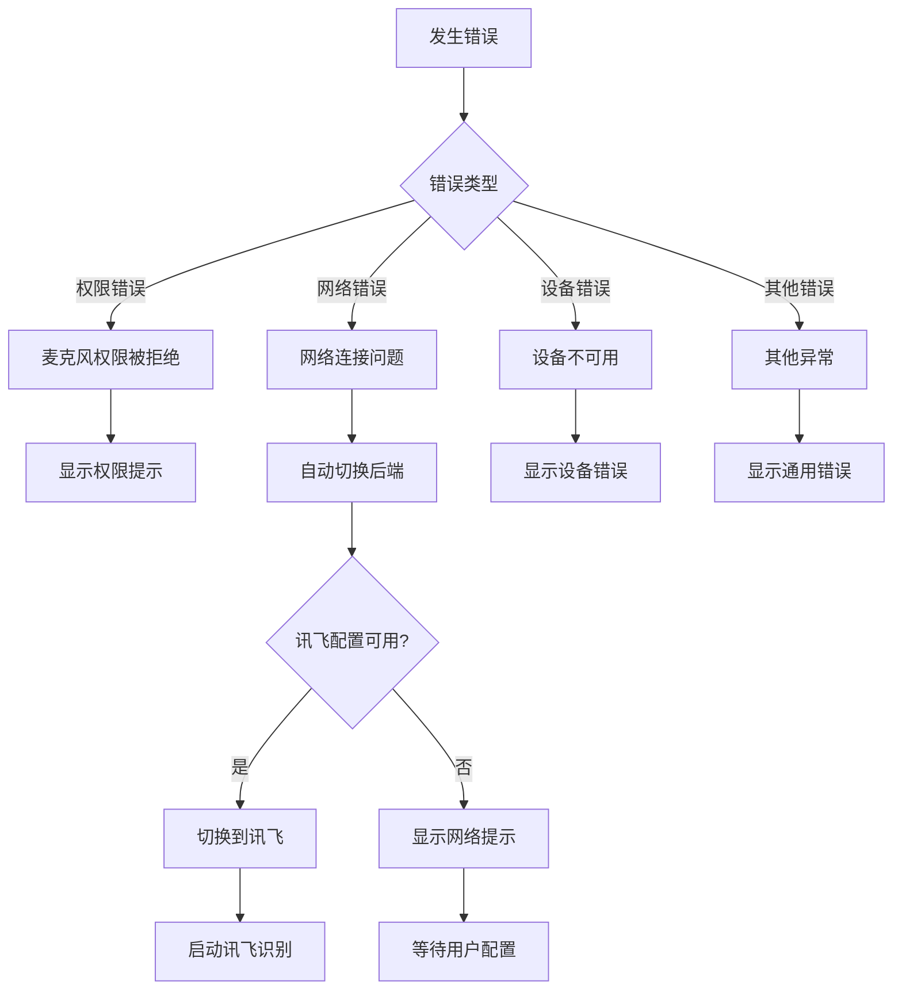
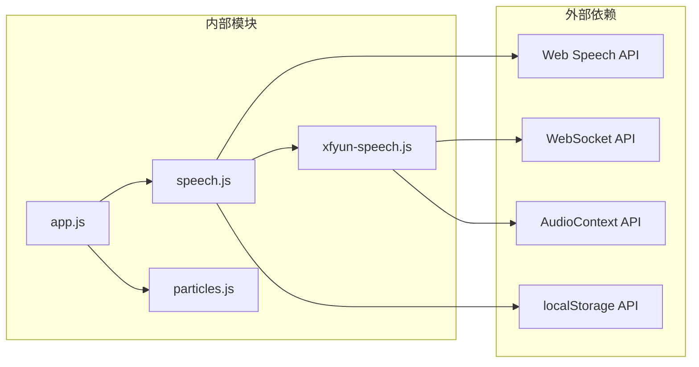

# 语音识别模块详解

<cite>
**本文档引用的文件**
- [README.md](file://README.md)
- [index.html](file://index.html)
- [speech.js](file://js/speech.js)
- [xfyun-speech.js](file://js/xfyun-speech.js)
- [app.js](file://js/app.js)
- [style.css](file://css/style.css)
- [particles.js](file://js/particles.js)
</cite>

## 目录
1. [简介](#简介)
2. [项目结构](#项目结构)
3. [核心组件](#核心组件)
4. [架构概览](#架构概览)
5. [详细组件分析](#详细组件分析)
6. [依赖关系分析](#依赖关系分析)
7. [性能考虑](#性能考虑)
8. [故障排除指南](#故障排除指南)
9. [结论](#结论)
10. [附录](#附录)

## 简介

这是一个基于Web Speech API的多后端语音识别模块，支持浏览器原生Web Speech API和讯飞WebSocket API两种识别引擎。该模块提供了完整的语音识别解决方案，包括自动重连、错误处理、状态管理和用户界面集成等功能。

项目采用现代化的前端架构，使用ES6模块化设计，支持响应式布局和丰富的视觉效果。核心功能包括实时语音转文字、多后端自动切换、错误降级处理等特性。

## 项目结构

该项目采用清晰的模块化组织结构，主要由以下几个部分组成：

**图表来源**
- [index.html](file://index.html)
- [app.js](file://js/app.js)
- [speech.js](file://js/speech.js)
- [xfyun-speech.js](file://js/xfyun-speech.js)
- [style.css](file://css/style.css)

**章节来源**
- [index.html](file://index.html)
- [style.css](file://css/style.css)

## 核心组件

### 语音识别管理器 (SpeechRecognition)

语音识别管理器是整个系统的核心组件，负责协调两个后端引擎的工作。它实现了统一的接口，隐藏了底层实现的复杂性。

#### 主要功能特性

1. **双后端支持**：同时支持浏览器原生Web Speech API和讯飞WebSocket API
2. **自动切换机制**：根据网络状况自动在两个后端之间切换
3. **状态管理**：维护识别状态的完整生命周期
4. **错误处理**：提供完善的错误捕获和降级策略
5. **配置持久化**：使用localStorage保存用户偏好设置

#### 关键属性和方法

- `state`: 当前识别状态（idle/listening/error）
- `backend`: 当前后端类型（native/xfyun）
- `onResult()`: 结果回调函数注册
- `onStateChange()`: 状态变化回调函数注册
- `startListening()`: 开始语音识别
- `stopListening()`: 停止语音识别
- `configureXfyun()`: 配置讯飞API凭证

**章节来源**
- [speech.js](file://js/speech.js)

### 讯飞WebSocket客户端 (XfyunSpeech)

讯飞WebSocket客户端专门处理与讯飞语音识别服务的通信，提供了完整的音频采集、传输和识别流程。

#### 技术特点

1. **实时音频传输**：使用AudioContext捕获PCM音频数据
2. **WebSocket通信**：建立持久连接进行实时数据传输
3. **音频预处理**：将Float32音频数据转换为Int16格式
4. **认证机制**：实现讯飞API的签名验证
5. **错误恢复**：具备连接断开后的自动重连能力

**章节来源**
- [xfyun-speech.js](file://js/xfyun-speech.js)

### 应用入口 (App)

应用入口负责初始化整个系统，包括粒子动画、语音识别模块和用户界面的协调工作。

#### 主要职责

1. **系统初始化**：检测浏览器兼容性和初始化各组件
2. **事件绑定**：处理用户交互事件
3. **状态同步**：保持UI状态与语音识别状态的一致性
4. **错误处理**：提供用户友好的错误提示

**章节来源**
- [app.js](file://js/app.js)

## 架构概览

系统采用分层架构设计，通过抽象层屏蔽不同后端的实现差异，提供统一的接口给上层应用。

**图表来源**
- [app.js](file://js/app.js)
- [speech.js](file://js/speech.js)
- [xfyun-speech.js](file://js/xfyun-speech.js)

## 详细组件分析

### 状态管理系统

系统实现了完整的状态管理机制，使用枚举定义了三种核心状态：

**图表来源**
- [speech.js](file://js/speech.js)

#### 状态转换逻辑

1. **空闲状态 (IDLE)**：系统初始状态，等待用户触发识别
2. **监听中状态 (LISTENING)**：正在进行语音识别，接收实时结果
3. **错误状态 (ERROR)**：发生异常情况，需要用户干预

每种状态都有对应的状态变化回调，用于更新UI显示和执行相应的处理逻辑。

**章节来源**
- [speech.js](file://js/speech.js)

### 自动重连算法

原生Web Speech API实现了智能的自动重连机制，能够处理网络中断等异常情况：

**图表来源**
- [speech.js](file://js/speech.js)

#### 重连策略细节

1. **指数退避延迟**：每次重试间隔增加，最多不超过2秒
2. **最大重试限制**：限制自动重试次数，避免无限循环
3. **条件切换**：当网络错误持续出现时自动切换到讯飞后端
4. **手动停止保护**：确保用户主动停止时不会被意外重启

**章节来源**
- [speech.js](file://js/speech.js)

### 多后端支持机制

系统实现了灵活的多后端支持，通过统一接口抽象不同后端的差异：

**图表来源**
- [speech.js](file://js/speech.js)
- [xfyun-speech.js](file://js/xfyun-speech.js)

#### 后端差异对比

| 特性 | 原生Web Speech API | 讯飞WebSocket API |
|------|-------------------|-------------------|
| 识别质量 | 高（云端AI） | 高（专业语音识别） |
| 网络要求 | 需要外网访问 | 需要外网访问 |
| 配置复杂度 | 简单 | 需要API凭证 |
| 本地处理 | 支持 | 不支持 |
| 实时性 | 良好 | 优秀 |
| 国内支持 | 一般 | 优秀 |

**章节来源**
- [speech.js](file://js/speech.js)
- [xfyun-speech.js](file://js/xfyun-speech.js)

### 讯飞WebSocket实现

讯飞WebSocket客户端提供了完整的音频处理和通信功能：

**图表来源**
- [xfyun-speech.js](file://js/xfyun-speech.js)

#### 音频处理流程

1. **音频采集**：使用getUserMedia获取麦克风权限
2. **音频格式转换**：将Float32音频数据转换为Int16格式
3. **WebSocket传输**：将音频数据编码后通过WebSocket发送
4. **结果解析**：解析服务器返回的识别结果

**章节来源**
- [xfyun-speech.js](file://js/xfyun-speech.js)

### 错误处理和降级策略

系统实现了多层次的错误处理机制：

**图表来源**
- [speech.js](file://js/speech.js)
- [xfyun-speech.js](file://js/xfyun-speech.js)

#### 错误分类和处理

1. **权限错误**：引导用户检查浏览器设置
2. **网络错误**：自动切换到备用后端
3. **设备错误**：提示用户检查硬件连接
4. **认证错误**：要求用户提供正确的API凭证

**章节来源**
- [speech.js](file://js/speech.js)
- [xfyun-speech.js](file://js/xfyun-speech.js)

## 依赖关系分析

系统采用了清晰的模块化依赖关系，每个模块都有明确的职责边界：

**图表来源**
- [app.js](file://js/app.js)
- [speech.js](file://js/speech.js)
- [xfyun-speech.js](file://js/xfyun-speech.js)

### 模块耦合度分析

- **低耦合设计**：各模块职责单一，相互依赖关系清晰
- **接口抽象**：通过统一接口隐藏实现细节
- **配置驱动**：后端选择和行为通过配置控制
- **事件驱动**：状态变化通过回调通知

**章节来源**
- [app.js](file://js/app.js)
- [speech.js](file://js/speech.js)
- [xfyun-speech.js](file://js/xfyun-speech.js)

## 性能考虑

### 音频处理优化

1. **采样率优化**：使用16kHz采样率平衡音质和性能
2. **缓冲区管理**：合理设置音频缓冲区大小，避免内存泄漏
3. **垃圾回收**：及时清理不再使用的音频对象
4. **CPU使用率**：通过节流和去抖减少不必要的计算

### 网络通信优化

1. **连接池管理**：复用WebSocket连接，减少握手开销
2. **数据压缩**：使用Base64编码传输音频数据
3. **错误重试**：实现指数退避重试机制
4. **超时控制**：设置合理的连接和请求超时时间

### 内存管理

1. **对象池**：复用音频缓冲区和WebSocket消息对象
2. **定时器清理**：及时清理不再使用的定时器
3. **事件监听器**：在适当时候移除事件监听器
4. **资源释放**：确保音频上下文和媒体流正确关闭

## 故障排除指南

### 常见问题诊断

#### 浏览器兼容性问题

**症状**：页面显示不支持语音识别

**原因**：
- 浏览器不支持Web Speech API
- 使用了不受支持的浏览器版本

**解决方法**：
- 使用Chrome、Edge或Safari浏览器
- 确保浏览器版本满足最低要求
- 在HTTPS环境下运行应用

#### 麦克风权限问题

**症状**：无法开始语音识别，提示权限被拒绝

**原因**：
- 用户拒绝了麦克风访问权限
- 浏览器阻止了麦克风访问

**解决方法**：
- 检查浏览器设置中的权限配置
- 确认网站具有麦克风访问权限
- 尝试刷新页面重新获取权限

#### 网络连接问题

**症状**：原生API频繁报错，自动切换到讯飞

**原因**：
- 网络不稳定或受限
- 防火墙阻止了Google服务访问
- DNS解析问题

**解决方法**：
- 检查网络连接稳定性
- 配置代理或VPN
- 使用讯飞后端作为替代方案

#### 讯飞API配置问题

**症状**：讯飞识别无法正常工作

**原因**：
- API凭证配置错误
- 网络环境不支持WebSocket
- 服务端返回认证失败

**解决方法**：
- 在讯飞开放平台重新申请API凭证
- 确认网络环境支持WebSocket通信
- 检查API配额和使用限制

### 调试技巧

1. **开发者工具**：使用浏览器开发者工具监控网络请求
2. **日志输出**：查看控制台中的错误信息和警告
3. **状态检查**：通过状态回调监控系统状态变化
4. **性能分析**：使用性能面板分析CPU和内存使用情况

**章节来源**
- [speech.js](file://js/speech.js)
- [xfyun-speech.js](file://js/xfyun-speech.js)

## 结论

这个语音识别模块展现了现代Web应用开发的最佳实践，通过模块化设计、状态管理和错误处理机制，提供了稳定可靠的语音识别功能。

### 主要优势

1. **多后端支持**：灵活的后端选择和自动切换机制
2. **用户体验友好**：直观的界面设计和实时反馈
3. **错误处理完善**：多层次的错误捕获和降级策略
4. **性能优化**：针对音频处理和网络通信的优化措施
5. **代码结构清晰**：模块化设计便于维护和扩展

### 技术亮点

- **状态管理模式**：完整的状态机设计，确保系统行为可预测
- **自动重连算法**：智能的网络异常处理机制
- **音频处理优化**：高效的PCM音频数据处理流程
- **WebSocket通信**：实时音频传输的可靠实现
- **响应式设计**：适配多种设备和屏幕尺寸

该模块为开发者提供了一个完整的语音识别解决方案，既适合个人项目使用，也适合作为企业级应用的基础组件。

## 附录

### 使用模式和最佳实践

#### 基础使用模式

1. **初始化配置**：在应用启动时初始化语音识别模块
2. **事件绑定**：注册结果和状态变化回调函数
3. **用户交互**：通过按钮或快捷键触发识别
4. **状态管理**：根据状态更新UI显示

#### 高级使用模式

1. **自定义后端**：扩展新的语音识别后端
2. **结果处理**：对识别结果进行二次处理和过滤
3. **性能监控**：监控识别性能和资源使用情况
4. **错误统计**：收集和分析错误类型和频率

#### 配置选项

- **语言设置**：支持多种语言的语音识别
- **采样率配置**：根据需求调整音频采样率
- **缓冲区大小**：优化音频处理性能
- **重试策略**：自定义网络错误处理策略