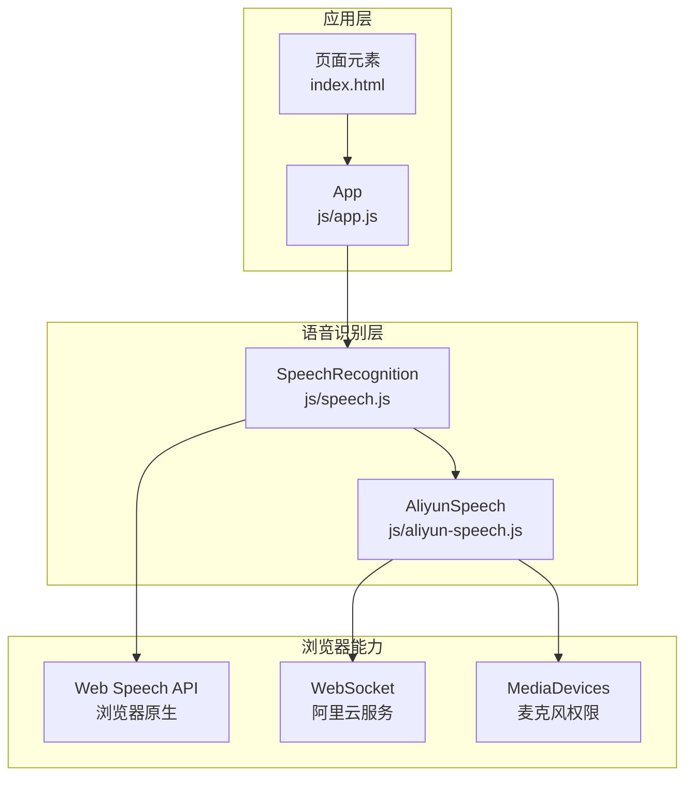
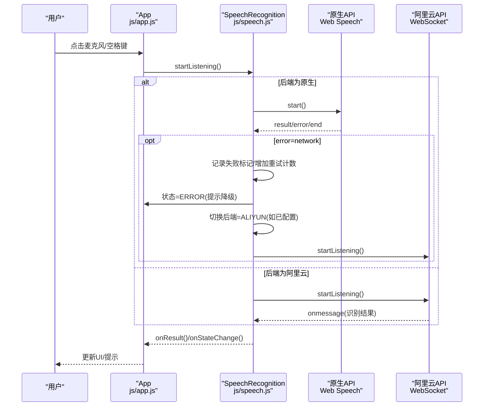
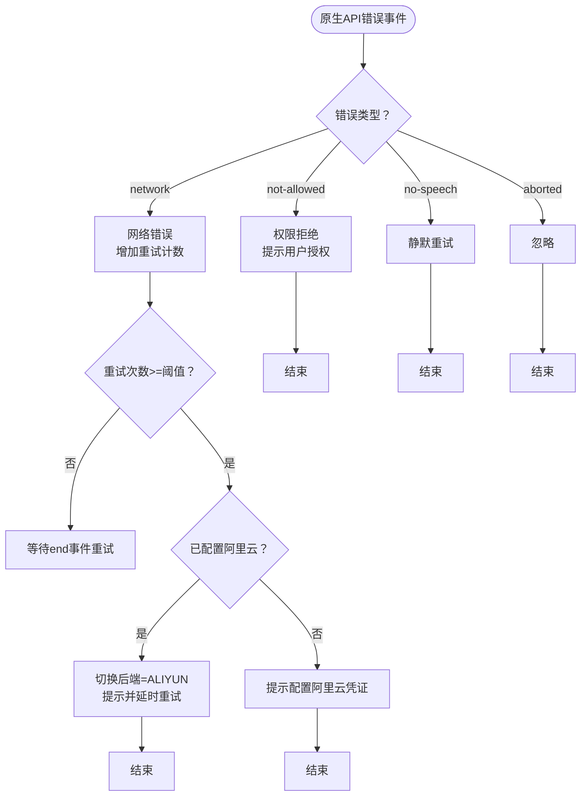
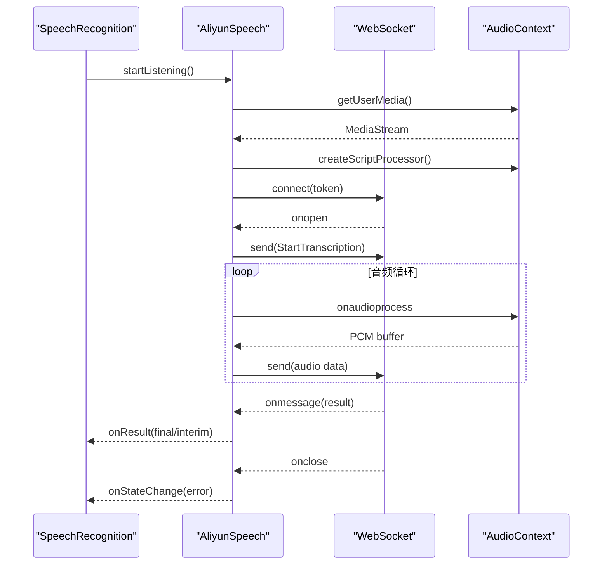
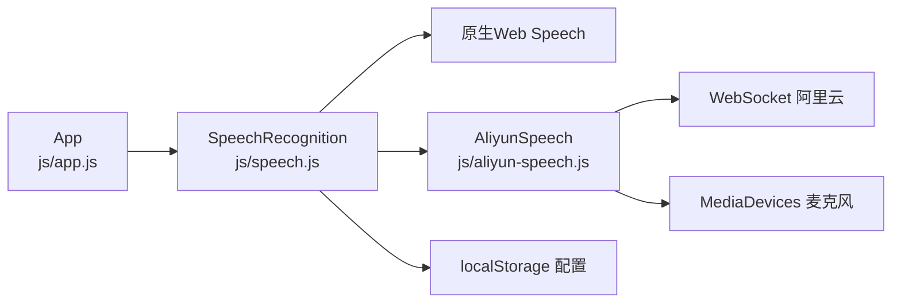

# 错误处理与恢复

<cite>
**本文引用的文件**
- [README.md](file://README.md)
- [index.html](file://index.html)
- [speech.js](file://js/speech.js)
- [aliyun-speech.js](file://js/aliyun-speech.js)
- [app.js](file://js/app.js)
- [style.css](file://css/style.css)
</cite>

## 目录
1. [简介](#简介)
2. [项目结构](#项目结构)
3. [核心组件](#核心组件)
4. [架构总览](#架构总览)
5. [详细组件分析](#详细组件分析)
6. [依赖关系分析](#依赖关系分析)
7. [性能考量](#性能考量)
8. [故障排查指南](#故障排查指南)
9. [结论](#结论)
10. [附录](#附录)

## 简介
本技术文档聚焦于语音识别系统的“错误处理与恢复”机制，涵盖以下关键点：
- 错误类型与处理策略：not-allowed（权限拒绝）、network（网络错误）、no-speech（无语音）、aborted（中断）等。
- 自动重连算法：原生API的指数退避策略与最大重试次数限制。
- 错误降级机制：原生API到阿里云API的自动切换逻辑。
- 状态变更通知机制与用户提示策略。
- 完整的最佳实践与调试技巧，并通过源码路径指引具体实现位置。

## 项目结构
该项目采用模块化前端架构，核心由三部分组成：
- 语音识别管理器：统一调度原生Web Speech API与阿里云WebSocket API，负责状态机、错误分发与降级切换。
- 阿里云语音客户端：封装WebSocket鉴权、音频采集与实时识别流程。
- 应用层控制器：绑定UI事件、渲染状态与提示、协调识别器工作。

图表来源
- [speech.js:21-382](file://js/speech.js#L21-L382)
- [aliyun-speech.js:17-478](file://js/aliyun-speech.js#L17-L478)
- [app.js:12-291](file://js/app.js#L12-L291)
- [index.html:1-143](file://index.html#L1-L143)

章节来源
- [speech.js:1-383](file://js/speech.js#L1-L383)
- [aliyun-speech.js:1-478](file://js/aliyun-speech.js#L1-L478)
- [app.js:1-292](file://js/app.js#L1-L292)
- [index.html:1-143](file://index.html#L1-L143)

## 核心组件
- 语音识别管理器（SpeechRecognition）
  - 状态机：IDLE、LISTENING、ERROR。
  - 后端选择：NATIVE、ALIYUN。
  - 自动重连：原生API基于递增延迟的重试。
  - 错误降级：网络错误触发原生到阿里云的切换。
  - 配置持久化：localStorage保存后端与阿里云凭证。
- 阿里云语音客户端（AliyunSpeech）
  - WebSocket鉴权与连接。
  - 麦克风权限获取与PCM音频采集。
  - 识别结果回调与错误上报。
- 应用控制器（App）
  - UI事件绑定与状态渲染。
  - 用户提示（状态栏、Toast）。
  - 设置面板同步与保存。

章节来源
- [speech.js:10-382](file://js/speech.js#L10-L382)
- [aliyun-speech.js:17-478](file://js/aliyun-speech.js#L17-L478)
- [app.js:12-291](file://js/app.js#L12-L291)

## 架构总览
系统通过“语音识别管理器”作为中枢，根据当前后端类型调用对应实现；当原生API出现网络错误时，自动记录失败标记并在必要时切换至阿里云API；阿里云API负责WebSocket鉴权、音频流传输与识别结果回传。

图表来源
- [speech.js:154-327](file://js/speech.js#L154-L327)
- [aliyun-speech.js:67-143](file://js/aliyun-speech.js#L67-L143)
- [app.js:48-243](file://js/app.js#L48-L243)

## 详细组件分析

### 语音识别管理器（SpeechRecognition）
- 状态机与回调
  - 状态变更通过内部回调通知上层，用于UI更新与提示。
  - 结果回调区分最终文本与中间文本，便于UI即时反馈。
- 后端选择与持久化
  - 支持手动切换后端，同时将配置保存至localStorage。
- 原生API错误处理
  - not-allowed：权限拒绝，提示用户开启麦克风权限。
  - network：网络错误，记录失败标记与重试计数；超过阈值自动切换至阿里云并提示。
  - no-speech：静默重试，不改变状态。
  - aborted：忽略，等待自然结束或下次重试。
- 自动重连算法
  - 原生API监听end事件，计算递增延迟（上限2秒），定时重启识别。
  - 成功返回结果时重置重试计数，避免无意义重试。
- 错误降级与自动切换
  - 当原生API出现网络错误且已配置阿里云凭证时，自动切换后端并短延时重试。
  - 若未配置阿里云凭证，则提示用户进行设置。

图表来源
- [speech.js:285-327](file://js/speech.js#L285-L327)
- [speech.js:272-283](file://js/speech.js#L272-L283)

章节来源
- [speech.js:10-382](file://js/speech.js#L10-L382)

### 阿里云语音客户端（AliyunSpeech）
- WebSocket鉴权与连接
  - 使用Token进行鉴权，连接阿里云NLS WebSocket服务。
  - 连接成功后发送StartTranscription指令，开始音频传输。
- 音频采集与传输
  - 使用AudioContext与ScriptProcessorNode捕获PCM数据，按帧发送。
  - 支持中间结果与SentenceEnd事件。
- 错误处理与状态上报
  - 权限错误、设备缺失、WebSocket连接失败均转换为明确错误消息。
  - 服务端返回非20000000状态码时，上报错误并清理资源。
- 结果解析
  - 解析服务端JSON响应，区分SentenceEnd最终结果与TranscriptionResultChanged中间结果。

图表来源
- [aliyun-speech.js:67-143](file://js/aliyun-speech.js#L67-L143)
- [aliyun-speech.js:196-244](file://js/aliyun-speech.js#L196-L244)
- [aliyun-speech.js:318-387](file://js/aliyun-speech.js#L318-L387)

章节来源
- [aliyun-speech.js:17-478](file://js/aliyun-speech.js#L17-L478)

### 应用控制器（App）
- 事件绑定与状态渲染
  - 主界面按钮与键盘事件触发识别启停。
  - 根据状态机更新按钮、波形、录音线与状态栏颜色。
- 用户提示策略
  - 状态栏显示当前后端与简要提示。
  - Toast用于复制成功、设置保存等轻提示。
- 设置面板同步与保存
  - 同步后端选择与阿里云凭证输入框。
  - 保存后端与凭证，关闭面板并提示。

章节来源
- [app.js:12-291](file://js/app.js#L12-L291)
- [style.css:345-408](file://css/style.css#L345-L408)

## 依赖关系分析
- 模块耦合
  - App依赖SpeechRecognition，负责UI与状态展示。
  - SpeechRecognition依赖AliyunSpeech与浏览器原生API。
  - AliyunSpeech依赖浏览器AudioContext与WebSocket。
- 外部依赖
  - Web Speech API（原生）与阿里云WebSocket服务。
  - localStorage用于配置持久化。
- 潜在风险
  - 原生API网络错误导致的降级路径需确保阿里云凭证有效。
  - WebSocket连接断开需正确清理资源并上报错误。

图表来源
- [speech.js:350-381](file://js/speech.js#L350-L381)
- [aliyun-speech.js:17-478](file://js/aliyun-speech.js#L17-L478)
- [app.js:12-291](file://js/app.js#L12-L291)

章节来源
- [speech.js:350-381](file://js/speech.js#L350-L381)
- [aliyun-speech.js:17-478](file://js/aliyun-speech.js#L17-L478)
- [app.js:12-291](file://js/app.js#L12-L291)

## 性能考量
- 原生API重连策略
  - 递增延迟+上限控制，避免频繁重试造成资源浪费。
  - 成功返回结果时重置计数，减少无效重试。
- 阿里云音频帧大小
  - 固定帧大小与按缓冲区批量发送，平衡实时性与稳定性。
- UI渲染优化
  - 仅在有文本时渲染段落，避免DOM过度更新。
  - 滚动容器仅在有新内容时滚动到底部。

章节来源
- [speech.js:272-283](file://js/speech.js#L272-L283)
- [aliyun-speech.js:251-260](file://js/aliyun-speech.js#L251-L260)
- [app.js:182-208](file://js/app.js#L182-L208)

## 故障排查指南
- 常见错误与定位
  - not-allowed：检查浏览器权限设置与HTTPS环境。
  - network：确认网络可达与原生服务可用性；若频繁出现，考虑切换至阿里云。
  - no-speech：确认麦克风设备可用与环境噪音控制。
  - aborted：观察是否被外部中断或资源释放。
- 降级与切换验证
  - 在原生网络错误后，确认是否自动切换至阿里云并提示。
  - 检查localStorage中后端配置是否持久化。
- 阿里云错误诊断
  - WebSocket连接失败：检查AppKey、Token与网络。
  - 服务端错误码：查看状态回调中的错误消息。
- UI提示核对
  - 状态栏颜色与文案是否随状态变化。
  - Toast是否在复制成功等场景正常弹出。

章节来源
- [speech.js:285-327](file://js/speech.js#L285-L327)
- [aliyun-speech.js:114-143](file://js/aliyun-speech.js#L114-L143)
- [aliyun-speech.js:318-344](file://js/aliyun-speech.js#L318-L344)
- [app.js:210-243](file://js/app.js#L210-L243)

## 结论
本项目通过清晰的状态机、完善的错误分类与降级策略、以及稳健的自动重连机制，实现了在复杂网络环境下可靠的语音识别体验。原生API与阿里云API的双后端设计，结合UI层面的即时反馈与持久化配置，使得系统具备良好的容错性与可维护性。建议在生产环境中进一步完善日志采集与错误上报，以便更精准地定位问题。

## 附录
- 最佳实践
  - 明确错误类型与处理边界，避免吞掉关键错误。
  - 在自动切换前后提供明确的用户提示与引导。
  - 对重连策略设置合理上限，防止资源耗尽。
  - 将敏感凭证存储在安全可控的后端接口中，而非前端。
- 调试技巧
  - 使用浏览器开发者工具的网络面板监控WebSocket与HTTP请求。
  - 在Console中观察错误事件与状态回调输出。
  - 通过设置面板切换后端并验证不同实现的行为差异。
- 代码示例路径（不展示具体代码，仅提供定位）
  - 原生API错误处理与降级切换：[speech.js:285-327](file://js/speech.js#L285-L327)
  - 原生API自动重连算法：[speech.js:272-283](file://js/speech.js#L272-L283)
  - 阿里云WebSocket连接与鉴权：[aliyun-speech.js:196-244](file://js/aliyun-speech.js#L196-L244)
  - 阿里云音频采集与帧发送：[aliyun-speech.js:94-116](file://js/aliyun-speech.js#L94-L116)
  - 阿里云错误上报与清理：[aliyun-speech.js:114-143](file://js/aliyun-speech.js#L114-L143)
  - 应用层状态渲染与提示：[app.js:210-243](file://js/app.js#L210-L243)