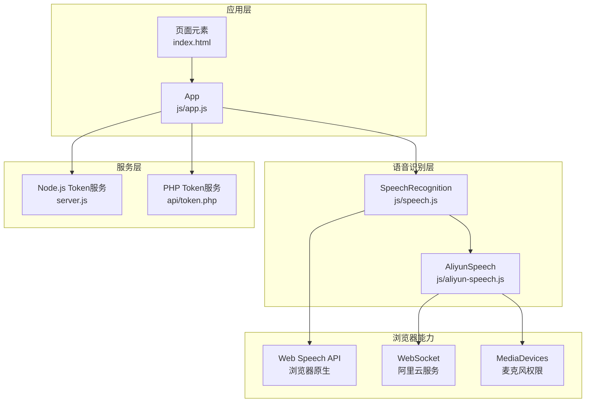
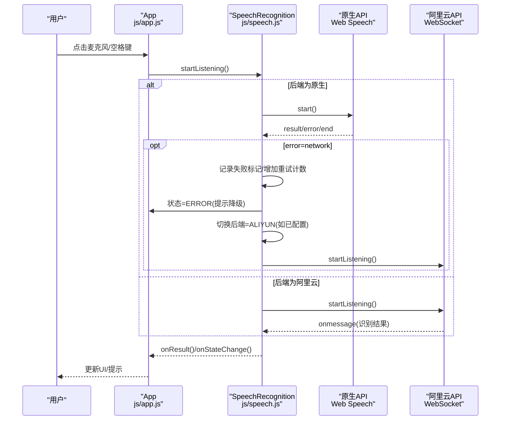
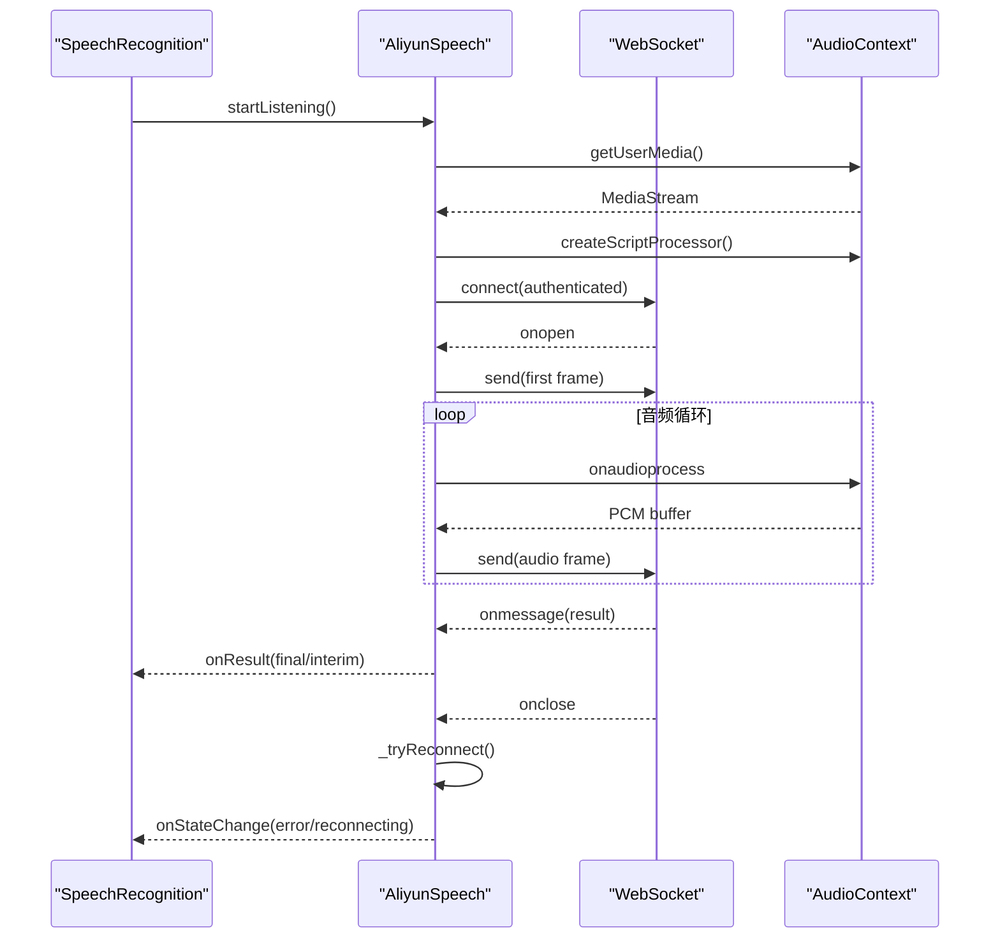
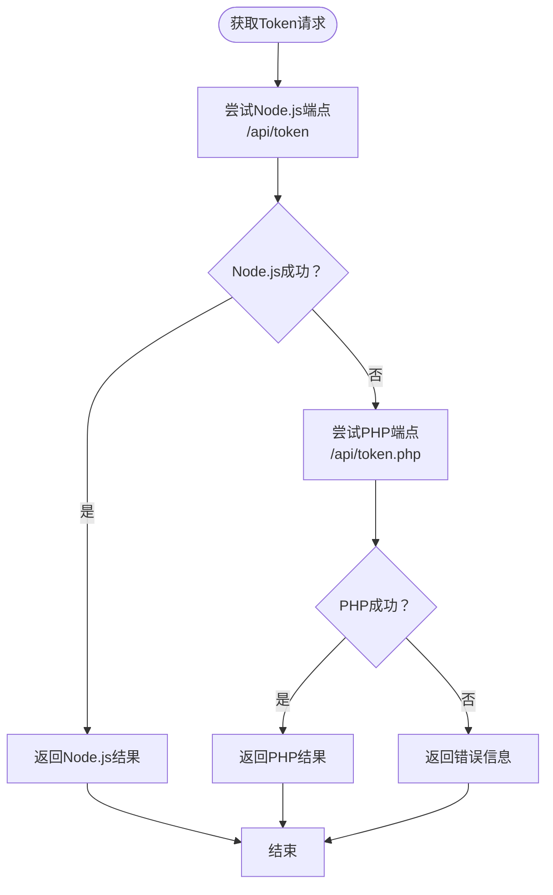
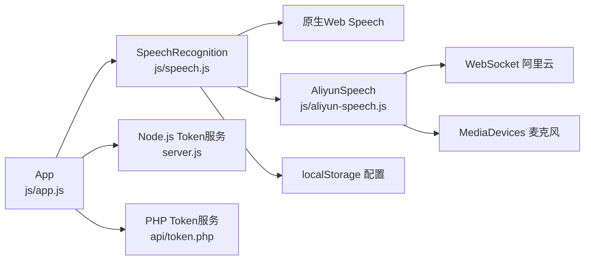

# 错误处理与恢复

<cite>
**本文档引用的文件**
- [README.md](file://README.md)
- [index.html](file://index.html)
- [speech.js](file://js/speech.js)
- [aliyun-speech.js](file://js/aliyun-speech.js)
- [app.js](file://js/app.js)
- [server.js](file://server.js)
- [token.php](file://api/token.php)
- [style.css](file://css/style.css)
</cite>

## 更新摘要
**所做更改**
- 新增双后端降级机制的详细说明，包括Node.js端点和PHP端点的自动切换逻辑
- 更新错误处理策略，增强故障诊断信息和用户提示
- 新增阿里云智能语音识别的完整错误处理与恢复机制
- 更新架构图以反映新的双后端架构

## 目录
1. [简介](#简介)
2. [项目结构](#项目结构)
3. [核心组件](#核心组件)
4. [架构总览](#架构总览)
5. [详细组件分析](#详细组件分析)
6. [依赖关系分析](#依赖关系分析)
7. [性能考量](#性能考量)
8. [故障排查指南](#故障排查指南)
9. [结论](#结论)
10. [附录](#附录)

## 简介
本技术文档聚焦于语音识别系统的"错误处理与恢复"机制，涵盖以下关键点：
- 错误类型与处理策略：not-allowed（权限拒绝）、network（网络错误）、no-speech（无语音）、aborted（中断）等。
- 自动重连算法：原生API的递增延迟重试与阿里云API的指数退避策略。
- 双后端降级机制：原生API到阿里云API的自动切换逻辑，以及Node.js端点到PHP端点的备用服务机制。
- 状态变更通知机制与用户提示策略。
- 完整的最佳实践与调试技巧，并通过源码路径指引具体实现位置。

## 项目结构
该项目采用模块化前端架构，核心由四部分组成：
- 语音识别管理器：统一调度原生Web Speech API与阿里云WebSocket API，负责状态机、错误分发与降级切换。
- 阿里云语音客户端：封装WebSocket鉴权、音频采集与实时识别流程，支持自动重连。
- Token获取服务：提供Node.js版本和PHP版本的双重Token获取服务，增强可用性。
- 应用层控制器：绑定UI事件、渲染状态与提示、协调识别器工作。

**图表来源**
- [speech.js:21-390](file://js/speech.js#L21-L390)
- [aliyun-speech.js:17-479](file://js/aliyun-speech.js#L17-L479)
- [app.js:12-375](file://js/app.js#L12-L375)
- [server.js:1-83](file://server.js#L1-L83)
- [token.php:1-146](file://api/token.php#L1-L146)

**章节来源**
- [speech.js:1-390](file://js/speech.js#L1-L390)
- [aliyun-speech.js:1-479](file://js/aliyun-speech.js#L1-L479)
- [app.js:1-375](file://js/app.js#L1-L375)
- [server.js:1-83](file://server.js#L1-L83)
- [token.php:1-146](file://api/token.php#L1-L146)

## 核心组件
- 语音识别管理器（SpeechRecognition）
  - 状态机：IDLE、LISTENING、ERROR。
  - 后端选择：NATIVE、ALIYUN。
  - 自动重连：原生API基于递增延迟的重试，阿里云API基于指数退避策略。
  - 错误降级：网络错误触发原生到阿里云的切换。
  - 配置持久化：localStorage保存后端与阿里云凭证。
- 阿里云语音客户端（AliyunSpeech）
  - WebSocket鉴权与连接，支持自动重连。
  - 麦克风权限获取与PCM音频采集。
  - 识别结果回调与错误上报。
  - 指数退避重连策略，最多3次重试。
- Token获取服务（双后端支持）
  - Node.js版本：Express服务器，提供/api/token端点。
  - PHP版本：独立token.php文件，提供相同功能。
  - 自动端点切换：优先尝试Node.js端点，失败时自动尝试PHP端点。
- 应用控制器（App）
  - UI事件绑定与状态渲染。
  - 用户提示（状态栏、Toast）。
  - 设置面板同步与保存。

**章节来源**
- [speech.js:10-390](file://js/speech.js#L10-L390)
- [aliyun-speech.js:17-479](file://js/aliyun-speech.js#L17-L479)
- [app.js:12-375](file://js/app.js#L12-L375)
- [server.js:19-76](file://server.js#L19-L76)
- [token.php:28-145](file://api/token.php#L28-L145)

## 架构总览
系统通过"语音识别管理器"作为中枢，根据当前后端类型调用对应实现；当原生API出现网络错误时，自动记录失败标记并在必要时切换至阿里云API；阿里云API负责WebSocket鉴权、音频流传输与识别结果回传。Token获取服务提供双后端支持，增强系统的可用性和容错能力。

**图表来源**
- [speech.js:153-340](file://js/speech.js#L153-L340)
- [aliyun-speech.js:74-144](file://js/aliyun-speech.js#L74-L144)
- [app.js:82-91](file://js/app.js#L82-L91)

## 详细组件分析

### 语音识别管理器（SpeechRecognition）
- 状态机与回调
  - 状态变更通过内部回调通知上层，用于UI更新与提示。
  - 结果回调区分最终文本与中间文本，便于UI即时反馈。
- 后端选择与持久化
  - 支持手动切换后端，同时将配置保存至localStorage。
  - 兼容旧配置中的xfyun后端，自动映射到native。
- 原生API错误处理
  - not-allowed：权限拒绝，提示用户开启麦克风权限。
  - network：网络错误，记录失败标记与重试计数；超过阈值自动切换至阿里云并提示。
  - no-speech：静默重试，不改变状态。
  - aborted：忽略，等待自然结束或下次重试。
- 自动重连算法
  - 原生API监听end事件，计算递增延迟（上限2秒），定时重启识别。
  - 成功返回结果时重置重试计数，避免无意义重试。
- 错误降级与自动切换
  - 当原生API出现网络错误且已配置阿里云凭证时，自动切换后端并短延时重试。
  - 若未配置阿里云凭证，则提示用户进行设置。
  - 支持从xfyun后端的平滑迁移。

**图表来源**
- [speech.js:288-330](file://js/speech.js#L288-L330)
- [speech.js:291-317](file://js/speech.js#L291-L317)

**章节来源**
- [speech.js:21-390](file://js/speech.js#L21-L390)

### 阿里云语音客户端（AliyunSpeech）
- WebSocket鉴权与连接
  - 异步构建认证URL，使用HMAC-SHA256签名。
  - 连接成功后发送首帧，开始音频传输。
  - 支持自动重连，最多3次重试，指数退避策略。
- 音频采集与传输
  - 使用AudioContext与ScriptProcessorNode捕获PCM数据，按帧发送。
  - 支持动态VAD（语音活动检测）参数。
- 错误处理与状态上报
  - 权限错误、设备缺失、WebSocket连接失败均转换为明确错误消息。
  - 服务端返回非0状态码时，上报错误并清理资源。
  - 支持客户端错误和服务器错误的区分处理。
- 结果解析
  - 解析服务端JSON响应，区分最终与中间结果，分别回调给上层。
- 自动重连机制
  - 基于指数退避策略，最大重连次数3次。
  - 断线后自动清理资源并重新建立连接。
  - 保持AudioContext和麦克风权限不变，提高用户体验。

**图表来源**
- [aliyun-speech.js:74-144](file://js/aliyun-speech.js#L74-L144)
- [aliyun-speech.js:199-244](file://js/aliyun-speech.js#L199-L244)
- [aliyun-speech.js:318-387](file://js/aliyun-speech.js#L318-L387)
- [aliyun-speech.js:392-424](file://js/aliyun-speech.js#L392-L424)

**章节来源**
- [aliyun-speech.js:17-479](file://js/aliyun-speech.js#L17-L479)

### Token获取服务（双后端支持）
- Node.js版本（server.js）
  - Express服务器，提供/api/token端点。
  - 使用阿里云POP-Core SDK获取Access Token。
  - 支持环境变量配置，错误处理完善。
- PHP版本（api/token.php）
  - 独立PHP脚本，无需额外SDK依赖。
  - 使用HMAC-SHA1签名算法，与Node.js版本兼容。
  - 提供相同的JSON响应格式。
- 自动端点切换机制
  - 应用启动时优先尝试Node.js端点。
  - Node.js端点失败时自动尝试PHP端点。
  - 提供详细的错误诊断信息。
  - 支持超时控制和重试机制。

**图表来源**
- [app.js:200-229](file://js/app.js#L200-L229)
- [server.js:19-76](file://server.js#L19-L76)
- [token.php:28-145](file://api/token.php#L28-L145)

**章节来源**
- [app.js:188-253](file://js/app.js#L188-L253)
- [server.js:19-76](file://server.js#L19-L76)
- [token.php:1-146](file://api/token.php#L1-L146)

### 应用控制器（App）
- 事件绑定与状态渲染
  - 主界面按钮与键盘事件触发识别启停。
  - 根据状态机更新按钮、波形、录音线与状态栏颜色。
  - 支持原生和阿里云两种后端的UI状态显示。
- 用户提示策略
  - 状态栏显示当前后端与简要提示。
  - Toast用于复制成功、设置保存、Token获取等轻提示。
  - 错误状态下自动打开设置面板引导用户配置。
- 设置面板同步与保存
  - 同步后端选择与阿里云凭证输入框。
  - 保存后端与凭证，关闭面板并提示。
- Token获取与降级切换
  - 实现双后端降级机制，优先使用Node.js端点。
  - 失败时自动切换到PHP端点，提供更好的用户体验。
  - 详细的错误处理和用户反馈。

**章节来源**
- [app.js:12-375](file://js/app.js#L12-L375)

## 依赖关系分析
- 模块耦合
  - App依赖SpeechRecognition，负责UI与状态展示。
  - SpeechRecognition依赖AliyunSpeech与浏览器原生API。
  - AliyunSpeech依赖浏览器AudioContext与WebSocket。
  - App依赖Token获取服务（双后端支持）。
- 外部依赖
  - Web Speech API（原生）与阿里云WebSocket服务。
  - Express服务器与PHP运行环境。
  - localStorage用于配置持久化。
- 潜在风险
  - 原生API网络错误导致的降级路径需确保阿里云凭证有效。
  - WebSocket连接断开需正确清理资源并上报错误。
  - Token服务端点不可用时的降级切换机制。
  - 双后端架构下的状态同步和一致性保证。

**图表来源**
- [speech.js:353-389](file://js/speech.js#L353-L389)
- [aliyun-speech.js:17-479](file://js/aliyun-speech.js#L17-L479)
- [app.js:12-375](file://js/app.js#L12-L375)
- [server.js:1-83](file://server.js#L1-L83)
- [token.php:1-146](file://api/token.php#L1-L146)

**章节来源**
- [speech.js:353-389](file://js/speech.js#L353-L389)
- [aliyun-speech.js:17-479](file://js/aliyun-speech.js#L17-L479)
- [app.js:12-375](file://js/app.js#L12-L375)

## 性能考量
- 原生API重连策略
  - 递增延迟+上限控制，避免频繁重试造成资源浪费。
  - 成功返回结果时重置计数，减少无效重试。
- 阿里云音频帧大小
  - 固定帧大小与按缓冲区批量发送，平衡实时性与稳定性。
  - 支持200ms音频帧长度，适合实时语音识别。
- Token获取优化
  - 双后端降级机制，提高服务可用性。
  - 超时控制和错误快速反馈。
- UI渲染优化
  - 仅在有文本时渲染段落，避免DOM过度更新。
  - 滚动容器仅在有新内容时滚动到底部。
- 自动重连策略
  - 阿里云API采用指数退避策略，最多3次重试。
  - 断线后自动清理资源，重新建立连接。

**章节来源**
- [speech.js:275-286](file://js/speech.js#L275-L286)
- [aliyun-speech.js:15-16](file://js/aliyun-speech.js#L15-L16)
- [aliyun-speech.js:392-424](file://js/aliyun-speech.js#L392-L424)
- [app.js:257-283](file://js/app.js#L257-L283)

## 故障排查指南
- 常见错误与定位
  - not-allowed：检查浏览器权限设置与HTTPS环境。
  - network：确认网络可达与原生服务可用性；若频繁出现，考虑切换至阿里云。
  - no-speech：确认麦克风设备可用与环境噪音控制。
  - aborted：观察是否被外部中断或资源释放。
- 降级与切换验证
  - 在原生网络错误后，确认是否自动切换至阿里云并提示。
  - 检查localStorage中后端配置是否持久化。
  - 验证阿里云凭证的有效性和Token获取功能。
- 阿里云错误诊断
  - WebSocket连接失败：检查APPID、APISecret、APIKey与网络。
  - 服务端错误码：查看状态回调中的错误消息。
  - 自动重连：确认重连机制正常工作，不超过最大重试次数。
- Token服务故障排查
  - Node.js端点不可用：检查服务是否启动，端口是否开放。
  - PHP端点不可用：检查PHP环境配置和token.php文件权限。
  - 双后端降级：验证自动切换逻辑和错误处理。
- UI提示核对
  - 状态栏颜色与文案是否随状态变化。
  - Toast是否在复制成功、Token获取等场景正常弹出。
  - 设置面板是否正确显示当前配置状态。

**章节来源**
- [speech.js:288-330](file://js/speech.js#L288-L330)
- [aliyun-speech.js:129-144](file://js/aliyun-speech.js#L129-L144)
- [aliyun-speech.js:327-344](file://js/aliyun-speech.js#L327-L344)
- [app.js:285-324](file://js/app.js#L285-L324)

## 结论
本项目通过清晰的状态机、完善的错误分类与降级策略、以及稳健的自动重连机制，实现了在复杂网络环境下可靠的语音识别体验。新增的双后端架构（原生API与阿里云API）和双Token服务端点（Node.js与PHP）进一步增强了系统的容错能力和可用性。通过UI层面的即时反馈与持久化配置，系统具备优秀的用户体验和可维护性。建议在生产环境中进一步完善日志采集与错误上报，以便更精准地定位问题。

## 附录
- 最佳实践
  - 明确错误类型与处理边界，避免吞掉关键错误。
  - 在自动切换前后提供明确的用户提示与引导。
  - 对重连策略设置合理上限，防止资源耗尽。
  - 将敏感凭证存储在安全可控的后端接口中，而非前端。
  - 实现双后端降级机制，提高系统可用性。
- 调试技巧
  - 使用浏览器开发者工具的网络面板监控WebSocket与HTTP请求。
  - 在Console中观察错误事件与状态回调输出。
  - 通过设置面板切换后端并验证不同实现的行为差异。
  - 监控Token服务端点的可用性和响应时间。
  - 检查阿里云API的错误码和状态消息。
- 代码示例路径（不展示具体代码，仅提供定位）
  - 原生API错误处理与降级切换：[speech.js:288-330](file://js/speech.js#L288-L330)
  - 原生API自动重连算法：[speech.js:275-286](file://js/speech.js#L275-L286)
  - 阿里云WebSocket连接与鉴权：[aliyun-speech.js:199-244](file://js/aliyun-speech.js#L199-L244)
  - 阿里云音频采集与帧发送：[aliyun-speech.js:108-121](file://js/aliyun-speech.js#L108-L121)
  - 阿里云错误上报与自动重连：[aliyun-speech.js:327-424](file://js/aliyun-speech.js#L327-L424)
  - Token双后端降级机制：[app.js:200-229](file://js/app.js#L200-L229)
  - Node.js Token服务实现：[server.js:19-76](file://server.js#L19-L76)
  - PHP Token服务实现：[token.php:28-145](file://api/token.php#L28-L145)
  - 应用层状态渲染与提示：[app.js:285-324](file://js/app.js#L285-L324)