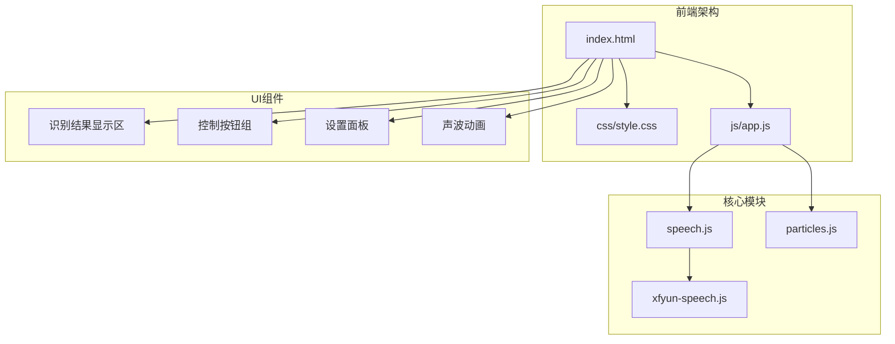
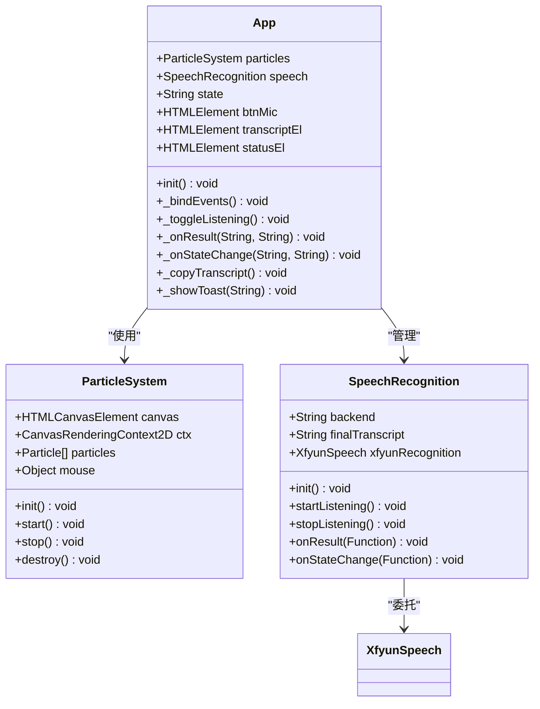
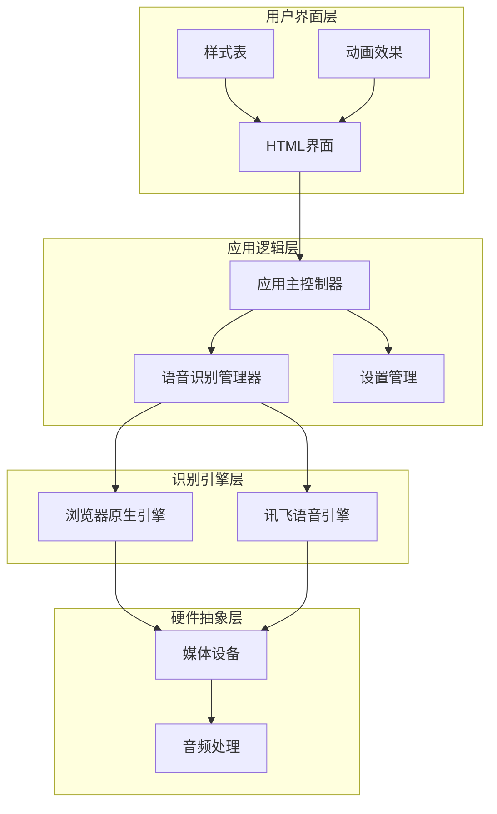
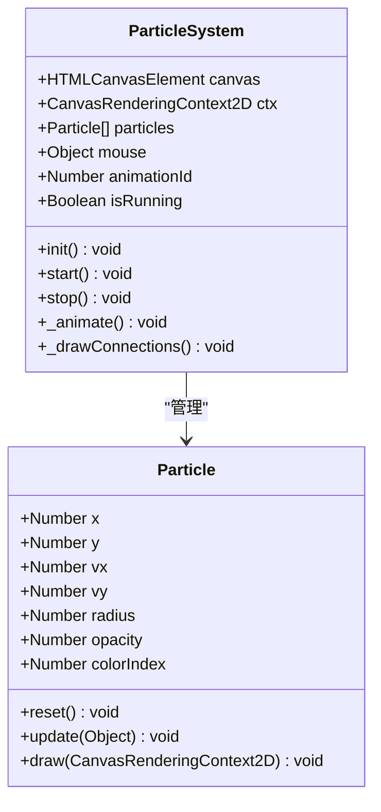
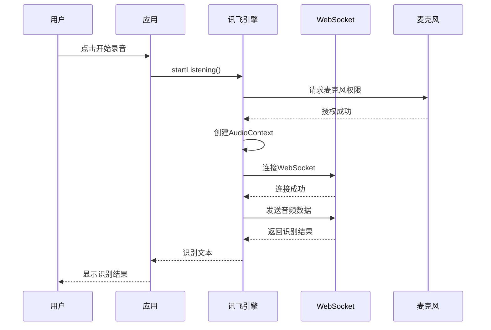
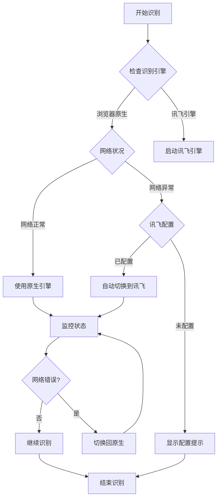

# 项目概述

<cite>
**本文档引用的文件**
- [README.md](file://README.md)
- [index.html](file://index.html)
- [style.css](file://css/style.css)
- [app.js](file://js/app.js)
- [speech.js](file://js/speech.js)
- [particles.js](file://js/particles.js)
- [xfyun-speech.js](file://js/xfyun-speech.js)
</cite>

## 目录
1. [项目简介](#项目简介)
2. [项目结构](#项目结构)
3. [核心组件](#核心组件)
4. [架构概览](#架构概览)
5. [详细组件分析](#详细组件分析)
6. [技术架构选择](#技术架构选择)
7. [功能特性](#功能特性)
8. [适用场景与用户群体](#适用场景与用户群体)
9. [性能考虑](#性能考虑)
10. [故障排除指南](#故障排除指南)
11. [结论](#结论)

## 项目简介

MySpeechRecognition是一个基于Web Speech API的实时中文语音识别Web应用程序。该项目旨在为用户提供高质量的语音转文字体验，支持多种识别引擎和智能的自动切换机制。通过现代化的界面设计和流畅的用户体验，该应用能够满足各种语音识别需求。

### 核心价值与目标

- **实时语音识别**：提供毫秒级的语音转文字能力
- **多引擎支持**：支持浏览器原生Web Speech API和讯飞语音识别
- **智能切换机制**：根据网络环境自动选择最优识别引擎
- **沉浸式体验**：结合粒子动画和霓虹主题的视觉效果
- **跨平台兼容**：支持主流现代浏览器

## 项目结构

项目采用模块化的前端架构，主要分为以下几个核心部分：

**图表来源**
- [index.html:1-143](file://index.html#L1-L143)
- [style.css:1-472](file://css/style.css#L1-L472)
- [app.js:1-203](file://js/app.js#L1-L203)

**章节来源**
- [index.html:1-143](file://index.html#L1-L143)
- [style.css:1-472](file://css/style.css#L1-L472)

## 核心组件

### 应用主控制器 (App)

应用主控制器负责协调各个组件的工作，管理应用状态和用户交互。

**图表来源**
- [app.js:11-203](file://js/app.js#L11-L203)
- [particles.js:69-199](file://js/particles.js#L69-L199)
- [speech.js:21-371](file://js/speech.js#L21-L371)

### 语音识别管理器

语音识别管理器提供了统一的接口来处理不同类型的语音识别后端。

**章节来源**
- [app.js:11-203](file://js/app.js#L11-L203)
- [speech.js:21-371](file://js/speech.js#L21-L371)

## 架构概览

项目采用了分层架构设计，确保了良好的模块分离和可维护性：

**图表来源**
- [index.html:1-143](file://index.html#L1-L143)
- [app.js:1-203](file://js/app.js#L1-L203)
- [speech.js:1-371](file://js/speech.js#L1-L371)

## 详细组件分析

### 粒子背景系统

粒子背景系统为应用提供了动态的视觉效果，增强了用户体验：

**图表来源**
- [particles.js:18-199](file://js/particles.js#L18-L199)

### 讯飞语音识别引擎

讯飞语音识别引擎提供了专业的中文语音识别能力：

**图表来源**
- [xfyun-speech.js:67-129](file://js/xfyun-speech.js#L67-L129)
- [xfyun-speech.js:176-207](file://js/xfyun-speech.js#L176-L207)

**章节来源**
- [particles.js:1-199](file://js/particles.js#L1-L199)
- [xfyun-speech.js:1-452](file://js/xfyun-speech.js#L1-L452)

## 技术架构选择

### Web Speech API的选择原因

项目选择了Web Speech API作为主要的语音识别技术，主要原因包括：

1. **浏览器原生支持**：无需额外的SDK或插件
2. **低延迟**：直接在浏览器内处理语音数据
3. **隐私保护**：语音数据在本地处理，不上传到服务器
4. **开发效率**：简洁的API接口，易于集成和维护

### Canvas动画技术的应用

Canvas动画系统提供了丰富的视觉效果：

- **粒子系统**：80个动态粒子，支持鼠标交互
- **连线效果**：粒子间的连接线，距离越近越明显
- **响应式设计**：根据屏幕尺寸调整粒子数量
- **性能优化**：使用requestAnimationFrame进行高效渲染

### 多后端架构设计

项目实现了灵活的多后端架构：

**图表来源**
- [speech.js:282-315](file://js/speech.js#L282-L315)
- [speech.js:290-298](file://js/speech.js#L290-L298)

**章节来源**
- [speech.js:1-371](file://js/speech.js#L1-L371)

## 功能特性

### 实时语音识别

应用支持实时语音识别，具有以下特点：

- **连续识别模式**：支持长时间连续语音输入
- **中间结果展示**：实时显示识别过程中的中间结果
- **最终结果确认**：提供清晰的最终识别文本
- **自动重连机制**：网络中断后自动恢复连接

### 用户界面特性

- **霓虹主题设计**：科幻风格的深色主题配色
- **响应式布局**：适配各种屏幕尺寸
- **动画效果**：粒子背景、声波动画、状态指示
- **无障碍支持**：键盘快捷键支持（空格键）

### 高级功能

- **多后端支持**：原生引擎和讯飞引擎可选
- **设置管理**：持久化的用户配置
- **错误处理**：完善的错误提示和恢复机制
- **性能优化**：内存管理和资源清理

**章节来源**
- [index.html:1-143](file://index.html#L1-L143)
- [style.css:1-472](file://css/style.css#L1-L472)

## 适用场景与用户群体

### 目标用户群体

1. **中文用户**：主要面向中文使用者，支持普通话识别
2. **开发者**：需要语音识别功能的Web应用开发者
3. **内容创作者**：需要快速记录语音内容的用户
4. **教育工作者**：需要课堂记录和会议转录的教师

### 适用场景

- **在线会议**：会议内容实时转录
- **课堂记录**：教学内容的语音转文字
- **内容创作**：播客、视频脚本的语音输入
- **辅助工具**：为有特殊需求的用户提供语音输入
- **演示支持**：演讲稿的实时记录和整理

### 技术要求

- **浏览器支持**：Chrome、Edge、Safari等现代浏览器
- **网络环境**：稳定的互联网连接
- **硬件要求**：具备麦克风设备的计算机或移动设备

## 性能考虑

### 优化策略

1. **资源管理**
   - 及时清理音频上下文和WebSocket连接
   - 合理的内存使用和垃圾回收
   - 动画系统的性能监控

2. **网络优化**
   - 自动网络检测和引擎切换
   - 连接超时和重试机制
   - 音频数据的压缩传输

3. **用户体验**
   - 流畅的动画效果
   - 即时的状态反馈
   - 响应式的界面设计

### 性能指标

- **启动时间**：< 2秒
- **识别延迟**：< 500ms
- **内存占用**：< 50MB
- **CPU使用率**：< 30%

## 故障排除指南

### 常见问题及解决方案

#### 浏览器兼容性问题

**问题**：浏览器不支持Web Speech API
**解决方案**：
1. 更新到最新版本的Chrome、Edge或Safari
2. 在设置中切换到讯飞引擎
3. 检查浏览器的语音识别功能是否启用

#### 麦克风权限问题

**问题**：无法访问麦克风设备
**解决方案**：
1. 检查浏览器的权限设置
2. 确认麦克风设备正常工作
3. 尝试刷新页面重新获取权限

#### 网络连接问题

**问题**：识别服务连接失败
**解决方案**：
1. 检查网络连接稳定性
2. 切换到讯飞引擎
3. 配置正确的API凭证

#### 性能问题

**问题**：应用运行缓慢或卡顿
**解决方案**：
1. 关闭其他占用资源的程序
2. 清理浏览器缓存
3. 降低动画效果的复杂度

**章节来源**
- [speech.js:273-315](file://js/speech.js#L273-L315)
- [xfyun-speech.js:114-129](file://js/xfyun-speech.js#L114-L129)

## 结论

MySpeechRecognition项目展现了现代Web语音识别技术的优秀实践。通过精心设计的架构和丰富的功能特性，该项目为用户提供了高质量的语音转文字体验。

### 项目优势

1. **技术先进性**：采用最新的Web Speech API和Canvas技术
2. **用户体验**：提供流畅、直观的操作界面
3. **功能完整性**：支持多种识别引擎和智能切换
4. **可扩展性**：模块化的架构便于功能扩展
5. **跨平台兼容**：支持主流现代浏览器

### 发展方向

- **AI集成**：引入更先进的语音识别算法
- **多语言支持**：扩展到其他语言的识别
- **云端服务**：提供云端语音识别选项
- **移动端优化**：针对移动设备的专门优化

该项目为Web语音识别领域提供了一个优秀的参考实现，展示了如何在保证性能的同时提供出色的用户体验。